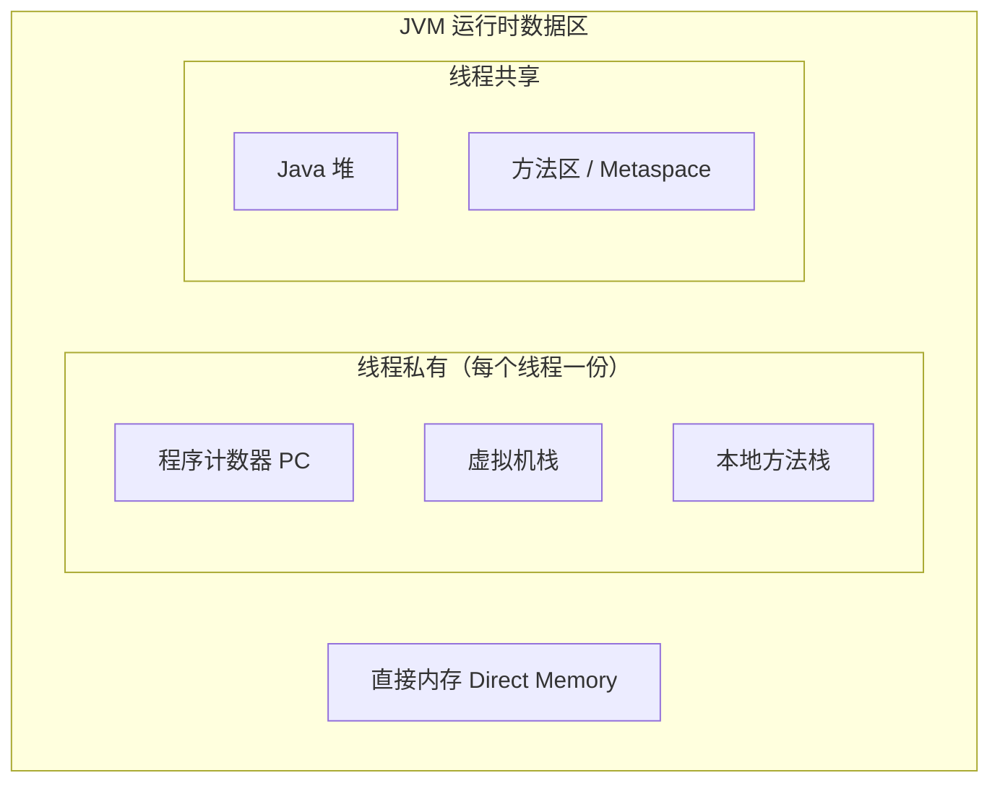
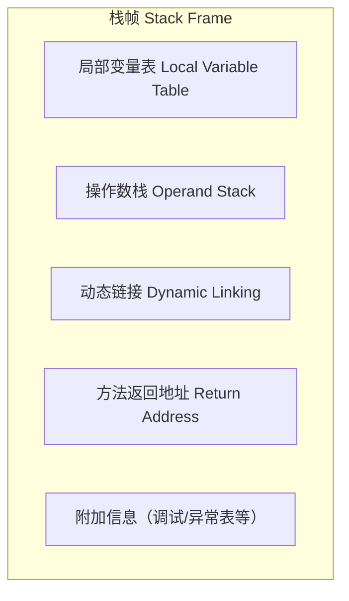
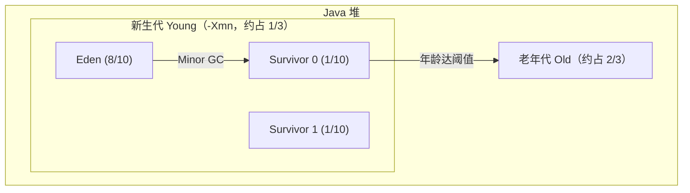

# M1 JVM 知识点

> 模块：M1 JVM ｜ 对应课表 Week 1-2
> 深度定位：面试能讲清 ｜ 来源：权威文档/书籍/博客
> 高频题：10 道

---

## 0. 速查索引

| # | 高频题 | 对应章节 | 学时 |
|---|---|---|---|
| 1 | JVM 运行时数据区 | §1.1–1.7 | Week1 Day1 |
| 2 | 堆内存分代结构 | §3.4 | Week1 Day3 |
| 3 | GC 算法 | §3.2 | Week1 Day3 |
| 4 | 垃圾收集器对比 | §3.6 | Week1 Day3 |
| 5 | CMS 四阶段 | §3.7 | Week1 Day3 |
| 6 | G1 原理 | §3.8 | Week1 Day3 |
| 7 | 类加载过程 | §2.1 | Week1 Day2 |
| 8 | 双亲委派 + 打破方式 | §2.3–2.4 | Week1 Day2 |
| 9 | OOM 排查 | §4.4–4.5 | Week2 Day1-2 |
| 10 | 对象晋升老年代条件 | §3.5 | Week1 Day3 |

---

## 1. 运行时数据区

JVM 运行时数据区是 JVM 在执行 Java 程序期间管理的内存区域。按**线程私有 / 线程共享**划分：程序计数器、虚拟机栈、本地方法栈为线程私有；堆、方法区为线程共享；直接内存则不属于 JVM 规范定义的运行时数据区，但常被一起讨论。

### 1.1 程序计数器（PC）

程序计数器是一块较小的内存空间，记录当前线程正在执行的字节码**行号/地址**。**线程私有**，生命周期与线程相同。分支、循环、跳转、异常处理、线程恢复都依赖它。

它是 JVM 规范中**唯一一个不会发生 OOM 的区域**。

> 关键结论：PC 线程私有，是因为 CPU 在多线程间轮转，每个线程需要一个独立计数器以在切换回来后恢复到正确位置。

**来源**：[JVM 规范 §2.5.1](https://docs.oracle.com/javase/specs/jvms/se17/html/jvms-2.html#jvms-2.5.1)

### 1.2 虚拟机栈

**定义**：虚拟机栈描述的是 Java 方法执行的线程内存模型：每个方法被执行时，JVM 都会同步创建一个**栈帧**，方法调用结束（正常或异常）栈帧即被销毁。线程私有，生命周期与线程相同。

**结构**（栈帧）：

- **局部变量表**：以变量槽（Slot）为单位存储方法参数与方法内局部变量。`long`/`double` 占 2 个 Slot，其余占 1 个。实例方法的第 0 个 Slot 是 `this` 引用。
- **操作数栈**：方法执行时的工作区，字节码指令从这里压栈/出栈（如 `iadd` 弹出两个 int 相加再压回）。
- **动态链接**：指向运行时常量池中该方法的**符号引用**，支持在运行期解析为直接引用（多态、虚方法分派依赖它）。
- **方法返回地址**：方法返回后恢复上层方法执行位置，可能存放 PC 值或异常信息。

**关键点**：
- 栈帧大小在**编译期**确定（局部变量表/操作数栈的深度写死在 Code 属性中），运行期不变。
- 可通过 `-Xss` 调整栈容量，默认通常 512KB–1MB（HotSpot JDK 17 默认 1MB）。
- 方法调用深度过深 → `StackOverflowError`；无法分配新栈帧（OOM 但无法申请到足够内存）→ `OutOfMemoryError`。

> 💡 **面试话术**：「虚拟机栈是线程私有的，每个方法调用会创建一个栈帧，栈帧里包含局部变量表、操作数栈、动态链接和返回地址四部分。局部变量表存方法参数和局部变量，以 Slot 为单位；操作数栈是字节码指令的工作区。栈帧大小在编译期就定死了。如果递归太深会抛 StackOverflowError；如果是不断开新线程导致无法分配新栈帧，则抛 OutOfMemoryError。」

**常见追问**：
- Q: 栈帧里有什么？ → 局部变量表、操作数栈、动态链接、方法返回地址（外加附加信息）。
- Q: 局部变量表和操作数栈的区别？ → 前者存数据（按 Slot 索引），后者是计算工作区（后进先出），字节码指令在两者间搬运。
- Q: `-Xss` 设大了会怎样？ → 单线程可用栈更深（少 SOF），但同样物理内存下能创建的线程数变少（更易 OOM）。
- Q: 方法内联与栈帧的关系？ → 内联后少了调用开销，省了创建栈帧与压栈出栈动作，是 JIT 优化基础。

**来源**：《深入理解 Java 虚拟机》第 3 版 §2.5.2；[JVM 规范 §2.5.2](https://docs.oracle.com/javase/specs/jvms/se17/html/jvms-2.html#jvms-2.5.2)；[JVM 规范 §2.6 栈帧](https://docs.oracle.com/javase/specs/jvms/se17/html/jvms-2.html#jvms-2.6)

### 1.3 本地方法栈

**定义**：与虚拟机栈作用相同，区别在于它服务于 **native 方法**（Java 调用 C/C++ 等本地代码）。HotSpot 实现中将虚拟机栈与本地方法栈合二为一。

- 同样线程私有，会抛 `StackOverflowError` 和 `OutOfMemoryError`。
- 常见 native 方法：`Object.hashCode`、`Thread.start0`、`System.currentTimeMillis` 等底层调用。

> 关键结论：本地方法栈 ≈ 虚拟机栈的 native 版本；HotSpot 不区分二者。

**来源**：[JVM 规范 §2.5.3](https://docs.oracle.com/javase/specs/jvms/se17/html/jvms-2.html#jvms-2.5.3)

### 1.4 堆

**定义**：Java 堆是 JVM 管理内存中**最大**的一块，被所有**线程共享**，在虚拟机启动时创建。几乎所有的**对象实例与数组**都在堆上分配（逃逸分析下可能栈上分配 / 标量替换，但典型情况仍在堆）。是 **GC 的主战场**。

**结构**（分代）：

新生代:老年代 默认 ≈ 1:2（`-XX:NewRatio=2`）；Eden:S0:S1 = 8:1:1（`-XX:SurvivorRatio=8`）。

**关键点**：
- 新对象一般先在 Eden 分配；大对象可直接进入老年代（`-XX:PretenureSizeThreshold`）。
- Minor GC 清理新生代，频繁但快；Major GC / Full GC 清理老年代/整个堆，慢且应尽量避免。
- 堆可处于物理不连续、逻辑连续空间；可通过 `-Xms`（初始）、`-Xmx`（最大）调整。
- JDK 8 默认垃圾收集器 Parallel Scavenge + Parallel Old；JDK 9+ G1；JDK 15+ ZGC 转正。

> 💡 **面试话术**：「堆是 JVM 内存中最大的一块，所有线程共享，是 GC 主战场。分新生代和老年代，新生代又分 Eden 和两个 Survivor 区，比例 8:1:1，新生代老年代默认 1:2。新对象先在 Eden 分配，Minor GC 后存活对象进 Survivor，多次 GC 仍存活（默认年龄 15）晋升老年代。大对象会直接进老年代避免复制开销。堆大小用 -Xms 和 -Xmx 控制。」

**常见追问**：
- Q: 为什么 Survivor 要两个？ → 复制算法需要一个空区做目标，两个 Survivor 交替使用，保证任何时候都有一个空。
- Q: 对象何时进老年代？ → ① 年龄达阈值（默认 15，`-XX:MaxTenuringThreshold`）；② 大对象超过 `PretenureSizeThreshold`；③ 动态年龄判断（Survivor 中相同年龄对象大小总和 > Survivor 一半，该年龄以上全部晋升）；④ Minor GC 后 Survivor 装不下。
- Q: 堆一定是连续的吗？ → 逻辑连续即可，物理可不连续。
- Q: JDK 8 默认收集器？ → Parallel Scavenge + Parallel Old（吞吐量优先）。

**来源**：《深入理解 Java 虚拟机》第 3 版 §2.5.3 / §3.8；[JVM 规范 §2.5.3](https://docs.oracle.com/javase/specs/jvms/se17/html/jvms-2.html#jvms-2.5.3)

### 1.5 方法区 / Metaspace

**定义**：方法区用于存储**已被加载的类信息、常量、静态变量、JIT 编译后的代码**等。线程共享。JVM 规范中它只是逻辑区域，不同 JDK 实现不同。

**演进**（重要考点）：

| 版本 | 实现 | 位置 | 调参 |
|---|---|---|---|
| JDK 7 及以前 | 永久代 PermGen | JVM 进程内存 | `-XX:PermSize` / `-XX:MaxPermSize` |
| JDK 8 | Metaspace | **直接内存** | `-XX:MetaspaceSize` / `-XX:MaxMetaspaceSize` |

**为什么废弃永久代**：
1. 永久代大小固定（`-XX:MaxPermSize`），容易 OOM，尤其是动态类加载多（Spring/CGLib/动态代理/JSP）的场景。
2. 永久代 GC 效率低，类元数据回收条件苛刻（类加载器卸载 + 无实例 + 无引用），常造成内存泄漏。
3. 调优困难——堆和永久代两套独立的内存管理。
4. 与 JRockit/HotSpot 合并的技术选型统一（JRockit 没有永久代）。

**关键点**：
- Metaspace 在**本地内存（直接内存）**中，默认上限是机器可用内存，受 `-XX:MaxMetaspaceSize` 约束。
- **字符串常量池、静态对象引用**在 JDK 7 起被移出永久代：字符串常量池移到 Java 堆，静态变量存在堆中的 Class 对象上。
- JDK 8 仍保留"方法区"概念，只是实现换成 Metaspace。

> 💡 **面试话术**：「方法区存类信息、常量池、静态变量，是线程共享的。JDK 7 之前用永久代实现，在 JVM 进程内存里，大小固定容易 OOM。JDK 8 把永久代废弃，换成 Metaspace，放在直接内存里，默认上限是机器内存，更不容易 OOM。同时字符串常量池和静态变量在 JDK 7 就已经从永久代移到了堆里。永久代被废弃主要是它大小固定、GC 困难、与 JRockit 合并的技术选型统一。」

**常见追问**：
- Q: 字符串常量池在哪？ → JDK 7+ 在 Java 堆（永久代移出）；JDK 6 在永久代。
- Q: 静态变量存哪？ → JDK 7+ 静态变量引用存在堆中 Class 对象上，对象本身在堆。
- Q: Metaspace 会 OOM 吗？ → 会，加载过多类（如不断生成代理类）会撑满，受 `-XX:MaxMetaspaceSize` 限制。
- Q: 永久代和 Metaspace 的本质区别？ → 位置（JVM 内存 vs 直接内存）+ 大小（固定上限 vs 默认机器内存）+ GC 策略。

**来源**：[JEP 122: Remove the Permanent Generation](https://openjdk.org/jeps/122)；《深入理解 Java 虚拟机》第 3 版 §2.5.4 / §2.4.3；[JVM 规范 §2.5.4](https://docs.oracle.com/javase/specs/jvms/se17/html/jvms-2.html#jvms-2.5.4)

### 1.6 运行时常量池

**定义**：运行时常量池是方法区的一部分。class 文件中的**常量池**（Constant Pool Table）在类加载后进入方法区，形成运行时常量池，存放编译期生成的**字面量**和**符号引用**。

**动态性**：运行时常量池不限于 class 文件常量池，可在运行期将新常量放入，典型例子是 `String.intern()` —— 把字符串放入字符串常量池并返回引用。JDK 7 起 `intern()` 存的是堆中 String 对象的引用，而非复制字符串。

> 关键结论：class 文件常量池 → 运行时常量池（方法区）→ 字符串常量池（JDK 7+ 在堆）。

**来源**：《深入理解 Java 虚拟机》第 3 版 §2.5.5 / §6.3；[JVM 规范 §2.5.5](https://docs.oracle.com/javase/specs/jvms/se17/html/jvms-2.html#jvms-2.5.5)

### 1.7 直接内存

**定义**：直接内存不是 JVM 运行时数据区的一部分，也不是 JVM 规范定义的区域，但因 NIO 的 `DirectByteBuffer` 被频繁使用而常被一起讨论。

**关键点**：
- NIO 引入基于 Channel 与 Buffer 的 I/O，可用 native 函数直接分配**堆外内存**，避免 Java 堆与 native 堆之间的数据拷贝（零拷贝）。
- **不受 `-Xmx` 约束**，但受物理机器内存和 `-XX:MaxDirectMemorySize` 限制。
- Metaspace（JDK 8+）就位于直接内存中——这就是为什么 Metaspace 不占 Java 堆。
- 回收依赖 `Unsafe.freeMemory` 或 Cleaner 机制，分配回收成本高于堆内对象，适合大块、长生命周期、I/O 密集场景。

> 关键结论：直接内存 = 堆外内存；不受 -Xmx 约束但受 -XX:MaxDirectMemorySize 限制；Metaspace 也在直接内存。

**来源**：[JVM 规范 §2.5.4](https://docs.oracle.com/javase/specs/jvms/se17/html/jvms-2.html#jvms-2.5.4)；《深入理解 Java 虚拟机》第 3 版 §2.5.7 / §13.2.6；[JEP 122](https://openjdk.org/jeps/122)

### 1.8 面试话术与追问

**总览话术**（可直接口述，约 230 字）：

「JVM 运行时数据区分为线程私有和线程共享两类。线程私有的是程序计数器、虚拟机栈、本地方法栈——程序计数器记录当前线程执行的字节码位置，是唯一不会 OOM 的区域；虚拟机栈以栈帧为单位，每个方法调用一个栈帧，里面有局部变量表、操作数栈、动态链接和返回地址；本地方法栈服务 native 方法，HotSpot 与虚拟机栈合并。线程共享的是堆和方法区：堆是 GC 主战场，分新生代和老年代，新对象先在 Eden 分配；方法区存类信息、常量池、静态变量，JDK 8 起从永久代换成 Metaspace，放在直接内存里。另外还有直接内存，NIO 用的堆外内存，不受 -Xmx 约束。」

**常见追问**：

- Q: **栈帧里有什么？** → 局部变量表（按 Slot 存参数和局部变量）、操作数栈（字节码计算工作区）、动态链接（指向常量池符号引用）、方法返回地址（恢复上层调用），外加附加信息。
- Q: **为什么永久代被废弃？** → ① 大小固定易 OOM；② GC 困难、类元数据回收条件苛刻；③ 与 JRockit 合并的技术选型；④ 动态类加载场景（Spring/代理/JSP）多，永久代不够灵活。
- Q: **PC 为什么线程私有？** → 多线程由 CPU 轮转执行，每个线程需要独立计数器才能在切回时恢复到正确执行位置；若共享会互相覆盖。
- Q: **堆和栈的区别？** → 栈线程私有存栈帧（方法运行时数据，编译期确定大小）；堆线程共享存对象实例（GC 主战场，运行期动态分配）。
- Q: **Metaspace 会 OOM 吗？怎么排查？** → 会，加载过多类（动态代理/JSP 重编译）会撑满，jcmd / jmap 看 Metaspace 占用，调整 `-XX:MaxMetaspaceSize`，排查是否有类加载器泄漏。
- Q: **为什么 Survivor 要两个？** → 复制算法需要空目标区，两个 Survivor 交替复制，保证一个时刻总有一个为空。

### 1.9 进阶阅读

- **JVM 规范 §2.5 Runtime Data Areas**：[docs.oracle.com](https://docs.oracle.com/javase/specs/jvms/se17/html/jvms-2.html#jvms-2.5) — 官方权威定义，5 个区域的精确描述。
- **JVM 规范 §2.6 Frames**：[docs.oracle.com](https://docs.oracle.com/javase/specs/jvms/se17/html/jvms-2.html#jvms-2.6) — 栈帧结构的权威说明，对应本地变量表/操作数栈/动态链接/返回地址。
- **JEP 122: Remove the Permanent Generation**：[openjdk.org](https://openjdk.org/jeps/122) — 永久代废弃的官方动机与设计，理解 Metaspace 演进的权威依据。
- **R大（RednaxelaFX）关于永久代废弃的回答**：知乎上 R大对"为什么 JDK 8 移除永久代"等 JVM 问题的深度回答，是中文社区公认的高质量来源；可在知乎搜索"RednaxelaFX 永久代"。

---

## 2. 类加载机制

（待填充）

---

## 3. GC 算法与垃圾收集器

（待填充）

---

## 4. JVM 调优与 OOM 排查

（待填充）

---

## 附：参考资料汇总

（待填充）
