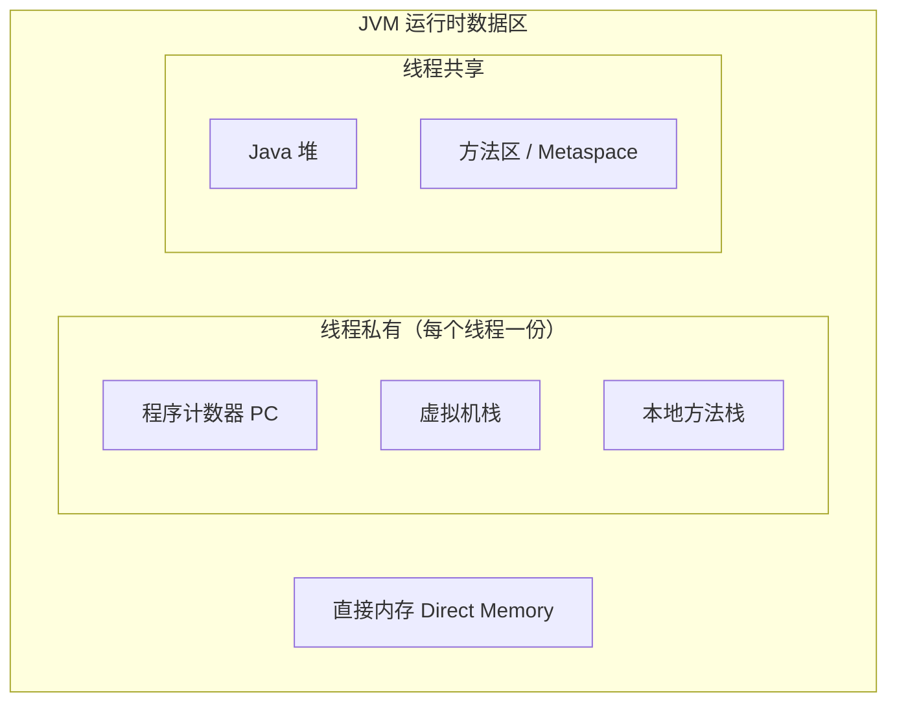
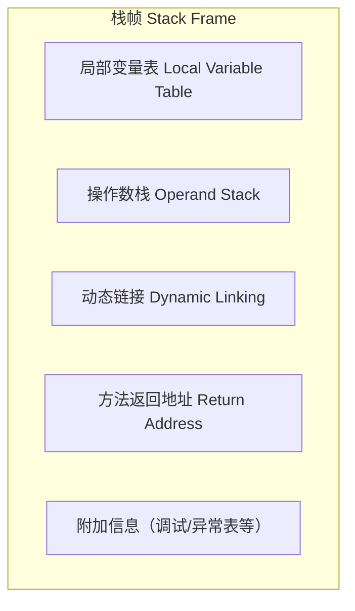
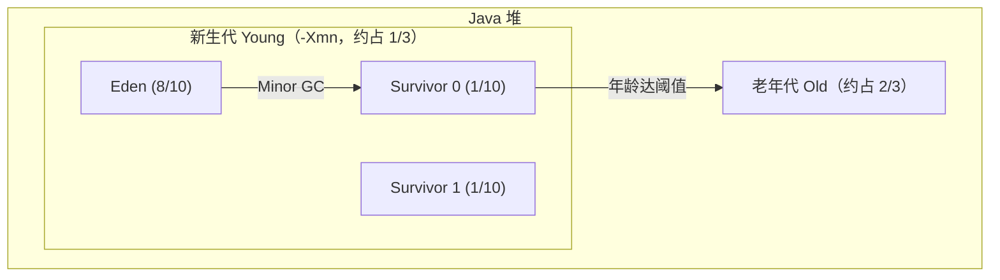
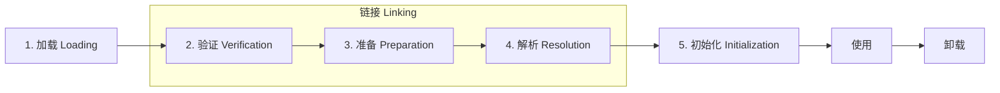
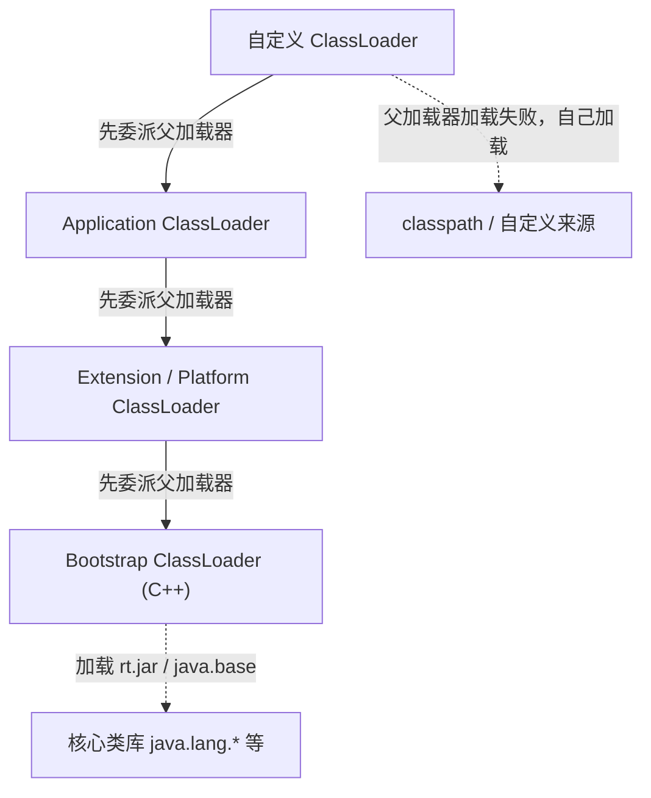
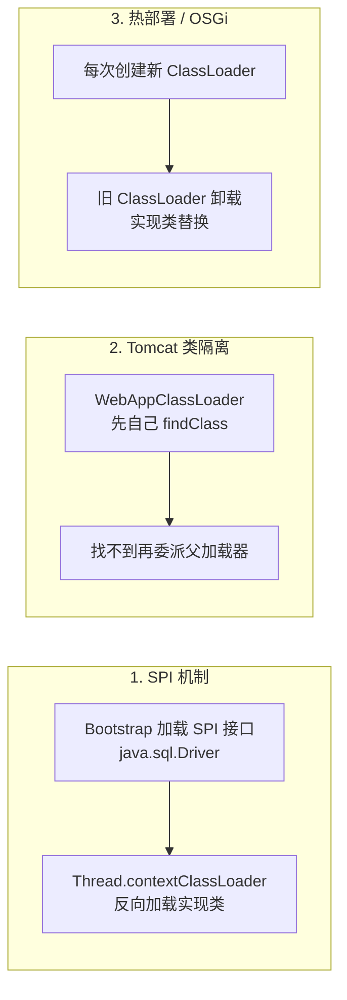

# M1 JVM 知识点

> 模块：M1 JVM ｜ 对应课表 Week 1-2
> 深度定位：面试能讲清 ｜ 来源：权威文档/书籍/博客
> 高频题：10 道

---

## 0. 速查索引

| # | 高频题 | 对应章节 | 学时 |
|---|---|---|---|
| 1 | JVM 运行时数据区 | §1.1–1.7 | Week1 Day1 |
| 2 | 堆内存分代结构 | §3.4 | Week1 Day3 |
| 3 | GC 算法 | §3.2 | Week1 Day3 |
| 4 | 垃圾收集器对比 | §3.6 | Week1 Day3 |
| 5 | CMS 四阶段 | §3.7 | Week1 Day3 |
| 6 | G1 原理 | §3.8 | Week1 Day3 |
| 7 | 类加载过程 | §2.1 | Week1 Day2 |
| 8 | 双亲委派 + 打破方式 | §2.3–2.4 | Week1 Day2 |
| 9 | OOM 排查 | §4.4–4.5 | Week2 Day1-2 |
| 10 | 对象晋升老年代条件 | §3.5 | Week1 Day3 |

---

## 1. 运行时数据区

JVM 运行时数据区是 JVM 在执行 Java 程序期间管理的内存区域。按**线程私有 / 线程共享**划分：程序计数器、虚拟机栈、本地方法栈为线程私有；堆、方法区为线程共享；直接内存则不属于 JVM 规范定义的运行时数据区，但常被一起讨论。



### 1.1 程序计数器（PC）

程序计数器是一块较小的内存空间，记录当前线程正在执行的字节码**行号/地址**。**线程私有**，生命周期与线程相同。分支、循环、跳转、异常处理、线程恢复都依赖它。

它是 JVM 规范中**唯一一个不会发生 OOM 的区域**。

> 关键结论：PC 线程私有，是因为 CPU 在多线程间轮转，每个线程需要一个独立计数器以在切换回来后恢复到正确位置。

**来源**：[JVM 规范 §2.5.1](https://docs.oracle.com/javase/specs/jvms/se17/html/jvms-2.html#jvms-2.5.1)

### 1.2 虚拟机栈

**定义**：虚拟机栈描述的是 Java 方法执行的线程内存模型：每个方法被执行时，JVM 都会同步创建一个**栈帧**，方法调用结束（正常或异常）栈帧即被销毁。线程私有，生命周期与线程相同。

**结构**（栈帧）：



- **局部变量表**：以变量槽（Slot）为单位存储方法参数与方法内局部变量。`long`/`double` 占 2 个 Slot，其余占 1 个。实例方法的第 0 个 Slot 是 `this` 引用。
- **操作数栈**：方法执行时的工作区，字节码指令从这里压栈/出栈（如 `iadd` 弹出两个 int 相加再压回）。
- **动态链接**：指向运行时常量池中该方法的**符号引用**，支持在运行期解析为直接引用（多态、虚方法分派依赖它）。
- **方法返回地址**：方法返回后恢复上层方法执行位置，可能存放 PC 值或异常信息。

**关键点**：
- 栈帧大小在**编译期**确定（局部变量表/操作数栈的深度写死在 Code 属性中），运行期不变。
- 可通过 `-Xss` 调整栈容量，默认通常 512KB–1MB（HotSpot JDK 17 默认 1MB）。
- 方法调用深度过深 → `StackOverflowError`；无法分配新栈帧（OOM 但无法申请到足够内存）→ `OutOfMemoryError`。

> 💡 **面试话术**：「虚拟机栈是线程私有的，每个方法调用会创建一个栈帧，栈帧里包含局部变量表、操作数栈、动态链接和返回地址四部分。局部变量表存方法参数和局部变量，以 Slot 为单位；操作数栈是字节码指令的工作区。栈帧大小在编译期就定死了。如果递归太深会抛 StackOverflowError；如果是不断开新线程导致无法分配新栈帧，则抛 OutOfMemoryError。」

**常见追问**：
- Q: 栈帧里有什么？ → 局部变量表、操作数栈、动态链接、方法返回地址（外加附加信息）。
- Q: 局部变量表和操作数栈的区别？ → 前者存数据（按 Slot 索引），后者是计算工作区（后进先出），字节码指令在两者间搬运。
- Q: `-Xss` 设大了会怎样？ → 单线程可用栈更深（少 SOF），但同样物理内存下能创建的线程数变少（更易 OOM）。
- Q: 方法内联与栈帧的关系？ → 内联后少了调用开销，省了创建栈帧与压栈出栈动作，是 JIT 优化基础。

**来源**：《深入理解 Java 虚拟机》第 3 版 §2.5.2；[JVM 规范 §2.5.2](https://docs.oracle.com/javase/specs/jvms/se17/html/jvms-2.html#jvms-2.5.2)；[JVM 规范 §2.6 栈帧](https://docs.oracle.com/javase/specs/jvms/se17/html/jvms-2.html#jvms-2.6)

### 1.3 本地方法栈

**定义**：与虚拟机栈作用相同，区别在于它服务于 **native 方法**（Java 调用 C/C++ 等本地代码）。HotSpot 实现中将虚拟机栈与本地方法栈合二为一。

- 同样线程私有，会抛 `StackOverflowError` 和 `OutOfMemoryError`。
- 常见 native 方法：`Object.hashCode`、`Thread.start0`、`System.currentTimeMillis` 等底层调用。

> 关键结论：本地方法栈 ≈ 虚拟机栈的 native 版本；HotSpot 不区分二者。

**来源**：[JVM 规范 §2.5.3](https://docs.oracle.com/javase/specs/jvms/se17/html/jvms-2.html#jvms-2.5.3)

### 1.4 堆

**定义**：Java 堆是 JVM 管理内存中**最大**的一块，被所有**线程共享**，在虚拟机启动时创建。几乎所有的**对象实例与数组**都在堆上分配（逃逸分析下可能栈上分配 / 标量替换，但典型情况仍在堆）。是 **GC 的主战场**。

**结构**（分代）：



新生代:老年代 默认 ≈ 1:2（`-XX:NewRatio=2`）；Eden:S0:S1 = 8:1:1（`-XX:SurvivorRatio=8`）。

**关键点**：
- 新对象一般先在 Eden 分配；大对象可直接进入老年代（`-XX:PretenureSizeThreshold`）。
- Minor GC 清理新生代，频繁但快；Major GC / Full GC 清理老年代/整个堆，慢且应尽量避免。
- 堆可处于物理不连续、逻辑连续空间；可通过 `-Xms`（初始）、`-Xmx`（最大）调整。
- JDK 8 默认垃圾收集器 Parallel Scavenge + Parallel Old；JDK 9+ G1；JDK 15+ ZGC 转正。

> 💡 **面试话术**：「堆是 JVM 内存中最大的一块，所有线程共享，是 GC 主战场。分新生代和老年代，新生代又分 Eden 和两个 Survivor 区，比例 8:1:1，新生代老年代默认 1:2。新对象先在 Eden 分配，Minor GC 后存活对象进 Survivor，多次 GC 仍存活（默认年龄 15）晋升老年代。大对象会直接进老年代避免复制开销。堆大小用 -Xms 和 -Xmx 控制。」

**常见追问**：
- Q: 为什么 Survivor 要两个？ → 复制算法需要一个空区做目标，两个 Survivor 交替使用，保证任何时候都有一个空。
- Q: 对象何时进老年代？ → ① 年龄达阈值（默认 15，`-XX:MaxTenuringThreshold`）；② 大对象超过 `PretenureSizeThreshold`；③ 动态年龄判断（Survivor 中相同年龄对象大小总和 > Survivor 一半，该年龄以上全部晋升）；④ Minor GC 后 Survivor 装不下。
- Q: 堆一定是连续的吗？ → 逻辑连续即可，物理可不连续。
- Q: JDK 8 默认收集器？ → Parallel Scavenge + Parallel Old（吞吐量优先）。

**来源**：《深入理解 Java 虚拟机》第 3 版 §2.5.3 / §3.8；[JVM 规范 §2.5.3](https://docs.oracle.com/javase/specs/jvms/se17/html/jvms-2.html#jvms-2.5.3)

### 1.5 方法区 / Metaspace

**定义**：方法区用于存储**已被加载的类信息、常量、静态变量、JIT 编译后的代码**等。线程共享。JVM 规范中它只是逻辑区域，不同 JDK 实现不同。

**演进**（重要考点）：

| 版本 | 实现 | 位置 | 调参 |
|---|---|---|---|
| JDK 7 及以前 | 永久代 PermGen | JVM 进程内存 | `-XX:PermSize` / `-XX:MaxPermSize` |
| JDK 8 | Metaspace | **直接内存** | `-XX:MetaspaceSize` / `-XX:MaxMetaspaceSize` |

**为什么废弃永久代**：
1. 永久代大小固定（`-XX:MaxPermSize`），容易 OOM，尤其是动态类加载多（Spring/CGLib/动态代理/JSP）的场景。
2. 永久代 GC 效率低，类元数据回收条件苛刻（类加载器卸载 + 无实例 + 无引用），常造成内存泄漏。
3. 调优困难——堆和永久代两套独立的内存管理。
4. 与 JRockit/HotSpot 合并的技术选型统一（JRockit 没有永久代）。

**关键点**：
- Metaspace 在**本地内存（直接内存）**中，默认上限是机器可用内存，受 `-XX:MaxMetaspaceSize` 约束。
- **字符串常量池、静态对象引用**在 JDK 7 起被移出永久代：字符串常量池移到 Java 堆，静态变量存在堆中的 Class 对象上。
- JDK 8 仍保留"方法区"概念，只是实现换成 Metaspace。

> 💡 **面试话术**：「方法区存类信息、常量池、静态变量，是线程共享的。JDK 7 之前用永久代实现，在 JVM 进程内存里，大小固定容易 OOM。JDK 8 把永久代废弃，换成 Metaspace，放在直接内存里，默认上限是机器内存，更不容易 OOM。同时字符串常量池和静态变量在 JDK 7 就已经从永久代移到了堆里。永久代被废弃主要是它大小固定、GC 困难、与 JRockit 合并的技术选型统一。」

**常见追问**：
- Q: 字符串常量池在哪？ → JDK 7+ 在 Java 堆（永久代移出）；JDK 6 在永久代。
- Q: 静态变量存哪？ → JDK 7+ 静态变量引用存在堆中 Class 对象上，对象本身在堆。
- Q: Metaspace 会 OOM 吗？ → 会，加载过多类（如不断生成代理类）会撑满，受 `-XX:MaxMetaspaceSize` 限制。
- Q: 永久代和 Metaspace 的本质区别？ → 位置（JVM 内存 vs 直接内存）+ 大小（固定上限 vs 默认机器内存）+ GC 策略。

**来源**：[JEP 122: Remove the Permanent Generation](https://openjdk.org/jeps/122)；《深入理解 Java 虚拟机》第 3 版 §2.5.4 / §2.4.3；[JVM 规范 §2.5.4](https://docs.oracle.com/javase/specs/jvms/se17/html/jvms-2.html#jvms-2.5.4)

### 1.6 运行时常量池

**定义**：运行时常量池是方法区的一部分。class 文件中的**常量池**（Constant Pool Table）在类加载后进入方法区，形成运行时常量池，存放编译期生成的**字面量**和**符号引用**。

**动态性**：运行时常量池不限于 class 文件常量池，可在运行期将新常量放入，典型例子是 `String.intern()` —— 把字符串放入字符串常量池并返回引用。JDK 7 起 `intern()` 存的是堆中 String 对象的引用，而非复制字符串。

> 关键结论：class 文件常量池 → 运行时常量池（方法区）→ 字符串常量池（JDK 7+ 在堆）。

**来源**：《深入理解 Java 虚拟机》第 3 版 §2.5.5 / §6.3；[JVM 规范 §2.5.5](https://docs.oracle.com/javase/specs/jvms/se17/html/jvms-2.html#jvms-2.5.5)

### 1.7 直接内存

**定义**：直接内存不是 JVM 运行时数据区的一部分，也不是 JVM 规范定义的区域，但因 NIO 的 `DirectByteBuffer` 被频繁使用而常被一起讨论。

**关键点**：
- NIO 引入基于 Channel 与 Buffer 的 I/O，可用 native 函数直接分配**堆外内存**，避免 Java 堆与 native 堆之间的数据拷贝（零拷贝）。
- **不受 `-Xmx` 约束**，但受物理机器内存和 `-XX:MaxDirectMemorySize` 限制。
- Metaspace（JDK 8+）就位于直接内存中——这就是为什么 Metaspace 不占 Java 堆。
- 回收依赖 `Unsafe.freeMemory` 或 Cleaner 机制，分配回收成本高于堆内对象，适合大块、长生命周期、I/O 密集场景。

> 关键结论：直接内存 = 堆外内存；不受 -Xmx 约束但受 -XX:MaxDirectMemorySize 限制；Metaspace 也在直接内存。

**来源**：[JVM 规范 §2.5.4](https://docs.oracle.com/javase/specs/jvms/se17/html/jvms-2.html#jvms-2.5.4)；《深入理解 Java 虚拟机》第 3 版 §2.5.7 / §13.2.6；[JEP 122](https://openjdk.org/jeps/122)

### 1.8 面试话术与追问

**总览话术**（可直接口述，约 230 字）：

「JVM 运行时数据区分为线程私有和线程共享两类。线程私有的是程序计数器、虚拟机栈、本地方法栈——程序计数器记录当前线程执行的字节码位置，是唯一不会 OOM 的区域；虚拟机栈以栈帧为单位，每个方法调用一个栈帧，里面有局部变量表、操作数栈、动态链接和返回地址；本地方法栈服务 native 方法，HotSpot 与虚拟机栈合并。线程共享的是堆和方法区：堆是 GC 主战场，分新生代和老年代，新对象先在 Eden 分配；方法区存类信息、常量池、静态变量，JDK 8 起从永久代换成 Metaspace，放在直接内存里。另外还有直接内存，NIO 用的堆外内存，不受 -Xmx 约束。」

**常见追问**：

- Q: **栈帧里有什么？** → 局部变量表（按 Slot 存参数和局部变量）、操作数栈（字节码计算工作区）、动态链接（指向常量池符号引用）、方法返回地址（恢复上层调用），外加附加信息。
- Q: **为什么永久代被废弃？** → ① 大小固定易 OOM；② GC 困难、类元数据回收条件苛刻；③ 与 JRockit 合并的技术选型；④ 动态类加载场景（Spring/代理/JSP）多，永久代不够灵活。
- Q: **PC 为什么线程私有？** → 多线程由 CPU 轮转执行，每个线程需要独立计数器才能在切回时恢复到正确执行位置；若共享会互相覆盖。
- Q: **堆和栈的区别？** → 栈线程私有存栈帧（方法运行时数据，编译期确定大小）；堆线程共享存对象实例（GC 主战场，运行期动态分配）。
- Q: **Metaspace 会 OOM 吗？怎么排查？** → 会，加载过多类（动态代理/JSP 重编译）会撑满，jcmd / jmap 看 Metaspace 占用，调整 `-XX:MaxMetaspaceSize`，排查是否有类加载器泄漏。
- Q: **为什么 Survivor 要两个？** → 复制算法需要空目标区，两个 Survivor 交替复制，保证一个时刻总有一个为空。

### 1.9 进阶阅读

- **JVM 规范 §2.5 Runtime Data Areas**：[docs.oracle.com](https://docs.oracle.com/javase/specs/jvms/se17/html/jvms-2.html#jvms-2.5) — 官方权威定义，5 个区域的精确描述。
- **JVM 规范 §2.6 Frames**：[docs.oracle.com](https://docs.oracle.com/javase/specs/jvms/se17/html/jvms-2.html#jvms-2.6) — 栈帧结构的权威说明，对应本地变量表/操作数栈/动态链接/返回地址。
- **JEP 122: Remove the Permanent Generation**：[openjdk.org](https://openjdk.org/jeps/122) — 永久代废弃的官方动机与设计，理解 Metaspace 演进的权威依据。
- **R大（RednaxelaFX）关于永久代废弃的回答**：知乎上 R大对"为什么 JDK 8 移除永久代"等 JVM 问题的深度回答，是中文社区公认的高质量来源；可在知乎搜索"RednaxelaFX 永久代"。

---

## 2. 类加载机制

类加载是 JVM 把 class 文件加载到内存、生成 `Class` 对象、并完成初始化的过程，是"类生命周期"的前半段（加载→链接→初始化→使用→卸载）。理解类加载是理解双亲委派、SPI、Tomcat 类隔离、热部署等机制的基石。

### 2.1 类加载过程

**定义**：类加载过程包含 **加载、链接、初始化** 三个大阶段，其中链接又分为 **验证、准备、解析** 三个子阶段。完整流程是 5 个阶段：加载→验证→准备→解析→初始化（使用和卸载属于类生命周期但不属于"加载"）。

**结构**（5 阶段流程）：



各阶段做什么：

- **加载**：通过类的全限定名获取定义此类的二进制字节流（可从 jar/网络/动态生成/JSP 等来源）；将字节流转换为方法区的运行时数据结构；在堆中生成一个代表该类的 `java.lang.Class` 对象，作为方法区数据的访问入口。**这是开发人员可控性最强的一步**——自定义类加载器就介入在这里。
- **验证**：确保 class 字节码符合 JVM 规范、不会危害虚拟机安全。包括文件格式验证（魔数 0xCAFEBABE、版本号）、元数据验证（语义合法）、字节码验证（控制流/数据流分析）、符号引用验证（解析阶段会用到）。
- **准备**：为**类变量**（`static`）在方法区分配内存并赋**零值**（如 int→0、引用→null），**不执行任何 Java 代码**。注意：
  - 此时 `static int a = 123;` 在准备阶段 a = 0，赋值 123 在初始化阶段才发生。
  - 例外：`static final` 修饰的**编译期常量**（ConstantValue 属性）在准备阶段就会被赋真实值，如 `static final int a = 123;` 直接 a = 123。
- **解析**：将常量池内的**符号引用**替换为**直接引用**（内存地址/偏移量/句柄）。符号引用在 class 文件中是字符串形式，解析后变成可直接定位目标的引用。解析可能在初始化前完成（部分 JVM），也可能延迟到对应指令首次使用时（懒解析）。
- **初始化**：执行类构造器 `<clinit>()` 方法。`<clinit>` 由编译器自动收集类中所有 **`static` 变量赋值动作**和**静态代码块**（`static {}`）按源码顺序合并而成。**JVM 保证 `<clinit>` 在多线程下被正确加锁同步**，这也是单例延迟初始化（静态内部类写法）线程安全的原理。

**准备阶段 vs 初始化阶段（高频考点）**：

| 代码 | 准备阶段值 | 初始化阶段值 |
|---|---|---|
| `static int a;` | 0 | 0（无赋值） |
| `static int a = 123;` | 0 | 123 |
| `static final int a = 123;` | 123（ConstantValue） | 123 |
| `static Integer a = 123;` | null（引用） | 装箱后的 Integer 对象 |

**触发初始化的时机（主动引用）**：① new / getstatic / putstatic / invokestatic 四条字节码指令（new 实例、读写静态字段、调用静态方法）；② 反射调用（`Class.forName`）；③ 初始化子类时父类若未初始化则先初始化；④ JVM 启动时的主类（含 main）；⑤ MethodHandle 句柄对应的类。

**不会触发初始化（被动引用）**：① 通过子类访问父类的静态字段，只初始化父类不初始化子类；② `ClassName[] arr = new ClassName[10]` 不触发类初始化（数组类型由 JVM 动态生成）；③ 访问 `static final` 常量（已被放入调用方常量池）。

**关键点**：
- 加载阶段是唯一允许开发人员介入（自定义 ClassLoader）的阶段。
- 准备阶段只赋零值，赋真实值在初始化阶段（`final` 常量例外）。
- `<clinit>` 线程安全，是静态内部类单例模式的原理。
- 加载、验证、准备、初始化的**开始顺序**确定，但**解析**有时会延迟，与初始化交错。

> 💡 **面试话术**：「类加载分 5 个阶段：加载、验证、准备、解析、初始化，其中验证准备解析合起来叫链接。加载是把 class 字节流读进来放到方法区，并在堆里建一个 Class 对象；验证确保字节码合法安全；准备给静态变量分配内存赋零值，比如 int 赋 0、引用赋 null，注意是零值不是真实值，真实值要等初始化阶段执行 `<clinit>` 才赋——但 final 常量在准备阶段就会通过 ConstantValue 属性赋真值；解析是把常量池符号引用换成直接引用；初始化就是执行 `<clinit>`，把静态变量赋值和静态代码块按顺序合并执行，JVM 保证它多线程同步加锁，所以静态内部类单例是线程安全的。」

**常见追问**：
- Q: 准备阶段 `static int a = 123` 的 a 是几？ → 0，123 在初始化阶段才赋。
- Q: `static final int a = 123` 呢？ → 准备阶段就是 123，因为是 ConstantValue 属性。
- Q: `<clinit>` 是什么？ → 类构造器，由静态变量赋值和静态代码块按源码顺序合并，多线程下 JVM 保证同步。
- Q: 什么时候不会触发类初始化？ → 通过子类访问父类静态字段、`new ClassName[10]`、访问 final 常量。
- Q: 加载和链接顺序严格吗？ → 加载一定先于链接开始，但解析有时延迟到初始化后才完成（懒解析）。

**来源**：[JVM 规范 §5 Loading, Linking, and Initializing](https://docs.oracle.com/javase/specs/jvms/se17/html/jvms-5.html)；《深入理解 Java 虚拟机》第 3 版 第 7 章 §7.3–7.4

### 2.2 类加载器分类

类加载器（ClassLoader）负责"加载"阶段把 class 字节流读入 JVM。JVM 默认提供三层加载器，开发人员可自定义。

| 类加载器 | 实现 | 加载范围 | 父加载器 |
|---|---|---|---|
| Bootstrap ClassLoader | C++ 实现，JVM 内部 | `<JAVA_HOME>/lib` 核心类库（rt.jar / java.base 模块），如 `java.*`、`sun.*` | 无（返回 null） |
| Extension / Platform ClassLoader | Java 实现（`ExtClassLoader`，JDK 9+ 改名 `PlatformClassLoader`） | JDK 8: `<JAVA_HOME>/lib/ext`；JDK 9+: 平台模块 | Bootstrap |
| Application ClassLoader | Java 实现（`AppClassLoader`），`ClassLoader.getSystemClassLoader()` 返回它 | classpath（`-cp` / `-classpath` / `CLASSPATH`）下的类，应用自身 + 第三方 jar | Extension/Platform |
| 自定义 ClassLoader | 继承 `java.lang.ClassLoader` | 任意来源：网络、加密 jar、动态生成、热部署 | 由构造时传入，常为 AppClassLoader |

> 关键结论：Bootstrap 是 C++ 写的、对 Java 不可见（`String.class.getClassLoader()` 返回 null）；其它都是 Java 类。JDK 9 模块化后 ExtClassLoader 改名 PlatformClassLoader，加载平台模块而非 ext 目录。

**来源**：[ClassLoader Javadoc (JDK 17)](https://docs.oracle.com/en/java/javase/17/docs/api/java.base/java/lang/ClassLoader.html)；《深入理解 Java 虚拟机》第 3 版 §7.4.1

### 2.3 双亲委派模型

**定义**：双亲委派模型规定类加载器收到加载请求时，**先把请求委派给父加载器**去加载，父加载器再向上委派，直到 Bootstrap；只有当父加载器反馈自己无法加载（在它的搜索范围内找不到对应类）时，子加载器才尝试自己加载。

**结构**（层级图）：



**工作原理**（以加载 `java.lang.String` 为例）：自定义加载器收到请求 → 委派给 AppClassLoader → 委派给 PlatformClassLoader → 委派给 Bootstrap → Bootstrap 在 `<JAVA_HOME>/lib` 找到 `java.lang.String` 并加载，返回 Class 对象。整个链条中**只有 Bootstrap 真正加载了它**，下面的子加载器不再尝试。

`ClassLoader.loadClass` 源码核心逻辑（简化）：

```java
protected Class<?> loadClass(String name, boolean resolve) throws ClassNotFoundException {
    synchronized (getClassLoadingLock(name)) {
        // 1. 检查是否已加载
        Class<?> c = findLoadedClass(name);
        if (c == null) {
            try {
                // 2. 委派给父加载器
                if (parent != null) {
                    c = parent.loadClass(name, false);
                } else {
                    c = findBootstrapClassOrNull(name); // 委派给 Bootstrap
                }
            } catch (ClassNotFoundException e) { /* 父加载器加载失败 */ }
            // 3. 父加载器都没找到，自己加载
            if (c == null) {
                c = findClass(name);
            }
        }
        return c;
    }
}
```

**为什么这样设计**：

1. **安全（防止核心类被篡改）**：所有 `java.*` 类必然由 Bootstrap 加载。如果用户自定义了一个 `java.lang.String`（即使放到 classpath），也会因为 Bootstrap 先加载到核心 String 而被忽略，避免恶意代码替换核心类。这也是为什么自定义类不能放在 `java.*` 包下（抛 `SecurityException: Prohibited package name`）。
2. **避免重复加载**：同一类只会被加载一次（同一个 ClassLoader 命名空间内），保证类的全局唯一性——判断两个类"相等"不仅看类全限定名，还要看是否由同一 ClassLoader 加载。
3. **保证类型一致性**：核心 API 由顶层加载器统一加载，应用代码引用 `java.lang.String` 拿到的都是同一个 Class 对象。

**关键点**：
- 双亲委派不是强制约束（JVM 规范没要求），而是 ClassLoader 的**推荐设计模式**。
- 子加载器可见父加载器加载的类，反之不行。
- `ClassLoader.getParent()` 返回父加载器，Bootstrap 返回 null（因为它不是 Java 对象）。
- 同一类的"相等"判断 = 全限定名相同 + 同一 ClassLoader 加载。

> 💡 **面试话术**：「双亲委派模型是说一个类加载器收到加载请求时，会先委派给父加载器去加载，父加载器再向上委派，一直到 Bootstrap。只有当父加载器找不到时，子加载器才自己加载。它的设计目的有两个：一是安全，保证核心类比如 java.lang.String 一定由 Bootstrap 加载，用户即使写了一个同名类也不会被加载，避免核心 API 被篡改；二是避免重复加载，保证一个类在一个 ClassLoader 命名空间里只加载一次，类的全局唯一性靠全限定名加 ClassLoader 一起判断。注意双亲委派不是 JVM 规范强制的，只是推荐模式，所以可以被打破。」

**常见追问**：
- Q: 双亲委派是强制的吗？ → 不是，JVM 规范没要求，是 ClassLoader 的推荐模式，可被重写 `loadClass` 打破。
- Q: 为什么判断两个类相等要看 ClassLoader？ → 因为同一个类名可能被不同 ClassLoader 加载出两个 Class 对象，它们互不相等（即便字节码完全相同）。
- Q: `getParent()` 什么时候返回 null？ → 该加载器的父加载器是 Bootstrap 时（因为 Bootstrap 是 C++ 实现，不是 Java 对象）。
- Q: 用户能写一个 `java.lang.String` 替换核心类吗？ → 不能，双亲委派下 Bootstrap 先加载到核心 String；而且 `java.*` 是禁止包名，自定义会被 SecurityManager 拒绝。

**来源**：[ClassLoader.loadClass Javadoc](https://docs.oracle.com/en/java/javase/17/docs/api/java.base/java/lang/ClassLoader.html#loadClass(java.lang.String,boolean))；《深入理解 Java 虚拟机》第 3 版 §7.4.2

### 2.4 打破双亲委派

**定义**：双亲委派是推荐模式而非强制约束，当父加载器需要"反向"使用子加载器加载类，或需要类隔离时，就需要打破双亲委派。三种典型方式：

**结构**（三种打破方式对比）：



**方式 1：SPI 机制（JDBC 为例）**

SPI（Service Provider Interface）核心矛盾：接口（如 `java.sql.Driver`）由 **Bootstrap** 加载，在 `<JAVA_HOME>/lib`；但实现类（如 `com.mysql.cj.jdbc.Driver`）是第三方 jar，在 classpath，**Bootstrap 看不到**。Bootstrap 加载接口后却无法用 `Class.forName` 加载实现类（因为它只能看到核心类库）。

解决：JDK 引入 `Thread.currentThread().getContextClassLoader()`，它默认是 **AppClassLoader**。`java.sql.DriverManager`（Bootstrap 加载的类）通过 contextClassLoader **反向**调用子加载器（AppClassLoader）加载 SPI 实现类。`ServiceLoader.load(Driver.class)` 内部就是这么做的。

```
Bootstrap 加载 DriverManager → 用 Thread.contextClassLoader（AppClassLoader）→ 加载 classpath 上的 MySQL Driver
```

这就是"父加载器请求子加载器加载类"的反向委派，是双亲委派模型被打补丁的典型。

**方式 2：Tomcat 每个 WebApp 独立 ClassLoader 先自己加载**

Tomcat 一个 JVM 部署多个 Web 应用，要求**类隔离**：A 应用用的 Spring 5 和 B 应用用的 Spring 4 不能冲突。如果严格走双亲委派，所有应用共用一个 AppClassLoader，先加载的 Spring 会"污染"其它应用。

Tomcat 为每个 Web 应用创建独立的 `WebAppClassLoader`，它**重写了 `loadClass`，优先自己加载**（顺序大致是：缓存 → JVM 缓存 → Java 核心类委派 Bootstrap → WebApp 本地 WEB-INF/classes 和 WEB-INF/lib → Common ClassLoader → AppClassLoader）。这样每个应用的类在自己命名空间里互不干扰。

为什么必须先自己加载？如果先委派 AppClassLoader，应用类会先被父加载器加载，多个应用就共享了同一个 Class 对象，隔离失败。但 Java 核心类（`java.*`）仍走 Bootstrap，保证安全。

**方式 3：热部署 / OSGi 模块化**

热部署：每次修改类文件后，**丢弃旧的 ClassLoader，新建一个 ClassLoader 重新加载该类**。旧 ClassLoader 加载的旧类对象因不再被引用，会被 GC 回收（连同其加载的类）。实现方式是自定义 ClassLoader 重写 `findClass`，监听文件变化触发重新加载。JRebel、IDE 的热部署都基于此。

OSGi：每个模块（Bundle）有自己的 ClassLoader，模块间通过 Import-Package / Export-Package 显式声明依赖，类加载变成**网状结构**而非树状，每个 Bundle 可以指定某个包从哪个 Bundle 加载，灵活但复杂。OSGi 是双亲委派的彻底替代方案。

**关键点**：
- 打破双亲委派 = 重写 `loadClass`（改变委派顺序）或反向使用 contextClassLoader。
- SPI 是"父加载器借助子加载器"的反向委派，最典型。
- Tomcat 是"子加载器先于父加载器"，为类隔离。
- 热部署靠"换 ClassLoader"，OSGi 靠"网状多加载器"。
- 自定义类加载器最常见做法：继承 `ClassLoader` 重写 `findClass`（保持双亲委派）或重写 `loadClass`（打破双亲委派）。

> 💡 **面试话术**：「双亲委派不是强制的，有三种典型打破场景。第一是 SPI，比如 JDBC：DriverManager 这种核心类由 Bootstrap 加载，但它要加载 classpath 上的 MySQL Driver 实现类，Bootstrap 看不到，所以 JDK 提供了 Thread.contextClassLoader，默认是 AppClassLoader，让 Bootstrap 加载的类能反向调用子加载器加载实现类。第二是 Tomcat 类隔离，每个 Web 应用有自己的 WebAppClassLoader，它重写了 loadClass 优先自己加载 WEB-INF 下的类，这样多个应用用不同版本的 Spring 不会冲突，但 java 核心类还是走 Bootstrap 保证安全。第三是热部署和 OSGi，热部署靠换一个新的 ClassLoader 重新加载类，旧的等 GC 回收；OSGi 每个 Bundle 一个 ClassLoader，类加载是网状的不是树状。」

**常见追问**：
- Q: 为什么需要打破双亲委派？ → 三种需求：① 父加载器需要加载子加载器范围的类（SPI）；② 需要类隔离（Tomcat 多应用）；③ 需要动态更新类（热部署）。
- Q: SPI 中为什么要用 contextClassLoader？ → 因为 Bootstrap 加载的类无法 `Class.forName` 到 classpath 上的实现类，必须借助子加载器，contextClassLoader 是这种"反向委派"的桥梁。
- Q: Tomcat 打破双亲委派会不会导致 java.lang.String 被替换？ → 不会，WebAppClassLoader 仍把 `java.*` 委派给 Bootstrap，只是应用类优先自己加载。
- Q: 自定义 ClassLoader 重写 loadClass 还是 findClass？ → 推荐重写 findClass 保持双亲委派；要打破双亲委派才重写 loadClass。
- Q: JDK 9 模块化对类加载的影响？ → 模块化（JPMS）下，类加载基于**模块**而非 classpath；PlatformClassLoader 取代 ExtClassLoader；BootClassLoader 只加载平台模块；模块间通过 `requires`/`exports` 显式依赖，未导出的包对外不可见（封装强化）；`--add-opens`/`--illegal-access` 用于兼容旧代码。

**来源**：[JVM 规范 §5.3 Creation and Loading](https://docs.oracle.com/javase/specs/jvms/se17/html/jvms-5.html#jvms-5.3)；[Tomcat 9 Class Loader HowTo](https://tomcat.apache.org/tomcat-9.0-doc/class-loader-howto.html)；[ServiceLoader Javadoc](https://docs.oracle.com/en/java/javase/17/docs/api/java.base/java/util/ServiceLoader.html)；[JEP 261: Module System](https://openjdk.org/jeps/261)

### 2.5 面试话术与追问

**总览话术**（可直接口述，约 260 字）：

「类加载过程分加载、验证、准备、解析、初始化五步，验证准备解析合起来叫链接。加载是把 class 字节流读到方法区并建 Class 对象，自定义 ClassLoader 介入在这一步；准备给静态变量赋零值，真实值要等初始化执行 `<clinit>`，但 final 常量在准备阶段就赋真值；解析把符号引用换成直接引用；初始化执行静态变量赋值和静态代码块，JVM 保证 `<clinit>` 多线程同步。类加载器分 Bootstrap、Platform、Application 三层加自定义，采用双亲委派：收到请求先委派父加载器，父加载器加载不了子加载器才自己加载，目的是安全（核心类不被篡改）和避免重复加载。但双亲委派不是强制的，三种场景会打破：SPI 用 contextClassLoader 反向委派，Tomcat 用 WebAppClassLoader 优先自己加载做类隔离，热部署和 OSGi 靠换或加 ClassLoader 实现动态更新。」

**常见追问**：

- Q: **为什么需要打破双亲委派？** → 双亲委派解决了核心类安全和重复加载问题，但牺牲了灵活性：① 父加载器无法加载子加载器范围的类（SPI 需要反向委派）；② 不同应用需要同名类隔离（Tomcat 多 WebApp）；③ 需要运行时动态更新类（热部署）。
- Q: **JDK 9 模块化对类加载的影响？** → 引入 JPMS，类加载基于模块而非 classpath；ExtClassLoader 改名 PlatformClassLoader 加载平台模块；模块未导出包对外不可见（强封装）；反射访问受限，需 `--add-opens` 兼容。
- Q: **`<clinit>` 和 `<init>` 区别？** → `<clinit>` 是类构造器，执行静态变量赋值和静态代码块，JVM 保证多线程同步，类只执行一次；`<init>` 是实例构造器，对应构造方法，每 new 一次执行一次。
- Q: **同一个类被不同 ClassLoader 加载是同一个类吗？** → 不是。JVM 判断类相等 = 全限定名 + 定义 ClassLoader 相同。两个 Class 对象即便字节码完全相同，加载器不同就互不相等，`instanceof` 会失败。这也是 Tomcat 类隔离的原理。
- Q: **类什么时候会被卸载？** → 需要同时满足：① 该类所有实例都被回收；② 加载该类的 ClassLoader 已被回收；③ 该类对应的 Class 对象无引用。条件苛刻，所以大量动态生成类（代理/JSP）容易 Metaspace OOM。
- Q: **`Class.forName` 和 `ClassLoader.loadClass` 区别？** → `Class.forName` 默认会执行初始化（执行 `<clinit>`）；`ClassLoader.loadClass` 只加载不初始化。`Class.forName(name, false, loader)` 可指定不初始化，常用于 SPI 懒加载。
- Q: **静态内部类单例为什么线程安全？** → 因为它的初始化由 JVM 在类加载初始化阶段执行 `<clinit>`，而 JVM 保证 `<clinit>` 在多线程下被加锁同步执行，且只执行一次。

### 2.6 进阶阅读

- **JVM 规范 §5 Loading, Linking, and Initializing**：[docs.oracle.com](https://docs.oracle.com/javase/specs/jvms/se17/html/jvms-5.html) — 类加载全过程的权威定义，§5.3 创建与加载、§5.4 链接、§5.5 初始化逐条对应本章五个阶段。
- **《深入理解 Java 虚拟机》第 3 版 第 7 章 类加载机制**：周志明著 — 中文社区公认最权威的中文 JVM 书籍，§7.4 类加载器、§7.5 双亲委派模型讲得最系统。
- **Tomcat 9 Class Loader HowTo**：[tomcat.apache.org](https://tomcat.apache.org/tomcat-9.0-doc/class-loader-howto.html) — Tomcat 官方类加载文档，详细描述 WebAppClassLoader 与各级加载器的委派关系，理解打破双亲委派的权威依据。
- **JEP 261: Module System**：[openjdk.org](https://openjdk.org/jeps/261) — JDK 9 模块化对类加载影响的官方设计文档，PlatformClassLoader、模块层（Layer）、引导升级都在这里。
- **ServiceLoader 文档**：[docs.oracle.com](https://docs.oracle.com/en/java/javase/17/docs/api/java.base/java/util/ServiceLoader.html) — SPI 机制的权威说明，包含与 `Thread.contextClassLoader` 配合使用的约定。
- **ClassLoader Javadoc**：[docs.oracle.com](https://docs.oracle.com/en/java/javase/17/docs/api/java.base/java/lang/ClassLoader.html) — `loadClass` / `findClass` / `getParent` 等方法的官方契约，理解双亲委派源码层级。
- **Stack Overflow: Why DriverManager uses Thread.contextClassLoader**：高票回答详细解释了 SPI 反向委派的设计动机与 `Class.forName` 在 Bootstrap 下失效的原因，是 JDBC SPI 机制的最佳补充阅读。

---

## 3. GC 算法与垃圾收集器

（待填充）

---

## 4. JVM 调优与 OOM 排查

（待填充）

---

## 附：参考资料汇总

（待填充）
