# M1 JVM 知识点

> 模块：M1 JVM ｜ 对应课表 Week 1-2
> 深度定位：面试能讲清 ｜ 来源：权威文档/书籍/博客
> 高频题：10 道

---

## 0. 速查索引

| # | 高频题 | 对应章节 | 学时 |
|---|---|---|---|
| 1 | JVM 运行时数据区 | §1.1–1.7 | Week1 Day1 |
| 2 | 堆内存分代结构 | §3.4 | Week1 Day3 |
| 3 | GC 算法 | §3.2 | Week1 Day3 |
| 4 | 垃圾收集器对比 | §3.6 | Week1 Day3 |
| 5 | CMS 四阶段 | §3.7 | Week1 Day3 |
| 6 | G1 原理 | §3.8 | Week1 Day3 |
| 7 | 类加载过程 | §2.1 | Week1 Day2 |
| 8 | 双亲委派 + 打破方式 | §2.3–2.4 | Week1 Day2 |
| 9 | OOM 排查 | §4.4–4.5 | Week2 Day1-2 |
| 10 | 对象晋升老年代条件 | §3.5 | Week1 Day3 |

---

## 1. 运行时数据区

JVM 运行时数据区是 JVM 在执行 Java 程序期间管理的内存区域。按**线程私有 / 线程共享**划分：程序计数器、虚拟机栈、本地方法栈为线程私有；堆、方法区为线程共享；直接内存则不属于 JVM 规范定义的运行时数据区，但常被一起讨论。

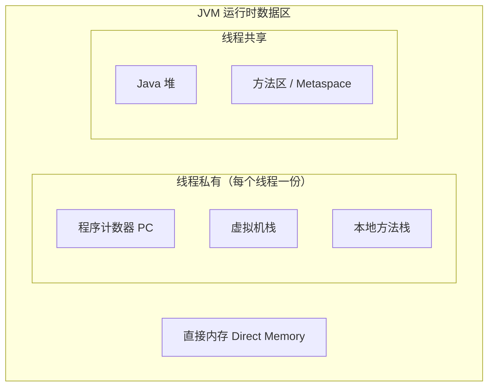

### 1.1 程序计数器（PC）

程序计数器是一块较小的内存空间，记录当前线程正在执行的字节码**行号/地址**。**线程私有**，生命周期与线程相同。分支、循环、跳转、异常处理、线程恢复都依赖它。

它是 JVM 规范中**唯一一个不会发生 OOM 的区域**。

> 关键结论：PC 线程私有，是因为 CPU 在多线程间轮转，每个线程需要一个独立计数器以在切换回来后恢复到正确位置。

**来源**：[JVM 规范 §2.5.1](https://docs.oracle.com/javase/specs/jvms/se17/html/jvms-2.html#jvms-2.5.1)

### 1.2 虚拟机栈

**定义**：虚拟机栈描述的是 Java 方法执行的线程内存模型：每个方法被执行时，JVM 都会同步创建一个**栈帧**，方法调用结束（正常或异常）栈帧即被销毁。线程私有，生命周期与线程相同。

**结构**（栈帧）：

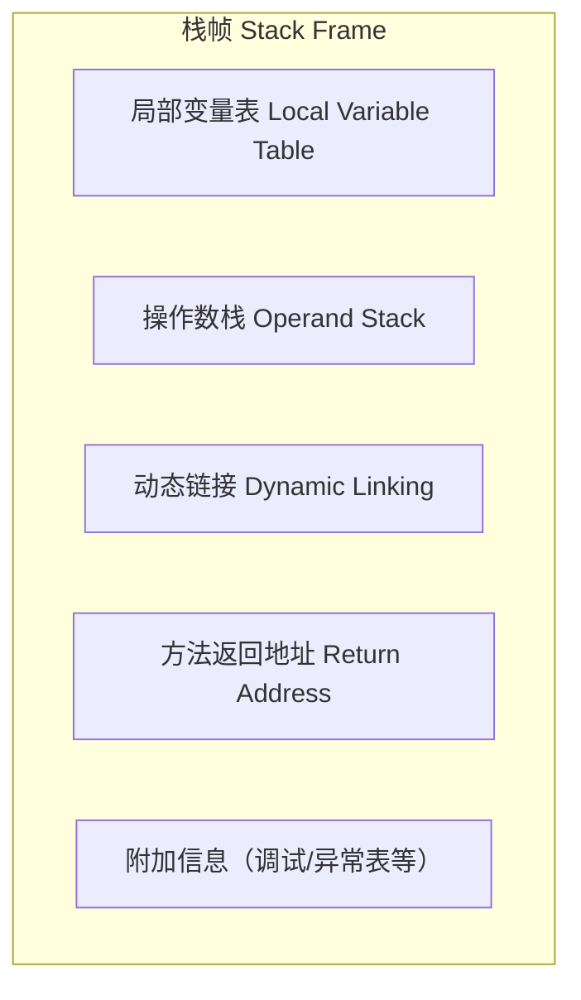

- **局部变量表**：以变量槽（Slot）为单位存储方法参数与方法内局部变量。`long`/`double` 占 2 个 Slot，其余占 1 个。实例方法的第 0 个 Slot 是 `this` 引用。
- **操作数栈**：方法执行时的工作区，字节码指令从这里压栈/出栈（如 `iadd` 弹出两个 int 相加再压回）。
- **动态链接**：指向运行时常量池中该方法的**符号引用**，支持在运行期解析为直接引用（多态、虚方法分派依赖它）。
- **方法返回地址**：方法返回后恢复上层方法执行位置，可能存放 PC 值或异常信息。

**关键点**：
- 栈帧大小在**编译期**确定（局部变量表/操作数栈的深度写死在 Code 属性中），运行期不变。
- 可通过 `-Xss` 调整栈容量，默认通常 512KB–1MB（HotSpot JDK 17 默认 1MB）。
- 方法调用深度过深 → `StackOverflowError`；无法分配新栈帧（OOM 但无法申请到足够内存）→ `OutOfMemoryError`。

> 💡 **面试话术**：「虚拟机栈是线程私有的，每个方法调用会创建一个栈帧，栈帧里包含局部变量表、操作数栈、动态链接和返回地址四部分。局部变量表存方法参数和局部变量，以 Slot 为单位；操作数栈是字节码指令的工作区。栈帧大小在编译期就定死了。如果递归太深会抛 StackOverflowError；如果是不断开新线程导致无法分配新栈帧，则抛 OutOfMemoryError。」

**常见追问**：
- Q: 栈帧里有什么？ → 局部变量表、操作数栈、动态链接、方法返回地址（外加附加信息）。
- Q: 局部变量表和操作数栈的区别？ → 前者存数据（按 Slot 索引），后者是计算工作区（后进先出），字节码指令在两者间搬运。
- Q: `-Xss` 设大了会怎样？ → 单线程可用栈更深（少 SOF），但同样物理内存下能创建的线程数变少（更易 OOM）。
- Q: 方法内联与栈帧的关系？ → 内联后少了调用开销，省了创建栈帧与压栈出栈动作，是 JIT 优化基础。

**来源**：《深入理解 Java 虚拟机》第 3 版 §2.5.2；[JVM 规范 §2.5.2](https://docs.oracle.com/javase/specs/jvms/se17/html/jvms-2.html#jvms-2.5.2)；[JVM 规范 §2.6 栈帧](https://docs.oracle.com/javase/specs/jvms/se17/html/jvms-2.html#jvms-2.6)

### 1.3 本地方法栈

**定义**：与虚拟机栈作用相同，区别在于它服务于 **native 方法**（Java 调用 C/C++ 等本地代码）。HotSpot 实现中将虚拟机栈与本地方法栈合二为一。

- 同样线程私有，会抛 `StackOverflowError` 和 `OutOfMemoryError`。
- 常见 native 方法：`Object.hashCode`、`Thread.start0`、`System.currentTimeMillis` 等底层调用。

> 关键结论：本地方法栈 ≈ 虚拟机栈的 native 版本；HotSpot 不区分二者。

**来源**：[JVM 规范 §2.5.3](https://docs.oracle.com/javase/specs/jvms/se17/html/jvms-2.html#jvms-2.5.3)

### 1.4 堆

**定义**：Java 堆是 JVM 管理内存中**最大**的一块，被所有**线程共享**，在虚拟机启动时创建。几乎所有的**对象实例与数组**都在堆上分配（逃逸分析下可能栈上分配 / 标量替换，但典型情况仍在堆）。是 **GC 的主战场**。

**结构**（分代）：

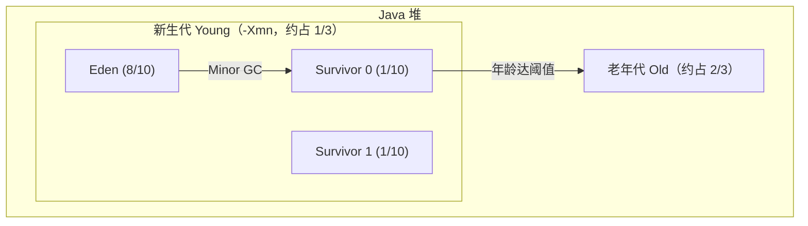

新生代:老年代 默认 ≈ 1:2（`-XX:NewRatio=2`）；Eden:S0:S1 = 8:1:1（`-XX:SurvivorRatio=8`）。

**关键点**：
- 新对象一般先在 Eden 分配；大对象可直接进入老年代（`-XX:PretenureSizeThreshold`）。
- Minor GC 清理新生代，频繁但快；Major GC / Full GC 清理老年代/整个堆，慢且应尽量避免。
- 堆可处于物理不连续、逻辑连续空间；可通过 `-Xms`（初始）、`-Xmx`（最大）调整。
- JDK 8 默认垃圾收集器 Parallel Scavenge + Parallel Old；JDK 9+ G1；JDK 15+ ZGC 转正。

> 💡 **面试话术**：「堆是 JVM 内存中最大的一块，所有线程共享，是 GC 主战场。分新生代和老年代，新生代又分 Eden 和两个 Survivor 区，比例 8:1:1，新生代老年代默认 1:2。新对象先在 Eden 分配，Minor GC 后存活对象进 Survivor，多次 GC 仍存活（默认年龄 15）晋升老年代。大对象会直接进老年代避免复制开销。堆大小用 -Xms 和 -Xmx 控制。」

**常见追问**：
- Q: 为什么 Survivor 要两个？ → 复制算法需要一个空区做目标，两个 Survivor 交替使用，保证任何时候都有一个空。
- Q: 对象何时进老年代？ → ① 年龄达阈值（默认 15，`-XX:MaxTenuringThreshold`）；② 大对象超过 `PretenureSizeThreshold`；③ 动态年龄判断（Survivor 中相同年龄对象大小总和 > Survivor 一半，该年龄以上全部晋升）；④ Minor GC 后 Survivor 装不下。
- Q: 堆一定是连续的吗？ → 逻辑连续即可，物理可不连续。
- Q: JDK 8 默认收集器？ → Parallel Scavenge + Parallel Old（吞吐量优先）。

**来源**：《深入理解 Java 虚拟机》第 3 版 §2.5.3 / §3.8；[JVM 规范 §2.5.3](https://docs.oracle.com/javase/specs/jvms/se17/html/jvms-2.html#jvms-2.5.3)

### 1.5 方法区 / Metaspace

**定义**：方法区用于存储**已被加载的类信息、常量、静态变量、JIT 编译后的代码**等。线程共享。JVM 规范中它只是逻辑区域，不同 JDK 实现不同。

**演进**（重要考点）：

| 版本 | 实现 | 位置 | 调参 |
|---|---|---|---|
| JDK 7 及以前 | 永久代 PermGen | JVM 进程内存 | `-XX:PermSize` / `-XX:MaxPermSize` |
| JDK 8 | Metaspace | **直接内存** | `-XX:MetaspaceSize` / `-XX:MaxMetaspaceSize` |

**为什么废弃永久代**：
1. 永久代大小固定（`-XX:MaxPermSize`），容易 OOM，尤其是动态类加载多（Spring/CGLib/动态代理/JSP）的场景。
2. 永久代 GC 效率低，类元数据回收条件苛刻（类加载器卸载 + 无实例 + 无引用），常造成内存泄漏。
3. 调优困难——堆和永久代两套独立的内存管理。
4. 与 JRockit/HotSpot 合并的技术选型统一（JRockit 没有永久代）。

**关键点**：
- Metaspace 在**本地内存（直接内存）**中，默认上限是机器可用内存，受 `-XX:MaxMetaspaceSize` 约束。
- **字符串常量池、静态对象引用**在 JDK 7 起被移出永久代：字符串常量池移到 Java 堆，静态变量存在堆中的 Class 对象上。
- JDK 8 仍保留"方法区"概念，只是实现换成 Metaspace。

> 💡 **面试话术**：「方法区存类信息、常量池、静态变量，是线程共享的。JDK 7 之前用永久代实现，在 JVM 进程内存里，大小固定容易 OOM。JDK 8 把永久代废弃，换成 Metaspace，放在直接内存里，默认上限是机器内存，更不容易 OOM。同时字符串常量池和静态变量在 JDK 7 就已经从永久代移到了堆里。永久代被废弃主要是它大小固定、GC 困难、与 JRockit 合并的技术选型统一。」

**常见追问**：
- Q: 字符串常量池在哪？ → JDK 7+ 在 Java 堆（永久代移出）；JDK 6 在永久代。
- Q: 静态变量存哪？ → JDK 7+ 静态变量引用存在堆中 Class 对象上，对象本身在堆。
- Q: Metaspace 会 OOM 吗？ → 会，加载过多类（如不断生成代理类）会撑满，受 `-XX:MaxMetaspaceSize` 限制。
- Q: 永久代和 Metaspace 的本质区别？ → 位置（JVM 内存 vs 直接内存）+ 大小（固定上限 vs 默认机器内存）+ GC 策略。

**来源**：[JEP 122: Remove the Permanent Generation](https://openjdk.org/jeps/122)；《深入理解 Java 虚拟机》第 3 版 §2.5.4 / §2.4.3；[JVM 规范 §2.5.4](https://docs.oracle.com/javase/specs/jvms/se17/html/jvms-2.html#jvms-2.5.4)

### 1.6 运行时常量池

**定义**：运行时常量池是方法区的一部分。class 文件中的**常量池**（Constant Pool Table）在类加载后进入方法区，形成运行时常量池，存放编译期生成的**字面量**和**符号引用**。

**动态性**：运行时常量池不限于 class 文件常量池，可在运行期将新常量放入，典型例子是 `String.intern()` —— 把字符串放入字符串常量池并返回引用。JDK 7 起 `intern()` 存的是堆中 String 对象的引用，而非复制字符串。

> 关键结论：class 文件常量池 → 运行时常量池（方法区）→ 字符串常量池（JDK 7+ 在堆）。

**来源**：《深入理解 Java 虚拟机》第 3 版 §2.5.5 / §6.3；[JVM 规范 §2.5.5](https://docs.oracle.com/javase/specs/jvms/se17/html/jvms-2.html#jvms-2.5.5)

### 1.7 直接内存

**定义**：直接内存不是 JVM 运行时数据区的一部分，也不是 JVM 规范定义的区域，但因 NIO 的 `DirectByteBuffer` 被频繁使用而常被一起讨论。

**关键点**：
- NIO 引入基于 Channel 与 Buffer 的 I/O，可用 native 函数直接分配**堆外内存**，避免 Java 堆与 native 堆之间的数据拷贝（零拷贝）。
- **不受 `-Xmx` 约束**，但受物理机器内存和 `-XX:MaxDirectMemorySize` 限制。
- Metaspace（JDK 8+）就位于直接内存中——这就是为什么 Metaspace 不占 Java 堆。
- 回收依赖 `Unsafe.freeMemory` 或 Cleaner 机制，分配回收成本高于堆内对象，适合大块、长生命周期、I/O 密集场景。

> 关键结论：直接内存 = 堆外内存；不受 -Xmx 约束但受 -XX:MaxDirectMemorySize 限制；Metaspace 也在直接内存。

**来源**：[JVM 规范 §2.5.4](https://docs.oracle.com/javase/specs/jvms/se17/html/jvms-2.html#jvms-2.5.4)；《深入理解 Java 虚拟机》第 3 版 §2.5.7 / §13.2.6；[JEP 122](https://openjdk.org/jeps/122)

### 1.8 面试话术与追问

**总览话术**（可直接口述，约 230 字）：

「JVM 运行时数据区分为线程私有和线程共享两类。线程私有的是程序计数器、虚拟机栈、本地方法栈——程序计数器记录当前线程执行的字节码位置，是唯一不会 OOM 的区域；虚拟机栈以栈帧为单位，每个方法调用一个栈帧，里面有局部变量表、操作数栈、动态链接和返回地址；本地方法栈服务 native 方法，HotSpot 与虚拟机栈合并。线程共享的是堆和方法区：堆是 GC 主战场，分新生代和老年代，新对象先在 Eden 分配；方法区存类信息、常量池、静态变量，JDK 8 起从永久代换成 Metaspace，放在直接内存里。另外还有直接内存，NIO 用的堆外内存，不受 -Xmx 约束。」

**常见追问**：

- Q: **栈帧里有什么？** → 局部变量表（按 Slot 存参数和局部变量）、操作数栈（字节码计算工作区）、动态链接（指向常量池符号引用）、方法返回地址（恢复上层调用），外加附加信息。
- Q: **为什么永久代被废弃？** → ① 大小固定易 OOM；② GC 困难、类元数据回收条件苛刻；③ 与 JRockit 合并的技术选型；④ 动态类加载场景（Spring/代理/JSP）多，永久代不够灵活。
- Q: **PC 为什么线程私有？** → 多线程由 CPU 轮转执行，每个线程需要独立计数器才能在切回时恢复到正确执行位置；若共享会互相覆盖。
- Q: **堆和栈的区别？** → 栈线程私有存栈帧（方法运行时数据，编译期确定大小）；堆线程共享存对象实例（GC 主战场，运行期动态分配）。
- Q: **Metaspace 会 OOM 吗？怎么排查？** → 会，加载过多类（动态代理/JSP 重编译）会撑满，jcmd / jmap 看 Metaspace 占用，调整 `-XX:MaxMetaspaceSize`，排查是否有类加载器泄漏。
- Q: **为什么 Survivor 要两个？** → 复制算法需要空目标区，两个 Survivor 交替复制，保证一个时刻总有一个为空。

### 1.9 进阶阅读

- **JVM 规范 §2.5 Runtime Data Areas**：[docs.oracle.com](https://docs.oracle.com/javase/specs/jvms/se17/html/jvms-2.html#jvms-2.5) — 官方权威定义，5 个区域的精确描述。
- **JVM 规范 §2.6 Frames**：[docs.oracle.com](https://docs.oracle.com/javase/specs/jvms/se17/html/jvms-2.html#jvms-2.6) — 栈帧结构的权威说明，对应本地变量表/操作数栈/动态链接/返回地址。
- **JEP 122: Remove the Permanent Generation**：[openjdk.org](https://openjdk.org/jeps/122) — 永久代废弃的官方动机与设计，理解 Metaspace 演进的权威依据。
- **R大（RednaxelaFX）关于永久代废弃的回答**：知乎上 R大对"为什么 JDK 8 移除永久代"等 JVM 问题的深度回答，是中文社区公认的高质量来源；可在知乎搜索"RednaxelaFX 永久代"。

---

## 2. 类加载机制

类加载是 JVM 把 class 文件加载到内存、生成 `Class` 对象、并完成初始化的过程，是"类生命周期"的前半段（加载→链接→初始化→使用→卸载）。理解类加载是理解双亲委派、SPI、Tomcat 类隔离、热部署等机制的基石。

### 2.1 类加载过程

**定义**：类加载过程包含 **加载、链接、初始化** 三个大阶段，其中链接又分为 **验证、准备、解析** 三个子阶段。完整流程是 5 个阶段：加载→验证→准备→解析→初始化（使用和卸载属于类生命周期但不属于"加载"）。

**结构**（5 阶段流程）：

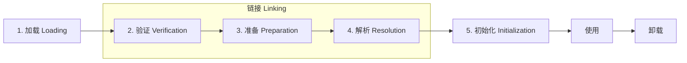

各阶段做什么：

- **加载**：通过类的全限定名获取定义此类的二进制字节流（可从 jar/网络/动态生成/JSP 等来源）；将字节流转换为方法区的运行时数据结构；在堆中生成一个代表该类的 `java.lang.Class` 对象，作为方法区数据的访问入口。**这是开发人员可控性最强的一步**——自定义类加载器就介入在这里。
- **验证**：确保 class 字节码符合 JVM 规范、不会危害虚拟机安全。包括文件格式验证（魔数 0xCAFEBABE、版本号）、元数据验证（语义合法）、字节码验证（控制流/数据流分析）、符号引用验证（解析阶段会用到）。
- **准备**：为**类变量**（`static`）在方法区分配内存并赋**零值**（如 int→0、引用→null），**不执行任何 Java 代码**。注意：
  - 此时 `static int a = 123;` 在准备阶段 a = 0，赋值 123 在初始化阶段才发生。
  - 例外：`static final` 修饰的**编译期常量**（ConstantValue 属性）在准备阶段就会被赋真实值，如 `static final int a = 123;` 直接 a = 123。
- **解析**：将常量池内的**符号引用**替换为**直接引用**（内存地址/偏移量/句柄）。符号引用在 class 文件中是字符串形式，解析后变成可直接定位目标的引用。解析可能在初始化前完成（部分 JVM），也可能延迟到对应指令首次使用时（懒解析）。
- **初始化**：执行类构造器 `<clinit>()` 方法。`<clinit>` 由编译器自动收集类中所有 **`static` 变量赋值动作**和**静态代码块**（`static {}`）按源码顺序合并而成。**JVM 保证 `<clinit>` 在多线程下被正确加锁同步**，这也是单例延迟初始化（静态内部类写法）线程安全的原理。

**准备阶段 vs 初始化阶段（高频考点）**：

| 代码 | 准备阶段值 | 初始化阶段值 |
|---|---|---|
| `static int a;` | 0 | 0（无赋值） |
| `static int a = 123;` | 0 | 123 |
| `static final int a = 123;` | 123（ConstantValue） | 123 |
| `static Integer a = 123;` | null（引用） | 装箱后的 Integer 对象 |

**触发初始化的时机（主动引用）**：① new / getstatic / putstatic / invokestatic 四条字节码指令（new 实例、读写静态字段、调用静态方法）；② 反射调用（`Class.forName`）；③ 初始化子类时父类若未初始化则先初始化；④ JVM 启动时的主类（含 main）；⑤ MethodHandle 句柄对应的类。

**不会触发初始化（被动引用）**：① 通过子类访问父类的静态字段，只初始化父类不初始化子类；② `ClassName[] arr = new ClassName[10]` 不触发类初始化（数组类型由 JVM 动态生成）；③ 访问 `static final` 常量（已被放入调用方常量池）。

**关键点**：
- 加载阶段是唯一允许开发人员介入（自定义 ClassLoader）的阶段。
- 准备阶段只赋零值，赋真实值在初始化阶段（`final` 常量例外）。
- `<clinit>` 线程安全，是静态内部类单例模式的原理。
- 加载、验证、准备、初始化的**开始顺序**确定，但**解析**有时会延迟，与初始化交错。

> 💡 **面试话术**：「类加载分 5 个阶段：加载、验证、准备、解析、初始化，其中验证准备解析合起来叫链接。加载是把 class 字节流读进来放到方法区，并在堆里建一个 Class 对象；验证确保字节码合法安全；准备给静态变量分配内存赋零值，比如 int 赋 0、引用赋 null，注意是零值不是真实值，真实值要等初始化阶段执行 `<clinit>` 才赋——但 final 常量在准备阶段就会通过 ConstantValue 属性赋真值；解析是把常量池符号引用换成直接引用；初始化就是执行 `<clinit>`，把静态变量赋值和静态代码块按顺序合并执行，JVM 保证它多线程同步加锁，所以静态内部类单例是线程安全的。」

**常见追问**：
- Q: 准备阶段 `static int a = 123` 的 a 是几？ → 0，123 在初始化阶段才赋。
- Q: `static final int a = 123` 呢？ → 准备阶段就是 123，因为是 ConstantValue 属性。
- Q: `<clinit>` 是什么？ → 类构造器，由静态变量赋值和静态代码块按源码顺序合并，多线程下 JVM 保证同步。
- Q: 什么时候不会触发类初始化？ → 通过子类访问父类静态字段、`new ClassName[10]`、访问 final 常量。
- Q: 加载和链接顺序严格吗？ → 加载一定先于链接开始，但解析有时延迟到初始化后才完成（懒解析）。

**来源**：[JVM 规范 §5 Loading, Linking, and Initializing](https://docs.oracle.com/javase/specs/jvms/se17/html/jvms-5.html)；《深入理解 Java 虚拟机》第 3 版 第 7 章 §7.3–7.4

### 2.2 类加载器分类

类加载器（ClassLoader）负责"加载"阶段把 class 字节流读入 JVM。JVM 默认提供三层加载器，开发人员可自定义。

| 类加载器 | 实现 | 加载范围 | 父加载器 |
|---|---|---|---|
| Bootstrap ClassLoader | C++ 实现，JVM 内部 | `<JAVA_HOME>/lib` 核心类库（rt.jar / java.base 模块），如 `java.*`、`sun.*` | 无（返回 null） |
| Extension / Platform ClassLoader | Java 实现（`ExtClassLoader`，JDK 9+ 改名 `PlatformClassLoader`） | JDK 8: `<JAVA_HOME>/lib/ext`；JDK 9+: 平台模块 | Bootstrap |
| Application ClassLoader | Java 实现（`AppClassLoader`），`ClassLoader.getSystemClassLoader()` 返回它 | classpath（`-cp` / `-classpath` / `CLASSPATH`）下的类，应用自身 + 第三方 jar | Extension/Platform |
| 自定义 ClassLoader | 继承 `java.lang.ClassLoader` | 任意来源：网络、加密 jar、动态生成、热部署 | 由构造时传入，常为 AppClassLoader |

> 关键结论：Bootstrap 是 C++ 写的、对 Java 不可见（`String.class.getClassLoader()` 返回 null）；其它都是 Java 类。JDK 9 模块化后 ExtClassLoader 改名 PlatformClassLoader，加载平台模块而非 ext 目录。

**来源**：[ClassLoader Javadoc (JDK 17)](https://docs.oracle.com/en/java/javase/17/docs/api/java.base/java/lang/ClassLoader.html)；《深入理解 Java 虚拟机》第 3 版 §7.4.1

### 2.3 双亲委派模型

**定义**：双亲委派模型规定类加载器收到加载请求时，**先把请求委派给父加载器**去加载，父加载器再向上委派，直到 Bootstrap；只有当父加载器反馈自己无法加载（在它的搜索范围内找不到对应类）时，子加载器才尝试自己加载。

**结构**（层级图）：

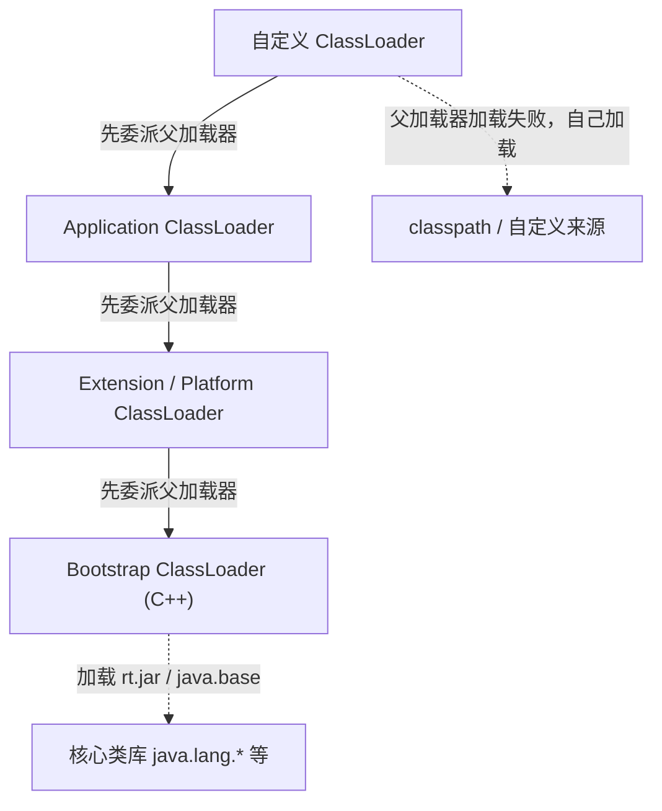

**工作原理**（以加载 `java.lang.String` 为例）：自定义加载器收到请求 → 委派给 AppClassLoader → 委派给 PlatformClassLoader → 委派给 Bootstrap → Bootstrap 在 `<JAVA_HOME>/lib` 找到 `java.lang.String` 并加载，返回 Class 对象。整个链条中**只有 Bootstrap 真正加载了它**，下面的子加载器不再尝试。

`ClassLoader.loadClass` 源码核心逻辑（简化）：

```java
protected Class<?> loadClass(String name, boolean resolve) throws ClassNotFoundException {
    synchronized (getClassLoadingLock(name)) {
        // 1. 检查是否已加载
        Class<?> c = findLoadedClass(name);
        if (c == null) {
            try {
                // 2. 委派给父加载器
                if (parent != null) {
                    c = parent.loadClass(name, false);
                } else {
                    c = findBootstrapClassOrNull(name); // 委派给 Bootstrap
                }
            } catch (ClassNotFoundException e) { /* 父加载器加载失败 */ }
            // 3. 父加载器都没找到，自己加载
            if (c == null) {
                c = findClass(name);
            }
        }
        return c;
    }
}
```

**为什么这样设计**：

1. **安全（防止核心类被篡改）**：所有 `java.*` 类必然由 Bootstrap 加载。如果用户自定义了一个 `java.lang.String`（即使放到 classpath），也会因为 Bootstrap 先加载到核心 String 而被忽略，避免恶意代码替换核心类。这也是为什么自定义类不能放在 `java.*` 包下（抛 `SecurityException: Prohibited package name`）。
2. **避免重复加载**：同一类只会被加载一次（同一个 ClassLoader 命名空间内），保证类的全局唯一性——判断两个类"相等"不仅看类全限定名，还要看是否由同一 ClassLoader 加载。
3. **保证类型一致性**：核心 API 由顶层加载器统一加载，应用代码引用 `java.lang.String` 拿到的都是同一个 Class 对象。

**关键点**：
- 双亲委派不是强制约束（JVM 规范没要求），而是 ClassLoader 的**推荐设计模式**。
- 子加载器可见父加载器加载的类，反之不行。
- `ClassLoader.getParent()` 返回父加载器，Bootstrap 返回 null（因为它不是 Java 对象）。
- 同一类的"相等"判断 = 全限定名相同 + 同一 ClassLoader 加载。

> 💡 **面试话术**：「双亲委派模型是说一个类加载器收到加载请求时，会先委派给父加载器去加载，父加载器再向上委派，一直到 Bootstrap。只有当父加载器找不到时，子加载器才自己加载。它的设计目的有两个：一是安全，保证核心类比如 java.lang.String 一定由 Bootstrap 加载，用户即使写了一个同名类也不会被加载，避免核心 API 被篡改；二是避免重复加载，保证一个类在一个 ClassLoader 命名空间里只加载一次，类的全局唯一性靠全限定名加 ClassLoader 一起判断。注意双亲委派不是 JVM 规范强制的，只是推荐模式，所以可以被打破。」

**常见追问**：
- Q: 双亲委派是强制的吗？ → 不是，JVM 规范没要求，是 ClassLoader 的推荐模式，可被重写 `loadClass` 打破。
- Q: 为什么判断两个类相等要看 ClassLoader？ → 因为同一个类名可能被不同 ClassLoader 加载出两个 Class 对象，它们互不相等（即便字节码完全相同）。
- Q: `getParent()` 什么时候返回 null？ → 该加载器的父加载器是 Bootstrap 时（因为 Bootstrap 是 C++ 实现，不是 Java 对象）。
- Q: 用户能写一个 `java.lang.String` 替换核心类吗？ → 不能，双亲委派下 Bootstrap 先加载到核心 String；而且 `java.*` 是禁止包名，自定义会被 SecurityManager 拒绝。

**来源**：[ClassLoader.loadClass Javadoc](https://docs.oracle.com/en/java/javase/17/docs/api/java.base/java/lang/ClassLoader.html#loadClass(java.lang.String,boolean))；《深入理解 Java 虚拟机》第 3 版 §7.4.2

### 2.4 打破双亲委派

**定义**：双亲委派是推荐模式而非强制约束，当父加载器需要"反向"使用子加载器加载类，或需要类隔离时，就需要打破双亲委派。三种典型方式：

**结构**（三种打破方式对比）：

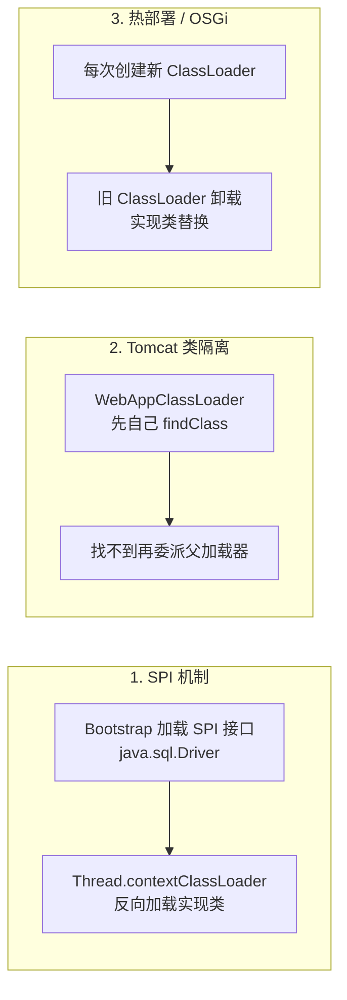

**方式 1：SPI 机制（JDBC 为例）**

SPI（Service Provider Interface）核心矛盾：接口（如 `java.sql.Driver`）由 **Bootstrap** 加载，在 `<JAVA_HOME>/lib`；但实现类（如 `com.mysql.cj.jdbc.Driver`）是第三方 jar，在 classpath，**Bootstrap 看不到**。Bootstrap 加载接口后却无法用 `Class.forName` 加载实现类（因为它只能看到核心类库）。

解决：JDK 引入 `Thread.currentThread().getContextClassLoader()`，它默认是 **AppClassLoader**。`java.sql.DriverManager`（Bootstrap 加载的类）通过 contextClassLoader **反向**调用子加载器（AppClassLoader）加载 SPI 实现类。`ServiceLoader.load(Driver.class)` 内部就是这么做的。

```
Bootstrap 加载 DriverManager → 用 Thread.contextClassLoader（AppClassLoader）→ 加载 classpath 上的 MySQL Driver
```

这就是"父加载器请求子加载器加载类"的反向委派，是双亲委派模型被打补丁的典型。

**方式 2：Tomcat 每个 WebApp 独立 ClassLoader 先自己加载**

Tomcat 一个 JVM 部署多个 Web 应用，要求**类隔离**：A 应用用的 Spring 5 和 B 应用用的 Spring 4 不能冲突。如果严格走双亲委派，所有应用共用一个 AppClassLoader，先加载的 Spring 会"污染"其它应用。

Tomcat 为每个 Web 应用创建独立的 `WebAppClassLoader`，它**重写了 `loadClass`，优先自己加载**（顺序大致是：缓存 → JVM 缓存 → Java 核心类委派 Bootstrap → WebApp 本地 WEB-INF/classes 和 WEB-INF/lib → Common ClassLoader → AppClassLoader）。这样每个应用的类在自己命名空间里互不干扰。

为什么必须先自己加载？如果先委派 AppClassLoader，应用类会先被父加载器加载，多个应用就共享了同一个 Class 对象，隔离失败。但 Java 核心类（`java.*`）仍走 Bootstrap，保证安全。

**方式 3：热部署 / OSGi 模块化**

热部署：每次修改类文件后，**丢弃旧的 ClassLoader，新建一个 ClassLoader 重新加载该类**。旧 ClassLoader 加载的旧类对象因不再被引用，会被 GC 回收（连同其加载的类）。实现方式是自定义 ClassLoader 重写 `findClass`，监听文件变化触发重新加载。JRebel、IDE 的热部署都基于此。

OSGi：每个模块（Bundle）有自己的 ClassLoader，模块间通过 Import-Package / Export-Package 显式声明依赖，类加载变成**网状结构**而非树状，每个 Bundle 可以指定某个包从哪个 Bundle 加载，灵活但复杂。OSGi 是双亲委派的彻底替代方案。

**关键点**：
- 打破双亲委派 = 重写 `loadClass`（改变委派顺序）或反向使用 contextClassLoader。
- SPI 是"父加载器借助子加载器"的反向委派，最典型。
- Tomcat 是"子加载器先于父加载器"，为类隔离。
- 热部署靠"换 ClassLoader"，OSGi 靠"网状多加载器"。
- 自定义类加载器最常见做法：继承 `ClassLoader` 重写 `findClass`（保持双亲委派）或重写 `loadClass`（打破双亲委派）。

> 💡 **面试话术**：「双亲委派不是强制的，有三种典型打破场景。第一是 SPI，比如 JDBC：DriverManager 这种核心类由 Bootstrap 加载，但它要加载 classpath 上的 MySQL Driver 实现类，Bootstrap 看不到，所以 JDK 提供了 Thread.contextClassLoader，默认是 AppClassLoader，让 Bootstrap 加载的类能反向调用子加载器加载实现类。第二是 Tomcat 类隔离，每个 Web 应用有自己的 WebAppClassLoader，它重写了 loadClass 优先自己加载 WEB-INF 下的类，这样多个应用用不同版本的 Spring 不会冲突，但 java 核心类还是走 Bootstrap 保证安全。第三是热部署和 OSGi，热部署靠换一个新的 ClassLoader 重新加载类，旧的等 GC 回收；OSGi 每个 Bundle 一个 ClassLoader，类加载是网状的不是树状。」

**常见追问**：
- Q: 为什么需要打破双亲委派？ → 三种需求：① 父加载器需要加载子加载器范围的类（SPI）；② 需要类隔离（Tomcat 多应用）；③ 需要动态更新类（热部署）。
- Q: SPI 中为什么要用 contextClassLoader？ → 因为 Bootstrap 加载的类无法 `Class.forName` 到 classpath 上的实现类，必须借助子加载器，contextClassLoader 是这种"反向委派"的桥梁。
- Q: Tomcat 打破双亲委派会不会导致 java.lang.String 被替换？ → 不会，WebAppClassLoader 仍把 `java.*` 委派给 Bootstrap，只是应用类优先自己加载。
- Q: 自定义 ClassLoader 重写 loadClass 还是 findClass？ → 推荐重写 findClass 保持双亲委派；要打破双亲委派才重写 loadClass。
- Q: JDK 9 模块化对类加载的影响？ → 模块化（JPMS）下，类加载基于**模块**而非 classpath；PlatformClassLoader 取代 ExtClassLoader；BootClassLoader 只加载平台模块；模块间通过 `requires`/`exports` 显式依赖，未导出的包对外不可见（封装强化）；`--add-opens`/`--illegal-access` 用于兼容旧代码。

**来源**：[JVM 规范 §5.3 Creation and Loading](https://docs.oracle.com/javase/specs/jvms/se17/html/jvms-5.html#jvms-5.3)；[Tomcat 9 Class Loader HowTo](https://tomcat.apache.org/tomcat-9.0-doc/class-loader-howto.html)；[ServiceLoader Javadoc](https://docs.oracle.com/en/java/javase/17/docs/api/java.base/java/util/ServiceLoader.html)；[JEP 261: Module System](https://openjdk.org/jeps/261)

### 2.5 面试话术与追问

**总览话术**（可直接口述，约 260 字）：

「类加载过程分加载、验证、准备、解析、初始化五步，验证准备解析合起来叫链接。加载是把 class 字节流读到方法区并建 Class 对象，自定义 ClassLoader 介入在这一步；准备给静态变量赋零值，真实值要等初始化执行 `<clinit>`，但 final 常量在准备阶段就赋真值；解析把符号引用换成直接引用；初始化执行静态变量赋值和静态代码块，JVM 保证 `<clinit>` 多线程同步。类加载器分 Bootstrap、Platform、Application 三层加自定义，采用双亲委派：收到请求先委派父加载器，父加载器加载不了子加载器才自己加载，目的是安全（核心类不被篡改）和避免重复加载。但双亲委派不是强制的，三种场景会打破：SPI 用 contextClassLoader 反向委派，Tomcat 用 WebAppClassLoader 优先自己加载做类隔离，热部署和 OSGi 靠换或加 ClassLoader 实现动态更新。」

**常见追问**：

- Q: **为什么需要打破双亲委派？** → 双亲委派解决了核心类安全和重复加载问题，但牺牲了灵活性：① 父加载器无法加载子加载器范围的类（SPI 需要反向委派）；② 不同应用需要同名类隔离（Tomcat 多 WebApp）；③ 需要运行时动态更新类（热部署）。
- Q: **JDK 9 模块化对类加载的影响？** → 引入 JPMS，类加载基于模块而非 classpath；ExtClassLoader 改名 PlatformClassLoader 加载平台模块；模块未导出包对外不可见（强封装）；反射访问受限，需 `--add-opens` 兼容。
- Q: **`<clinit>` 和 `<init>` 区别？** → `<clinit>` 是类构造器，执行静态变量赋值和静态代码块，JVM 保证多线程同步，类只执行一次；`<init>` 是实例构造器，对应构造方法，每 new 一次执行一次。
- Q: **同一个类被不同 ClassLoader 加载是同一个类吗？** → 不是。JVM 判断类相等 = 全限定名 + 定义 ClassLoader 相同。两个 Class 对象即便字节码完全相同，加载器不同就互不相等，`instanceof` 会失败。这也是 Tomcat 类隔离的原理。
- Q: **类什么时候会被卸载？** → 需要同时满足：① 该类所有实例都被回收；② 加载该类的 ClassLoader 已被回收；③ 该类对应的 Class 对象无引用。条件苛刻，所以大量动态生成类（代理/JSP）容易 Metaspace OOM。
- Q: **`Class.forName` 和 `ClassLoader.loadClass` 区别？** → `Class.forName` 默认会执行初始化（执行 `<clinit>`）；`ClassLoader.loadClass` 只加载不初始化。`Class.forName(name, false, loader)` 可指定不初始化，常用于 SPI 懒加载。
- Q: **静态内部类单例为什么线程安全？** → 因为它的初始化由 JVM 在类加载初始化阶段执行 `<clinit>`，而 JVM 保证 `<clinit>` 在多线程下被加锁同步执行，且只执行一次。

### 2.6 进阶阅读

- **JVM 规范 §5 Loading, Linking, and Initializing**：[docs.oracle.com](https://docs.oracle.com/javase/specs/jvms/se17/html/jvms-5.html) — 类加载全过程的权威定义，§5.3 创建与加载、§5.4 链接、§5.5 初始化逐条对应本章五个阶段。
- **《深入理解 Java 虚拟机》第 3 版 第 7 章 类加载机制**：周志明著 — 中文社区公认最权威的中文 JVM 书籍，§7.4 类加载器、§7.5 双亲委派模型讲得最系统。
- **Tomcat 9 Class Loader HowTo**：[tomcat.apache.org](https://tomcat.apache.org/tomcat-9.0-doc/class-loader-howto.html) — Tomcat 官方类加载文档，详细描述 WebAppClassLoader 与各级加载器的委派关系，理解打破双亲委派的权威依据。
- **JEP 261: Module System**：[openjdk.org](https://openjdk.org/jeps/261) — JDK 9 模块化对类加载影响的官方设计文档，PlatformClassLoader、模块层（Layer）、引导升级都在这里。
- **ServiceLoader 文档**：[docs.oracle.com](https://docs.oracle.com/en/java/javase/17/docs/api/java.base/java/util/ServiceLoader.html) — SPI 机制的权威说明，包含与 `Thread.contextClassLoader` 配合使用的约定。
- **ClassLoader Javadoc**：[docs.oracle.com](https://docs.oracle.com/en/java/javase/17/docs/api/java.base/java/lang/ClassLoader.html) — `loadClass` / `findClass` / `getParent` 等方法的官方契约，理解双亲委派源码层级。
- **Stack Overflow: Why DriverManager uses Thread.contextClassLoader**：高票回答详细解释了 SPI 反向委派的设计动机与 `Class.forName` 在 Bootstrap 下失效的原因，是 JDBC SPI 机制的最佳补充阅读。

---

## 3. GC 算法与垃圾收集器

垃圾收集（Garbage Collection, GC）是 JVM 自动管理内存的核心机制：自动识别「死对象」并回收其占用的内存，避免手动 `free` 带来的泄漏与悬空指针。本章是 M1 最高频章节，覆盖堆分代、GC 算法、收集器对比、CMS、G1、晋升条件 6 道高频题。

理解 GC 的两条主线：
1. **判定什么对象该回收**（存活判定）→ 决定 GC 的正确性；
2. **怎么回收**（GC 算法 + 收集器实现）→ 决定 GC 的效率与停顿。

### 3.1 判断对象存活

**定义**：GC 之前必须先判断堆里哪些对象「已死」可回收。两种经典判定思路：**引用计数法** 与 **可达性分析**。主流 JVM（HotSpot、JRockit、IBM J9 等）都用可达性分析，引用计数法因无法解决循环引用，只在小众场景（如早期 Python CPython 的引用计数 + 标记清除辅助）出现。

**引用计数法**：给对象加一个引用计数器，每被引用一次 +1，引用失效 -1，归 0 即可回收。优点：实现简单、判定快、可分散执行。致命缺陷：**循环引用**——A 引用 B、B 引用 A，两者计数都不为 0 却都该被回收。

```text
   ┌─────┐         ┌─────┐
   │  A  │ ──────▶ │  B  │
   │ cnt=1│ ◀────── │ cnt=1│   ← 互相引用，cnt 永远 ≥1，无法回收
   └─────┘         └─────┘
       ↑               ↑
   stack 已无引用   stack 已无引用
```

**可达性分析（Reachability Analysis）**：从一组被称为 **GC Roots** 的根对象出发，顺着引用链向下搜索；搜索走过的路径叫「引用链」，不可达的对象即为可回收对象。HotSpot 实现：用 OopMap 记录引用位置，在安全点（Safepoint）遍历。

**GC Roots 的种类**（高频考点，需能口述全）：
- **虚拟机栈中引用的对象**：各线程方法栈帧局部变量表里的引用（正在执行的方法用到的对象）。
- **本地方法栈中 JNI 引用的对象**：native 方法持有的对象。
- **方法区中类静态变量引用的对象**：`static` 变量（JDK 7+ 在堆的 Class 对象上）。
- **方法区中常量引用的对象**：如字符串常量池里的引用。
- **Java 虚拟机内部的引用**：基本类型对应的 Class 对象、常驻异常对象（`NullPointerException` 等）、系统类加载器。
- **同步锁 `synchronized` 持有的对象**：被任何线程持有 monitor 的对象。
- **JMXBean、JVMTI 等 JVM 内部回调注册的对象**：临时性的 GC Roots。
- **分代收集中跨代引用**：记忆集（Remembered Set）记录的老年代指向新生代的引用，也作为新生代 GC 的临时 Roots。

> 关键结论：「GC Roots 之外的对象都不是根」。临时 GC Roots 让分代 GC 不必每次扫描整个堆。

**引用强度（JDK 1.2+ 四种引用）**：可达性分析中「引用」按强度分四级，决定回收优先级。

| 引用类型 | 回收时机 | 典型用途 |
|---|---|---|
| 强引用 Strong | 永不回收（只要可达） | `Object o = new Object()` |
| 软引用 Soft | 内存不足时回收 | 内存敏感缓存 `SoftReference` |
| 弱引用 Weak | 下次 GC 必回收 | `WeakHashMap`、`ThreadLocal` 的 Entry |
| 虚引用 Phantom | 不影响回收，仅做回收通知 | 跟踪对象被回收时机，配合 `ReferenceQueue` |

**finalize() 机制**：对象不可达后并非「立即」回收，而是先进入「待回收」判定。如果对象**重写了 `finalize()` 且未被调用过**，会被放入 `F-Queue`，由 Finalizer 线程低优先级执行；执行中如果对象重新与引用链建立连接（「自救」），则逃脱本次回收，否则下次标记时被清除。

- `finalize()` **只会被 JVM 调用一次**——自救机会仅一次。
- 不推荐使用：执行时间不确定、可能导致对象复活、性能差。JDK 9 已 `@Deprecated`。
- 替代方案：`try-with-resources` / `AutoCloseable` 做资源释放。

> 💡 **面试话术**：「判断对象存活主流用可达性分析，从 GC Roots 出发沿引用链搜索，不可达的可回收。GC Roots 主要有几种：虚拟机栈里方法用到的对象、本地方法栈 JNI 引用的对象、方法区里静态变量和常量引用的对象、synchronized 持有的对象，还有 JVM 内部的 Class 对象和系统类加载器。引用计数法因为解决不了循环引用所以主流 JVM 不用。另外 JDK 把引用分强软弱虚四种，软引用内存不足才回收适合做缓存，弱引用下次 GC 必回收用在 WeakHashMap。finalize 不推荐用，JDK 9 已废弃，因为它执行时间不确定还可能让对象复活。」

**常见追问**：
- Q: GC Roots 有哪些？ → 栈帧局部变量、JNI 引用、静态变量、常量、synchronized 持有对象、JVM 内部对象（Class/异常/类加载器）、跨代引用（临时）。
- Q: 为什么不用引用计数法？ → 无法解决循环引用，A↔B 互相引用却都已不可达，计数不为 0 漏回收。
- Q: 软引用和弱引用的区别？ → 软引用在内存不足时才回收（适合缓存），弱引用在下次 GC 时必回收（WeakHashMap）。
- Q: finalize 会被调用几次？ → 至多一次。如果对象在 finalize 中自救，第二次回收时不会再调用 finalize。
- Q: 一个对象可以永久不回收吗？ → 强引用只要可达就不回收；但 finalize 自救只能一次，且 Finalizer 线程优先级低，依赖它做回收很危险。

**来源**：《深入理解 Java 虚拟机》第 3 版 §3.2；[JVM 规范 §2.5 运行时数据区](https://docs.oracle.com/javase/specs/jvms/se17/html/jvms-2.html#jvms-2.5)；[Java 引用对象 Javadoc](https://docs.oracle.com/en/java/javase/17/docs/api/java.base/java/lang/ref/package-summary.html)

### 3.2 GC 算法

**定义**：GC 算法指在已判定存活对象后，如何组织内存回收的基础策略，与具体收集器实现解耦。三种基础算法：**标记-清除**、**标记-复制**、**标记-整理**。所有现代收集器都是这三种的变体组合。

**结构**（三种算法 ASCII 示意）：

```text
1. 标记-清除 Mark-Sweep
   标记阶段：从 GC Roots 遍历，标记所有存活对象
   清除阶段：清除未标记对象

   [A][B][C][D][E][F][G]   (A,C,E,G 存活)
   标记: [*][ ][*][ ][*][ ][*]
   清除: [A][ ][C][ ][E][ ][G]   ← 产生碎片，分配大对象失败

2. 标记-复制 Mark-Copy
   将内存分两块，每次只用一块；GC 时把存活对象复制到另一块

   From: [A][B][C][D]    To: [    空    ]
   复制存活 A,C 到 To:
   From: [    空    ]    To: [A][C][    ]
   ← 浪费一半空间，但无碎片、分配快（指针碰撞）

3. 标记-整理 Mark-Compact
   标记后，把存活对象向一端移动，整理成连续

   [A][B][C][D][E]   (A,C,E 存活)
   标记: [*][ ][*][ ][*]
   整理: [A][C][E][      空      ]
   ← 无碎片、不浪费空间，但移动对象成本高（更新所有引用）
```

**三种算法对比**：

| 算法 | 优点 | 缺点 | 适用 |
|---|---|---|---|
| 标记-清除 | 简单、不移动对象 | 内存碎片、分配大对象易触发 Full GC | CMS 老年代 |
| 标记-复制 | 无碎片、分配快（指针碰撞）、适合朝生夕灭对象 | 浪费一半空间（实际用 8:1:1 缓解） | 新生代（Serial/ParNew/Parallel Scavenge/G1 Young） |
| 标记-整理 | 无碎片、不浪费空间 | 移动成本高、STW 长（更新引用） | 老年代（Serial Old/Parallel Old/G1 Old） |

**关键点**：
- **碎片问题**：标记-清除产生大量不连续空间，分配大对象时找不到连续空间会提前 Full GC。CMS 为追求低停顿用标记-清除，代价是碎片，可用 `-XX:+UseCMSCompactAtFullCollection` 在 Full GC 时整理。
- **复制算法的空间利用率**：分代理论下新生代 8:1:1，每次只浪费 10%，而非 50%，因为新生代 98% 对象朝生夕灭。
- **整理的代价**：移动对象必须更新所有指向它的引用，要求 STW，所以整理型老年代收集器停顿较长。

> 💡 **面试话术**：「GC 基础算法有三种。标记-清除先标记存活再清除未标记的，简单但有内存碎片，分配大对象容易失败。标记-复制把内存分两块，每次只用一块，GC 时把存活对象复制到另一块然后清空原来那块，无碎片分配快，但浪费一半空间，新生代用 8:1:1 把浪费降到 10%。标记-整理在标记后把存活对象向一端移动整理成连续，无碎片也不浪费空间，但移动对象要更新所有引用，停顿较长。所以一般是新生代用复制算法、老年代用标记-清除或标记-整理。」

**常见追问**：
- Q: 为什么新生代用复制算法？ → 新生代对象 98% 朝生夕灭，存活少复制成本低；8:1:1 浪费仅 10%。
- Q: CMS 为什么用标记-清除不用整理？ → 整理要移动对象更新引用，必须 STW，与 CMS 低停顿目标冲突；代价是碎片。
- Q: 标记-复制浪费一半空间怎么解决？ → 分代后 Eden:S0:S1 = 8:1:1，每次只浪费一个 Survivor（10%）。
- Q: 标记-整理为什么慢？ → 移动对象后要更新所有指向它的引用（包括栈、堆、GC Roots），需 STW。
- Q: 三种算法各自的 STW 时长？ → 标记-清除中等（标记+清除两阶段都 STW）；标记-复制较长（要复制存活对象）；标记-整理最长（要移动并更新引用）。

**来源**：《深入理解 Java 虚拟机》第 3 版 §3.3；[Oracle GC Tuning Guide - collectors](https://docs.oracle.com/en/java/javase/17/gctuning/available-collectors.html)

### 3.3 分代收集理论

**定义**：分代收集理论建立在两条经验假说之上，是绝大多数收集器的设计基础——把堆分成新生代和老年代，对不同代用不同算法，提升整体效率。

**两条假说**：

1. **弱代假说（Weak Generational Hypothesis）**：绝大多数对象都是朝生夕灭的（die young）；熬过越多次垃圾收集过程的对象越难以消亡（live long live forever）。
   - 推论：新生代每次 GC 大部分对象可回收 → 适合复制算法（只复制少数存活）。
   - 推论：老年代对象长期存活 → 适合标记-整理（避免频繁复制）。
2. **跨代引用假说（Cross-Generational Reference Hypothesis）**：跨代引用相对于同代引用仅占极少数。
   - 推论：新生代 GC 时不必扫描整个老年代找谁引用了新生代对象，只需维护一个「记录跨代引用」的数据结构 → **Remembered Set**。

**结构**（分代与跨代引用）：

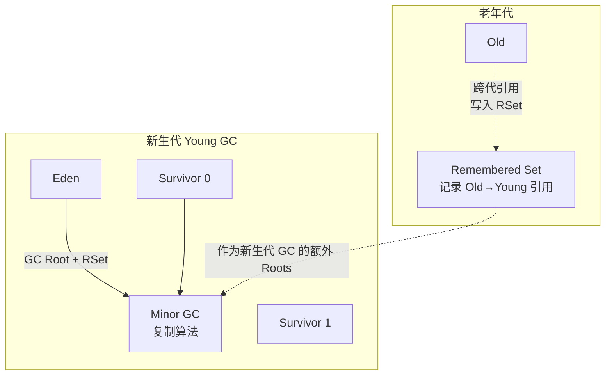

**Remembered Set（记忆集）**：为解决跨代引用扫描问题而生的数据结构。在新生代里维护一个表，记录「哪些老年代对象指向了本新生代区域」，这样新生代 GC 时，把这些老年代对象当作额外的 GC Roots，避免全堆扫描。

- 写屏障（Write Barrier）：每次「老年代引用新生代」的赋值操作，都会触发写屏障更新 RSet。
- 粒度可选：字长精度（精确到指针）、卡精度（Card Table，按固定大小卡片，HotSpot 用 512B 卡页，标记脏卡）、对象精度。
- HotSpot 用 **Card Table**：把老年代划分成 512B 的卡页，每张卡对应一个 byte；当老年代某卡内对象引用了新生代，写屏障把该 byte 标记为脏（dirty）。Minor GC 时只扫描脏卡，不扫整个老年代。

> 关键结论：RSet/Card Table 用「空间换时间」，把全堆扫描降为局部扫描，是分代 GC 高效的关键。

**关键点**：
- 分代不是必须的（G1 也分代、ZGC 不分代 JDK 21 才有实验性分代），但分代理论在过去 30 年被证明有效。
- 不同代用不同算法是分代收集的核心思想：新生代复制、老年代整理或清除。
- RSet 让 Minor GC 不必扫描老年代，停顿时间稳定。

> 💡 **面试话术**：「分代收集基于两条假说：弱代假说——绝大多数对象朝生夕灭，熬过越多次 GC 越难回收；跨代引用假说——跨代引用极少。所以把堆分新生代老年代，新生代每次 GC 大部分对象可回收，用复制算法很划算；老年代对象长期存活，用标记-整理避免频繁复制。但新生代 GC 时怎么知道老年代有没有引用新生代？不能每次扫整个老年代，所以维护 Remembered Set，HotSpot 用 Card Table，把老年代划分成 512B 的卡页，老年代引用新生代时写屏障把对应卡标记为脏，Minor GC 只扫脏卡就行，不用全堆扫描。」

**常见追问**：
- Q: 为什么要分代？ → 基于弱代假说，不同生命周期的对象用不同算法，整体效率最高。
- Q: RSet 是什么？ → 记录跨代引用（老年代→新生代）的数据结构，避免 Minor GC 扫描整个老年代。
- Q: Card Table 和 RSet 的关系？ → Card Table 是 RSet 的一种实现（卡精度），HotSpot 用 512B 卡页。
- Q: 写屏障是什么？ → 引用字段赋值时由 JVM 插入的钩子代码，用来维护 RSet/Card Table（G1 还用它维护 SATB）。
- Q: 不分代的收集器有吗？ → ZGC（JDK 15 转正时无分代，JDK 21 引入实验性分代 ZGC）、Shenandoah 不严格分代。

**来源**：《深入理解 Java 虚拟机》第 3 版 §3.1–3.3；[Oracle GC Tuning Guide - Generational](https://docs.oracle.com/en/java/javase/17/gctuning/garbage-collector-implementation.html)

### 3.4 堆分代结构

**定义**：HotSpot 堆按对象生命周期划分新生代（Young）和老年代（Old），新生代再分 Eden 和两个 Survivor（S0/From、S1/To）。比例默认 8:1:1（Eden:S0:S1）和 1:2（Young:Old）。

**结构**：

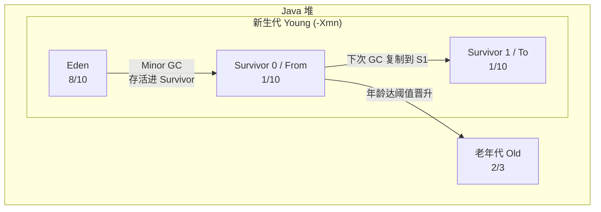

**比例参数**：
- `-XX:NewRatio=2`：新生代:老年代 = 1:2（默认）。
- `-XX:SurvivorRatio=8`：Eden:Survivor = 8:1，即 Eden:S0:S1 = 8:1:1。
- `-XX:NewSize` / `-XX:MaxNewSize`：新生代初始/最大值（或用 `-Xmn` 同时设两者）。
- `-XX:TargetSurvivorRatio=50`：Survivor 目标使用率，默认 50%。

**对象在堆中的流转**（高频考点）：

```text
new 对象
   ↓
Eden 分配（大对象直接进老年代）
   ↓ Eden 满
Minor GC（复制算法）
   ↓ 存活
Survivor（年龄+1，S0<->S1 交替复制）
   ↓ 年龄达阈值 / Survivor 装不下 / 动态年龄判断
老年代
   ↓ 老年代满
Full GC（标记-清除/整理）
```

**三种 GC 的区别**（务必分清）：

| 名称 | 回收区域 | 触发 | 频率 | 速度 |
|---|---|---|---|---|
| **Minor GC / Young GC** | 新生代（Eden + 一个 Survivor） | Eden 区满 | 频繁 | 快（毫秒级，复制算法 + RSet） |
| **Major GC** | 老年代 | 老年代满/晋升失败 | 较少 | 慢（模糊术语，常与 Full GC 混用） |
| **Full GC** | 整个堆 + 方法区（Metaspace） | System.gc() / 老年代满 / Metaspace 不足 / 晋升失败 / CMS Concurrent Mode Failure | 很少 | 最慢（应尽量避免） |

> 注意：「Major GC」术语模糊，不同资料定义不同——有人指老年代 GC，有人等同于 Full GC。面试时优先说 Minor GC 和 Full GC，必要时澄清 Major 的歧义。

**关键点**：
- Minor GC 只回收新生代，必定 STW，但因复制算法 + RSet 而很快；不意味着老年代没被扫描。
- Full GC 触发条件多：`System.gc()` 建议、老年代空间不足、Metaspace 不足、晋升到老年代时空间不够、CMS Concurrent Mode Failure。
- Survivor 两个区：复制算法需要一个空目标区，两个 Survivor 交替使用，任意时刻必有一个为空。
- JDK 8 默认 Parallel Scavenge + Parallel Old（吞吐量优先）；JDK 9+ G1；JDK 15+ ZGC 生产可用；JDK 17 默认 G1。

> 💡 **面试话术**：「堆分新生代和老年代，新生代占 1/3 老年代占 2/3，新生代再分 Eden 和两个 Survivor，比例 8:1:1。新对象先在 Eden 分配，Eden 满触发 Minor GC，存活对象复制到 Survivor 并年龄加 1，两个 Survivor 交替复制保证任意时刻有一个为空。对象多次 GC 仍存活（默认年龄 15）晋升老年代。Minor GC 只回收新生代，频繁但快；Full GC 回收整个堆，慢且应尽量避免，触发条件有 System.gc、老年代满、Metaspace 不足、晋升失败、CMS 的 Concurrent Mode Failure。」

**常见追问**：
- Q: 为什么 Survivor 两个？ → 复制算法需要空目标区，两个交替使用，任意时刻一个为空。
- Q: Minor GC 会扫描老年代吗？ → 不会全扫，通过 RSet/Card Table 只扫脏卡。
- Q: Major GC 和 Full GC 区别？ → Major 概念模糊常指老年代 GC；Full GC 回收整个堆 + Metaspace。面试时优先用 Minor / Full。
- Q: 8:1:1 这个比例怎么调？ → `-XX:SurvivorRatio=8`（Eden 占 8 份，每个 Survivor 占 1 份）。
- Q: JDK 9 默认收集器？ → G1（JEP 243），不再是 Parallel。

**来源**：《深入理解 Java 虚拟机》第 3 版 §3.5 / §3.8；[Oracle G1 GC Tuning Guide](https://docs.oracle.com/en/java/javase/17/gctuning/garbage-first-garbage-collector-tuning.html)

### 3.5 对象晋升老年代条件

**定义**：新生代对象经过若干次 Minor GC 仍存活，会被「晋升」到老年代。晋升有 4 类触发条件，是高频考点（#10），需能逐条口述。

**晋升条件**：

1. **年龄达阈值（-XX:MaxTenuringThreshold）**
   - 对象在 Survivor 中每经历一次 Minor GC 年龄 +1，达到阈值晋升老年代。
   - 默认 **15**（HotSpot 对象头 4 bit 存年龄，最大值 15）。
   - `-XX:MaxTenuringThreshold=15` 可调（0–15）。
   - 设为 0 表示新生代不经过 Survivor 直接进老年代（用于老年代密集场景）。

2. **大对象直接进老年代（-XX:PretenureSizeThreshold）**
   - 超过阈值的对象不在 Eden 分配，直接进老年代，避免在 Eden/Survivor 间复制开销。
   - 仅对 Serial / ParNew 生效，Parallel Scavenge 不支持（用它的话大对象仍在新生代分配）。
   - 单位字节，如 `-XX:PretenureSizeThreshold=1048576`（1MB）。

3. **动态年龄判断（Dynamic Age Determination）**
   - Survivor 中**相同年龄所有对象大小总和 ≥ Survivor 空间的 50%**（`-XX:TargetSurvivorRatio`），则该年龄及以上对象全部晋升老年代。
   - 即便没到 MaxTenuringThreshold 也提前晋升。
   - 作用：应对突发流量下大量同龄对象，避免 Survivor 装不下。
   - HotSpot 在 Minor GC 后扫描 Survivor，按年龄从小到大累加，超过阈值就晋升。

4. **Survivor 空间不足 / 晋升失败**
   - Minor GC 后存活对象 Survivor 装不下，通过担保机制（`-XX:+HandlePromotionFailure`，JDK 6 update 24 后默认开启且不可关闭）直接进老年代。
   - 晋升前会检查老年代平均晋升大小是否 ≤ 老年代剩余空间，不够则提前 Full GC（空间分配担保）。

**空间分配担保**（重要细节）：

```text
Minor GC 前:
  检查 老年代连续可用空间 > 新生代所有对象总大小?
    是 → 安全, 直接 Minor GC
    否 → 检查 是否允许担保失败 (HandlePromotionFailure)?
            否 → Full GC
            是 → 尝试 Minor GC (冒险):
                   成功 → 完成
                   失败 (Survivor 装不下且老年代也不够) → Full GC
```

**关键点**：
- MaxTenuringThreshold 最大 15，因为对象头 Mark Word 中年龄字段是 4 bit。
- 大对象直接进老年代只对 Serial/ParNew 有效，Parallel Scavenge 不支持 PretenureSizeThreshold。
- 动态年龄判断是「该年龄及以上全部晋升」，不是「该年龄晋升」。
- JDK 6u24+ 担保失败处理默认开启，参数已无法关闭。

> 💡 **面试话术**：「对象晋升老年代有四种条件。第一，年龄达到阈值，对象在 Survivor 每经历一次 Minor GC 年龄加 1，到 15 就晋升，由 -XX:MaxTenuringThreshold 控制，最大 15 是因为对象头年龄字段只有 4 bit。第二，大对象超过 PretenureSizeThreshold 直接进老年代，避免复制开销，但这个参数只对 Serial 和 ParNew 生效，Parallel Scavenge 不支持。第三，动态年龄判断，Survivor 中相同年龄对象大小总和超过 Survivor 一半，该年龄及以上全部晋升，应对突发流量。第四，Minor GC 后 Survivor 装不下，走空间分配担保，老年代剩余空间不够就 Full GC。」

**常见追问**：
- Q: MaxTenuringThreshold 为什么最大 15？ → 对象头 Mark Word 中年龄字段是 4 bit，最大表示 15。
- Q: PretenureSizeThreshold 对所有收集器有效吗？ → 否，只对 Serial/ParNew，Parallel Scavenge 不支持。
- Q: 动态年龄判断是「该年龄」还是「该年龄及以上」？ → 该年龄及以上全部晋升，避免 Survivor 持续紧张。
- Q: 空间分配担保什么时候触发 Full GC？ → Minor GC 前判断老年代剩余 < 新生代总大小且不允许冒险，或冒险失败时。
- Q: 年龄为 0 的对象在哪？ → 刚分配在 Eden 还没经历过 GC 的对象年龄为 0。

**来源**：《深入理解 Java 虚拟机》第 3 版 §3.8.5 / §3.5.3；[HotSpot 对象头 Mark Word](https://wiki.openjdk.org/display/HotSpot/CompressedOops)；[Oracle GC Tuning - Sizing](https://docs.oracle.com/en/java/javase/17/gctuning/sizing-the-generations.html)

### 3.6 垃圾收集器对比

**定义**：GC 算法是策略，收集器是 HotSpot 的具体实现。按分代、算法、并行/并发、STW 程度可分为 7 款经典收集器，覆盖 JDK 1.3 至 JDK 17 演进历程。

**结构**（收集器演进与搭配关系）：

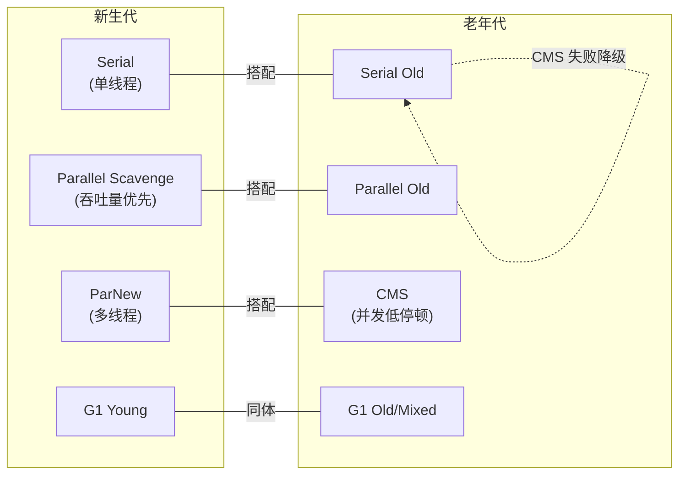

**对比表**（高频题 #4 核心）：

| 收集器 | 分代 | 算法 | 并行/并发 | STW | 适用场景 |
|---|---|---|---|---|---|
| **Serial / Serial Old** | 新生代/老年代 | 复制 / 标记-整理 | 单线程 | 全程 STW | 客户端模式、小堆（<100MB） |
| **ParNew** | 新生代 | 复制 | 并行（多线程） | 全程 STW | 配合 CMS，Server 模式新生代 |
| **Parallel Scavenge / Parallel Old** | 新生代/老年代 | 复制 / 标记-整理 | 并行 | 全程 STW | JDK 8 默认，吞吐量优先（计算任务） |
| **CMS (Concurrent Mark Sweep)** | 老年代 | 标记-清除 | 并发（部分 STW） | 初始标记+重新标记 STW | 低停顿服务，JDK 9 已废弃 |
| **G1 (Garbage First)** | 整堆（Region 分代） | 整体标记-整理 + 局部复制 | 并行+并发 | 可预测停顿 | JDK 9+ 默认，大堆 6GB+ |
| **ZGC** | 整堆（不分代，JDK21+实验分代） | 染色指针 + 读屏障 | 并发 | <1ms（JDK 16+） | 超低延迟，超大堆（TB 级） |
| **Shenandoah** | 整堆（不分代） | Brooks 转发指针 + 读屏障 | 并发 | <10ms | Red Hat 发行版，低延迟 |

**关键概念辨析**：
- **并行（Parallel）**：多条 GC 线程同时工作，但**仍然 STW**（用户线程全停）。
- **并发（Concurrent）**：GC 线程与用户线程**同时运行**（部分阶段不 STW），是 CMS/G1/ZGC 的核心。
- **吞吐量优先** vs **低停顿优先**：Parallel Scavenge 是前者（`-XX:MaxGCPauseMillis` 调大停顿换吞吐），CMS/G1 是后者。

**搭配关系**（部分收集器有固定搭档，不能任意组合）：
- Serial ↔ Serial Old
- ParNew ↔ CMS / Serial Old
- Parallel Scavenge ↔ Parallel Old（**不能**配 CMS，这是面试陷阱）
- G1 自己管整堆（不与其他搭配）
- ZGC / Shenandoah 自己管整堆

**版本演进**：
- JDK 8：默认 Parallel Scavenge + Parallel Old；CMS 仍可用。
- JDK 9：默认 G1（[JEP 243](https://openjdk.org/jeps/243)）；CMS 标记 Deprecated。
- JDK 14：CMS 移除（[JEP 363](https://openjdk.org/jeps/363)）。
- JDK 15：ZGC 转正（[JEP 377](https://openjdk.org/jeps/377)），Shenandoah 转正（JEP 379）。
- JDK 21：分代 ZGC 实验性引入（[JEP 439](https://openjdk.org/jeps/439)）。

> 💡 **面试话术**：「收集器按分代和并发程度分。Serial 单线程客户端用；ParNew 是 Serial 多线程版，专门配 CMS；Parallel Scavenge 是 JDK 8 默认，吞吐量优先搭配 Parallel Old。CMS 是第一款并发收集器，标记清除算法，低停顿但有碎片，JDK 14 移除。G1 是 JDK 9 默认，把堆分成 Region，整体标记整理局部复制，可预测停顿。ZGC 用染色指针和读屏障做到亚毫秒停顿，适合超大堆。注意 Parallel Scavenge 不能配 CMS，这是常见陷阱。」

**常见追问**：
- Q: Parallel Scavenge 和 ParNew 区别？ → 都是并行新生代收集器，但 ParNew 可配 CMS，Parallel Scavenge 不能；PS 关注吞吐量（自适应调节），ParNew 关注停顿。
- Q: JDK 8 默认收集器？ → Parallel Scavenge + Parallel Old（吞吐量优先）。
- Q: CMS 为什么被废弃？ → 碎片问题、Concurrent Mode Failure 降级、Promotion Failure、与 G1 相比已无优势，JDK 14 移除（JEP 363）。
- Q: 并行和并发的区别？ → 并行是 GC 多线程但 STW；并发是 GC 与用户线程同时跑（部分阶段不 STW）。
- Q: G1 和 ZGC 怎么选？ → G1 适合 4–32GB、停顿几十到几百 ms；ZGC 适合 16GB–TB、停顿 <1ms，对延迟极致敏感选 ZGC。

**来源**：《深入理解 Java 虚拟机》第 3 版 §3.5 / 第 4 章；[JEP 243: G1 默认](https://openjdk.org/jeps/243)；[JEP 363: 移除 CMS](https://openjdk.org/jeps/363)；[JEP 377: ZGC 转正](https://openjdk.org/jeps/377)；[Oracle Available Collectors](https://docs.oracle.com/en/java/javase/17/gctuning/available-collectors.html)

### 3.7 CMS 四阶段

**定义**：CMS（Concurrent Mark Sweep）是第一款真正意义上的**并发**垃圾收集器，目标是**降低停顿时间**（低延迟优先），用于老年代。基于标记-清除算法，分四个阶段，其中两个并发（与用户线程同时跑），两个 STW（很短）。

**结构**（四阶段流程）：

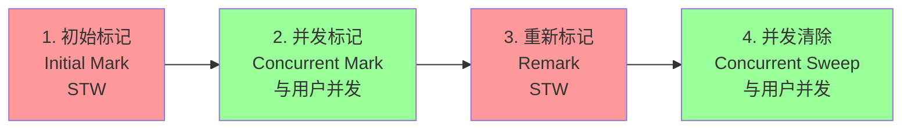

```text
STW       并发            STW       并发
 │         │              │          │
 ▼         ▼              ▼          ▼
[初始标记]───[并发标记]───[重新标记]───[并发清除]
 短       长(并发)         短        长(并发)
 标GC      遍历GC Roots    修正并发   清除未标记
 Roots直   可达对象,       标记期间   对象,产生
 接关联     用户在跑        用户产生   碎片
                           的引用变化
```

**四阶段详解**：

1. **初始标记（Initial Mark）—— STW**
   - 仅标记 GC Roots **直接关联**的对象，速度很快。
   - 必须停用户线程，但只标一层，停顿极短。
2. **并发标记（Concurrent Mark）—— 与用户线程并发**
   - 从初始标记的对象出发，沿引用链遍历，标记所有可达对象。
   - 耗时最长，但**不 STW**，用户线程继续跑。
   - 用户线程在此期间产生新引用，导致标记不准，需下一阶段修正。
3. **重新标记（Remark）—— STW**
   - 修正并发标记期间用户线程产生的引用变化。
   - CMS 用**增量更新（Incremental Update）**：并发标记期间用写屏障记录「新增的引用」（被新引用的旧对象），重新标记阶段重新扫这些对象。
   - 停顿比初始标记稍长，但远短于并发标记。
4. **并发清除（Concurrent Sweep）—— 与用户线程并发**
   - 清除未标记对象，回收内存。
   - 不 STW，但会产生碎片（标记-清除，不整理）。
   - 清除期间用户产生新垃圾（「浮动垃圾」），本次不回收，下次 GC 再处理。

**优点**：
- 并发收集，低停顿（停顿主要在初始标记和重新标记，毫秒级）。
- 适合对响应时间敏感的 Web/交互式服务。

**缺点**（高频考点）：
1. **CPU 敏感**：并发阶段占 CPU，降低吞吐量（默认 GC 线程数 = (CPU+3)/4）。
2. **浮动垃圾**：并发清除阶段新产生的垃圾本次不回收。
3. **内存碎片**：标记-清除产生碎片，分配大对象易触发 Full GC。
4. **Concurrent Mode Failure**：并发阶段老年代不够，被迫停用户线程，**降级为 Serial Old** 做 Full GC（标记-整理），停顿很长。
5. **Promotion Failure**：Minor GC 时 Survivor 装不下要晋升老年代但碎片化导致连续空间不足。

**关键参数**：
- `-XX:+UseConcMarkSweepGC`：启用 CMS（老年代），新生代自动用 ParNew。
- `-XX:CMSInitiatingOccupancyFraction=68`：老年代使用率达到该百分比触发 CMS GC（JDK 6+ 自适应）。
- `-XX:+UseCMSCompactAtFullCollection`：Full GC 时进行整理（默认开启，但 STW）。
- `-XX:CMSFullGCsBeforeCompaction=0`：多少次 Full GC 后整理一次（0 = 每次）。
- `-XX:+CMSParallelRemarkEnabled`：并行重新标记，缩短 STW。

**降级场景**（重要）：
- 并发阶段老年代空间不足 → `Concurrent Mode Failure` → 降级 Serial Old Full GC（全堆 STW 标记-整理）。
- Minor GC 晋升失败 → `Promotion Failure` → 触发 Full GC。

> 💡 **面试话术**：「CMS 是第一款并发收集器，老年代用，标记-清除算法，分四阶段：初始标记 STW 只标 GC Roots 直接关联的对象，停顿极短；并发标记和用户线程一起跑，沿引用链遍历可达对象，耗时最长但不 STW；重新标记 STW，用增量更新修正并发标记期间用户新增的引用；并发清除和用户并发，清除未标记对象。优点是低停顿，缺点是 CPU 敏感、有浮动垃圾、有碎片、可能 Concurrent Mode Failure 降级 Serial Old。JDK 9 废弃 JDK 14 移除，被 G1 取代。」

**常见追问**：
- Q: CMS 哪些阶段 STW？ → 初始标记和重新标记，两个都很短；并发标记和并发清除不 STW。
- Q: CMS 用什么算法处理并发标记的引用变化？ → 增量更新（Incremental Update），记录新增引用，重新标记阶段重扫。G1 用的是 SATB，二者不同。
- Q: Concurrent Mode Failure 是什么？ → 并发阶段老年代空间不足，被迫停用户线程降级 Serial Old Full GC，停顿长。可通过调低 CMSInitiatingOccupancyFraction 提前触发 CMS GC 缓解。
- Q: CMS 为什么有碎片？ → 标记-清除不移动对象，反复 GC 产生碎片，分配大对象易 Full GC。
- Q: CMS 和 G1 怎么选？ → JDK 9+ 选 G1（CMS 已废弃）；G1 可预测停顿、整理无碎片、Region 化更适合大堆。

**来源**：《深入理解 Java 虚拟机》第 3 版 §3.5.5 / 第 4 章；[JEP 291: CMS Deprecated](https://openjdk.org/jeps/291)；[JEP 363: 移除 CMS](https://openjdk.org/jeps/363)；[Oracle CMS Tuning](https://docs.oracle.com/en/java/javase/11/gctuning/concurrent-mark-sweep-cms-collector.html)

### 3.8 G1 原理

**定义**：G1（Garbage First）是面向**大堆**（4GB+）、**可预测停顿**的收集器，JDK 9 起为默认。打破物理分代，把堆划分为多个大小相等的 **Region**，每个 Region 可动态扮演 Eden / Survivor / Old / Humongous。整体看是标记-整理，局部（Region 间）看是复制。

**结构**（Region 划分）：

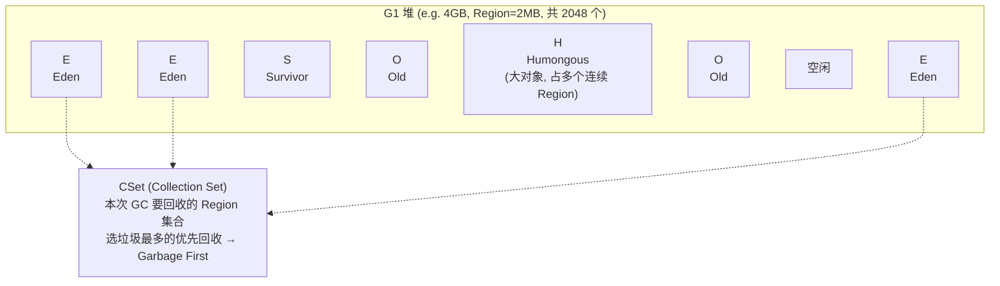

```text
堆被划分为 N 个 Region (1–32MB, 2 的幂)
每个 Region 动态角色: E / S / O / H
   ┌──┬──┬──┬──┬──┬──┬──┬──┬──┐
   │E │E │S │O │H │H │O │空│E │
   └──┴──┴──┴──┴──┴──┴──┴──┴──┘
                  ↑
            大对象跨多个连续 Region

GC 时:
  - Young GC: 回收所有 E + S (复制到新 S / O)
  - Mixed GC: 回收所有 Young + 部分 Old (按收益排序, Garbage First)
```

**核心概念**（高频考点）：

| 概念 | 含义 |
|---|---|
| **Region** | 堆的基本单位，1–32MB，2 的幂；角色动态可变，无物理分代边界 |
| **Humongous** | 大对象 Region，对象 ≥ Region/2 时占用整个或多个连续 Region，逻辑上属于老年代 |
| **CSet (Collection Set)** | 本次 GC 要回收的 Region 集合；G1 按「回收收益（垃圾比例）」选 Region，垃圾最多的优先 → Garbage First |
| **RSet (Remembered Set)** | 每个 Region 维护一个表，记录「哪些其他 Region 引用了本 Region」；GC 时只需扫 RSet 不必扫全堆 |
| **SATB (Snapshot-At-The-Beginning)** | G1 处理并发标记引用变化的算法；在 GC 开始时拍「逻辑快照」，并发标记期间被覆盖的引用对象视为存活（不漏标），写屏障记录原始引用到 SATB 队列 |

**SATB vs 增量更新**（重要区别，高频追问）：
- **CMS 增量更新**：记录「新增的引用」（关注点：用户新引用了旧对象）。
- **G1 SATB**：记录「被覆盖前的旧引用」（关注点：用户断开了引用，但快照里这个对象是存活的，标记为存活，下轮再回收）。
- SATB 标记阶段开始时拍快照，并发标记期间产生的引用变化不影响本快照；可能多标（浮动垃圾），但不会漏标，正确性更好。
- SATB 在重新标记阶段工作量小（快照已确定），停顿更可控；这是 G1 选 SATB 的关键原因。

**GC 类型**：
1. **Young GC（Minor GC）**：Eden 满，回收所有 Young Region，复制存活到新 Survivor / Old。STW，停顿由 `-XX:MaxGCPauseMillis` 调节。
2. **Mixed GC**：回收所有 Young + 部分 Old Region（按收益排序选）。G1 的主力 GC，是「Garbage First」的体现。触发条件：`-XX:G1HeapWastePercent`（默认 5%）允许的浪费达阈值，且 `-XX:G1MixedGCCountTarget`（默认 8）分多次回收完 Old。
3. **Full GC**：单线程 Serial Old 降级（G1 期望避免），触发：晋升失败、Metaspace 不足、`System.gc()`、Humongous 分配失败、并发标记后无足够 Region 回收。

**关键参数**：
- `-XX:+UseG1GC`：启用 G1（JDK 9+ 默认）。
- `-XX:MaxGCPauseMillis=200`：目标最大停顿（默认 200ms），G1 据此调整 CSet 大小（不是硬保证）。
- `-XX:G1HeapRegionSize=2m`：Region 大小（1–32MB，不指定则 JVM 按堆大小自动选）。
- `-XX:InitiatingHeapOccupancyPercent=45`：堆使用率超此值触发并发标记周期（默认 45%）。
- `-XX:G1NewSizePercent=5` / `-XX:G1MaxNewSizePercent=60`：Young Region 占比上下限。
- `-XX:G1MixedGCCountTarget=8`：Mixed GC 分多少次回收 Old。

**与 CMS 对比**（高频题）：

| 维度 | CMS | G1 |
|---|---|---|
| 分代 | 物理分代（连续） | 逻辑分代（Region 化） |
| 算法 | 标记-清除（碎片） | 整体标记-整理 + 局部复制（无碎片） |
| 停顿 | 不可预测 | 可预测（MaxGCPauseMillis） |
| 并发标记引用处理 | 增量更新 | SATB |
| 大对象 | 直接进老年代 | Humongous Region |
| Full GC | 降级 Serial Old | 降级 Serial Old（单线程） |
| 适用堆大小 | <8GB | 4–32GB+ |
| 状态 | JDK 14 移除 | JDK 9+ 默认 |

**关键点**：
- G1 的「可预测停顿」是软目标：用户设 `MaxGCPauseMillis`，G1 在 CSet 中选择尽量多的高收益 Region，但**不保证**一定达标。
- G1 整体无碎片（Region 间复制整理），但 Humongous Region 可能产生碎片。
- G1 仍有 Full GC 降级风险（晋升失败、Metaspace 不足），调优目标是避免 Full GC。
- Mixed GC 是 G1 的灵魂：分多次回收 Old，每次停顿可控。

> 💡 **面试话术**：「G1 是 JDK 9 默认收集器，把堆划分成 1–32MB 的 Region，每个 Region 动态扮演 Eden、Survivor、Old 或 Humongous，打破物理分代。整体看是标记-整理，局部 Region 间是复制，所以无碎片。G1 用 SATB 处理并发标记的引用变化——在标记开始拍快照，被覆盖的旧引用视为存活记到 SATB 队列，不漏标但可能多标产生浮动垃圾，重新标记工作量小停顿可控，这是 G1 选 SATB 不用增量更新的原因。GC 分 Young GC 和 Mixed GC，Mixed GC 回收所有 Young 加部分 Old，按垃圾收益排序选 Region，这就是 Garbage First。停顿由 -XX:MaxGCPauseMillis 调节但不是硬保证。RSet 记录哪些 Region 引用了本 Region，避免全堆扫描。G1 仍可能 Full GC 降级 Serial Old，调优目标是避免。」

**常见追问**：
- Q: G1 什么时候 Full GC？ → 晋升失败、Metaspace 不足、Humongous 分配失败、并发标记后无足够 Region 可回收、`System.gc()`。
- Q: G1 为什么用 SATB 不用增量更新？ → SATB 拍快照后并发标记期间不必处理新增引用，重新标记工作量小，停顿可控；正确性更好（不漏标）。增量更新需在重新标记重扫新增引用，工作量大。
- Q: G1 的「可预测停顿」是硬保证吗？ → 不是，是软目标。G1 尽量按 MaxGCPauseMillis 调 CSet，但不保证。
- Q: G1 有碎片吗？ → 整体无碎片（Region 间复制整理），但 Humongous Region 可能碎片化。
- Q: G1 和 CMS 怎么选？ → JDK 9+ 选 G1（CMS 已废弃）；G1 无碎片、可预测停顿、适合大堆；CMS 碎片多、降级风险高。
- Q: Region 大小怎么定？ → 1–32MB，2 的幂，不指定则 JVM 按堆大小自动选（堆越大 Region 越大）。

**来源**：《深入理解 Java 虚拟机》第 3 版 §3.5.6 / 第 4 章；[JEP 243: G1 默认](https://openjdk.org/jeps/243)；[Oracle G1 GC Tuning Guide](https://docs.oracle.com/en/java/javase/17/gctuning/garbage-first-garbage-collector-tuning.html)；[OpenJDK G1 Wiki](https://wiki.openjdk.org/display/HotSpot/G1GC)；[美团技术博客 G1 调优实战](https://tech.meituan.com/2016/09/23/g1.html)

### 3.9 面试话术与追问

**总览话术**（可直接口述，约 350 字）：

「GC 主要解决两件事：判定对象存活和回收内存。存活判定主流用可达性分析，从 GC Roots 出发沿引用链搜索，不可达的可回收；GC Roots 有栈帧局部变量、JNI 引用、静态变量、常量、synchronized 持有对象等。GC 算法有三种：标记-清除有碎片、标记-复制浪费空间但无碎片、标记-整理无碎片但移动成本高。基于弱代假说把堆分新生代老年代，新生代 8:1:1 老年代 1:2，新生代用复制算法老年代用整理。对象晋升老年代四种条件：年龄达阈值 15、大对象直接进、动态年龄判断、Survivor 装不下走担保。收集器方面，JDK 8 默认 Parallel Scavenge + Parallel Old 吞吐量优先，JDK 9 默认 G1。CMS 是第一款并发收集器，四阶段中只有初始标记和重新标记 STW，但有碎片和 Concurrent Mode Failure 风险，JDK 14 移除。G1 把堆分成 Region，用 SATB 处理并发标记，Mixed GC 按 Garbage First 选 Region，可预测停顿，是现在的主流选择。」

**常见追问**（高频 8 问）：

- Q: **G1 什么时候 Full GC？** → 晋升失败（Mixed GC 后老年代仍不够）、Metaspace 不足、Humongous 分配失败、并发标记后无足够 Region 可回收、`System.gc()`。G1 的 Full GC 是单线程 Serial Old 降级，停顿很长，调优目标是避免。
- Q: **CMS 和 G1 怎么选？** → JDK 9+ 选 G1（CMS 已废弃）。G1 无碎片、可预测停顿、适合 4GB+ 大堆；CMS 碎片多、Concurrent Mode Failure 降级风险高，仅 JDK 8 旧系统保留。
- Q: **为什么 G1 用 SATB 不用增量更新？** → SATB 在标记开始拍快照，并发标记期间被覆盖的旧引用视为存活记入 SATB 队列，重新标记只需处理这些对象，工作量小停顿可控，正确性不漏标（可能多标产生浮动垃圾）。增量更新需在重新标记重扫所有新增引用，工作量大。
- Q: **CMS 的 Concurrent Mode Failure 怎么处理？** → 降级 Serial Old 做 Full GC（标记-整理），全程 STW 停顿长。预防：调低 `-XX:CMSInitiatingOccupancyFraction` 让 CMS 更早触发；或换 G1。
- Q: **Minor GC 会扫描老年代吗？** → 不会全扫。通过 RSet / Card Table 记录跨代引用，Minor GC 只扫脏卡（老年代指向新生代的卡页），不必扫整个老年代。
- Q: **对象什么时候进老年代？** → ① 年龄达 MaxTenuringThreshold（默认 15）；② 大对象超 PretenureSizeThreshold（仅 Serial/ParNew）；③ 动态年龄判断（同龄对象总和 ≥ Survivor 50%）；④ Minor GC 后 Survivor 装不下走空间分配担保。
- Q: **Parallel Scavenge 能配 CMS 吗？** → 不能，只能配 Parallel Old。ParNew 才能配 CMS，这是常见面试陷阱。
- Q: **ZGC 凭什么做到亚毫秒停顿？** → 染色指针（在 64 位指针高位存标记信息）+ 读屏障（用户线程读引用时自行转发），让标记、转移、重定位都并发，STW 只在初始标记等极短阶段。JEP 377 转正，JEP 439 引入分代 ZGC。

### 3.10 进阶阅读

- **《深入理解 Java 虚拟机》第 3 版 第 3 章 / 第 4 章**：周志明著 — 中文社区最权威的 GC 算法与收集器讲解，§3.1–3.5 讲算法与分代理论，第 4 章逐个讲收集器，CMS/G1 章节最系统。
- **JEP 243: G1 成为默认收集器**：[openjdk.org/jeps/243](https://openjdk.org/jeps/243) — G1 设计目标与默认化的官方动机，理解 G1 定位的权威依据。
- **JEP 363: 移除 CMS**：[openjdk.org/jeps/363](https://openjdk.org/jeps/363) — CMS 移除的官方理由（碎片、降级、维护成本），理解 CMS 缺陷的权威来源。
- **JEP 377: ZGC 转正** + **JEP 439: 分代 ZGC**：[openjdk.org/jeps/377](https://openjdk.org/jeps/377) / [openjdk.org/jeps/439](https://openjdk.org/jeps/439) — ZGC 染色指针、读屏障、并发转移的官方设计，亚毫秒停顿的原理。
- **Oracle G1 GC Tuning Guide**：[docs.oracle.com](https://docs.oracle.com/en/java/javase/17/gctuning/garbage-first-garbage-collector-tuning.html) — 官方 G1 调优指南，Region、CSet、Mixed GC、IHOP 参数详解，调优第一手资料。
- **OpenJDK G1GC Wiki**：[wiki.openjdk.org/HotSpot/G1GC](https://wiki.openjdk.org/display/HotSpot/G1GC) — G1 实现细节，RSet、SATB、CSet 选择算法的内部文档。
- **美团技术博客 G1 GC 调优实战**：[tech.meituan.com/2016/09/23/g1.html](https://tech.meituan.com/2016/09/23/g1.html) — 美团生产环境 G1 调优实战案例，参数选择与问题排查的真实工程经验。
- **R大（RednaxelaFX）关于 CMS/G1 的知乎回答**：知乎搜索"RednaxelaFX G1"或"RednaxelaFX CMS" — R大对 SATB vs 增量更新、Card Table、写屏障等底层细节的深度回答，是中文社区公认的高质量来源。
- **Stack Overflow: SATB vs Incremental Update**：高票回答对比 CMS 增量更新与 G1 SATB 的本质区别——前者关注"新增引用"后者关注"消失引用"，是面试常被深挖的细节。
- **HotSpot 源码（OpenJDK 17）`src/hotspot/share/gc/g1/`**：[GitHub OpenJDK](https://github.com/openjdk/jdk/tree/jdk-17%2B35/src/hotspot/share/gc/g1) — G1 源码，`g1SATBMarkQueue`、`g1CardTable`、`heapRegion` 等类，源码级理解 SATB 与 RSet 实现。

---

## 4. JVM 调优与 OOM 排查

（待填充）

---

## 附：参考资料汇总

（待填充）
