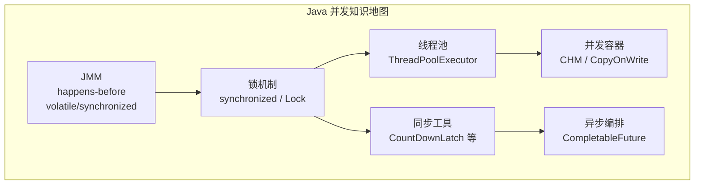
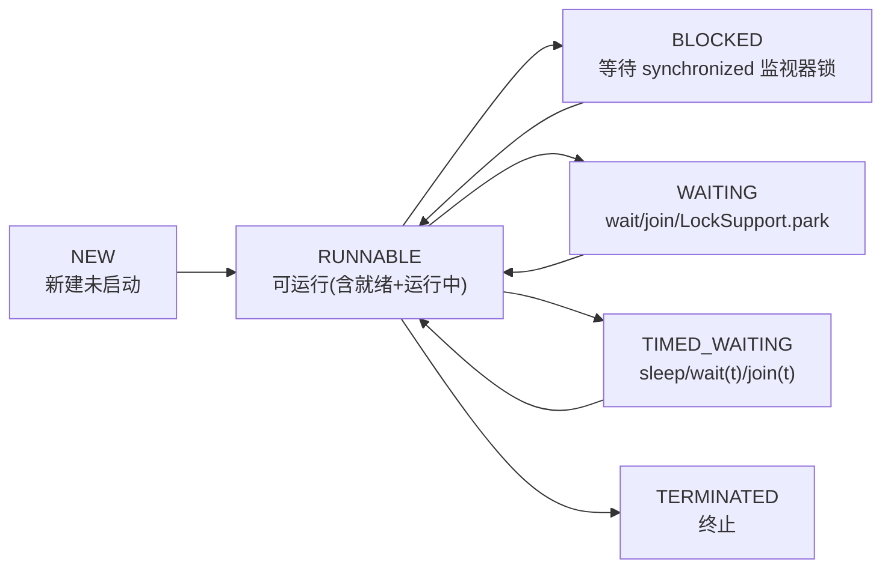
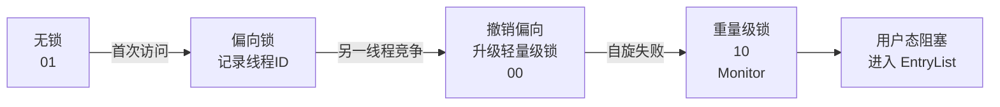
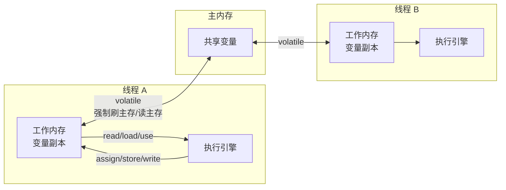
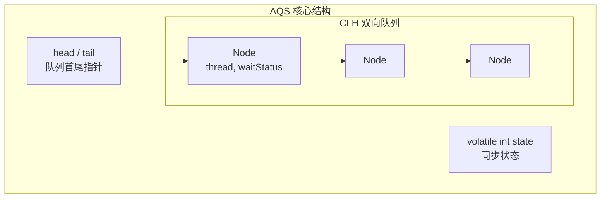
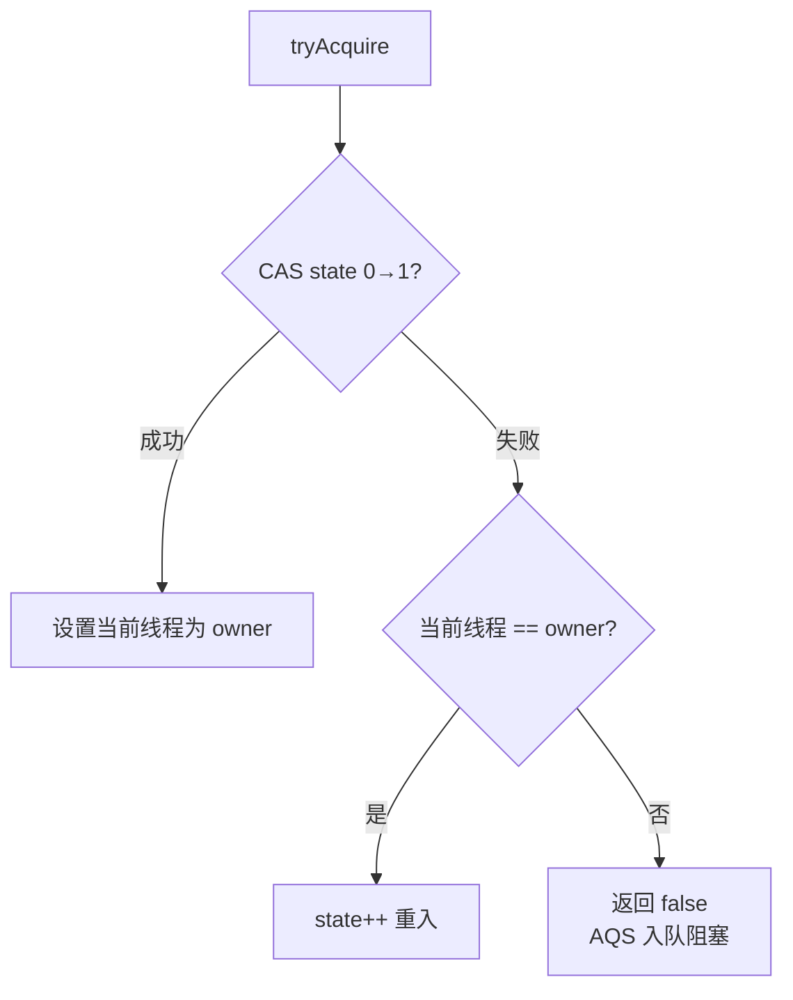
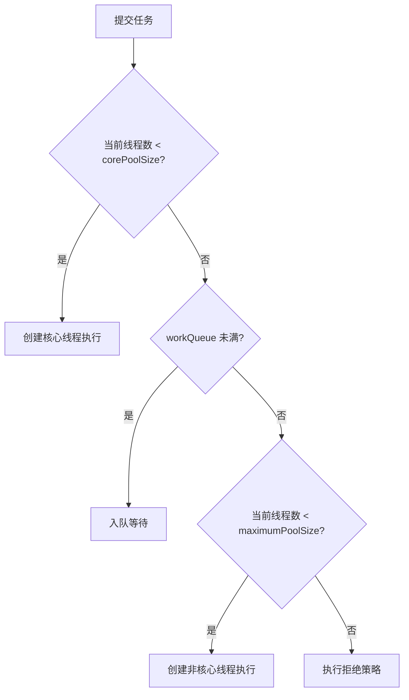
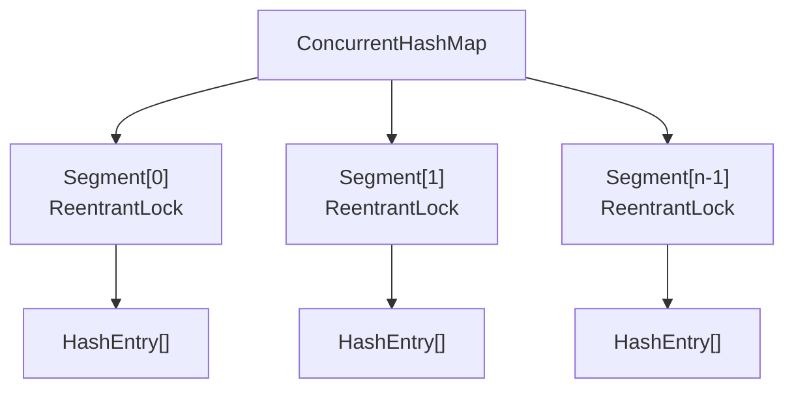
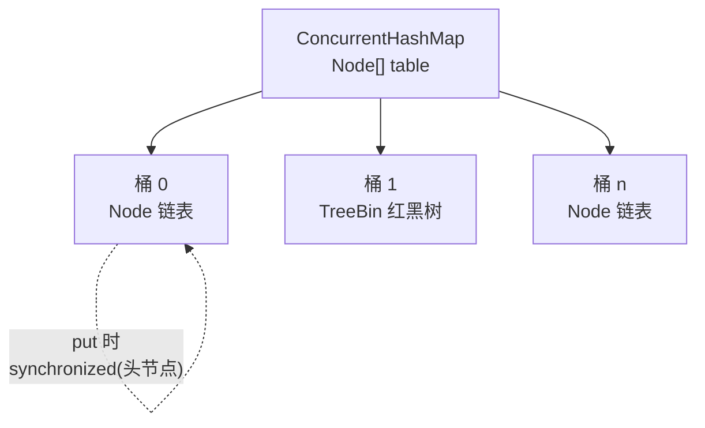
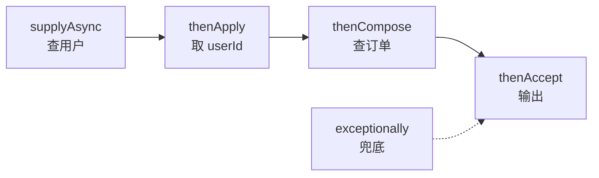

# M2 Java 并发知识点

> 模块：M2 Java 并发 ｜ 对应课表 Week 1-2
> 深度定位：面试能讲清 ｜ 来源：权威文档/书籍/博客
> 高频题：10 道

---

## 0. 速查索引

| # | 高频题 | 对应章节 | 学时 |
|---|---|---|---|
| 1 | synchronized 底层原理 | §1.2 | Week1 Day3 |
| 2 | volatile 语义 | §1.3 | Week1 Day4 |
| 3 | AQS 框架原理 | §2.1 | Week1 Day4 |
| 4 | ReentrantLock 公平 vs 非公平 | §2.2 | Week2 Day2 |
| 5 | ThreadPoolExecutor 7参数+流程+拒绝策略 | §3.1 | Week2 Day1 |
| 6 | 线程池核心线程数怎么设 | §3.2 | Week2 Day1 |
| 7 | ConcurrentHashMap JDK7 vs JDK8 | §4.1 | Week2 Day3 |
| 8 | CountDownLatch vs CyclicBarrier vs Semaphore | §4.2 | Week2 Day4 |
| 9 | CompletableFuture 异步编排 | §4.3 | Week2 Day4 |
| 10 | 死锁 4 条件 + 排查 | §5.1 | Week2 Day2 |

---

## 1. 并发基础：线程与锁

Java 并发的核心是 **JMM（Java Memory Model）** 与 **JUC（java.util.concurrent）**。JMM 定义了线程间如何通过共享内存通信，JUC 提供了锁、线程池、并发容器等工具。



### 1.1 线程基础

**线程生命周期**：Java 线程有 6 种状态（`Thread.State`）：



> 关键结论：Java 线程状态没有"运行中"和"就绪"之分，统称 RUNNABLE；调用 `Thread.sleep()` 进入 TIMED_WAITING 而非 BLOCKED；BLOCKED 仅针对 synchronized 监视器锁。

**来源**：[Thread.State Javadoc](https://docs.oracle.com/en/java/javase/17/docs/api/java.base/java/lang/Thread.State.html)；《Java并发编程的艺术》第 4 章

### 1.2 synchronized 底层原理

**定义**：`synchronized` 是 Java 内建的原子性互斥锁，基于 JVM 层面的**对象头 Mark Word** 与 **Monitor**（管程）实现。JDK 6 引入锁升级优化后性能大幅提升。

**对象头 Mark Word**（64 位 JVM）：

| 锁状态 | 25bit | 31bit | 1bit | 4bit | 1bit(偏向标志) | 2bit(锁标志位) |
|---|---|---|---|---|---|---|
| 无锁 | unused | hashCode | unused | 分代年龄 | 0 | 01 |
| 偏向锁 | 线程ID | epoch | unused | 分代年龄 | 1 | 01 |
| 轻量级锁 | 指向栈中锁记录指针 |  |  |  |  | 00 |
| 重量级锁 | 指向 Monitor 指针 |  |  |  |  | 10 |
| GC 标记 |  |  |  |  |  | 11 |

**锁升级过程**：



**关键点**：
- **偏向锁**：同一线程反复进入同步块，只 CAS 写线程 ID，无额外开销。JDK 15 后逐步废弃（`-XX:-UseBiasedLocking`）。
- **轻量级锁**：多线程交替（无真竞争），通过栈帧中锁记录 + CAS 自旋完成加锁，避免系统调用。
- **重量级锁**：真竞争激烈，自旋超过阈值，膨胀为 Monitor（基于操作系统 Mutex），未抢到的线程进入 `EntryList` 阻塞，用户态→内核态切换开销大。
- 字节码层面：同步块用 `monitorenter` / `monitorexit`；同步方法在常量池 `ACC_SYNCHRONIZED` 标志位标记。

> 💡 **面试话术**：「synchronized 底层基于对象头的 Mark Word 实现。Mark Word 记录锁状态，会经历偏向锁→轻量级锁→重量级锁的升级。偏向锁只在线程 ID 上做 CAS，适合单线程重入；轻量级锁通过栈帧锁记录加 CAS 自旋，适合多线程交替；竞争激烈时膨胀为重量级锁，依赖操作系统 Monitor，未抢到的线程进入 EntryList 阻塞。JDK 6 后 synchronized 性能已经和 ReentrantLock 接近。」

**常见追问**：
- Q: synchronized 和 ReentrantLock 区别？ → 可重入性都有；ReentrantLock 支持中断/超时/多 Condition/公平锁；synchronized 是语法关键字自动释放，ReentrantLock 必须 finally unlock。
- Q: 锁能降级吗？ → HotSpot 实现中允许 GC safepoint 时降级，但运行期一般只升级不降级。
- Q: 为什么 JDK 15 废弃偏向锁？ → 维护成本高、现代应用偏向锁收益小（多核竞争场景多），且与 ZGC 等有冲突。
- Q: synchronized 是可重入的吗？ → 是，Monitor 计数器记录重入次数。

**来源**：《Java并发编程的艺术》第 2 章；《深入理解Java虚拟机》第 13 章；[OpenJDK JEP 374: Disable and Deprecate Biased Locking](https://openjdk.org/jeps/374)；[Mark Word 源码 markWord.hpp](https://github.com/openjdk/jdk/blob/master/src/hotspot/share/oops/markWord.hpp)

### 1.3 volatile 语义

**定义**：`volatile` 是 JVM 提供的轻量级同步机制，保证 **可见性** + **禁止指令重排序**，但**不保证原子性**。

**Java Memory Model（JMM）**：



**三大语义**：
- **可见性**：写 volatile 变量后强制刷回主内存；读 volatile 变量强制从主内存读，使其他线程立即可见。
- **禁止重排序**：通过**内存屏障**（Memory Barrier）实现。写前插入 StoreStore 屏障，写后 StoreLoad；读前 LoadLoad，读后 LoadStore。
- **不保证原子性**：`i++` 是「读-改-写」三步，volatile 不能保证三步原子。

**happens-before 规则**（volatile 相关）：
- 对 volatile 变量的写 happens-before 后续对它的读。
- 传递性：A happens-before B，B happens-before C，则 A happens-before C。

**关键点**：
- 典型用法：状态标志位（`volatile boolean running`）、DCL 单例的 `instance` 字段。
- DCL 单例为何要 volatile？→ 防止「分配内存→赋值 instance→初始化对象」被重排为「分配→赋值→初始化」，其他线程拿到未初始化对象。

> 💡 **面试话术**：「volatile 保证可见性和禁止重排序，但不保证原子性。可见性靠 JMM 强制读写主存实现；禁止重排靠内存屏障。典型场景是状态标志位和 DCL 单例。DCL 里 instance 必须 volatile，是因为 new 对象分三步：分配内存、初始化、赋值引用，如果没有 volatile，可能赋值和初始化重排，其他线程拿到未初始化的对象。」

**常见追问**：
- Q: volatile 能替代 synchronized 吗？ → 不能，多个线程做 i++ 仍然线程不安全，需要 `AtomicInteger` 或 synchronized。
- Q: happens-before 是什么？ → JMM 定义的偏序关系，保证前操作结果对后操作可见，是判断数据竞争的工具。
- Q: volatile 数组能保证元素可见吗？ → volatile 只保证引用可见，不保证数组元素修改可见，应用 `AtomicIntegerArray`。

**来源**：《Java并发编程的艺术》第 3 章；[Java Memory Model](https://www.cs.umd.edu/~pugh/java/memoryModel/)；[JLS §17.4 Memory Model](https://docs.oracle.com/javase/specs/jls/se17/html/jls-17.html#jls-17.4)

### 1.4 面试话术与追问

> 「Java 并发的两大基石是 JMM 和 JUC。JMM 定义了线程如何通过主内存通信，核心是 happens-before。synchronized 是内置锁，基于对象头 Mark Word 实现锁升级，从偏向锁到轻量级再到重量级锁，竞争越激烈开销越大。volatile 是轻量同步，保证可见性和禁止重排但不保证原子性。两者选择：写状态标志用 volatile，复合操作用 synchronized 或 Lock。」

- Q: 为什么线程调用 start() 后不能再次 start()？ → 线程状态从 NEW 跳到 RUNNABLE 后不可逆，再次 start 抛 IllegalThreadStateException。
- Q: wait() 和 sleep() 区别？ → wait 释放锁、必须在同步块、由 notify 唤醒；sleep 不释放锁、任意位置、超时自动醒。
- Q: 为什么 wait/notify 必须在 synchronized 块内？ → 否则抛 IllegalMonitorStateException，Monitor 是对象锁，必须先持有才能 wait。

### 1.5 进阶阅读

- [The "Double-Checked Locking is Broken" Declaration](https://www.cs.umd.edu/~pugh/java/memoryModel/DoubleCheckedLocking.html) — DCL 为何必须 volatile 的权威解释
- [JEP 374: Disable and Deprecate Biased Locking](https://openjdk.org/jeps/374) — 偏向锁废弃原因
- [Doug Lea — JMM 推导](http://g.oswego.edu/dl/jmm/cookbook.html) — 内存屏障 cookbook
- [OpenJDK markWord.hpp 源码](https://github.com/openjdk/jdk/blob/master/src/hotspot/share/oops/markWord.hpp) — Mark Word 64 位布局

---

## 2. JUC 锁框架

### 2.1 AQS 框架原理

**定义**：AQS（AbstractQueuedSynchronizer）是 JUC 锁与同步器的基础框架，由 Doug Lea 设计。核心思想：用 **volatile int state** 表示同步状态，用 **CLH 变种队列** 管理等待线程，子类通过 `tryAcquire/tryRelease` 等模板方法实现独占或共享语义。

**结构**：



**关键点**：
- **state**：volatile 修饰，CAS 修改。语义由子类决定：ReentrantLock 表示重入次数；Semaphore 表示许可数；CountDownLatch 表示计数。
- **CLH 队列**：FIFO 双向链表，每个 Node 封装一个线程引用和等待状态。线程获取锁失败后封装为 Node 入队，前驱节点释放后唤醒后继。
- **模板方法模式**：AQS 提供 `acquire/release` 主流程（入队、阻塞、唤醒），子类只实现 `tryAcquire/tryRelease`（独占）或 `tryAcquireShared/tryReleaseShared`（共享）。
- **独占 vs 共享**：独占（ReentrantLock）同一时刻只有一个线程持有；共享（Semaphore/CountDownLatch）允许多个线程同时获取。
- **park/unpark**：线程阻塞用 `LockSupport.park()`，唤醒用 `unpark()`，基于 Unsafe 的 Parker 实现，避免 Thread.suspend/resume 死锁问题。

**tryAcquire 流程（ReentrantLock 非公平）**：



> 💡 **面试话术**：「AQS 是 JUC 锁的基础框架，核心是 volatile state 和 CLH 队列。state 通过 CAS 修改，语义由子类定义——ReentrantLock 里是重入次数，Semaphore 是许可数。线程抢锁失败就封装成 Node 加入 CLH 队列阻塞，前驱释放后唤醒后继。AQS 用模板方法模式，acquire/release 主流程写死在父类，子类只实现 tryAcquire/tryRelease。ReentrantLock、Semaphore、CountDownLatch、ReentrantReadWriteLock 都基于 AQS。」

**常见追问**：
- Q: AQS 为什么用 CLH 队列而不用普通链表？ → CLH 入队出队只需 CAS 修改尾指针和前驱唤醒后继，并发友好；前驱节点状态可取消/阻塞，便于队列出队。
- Q: 公平锁和非公平锁在 AQS 上有何区别？ → 非公平 `tryAcquire` 直接 CAS 抢；公平 `tryAcquire` 先 `hasQueuedPredecessors()` 检查队列是否有前驱。
- Q: state 为什么是 volatile 而不是 Atomic 原子类？ → 修改靠 CAS 自身保证原子性，volatile 保证可见性即可，AtomicInteger 内部也是 volatile + CAS。

**来源**：《Java并发编程的艺术》第 11 章；[Doug Lea — AQS 原始论文](http://gee.cs.oswego.edu/dl/papers/aqs.pdf)；[AbstractQueuedSynchronizer Javadoc](https://docs.oracle.com/en/java/javase/17/docs/api/java.base/java/util/concurrent/locks/AbstractQueuedSynchronizer.html)

### 2.2 ReentrantLock 公平锁 vs 非公平锁

**定义**：ReentrantLock 是基于 AQS 的可重入独占锁。构造函数传入 `fair` 决定公平或非公平，默认非公平。

**对比**：

| 维度 | 公平锁 | 非公平锁 |
|---|---|---|
| 获取顺序 | 严格 FIFO，先到先得 | 允许插队，新线程直接 CAS 抢 |
| tryAcquire | `hasQueuedPredecessors()` 检查队列 | 直接 CAS state |
| 吞吐量 | 低（频繁线程切换） | 高（默认） |
| 饥饿 | 不会 | 可能（某线程长期抢不到） |
| 适用 | 严格顺序场景 | 大多数场景 |

**关键点**：
- 非公平锁吞吐高的原因：刚释放锁的线程很可能下次还能直接抢到，避免唤醒队列线程的开销。
- 公平锁每次都检查队列，多一次 `hasQueuedPredecessors()` 调用。

> 💡 **面试话术**：「ReentrantLock 默认非公平。非公平锁 tryAcquire 直接 CAS 抢，公平锁先 hasQueuedPredecessors 检查队列是否有前驱。非公平吞吐高，因为刚释放的线程很可能再次抢到，省去唤醒队列线程的开销，但可能导致队列线程饥饿。生产环境一般用默认非公平。」

**常见追问**：
- Q: 公平锁真的完全公平吗？ → 入队后公平，但刚 start 的线程和队列头线程可能并发 CAS。
- Q: 为什么默认非公平？ → 性能优先，公平锁的额外检查和线程切换开销大。

**来源**：《Java并发编程实战》第 13 章；[ReentrantLock Javadoc](https://docs.oracle.com/en/java/javase/17/docs/api/java.base/java/util/concurrent/locks/ReentrantLock.html)

### 2.3 ReentrantReadWriteLock / StampedLock

- **ReentrantReadWriteLock**：读共享、写独占，基于 AQS 的 state 高 16 位读、低 16 位写。适合读多写少。
- **StampedLock**（JDK 8）：增加**乐观读**（`tryOptimisticRead`），不加锁先读，校验 stamp 失败再升级悲观读，性能更好但不支持重入。

> 关键结论：StampedLock 适合读多写少且不重入场景；不可重入是它的最大坑点，否则可能死锁。

**来源**：[StampedLock Javadoc](https://docs.oracle.com/en/java/javase/17/docs/api/java.base/java/util/concurrent/locks/StampedLock.html)

### 2.4 面试话术与追问

> 「JUC 锁框架都基于 AQS。AQS 用 volatile state + CLH 队列 + 模板方法模式，把入队阻塞唤醒的通用流程抽到父类，子类只实现 tryAcquire/tryRelease。ReentrantLock 默认非公平，吞吐高但可能饥饿；ReadWriteLock 用 state 高低位分离实现读共享写独占；StampedLock 用乐观读进一步提升读性能但不支持重入。」

- Q: AQS 用什么阻塞线程？ → `LockSupport.park()`，对应唤醒是 `unpark()`，基于 Parker。
- Q: Condition 是怎么实现的？ → AQS 内部维护单向 Condition 等待队列，await 把 Node 从同步队列移到 Condition 队列，signal 时移回。

### 2.5 进阶阅读

- [Doug Lea — AQS paper](http://gee.cs.oswego.edu/dl/papers/aqs.pdf) — AQS 设计原理原始论文
- [LockSupport Javadoc](https://docs.oracle.com/en/java/javase/17/docs/api/java.base/java/util/concurrent/locks/LockSupport.html) — park/unpark 机制
- [美团技术博客 — AQS 源码分析](https://tech.meituan.com/) — 中文 AQS 源码逐行解读

---

## 3. 线程池

### 3.1 ThreadPoolExecutor 7大参数 + 工作流程 + 拒绝策略

**定义**：线程池是管理线程复用的容器，避免频繁创建销毁线程的开销。核心实现类是 `ThreadPoolExecutor`。

**7 大参数**：

| # | 参数 | 类型 | 含义 |
|---|---|---|---|
| 1 | corePoolSize | int | 核心线程数，即使空闲也不回收（除非 allowCoreThreadTimeOut） |
| 2 | maximumPoolSize | int | 最大线程数，包含核心 |
| 3 | keepAliveTime | long | 非核心线程空闲存活时间 |
| 4 | unit | TimeUnit | keepAliveTime 单位 |
| 5 | workQueue | BlockingQueue | 任务队列 |
| 6 | threadFactory | ThreadFactory | 线程工厂，命名等 |
| 7 | handler | RejectedExecutionHandler | 拒绝策略 |

**工作流程**：



**4 种拒绝策略**：

| 策略 | 行为 |
|---|---|
| AbortPolicy（默认） | 抛 RejectedExecutionException |
| CallerRunsPolicy | 由提交任务的线程执行（背压） |
| DiscardPolicy | 静默丢弃 |
| DiscardOldestPolicy | 丢弃队列最早任务，重试提交 |

**关键点**：
- 常用队列：`LinkedBlockingQueue`（无界，注意 OOM）、`ArrayBlockingQueue`（有界）、`SynchronousQueue`（无容量，直接交付）。
- `execute()` vs `submit()`：execute 无返回值、异常直接抛；submit 返回 Future、异常封装在 Future。

> 💡 **面试话术**：「线程池核心是 ThreadPoolExecutor，7 大参数：核心数、最大数、存活时间、时间单位、任务队列、线程工厂、拒绝策略。流程是：先创建核心线程，满了入队，队列满了创建非核心线程到最大数，再满就执行拒绝策略，默认 AbortPolicy 抛异常。阿里规范要求用 ThreadPoolExecutor 手动构造，不要用 Executors 工具类，因为 newFixedThreadPool 用无界队列可能 OOM，newCachedThreadPool 最大线程数 Integer.MAX_VALUE 也可能 OOM。」

**常见追问**：
- Q: 核心线程能被回收吗？ → 默认不能，`allowCoreThreadTimeOut(true)` 后可以。
- Q: 为什么队列满才创建非核心线程，而不是先到最大线程数？ → JDK 设计如此，与 Semrush/Microsoft 等实现不同；好处是减少线程数，坏处是队列无界时最大线程数永远到不了。
- Q: 线程池怎么保证线程不退出？ → 核心线程用 `workQueue.take()` 阻塞获取任务，非核心用 `poll(timeout)`。

**来源**：《Java并发编程艺术》第 9 章；[ThreadPoolExecutor Javadoc](https://docs.oracle.com/en/java/javase/17/docs/api/java.base/java/util/concurrent/ThreadPoolExecutor.html)；[阿里巴巴 Java 开发手册](https://github.com/alibaba/p3c)

### 3.2 线程池核心线程数怎么设

**经验公式**（Brian Goetz，《Java并发编程实战》）：

- **CPU 密集型**：`N + 1`（N = CPU 核心数），+1 是为了在偶发页缺失/异常时仍能利用 CPU。
- **IO 密集型**：`N × (1 + 等待时间/计算时间)`，即 `N × (1 + WT/ST)`，WT/ST 越大线程越多。

**关键点**：
- 实际生产中 WT/ST 难精确测量，常用 `2N` 或 `N × 2~10` 经验值。
- 混合型任务建议拆分到不同线程池。
- 可动态调整：`setCorePoolSize` / `setMaximumPoolSize` 运行期生效。

> 💡 **面试话术**：「线程池设置核心数看任务类型。CPU 密集型用 N+1，因为线程多了反而增加上下文切换开销；IO 密集型用 N×(1+等待/计算)，因为线程大部分时间在等 IO，可以多开。实际很难精确测等待时间，常用 2N 经验值。混合任务拆分到不同池。生产环境最好支持运行期动态调整，比如美团的动态线程池方案。」

**常见追问**：
- Q: CPU 100% 时线程池该设多少？ → CPU 密集型，N+1 即可，再多无益。
- Q: 怎么动态调线程池参数？ → `setCorePoolSize` 立即生效；美团动态线程池方案把参数放配置中心。

**来源**：《Java并发编程实战》Brian Goetz 第 8 章；[美团技术博客 — Java线程池实现原理及其在美团业务中的实践](https://tech.meituan.com/2020/04/02/java-pooling-pratice-in-meituan.html)

### 3.3 常见线程池（Executors 工具类）

| 方法 | core | max | queue | 风险 |
|---|---|---|---|---|
| newFixedThreadPool | n | n | LinkedBlockingQueue（无界） | OOM 队列堆积 |
| newSingleThreadExecutor | 1 | 1 | LinkedBlockingQueue（无界） | OOM |
| newCachedThreadPool | 0 | Integer.MAX_VALUE | SynchronousQueue | OOM 线程过多 |
| newScheduledThreadPool | n | Integer.MAX_VALUE | DelayedWorkQueue | OOM 线程过多 |

> 关键结论：阿里规范禁用 Executors，必须用 `new ThreadPoolExecutor(...)` 显式指定有界队列和拒绝策略。

**来源**：[阿里巴巴 P3C](https://github.com/alibaba/p3c)

### 3.4 面试话术与追问

> 「线程池的本质是线程复用，ThreadPoolExecutor 7 参数：核心数、最大数、存活时间、单位、队列、工厂、拒绝策略。流程：先核心、后队列、再非核心、最后拒绝。核心线程数 CPU 密集型 N+1、IO 密集型 2N。阿里规范要求手动构造 ThreadPoolExecutor 并用有界队列，禁用 Executors 工具类，因为它们都用无界队列或无界线程数容易 OOM。」

- Q: 线程池如何优雅关闭？ → `shutdown()` 不接受新任务但执行完队列任务；`shutdownNow()` 尝试中断所有任务；建议 `awaitTermination` 等待。
- Q: 线程池里线程异常了怎么办？ → execute 异常直接抛出且线程销毁重建；submit 异常封装在 Future.get()。

### 3.5 进阶阅读

- [ThreadPoolExecutor Javadoc](https://docs.oracle.com/en/java/javase/17/docs/api/java.base/java/util/concurrent/ThreadPoolExecutor.html) — 完整参数与流程说明
- [美团 — Java线程池实现原理及其在美团业务中的实践](https://tech.meituan.com/2020/04/02/java-pooling-pratice-in-meituan.html) — 动态线程池方案
- [Hippo4j 动态线程池框架](https://github.com/opengoofy/hippo4j) — 开源动态线程池

---

## 4. 并发容器与工具

### 4.1 ConcurrentHashMap JDK7 分段锁 vs JDK8 synchronized+CAS

**JDK 7：分段锁（Segment）**



- 默认 16 个 Segment，每个 Segment 是一个独立的小 HashMap + ReentrantLock。
- 锁粒度：Segment 级别，最多 16 线程并发写。

**JDK 8：synchronized + CAS + 链表/红黑树**



- 抛弃 Segment，直接用 Node 数组。
- 锁粒度：桶的头节点（用 `synchronized`），并发度大幅提升。
- 链表长度 ≥ 8 且数组长度 ≥ 64 转红黑树。
- sizeCtl 控制：-1 表示初始化，-(N) 表示 N-1 个线程在扩容。

**关键差异**：

| 维度 | JDK 7 | JDK 8 |
|---|---|---|
| 数据结构 | Segment + HashEntry 链表 | Node 数组 + 链表/红黑树 |
| 锁实现 | ReentrantLock (Segment) | synchronized + CAS (桶头节点) |
| 并发度 | Segment 数（默认 16） | 数组长度 |
| 查询复杂度 | O(n) 链表 | O(logn) 红黑树 |

> 💡 **面试话术**：「ConcurrentHashMap JDK7 用分段锁，每个 Segment 是一个 ReentrantLock + 小 HashMap，默认 16 段，最多 16 线程并发写。JDK8 重写了，去掉 Segment，直接用 Node 数组，put 时对桶头节点 synchronized，并发度从 16 提升到数组长度。链表超过 8 转红黑树。JDK8 为什么改用 synchronized 而不是 ReentrantLock？因为 synchronized 经过锁升级优化后性能不输 ReentrantLock，且内存占用少，JVM 还能做锁粗化优化。」

**常见追问**：
- Q: CHM 的 put 流程？ → 计算 hash → 空桶 CAS 插入 → 非空 synchronized 头节点插入 → 链表/红黑树处理 → 检查是否扩容。
- Q: CHM 的 size() 准吗？ → 不完全准，并发场景靠 baseCount + CounterCell 数组累加估算，是弱一致。
- Q: CHM 的 get 要加锁吗？ → 不加锁，Node 的 val 和 next 都是 volatile，保证可见性。

**来源**：《Java并发编程艺术》第 6 章；[ConcurrentHashMap Javadoc](https://docs.oracle.com/en/java/javase/17/docs/api/java.base/java/util/concurrent/ConcurrentHashMap.html)；[OpenJDK ConcurrentHashMap 源码](https://github.com/openjdk/jdk/blob/master/src/java.base/share/classes/java/util/concurrent/ConcurrentHashMap.java)

### 4.2 CountDownLatch vs CyclicBarrier vs Semaphore

| 维度 | CountDownLatch | CyclicBarrier | Semaphore |
|---|---|---|---|
| 语义 | 倒计数，归 0 释放等待 | 屏障，N 个线程都到才继续 | 许可证，acquire/release |
| 可重用 | 一次性 | 可 reset 重用（cyclic） | 持续使用 |
| 基于 | AQS 共享 | ReentrantLock + Condition | AQS 共享 |
| 典型场景 | 主线程等多任务完成 | 多线程相互等待到齐 | 限流、资源池 |

**关键点**：
- CountDownLatch：`countDown()` 减一，`await()` 阻塞到 0。一次性，不能重置。
- CyclicBarrier：`await()` 等到指定数后一起放行，可 `reset()` 重用，可指定到达后回调。
- Semaphore：`acquire()` 取许可，`release()` 还，可设公平/非公平，适合限流。

> 💡 **面试话术**：「三者区别在语义和可重用性。CountDownLatch 是一次性倒计数，主线程等 N 个子任务完成，不可重用。CyclicBarrier 是屏障，N 个线程相互等到齐后一起继续，可以 reset 重用。Semaphore 是许可证，acquire 取 release 还，适合限流。底层都基于 AQS 共享模式。」

**常见追问**：
- Q: CyclicBarrier 和 CountDownLatch 能互换吗？ → 不能完全互换，前者可重用且线程间互相等，后者单向等。
- Q: Semaphore 公平和非公平？ → 公平先到先得，非公平允许插队，默认非公平。

**来源**：《Java并发编程实战》第 5 章；[CountDownLatch Javadoc](https://docs.oracle.com/en/java/javase/17/docs/api/java.base/java/util/concurrent/CountDownLatch.html)

### 4.3 CompletableFuture 常用方法 + 异步编排

**定义**：JDK 8 引入的异步编排工具，实现 `Future` + `CompletionStage`，支持链式回调、组合、异常处理，是 Future 的增强版。

**常用方法**：

| 类别 | 方法 | 说明 |
|---|---|---|
| 创建 | supplyAsync / runAsync | 异步执行有/无返回值任务 |
| 转换 | thenApply / thenApplyAsync | 拿到结果转换 |
| 消费 | thenAccept / thenRun | 消费结果无返回 |
| 组合 | thenCompose / thenCombine | 串联两个 / 合并两个 |
| 多任务 | allOf / anyOf | 等全部完成 / 任一完成 |
| 异常 | exceptionally / handle / whenComplete | 异常恢复 / 处理 |

**典型编排示例**：



**关键点**：
- `thenApply` 同线程执行，`thenApplyAsync` 提交到 ForkJoinPool。
- `thenCompose` 用于串联依赖任务（flatMap 语义），`thenCombine` 用于合并两个独立任务结果。
- 默认线程池是 `ForkJoinPool.commonPool()`，生产建议自定义线程池避免资源竞争。

> 💡 **面试话术**：「CompletableFuture 是 Future 的增强，支持链式回调、组合、异常处理。supplyAsync 异步执行，thenApply 转换结果，thenCompose 串联依赖任务，thenCombine 合并两个独立任务，allOf 等全部完成。它解决了 Future 不能回调、不能组合、阻塞 get 的问题。生产中要传自定义线程池，避免用默认的 ForkJoinPool 影响其他任务。」

**常见追问**：
- Q: CompletableFuture 和 Future 区别？ → Future 只能阻塞 get 或轮询 isDone；CompletableFuture 支持回调链和组合。
- Q: thenApply 和 thenCompose 区别？ → thenApply 转换为 T→R；thenCompose 处理 T→CompletableFuture<R>，避免嵌套。

**来源**：[CompletableFuture Javadoc](https://docs.oracle.com/en/java/javase/17/docs/api/java.base/java/util/concurrent/CompletableFuture.html)；《Java并发编程的艺术》第 11 章

### 4.4 面试话术与追问

> 「并发容器和工具是 JUC 的实用层。ConcurrentHashMap JDK8 后用 synchronized + CAS 锁桶头节点，并发度从 16 提升到数组长度。CountDownLatch 一次性倒计数，CyclicBarrier 可重用屏障，Semaphore 许可证限流。CompletableFuture 是 Future 增强，支持链式回调和组合，生产环境务必传自定义线程池。」

- Q: CopyOnWriteArrayList 原理？ → 写时复制，写时锁 + 复制新数组，读无锁，适合读多写少。
- Q: ConcurrentSkipListMap 为什么用跳表？ → 跳表支持并发友好（CAS 局部插入），红黑树并发改造复杂。

### 4.5 进阶阅读

- [ConcurrentHashMap 源码](https://github.com/openjdk/jdk/blob/master/src/java.base/share/classes/java/util/concurrent/ConcurrentHashMap.java) — JDK 8 实现
- [Doug Lea — ConcurrentHashMap 8 设计](http://gee.cs.oswego.edu/dl/concurrency-interest/) — 作者笔记
- [CompletableFuture Javadoc](https://docs.oracle.com/en/java/javase/17/docs/api/java.base/java/util/concurrent/CompletableFuture.html)

---

## 5. 死锁与并发问题排查

### 5.1 死锁的 4 个必要条件 + 排查

**定义**：死锁是两个或多个线程互相持有对方需要的资源，导致永久阻塞。

**4 个必要条件**（Coffman 条件，缺一不可）：

1. **互斥**：资源同一时刻只能被一个线程占用。
2. **持有并等待**：线程持有资源的同时等待其他资源。
3. **不可剥夺**：资源只能由持有者主动释放，不能强制夺走。
4. **循环等待**：存在线程→资源的环形等待链。


**排查工具**：
- **jstack**：`jstack <pid>` 输出线程栈，末尾会自动检测死锁并打印 "Found 1 deadlock"。
- **jconsole / VisualVM**：图形界面检测死锁。
- **arthas**：`thread -b` 找出阻塞其他线程的线程，`thread <id>` 看具体栈。

**经典死锁代码**：

```java
// 线程 A：先锁1 再锁2
synchronized(lock1) {
    synchronized(lock2) { ... }
}
// 线程 B：先锁2 再锁1
synchronized(lock2) {
    synchronized(lock1) { ... }
}
```

**预防策略**：
- **破坏循环等待**：所有线程按固定顺序加锁。
- **破坏持有并等待**：一次性申请所有资源。
- **破坏不可剥夺**：用 `tryLock(timeout)` 替代 synchronized，超时放弃。
- 避免策略：银行家算法（生产很少用）。

> 💡 **面试话术**：「死锁需要同时满足 4 个条件：互斥、持有并等待、不可剥夺、循环等待。生产中常见的是循环等待，比如线程 A 先锁1 再锁2，线程 B 先锁2 再锁1。排查用 jstack 自动检测，或 arthas thread -b。预防最实用的是固定加锁顺序和用 tryLock 超时放弃。」

**常见追问**：
- Q: 线上 CPU 100% 怎么排查？ → `top` 找进程 → `top -Hp` 找线程 → `jstack` 看栈 → 找占用 CPU 最高的线程在干什么（通常是死循环或 GC）。
- Q: jstack 中线程状态是 BLOCKED 一定是死锁吗？ → 不一定，BLOCKED 也可能是正常等锁，要结合 "Found deadlock" 报告判断。

**来源**：《Java并发编程实战》第 10 章；[jstack 指南](https://docs.oracle.com/en/java/javase/17/docs/specs/man/jstack.html)；[arthas 文档](https://arthas.aliyun.com/)

### 5.2 活锁 / 饥饿

- **活锁**：线程不阻塞但反复改变状态，谁也不推进（如两人互相让路）。解法：引入随机退避。
- **饥饿**：线程长期抢不到资源（如非公平锁低优先级线程）。解法：公平锁或优先级调整。

> 关键结论：活锁比死锁更难排查，因为线程是"活着"的，jstack 看不出异常。

**来源**：《Java并发编程实战》第 11 章

### 5.3 面试话术与追问

> 「死锁要同时满足 4 个 Coffman 条件，生产中最常见的是循环等待。排查用 jstack 自动检测死锁，或 arthas thread -b。预防手段：固定加锁顺序破坏循环等待、用 tryLock 超时破坏不可剥夺。除了死锁还有活锁（线程活着但不推进）和饥饿（长期抢不到资源），活锁比死锁难查。」

- Q: 死锁能自动恢复吗？ → 不能，必须外部干预（重启或中断线程）。
- Q: 数据库的死锁和 Java 的死锁一样吗？ → 概念相同，但数据库会主动检测并回滚一个事务，Java 不会自动恢复。

### 5.4 进阶阅读

- [arthas thread 命令](https://arthas.aliyun.com/doc/thread) — 线程排查
- [JEP 280: Synchronization vigilant](https://openjdk.org/jeps/) — 锁监控
- [Coffman 1971 原始论文](https://en.wikipedia.org/wiki/Deadlock#Coffman_conditions) — 死锁 4 条件原始定义

---

## 附：参考资料汇总

### 官方文档
- [Thread.State Javadoc](https://docs.oracle.com/en/java/javase/17/docs/api/java.base/java/lang/Thread.State.html) — 线程 6 种状态
- [AbstractQueuedSynchronizer Javadoc](https://docs.oracle.com/en/java/javase/17/docs/api/java.base/java/util/concurrent/locks/AbstractQueuedSynchronizer.html) — AQS 框架
- [ReentrantLock Javadoc](https://docs.oracle.com/en/java/javase/17/docs/api/java.base/java/util/concurrent/locks/ReentrantLock.html)
- [StampedLock Javadoc](https://docs.oracle.com/en/java/javase/17/docs/api/java.base/java/util/concurrent/locks/StampedLock.html)
- [ThreadPoolExecutor Javadoc](https://docs.oracle.com/en/java/javase/17/docs/api/java.base/java/util/concurrent/ThreadPoolExecutor.html)
- [ConcurrentHashMap Javadoc](https://docs.oracle.com/en/java/javase/17/docs/api/java.base/java/util/concurrent/ConcurrentHashMap.html)
- [CountDownLatch Javadoc](https://docs.oracle.com/en/java/javase/17/docs/api/java.base/java/util/concurrent/CountDownLatch.html)
- [CompletableFuture Javadoc](https://docs.oracle.com/en/java/javase/17/docs/api/java.base/java/util/concurrent/CompletableFuture.html)
- [JLS §17.4 Memory Model](https://docs.oracle.com/javase/specs/jls/se17/html/jls-17.html#jls-17.4) — JMM 规范
- [jstack 指南](https://docs.oracle.com/en/java/javase/17/docs/specs/man/jstack.html)

### 书籍
- 《Java并发编程的艺术》方腾飞 — 第 2/3/6/9/11 章
- 《Java并发编程实战》Brian Goetz — 第 5/8/10/13 章

### 论文与设计文档
- [Doug Lea — AQS paper](http://gee.cs.oswego.edu/dl/papers/aqs.pdf) — AQS 原始设计
- [Java Memory Model](https://www.cs.umd.edu/~pugh/java/memoryModel/) — JMM 权威
- [Doug Lea JMM cookbook](http://g.oswego.edu/dl/jmm/cookbook.html) — 内存屏障
- [DCL is Broken](https://www.cs.umd.edu/~pugh/java/memoryModel/DoubleCheckedLocking.html)

### 技术博客
- [美团 — Java线程池实现原理及其在美团业务中的实践](https://tech.meituan.com/2020/04/02/java-pooling-pratice-in-meituan.html)
- [OpenJDK JEP 374 — 偏向锁废弃](https://openjdk.org/jeps/374)

### 源码
- [OpenJDK markWord.hpp](https://github.com/openjdk/jdk/blob/master/src/hotspot/share/oops/markWord.hpp) — Mark Word 布局
- [OpenJDK ConcurrentHashMap 源码](https://github.com/openjdk/jdk/blob/master/src/java.base/share/classes/java/util/concurrent/ConcurrentHashMap.java)

### 工具
- [arthas](https://arthas.aliyun.com/) — 线程/锁在线排查
- [阿里巴巴 P3C](https://github.com/alibaba/p3c) — 线程池规范
- [Hippo4j 动态线程池](https://github.com/opengoofy/hippo4j)
