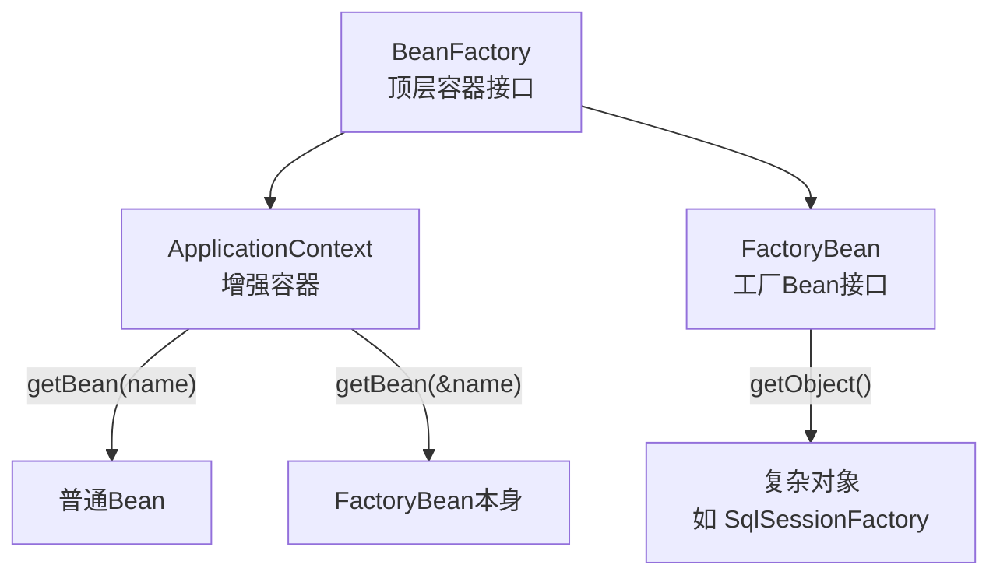
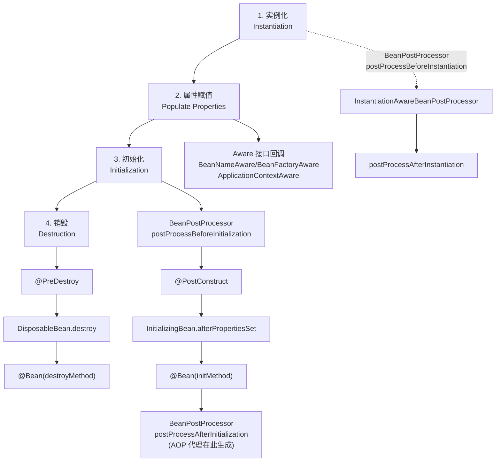
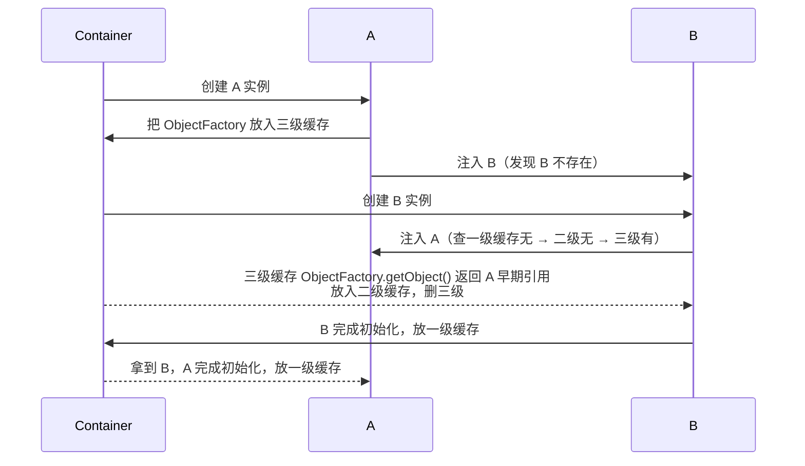
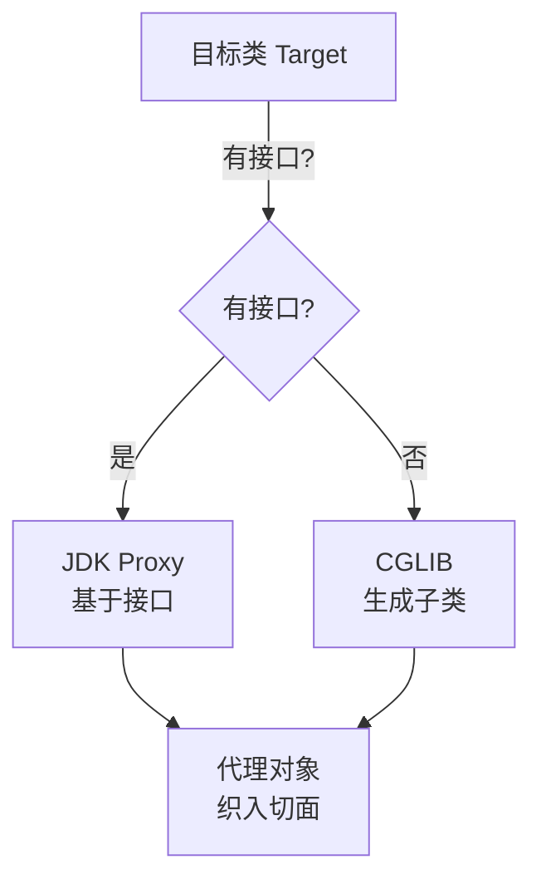
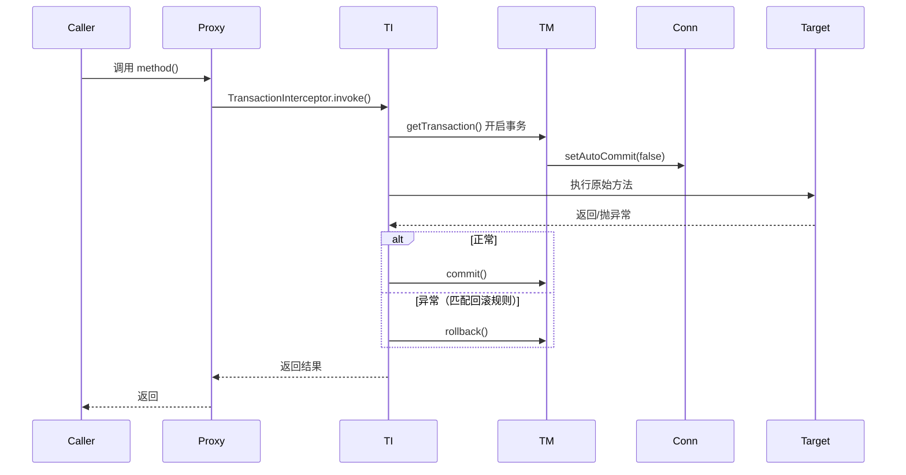
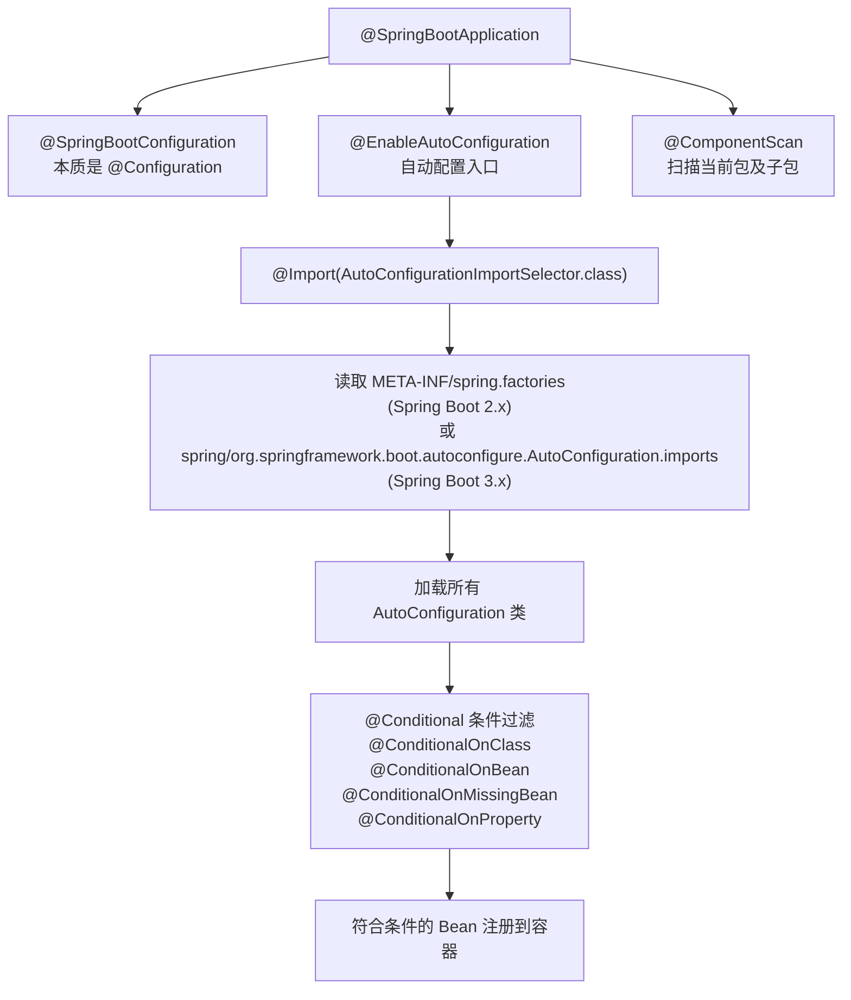
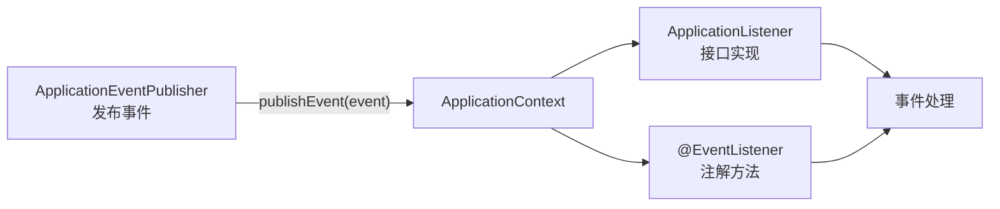

# M3 Spring 全家桶知识点

> 模块：M3 Spring 全家桶 ｜ 对应课表 Week 1-2
> 深度定位：面试能讲清 ｜ 来源：权威文档/书籍/博客
> 高频题：10 道
> 备注：Dropwizard 用户重点补课，迁移对照见 §6

---

## 0. 速查索引

| # | 高频题 | 对应章节 | 学时 |
|---|---|---|---|
| 1 | BeanFactory vs FactoryBean vs ApplicationContext | §1.1 | Week1 Day1 |
| 2 | Bean 生命周期完整过程 | §1.2 | Week1 Day1 |
| 3 | Spring 循环依赖如何解决 | §1.3 | Week1 Day2 |
| 4 | AOP 的实现方式（JDK Proxy vs CGLIB） | §2.1 | Week1 Day5 |
| 5 | @Transactional 原理 + 失效场景 | §2.2 | Week1 Day5 |
| 6 | SpringBoot 自动配置原理 | §3.1 | Week2 |
| 7 | Spring 事务传播行为 + 隔离级别 | §2.3 | Week1 Day5 |
| 8 | @Configuration @Bean 单例保证原理 | §1.4 | Week1 Day1 |
| 9 | Spring 监听器模式（ApplicationEvent） | §4.1 | Week2 |
| 10 | Dropwizard → Spring Boot 迁移对照 | §5.1 | Week1 Day2 |

---

## 1. IoC 容器与 Bean

### 1.1 BeanFactory vs FactoryBean vs ApplicationContext

**定义**：三者容易混淆，但本质不同。

| 名称 | 本质 | 作用 |
|---|---|---|
| BeanFactory | Spring IoC 容器**顶层接口** | 提供获取 Bean 的基础能力（懒加载） |
| ApplicationContext | BeanFactory 的**子接口** | 增强版容器，预加载、国际化、事件、AOP |
| FactoryBean | **工厂 Bean 接口** | 用户自定义创建复杂对象的 Bean，getObject() 返回目标对象 |

**关键点**：
- **BeanFactory** 是 Spring 容器的根接口，`DefaultListableBeanFactory` 是常用实现。它懒加载，调用 `getBean` 才创建。
- **ApplicationContext** 在 BeanFactory 基础上扩展：启动时预实例化 singleton、支持 ResourceLoader、MessageSource、ApplicationEventPublisher。生产环境基本都用它。
- **FactoryBean** 是一种特殊 Bean，注册到容器后，`getBean("xxx")` 返回的不是 FactoryBean 本身，而是 `getObject()` 的产物；想拿 FactoryBean 本身用 `getBean("&xxx")`。典型：`SqlSessionFactoryBean`、`FeignClientFactoryBean`。



> 💡 **面试话术**：「BeanFactory 是 Spring 容器的顶层接口，提供 getBean 的基础能力，懒加载。ApplicationContext 是它的子接口，启动时预实例化 singleton，还加了事件、国际化、资源加载。FactoryBean 不是容器，是工厂 Bean， getObject() 返回目标对象，用于创建复杂 Bean，比如 MyBatis 的 SqlSessionFactoryBean。三者名字像但完全不同：前两个是容器，第三个是创建对象的工具 Bean。」

**常见追问**：
- Q: 为什么 ApplicationContext 启动时预实例化？ → singleton 提前发现问题，避免运行期才暴露 Bean 创建异常。
- Q: FactoryBean 和 BeanFactory 区别？ → FactoryBean 是创建复杂对象的 Bean；BeanFactory 是容器接口。前者是"产品"，后者是"工厂仓库"。
- Q: @Bean 方法返回的对象算 FactoryBean 吗？ → 不算，@Bean 是声明 Bean 的方式，FactoryBean 是实现 `FactoryBean<T>` 接口的特殊 Bean。

**来源**：[Spring Framework Reference — Core](https://docs.spring.io/spring-framework/reference/core/beans.html)；《Spring 实战》第 6 版 第 1-2 章；[BeanFactory Javadoc](https://docs.spring.io/spring-framework/docs/current/javadoc-api/org/springframework/beans/factory/BeanFactory.html)

### 1.2 Bean 生命周期完整过程

**定义**：Spring Bean 从实例化到销毁的完整过程，分为 4 大阶段 + 多个扩展点。



**7 步精简版**（面试常答）：
1. **实例化**：调用构造器创建对象（`createBeanInstance`）。
2. **属性赋值**：依赖注入（`populateBean`，处理 @Autowired/@Value）。
3. **Aware 回调**：BeanNameAware → BeanFactoryAware → ApplicationContextAware。
4. **前置处理**：`BeanPostProcessor.postProcessBeforeInitialization`。
5. **初始化方法**：@PostConstruct → InitializingBean.afterPropertiesSet() → @Bean(initMethod)。
6. **后置处理**：`BeanPostProcessor.postProcessAfterInitialization`（**AOP 代理在这里生成**）。
7. **销毁**：@PreDestroy → DisposableBean.destroy() → @Bean(destroyMethod)。

**关键点**：
- AOP 代理在 `postProcessAfterInitialization` 阶段生成（`AbstractAutoProxyCreator`），所以 Bean 注入的是原始对象，但容器中存的最终是代理对象。
- 三级缓存与循环依赖的关键在 BeanPostProcessor 提前暴露。

> 💡 **面试话术**：「Bean 生命周期分实例化、属性赋值、初始化、销毁四阶段。实例化调构造器，属性赋值做依赖注入，初始化顺序是 @PostConstruct → InitializingBean → @Bean(initMethod)，最后 BeanPostProcessor 后置处理时生成 AOP 代理。销毁顺序是 @PreDestroy → DisposableBean → @Bean(destroyMethod)。关键是 AOP 代理在 postProcessAfterInitialization 生成，这也影响了循环依赖的解决。」

**常见追问**：
- Q: BeanPostProcessor 和 BeanFactoryPostProcessor 区别？ → 前者改 Bean 实例，后者改 BeanDefinition（在实例化前）。
- Q: 构造器注入和 Setter 注入哪个先？ → 构造器在实例化阶段，Setter 在属性赋值阶段，构造器先。
- Q: @PostConstruct 和 InitializingBean 谁先？ → @PostConstruct 先，因为 CommonAnnotationBeanPostProcessor 在 beforeInitialization 阶段调用。

**来源**：[Spring Framework Reference — Bean Lifecycle](https://docs.spring.io/spring-framework/reference/core/beans/context-introduction.html#beans-factory-lifecycle)；[BeanPostProcessor Javadoc](https://docs.spring.io/spring-framework/docs/current/javadoc-api/org/springframework/beans/factory/config/BeanPostProcessor.html)；《Spring 源码深度解析》第 5 章

### 1.3 Spring 循环依赖如何解决

**定义**：循环依赖是 A 依赖 B、B 又依赖 A。Spring 用**三级缓存**解决 singleton 的 setter 注入循环依赖，但**无法解决构造器循环依赖**。

**三级缓存**（`DefaultSingletonBeanRegistry`）：

| 层级 | 名称 | 内容 |
|---|---|---|
| 一级 | singletonObjects | 完整的 singleton Bean（已完成初始化） |
| 二级 | earlySingletonObjects | 提前暴露的半成品 Bean（已实例化未初始化） |
| 三级 | singletonFactories | ObjectFactory，调用才生成对象（支持 AOP 提前代理） |

**解决流程**（A 依赖 B，B 依赖 A）：



**关键点**：
- **为什么需要三级而非二级？** → 三级缓存存的是 ObjectFactory，**有需要时才生成 AOP 代理**。如果只用二级，必须在实例化后立即生成代理，破坏 Spring 设计原则（代理应在初始化后置阶段生成）。
- **构造器循环依赖无解**：构造器在实例化阶段，连对象都还没创建，无法提前暴露。
- **prototype 作用域循环依赖无解**：prototype 不缓存，每次创建新对象。
- Spring Boot 2.6+ 默认禁用循环依赖（`spring.main.allow-circular-references=false`），鼓励重构。

> 💡 **面试话术**：「Spring 用三级缓存解决 singleton 的 setter 循环依赖。一级存完整 Bean，二级存半成品，三级存 ObjectFactory。A 创建时把 ObjectFactory 放三级，注入 B 时 B 又要 A，从三级拿到 A 的早期引用放二级，B 完成后 A 继续。三级缓存的意义是延迟 AOP 代理生成——只有真的有循环依赖时才提前生成代理，否则代理仍在初始化后置阶段生成。构造器循环依赖和 prototype 都无解，Spring Boot 2.6 后默认禁用循环依赖。」

**常见追问**：
- Q: 如果没有 AOP，二级缓存够吗？ → 够，三级主要是为了支持 AOP 提前代理。
- Q: @Async 的循环依赖为什么有问题？ → @Async 在后置阶段生成代理，与三级缓存提前代理冲突，Spring 会报 BeanCurrentlyInCreationException，需用 @Lazy。
- Q: 三级缓存为什么要 ObjectFactory 而不直接存对象？ → 因为是否需要 AOP 代理是延迟判断的，ObjectFactory 的 getObject 内部决定返回原始对象还是代理。

**来源**：[Spring Framework — Circular Dependencies](https://docs.spring.io/spring-framework/reference/core/beans/dependencies/factory-collaborators.html#beans-dependency-resolution)；[DefaultSingletonBeanRegistry 源码](https://github.com/spring-projects/spring-framework/blob/main/spring-beans/src/main/java/org/springframework/beans/factory/support/DefaultSingletonBeanRegistry.java)；《Spring 源码深度解析》第 5 章

### 1.4 @Configuration @Bean 单例保证原理

**定义**：`@Configuration` 标注的类是配置类，里面的 @Bean 方法返回的对象默认是 singleton。但 @Configuration 用 CGLIB 代理保证多次调用 @Bean 方法返回同一对象。

**对比 @Configuration vs @Component + @Bean**：

| 场景 | @Configuration | @Component |
|---|---|---|
| @Bean 方法被另一 @Bean 调用 | 返回容器中的 singleton | 普通方法调用，每次 new 新对象 |
| 原理 | CGLIB 代理配置类 | 无代理 |
| lite 模式 | 否（full 模式） | 是（lite 模式） |

**CGLIB 代理做的事**：
- 拦截 @Bean 方法调用，先查容器，有则返回，没有才执行方法体创建。

```java
@Configuration
public class Config {
    @Bean public A a() { return new A(b()); }  // b() 被代理拦截
    @Bean public B b() { return new B(); }
}
// a() 里调 b() → CGLIB 拦截 → 返回容器中的 singleton B
```

> 💡 **面试话术**：「@Configuration 类会被 CGLIB 代理，@Bean 方法调用被拦截，先查容器有就返回，没有才创建。所以一个 @Bean 调另一个 @Bean 拿到的是 singleton。如果换成 @Component，就是 lite 模式，@Bean 方法是普通方法，每次调用 new 新对象，单例就破了。这就是 @Configuration 加 @Bean 才能保证单例的原因。」

**常见追问**：
- Q: 为什么要用 CGLIB 代理而不是直接处理？ → @Bean 方法可能复杂调用链，CGLIB 代理能拦截任意嵌套调用。
- Q: @Configuration(proxyBeanMethods=false) 是什么？ → 关闭代理，lite 模式，启动更快，但 @Bean 间互相调用不再保证 singleton，适合纯配置场景。

**来源**：[Spring — Configuration Class](https://docs.spring.io/spring-framework/reference/core/beans/java/configuration-annotation.html)；[ConfigurationClassPostProcessor 源码](https://github.com/spring-projects/spring-framework/blob/main/spring-context/src/main/java/org/springframework/context/annotation/ConfigurationClassPostProcessor.java)

### 1.5 面试话术与追问

> 「IoC 容器的核心是 BeanFactory，ApplicationContext 是增强版。Bean 生命周期分实例化、属性赋值、初始化、销毁四阶段，AOP 代理在初始化后置处理生成。循环依赖靠三级缓存解决 singleton 的 setter 注入循环，三级缓存存 ObjectFactory 是为了延迟 AOP 代理生成。@Configuration 用 CGLIB 代理保证 @Bean 方法返回 singleton。」

- Q: BeanFactory 和 ApplicationContext 谁先创建？ → BeanFactory 先（DefaultListableBeanFactory），ApplicationContext 内部持有一个。
- Q: Bean 作用域有哪些？ → singleton（默认）、prototype、request、session、application（Web）。

### 1.6 进阶阅读

- [Spring Framework Reference — Core](https://docs.spring.io/spring-framework/reference/core/beans.html) — 官方容器文档
- [Spring 源码深度解析](https://book.douban.com/subject/35444945/) — 第 5 章 IoC 源码
- [Spring 三级缓存源码分析](https://github.com/spring-projects/spring-framework/blob/main/spring-beans/src/main/java/org/springframework/beans/factory/support/DefaultSingletonBeanRegistry.java)

---

## 2. AOP 与事务

### 2.1 AOP 的实现方式（JDK Proxy vs CGLIB）

**定义**：Spring AOP 是基于代理的面向切面编程，运行期为 Bean 创建代理对象织入增强。两种代理方式：

| 维度 | JDK 动态代理 | CGLIB 代理 |
|---|---|---|
| 原理 | 基于**接口**，`Proxy.newProxyInstance` | 基于**子类继承**，ASM 生成字节码 |
| 要求 | 目标类实现接口 | 目标类可继承（final 类/方法不行） |
| 性能 | 创建快，调用稍慢 | 创建慢，调用快 |
| Spring 默认 | 有接口时优先用 | 无接口时用；可强制 `proxyTargetClass=true` |
| Spring Boot 2.x+ | 默认 CGLIB | 即使有接口也用 CGLIB |

**关键点**：
- Spring AOP 默认：有接口用 JDK Proxy，无接口用 CGLIB。
- Spring Boot 2.x 起 `spring.aop.proxy-target-class=true` 默认开启，统一用 CGLIB，避免代理类型不一致问题。
- AOP 在 Bean 生命周期 `postProcessAfterInitialization` 阶段生成代理（`AbstractAutoProxyCreator`）。
- **同类内部方法调用不走代理**：因为 `this.method()` 调的是原始对象而非代理对象，是 @Transactional 失效的常见原因。



> 💡 **面试话术**：「Spring AOP 用两种代理：JDK 动态代理基于接口，CGLIB 基于子类继承。Spring 默认有接口用 JDK Proxy，无接口用 CGLIB。Spring Boot 2.x 后默认强制用 CGLIB（proxyTargetClass=true），避免代理类型不一致。AOP 代理在 Bean 后置处理 postProcessAfterInitialization 阶段生成。一个常见坑：同类内部方法调用 this.method() 走的是原始对象，不走代理，这是 @Transactional 失效的典型原因。」

**常见追问**：
- Q: CGLIB 不能代理什么？ → final 类和 final 方法，因为无法继承和覆盖。
- Q: AspectJ 和 Spring AOP 区别？ → Spring AOP 是运行时代理，只能方法级；AspectJ 是编译时/加载时织入，支持字段/构造器级，性能更好但需额外编译器。
- Q: 为什么 Spring AOP 只能拦截 public 方法？ → JDK Proxy 接口方法是 public；CGLIB 虽然技术上能代理 protected，但 Spring 设计上只拦截 public。

**来源**：[Spring Framework Reference — AOP](https://docs.spring.io/spring-framework/reference/core/aop.html)；[Spring AOP Javadoc](https://docs.spring.io/spring-framework/docs/current/javadoc-api/org/springframework/aop/framework/ProxyFactory.html)；《Spring 源码深度解析》第 6 章

### 2.2 @Transactional 原理 + 失效场景

**原理**：`@Transactional` 基于 AOP，Spring 为目标类创建代理，方法执行前开启事务，正常提交、异常回滚。核心类 `TransactionInterceptor`（事务拦截器）+ `PlatformTransactionManager`。



**7 种失效场景**：

| # | 场景 | 原因 | 解决 |
|---|---|---|---|
| 1 | 方法非 public | CGLIB/JDK Proxy 只拦截 public | 改 public 或用 AspectJ |
| 2 | 自调用（this.method） | this 是原始对象不是代理 | 注入自身代理或拆分到另一 Bean |
| 3 | 异常被 catch 吞掉 | 拦截器看不到异常 | 重新抛出或用 TransactionAspectSupport |
| 4 | 抛 checked 异常 | 默认只回滚 RuntimeException | `@Transactional(rollbackFor=Exception.class)` |
| 5 | 传播行为不当（NESTED/SUPPORTS） | 新事务独立提交 | 选对 propagation |
| 6 | 数据库引擎不支持事务 | MyISAM 无事务 | 用 InnoDB |
| 7 | Bean 未被 Spring 管理 | 无代理 | 加 @Service/@Component |

**关键点**：
- 默认回滚规则：只回滚 `RuntimeException` 和 `Error`，checked 异常不回滚。
- `rollbackFor = Exception.class` 让 checked 异常也回滚。
- 自调用失效的本质：`this` 不是代理对象，绕过了拦截器。

> 💡 **面试话术**：「@Transactional 基于 AOP 代理，TransactionInterceptor 在方法前后做开启提交回滚。失效场景主要有 7 种：方法非 public、自调用 this.method 走原始对象、异常被 catch 吞掉、抛 checked 异常默认不回滚、传播行为不当、数据库引擎不支持事务、Bean 没被 Spring 管理。生产中常见的是自调用和吞异常。自调用解决方式是注入自身代理或拆分 Bean；checked 异常加 rollbackFor=Exception.class。」

**常见追问**：
- Q: @Transactional 加在 private 方法上一定失效吗？ → Spring AOP 是的，但 AspectJ 模式可以。
- Q: 同一类中 public A 调 public B（B 有 @Transactional），B 的事务生效吗？ → 不生效，自调用走原始对象。
- Q: @Transactional 的 isolation 和 timeout 在哪生效？ → 在事务开启时由 TransactionManager 设置到 Connection。

**来源**：[Spring — Transaction Management](https://docs.spring.io/spring-framework/reference/data-access/transaction.html)；[TransactionInterceptor 源码](https://github.com/spring-projects/spring-framework/blob/main/spring-tx/src/main/java/org/springframework/transaction/interceptor/TransactionInterceptor.java)；《Spring 源码深度解析》第 7 章

### 2.3 Spring 事务传播行为 + 隔离级别

**7 种传播行为**（`Propagation`）：

| 传播行为 | 当前有事务 | 当前无事务 |
|---|---|---|
| REQUIRED（默认） | 加入当前 | 新建 |
| REQUIRES_NEW | 挂起当前，新建独立事务 | 新建 |
| NESTED | 在当前事务内建保存点（嵌套） | 新建 |
| SUPPORTS | 加入当前 | 非事务执行 |
| NOT_SUPPORTED | 挂起当前，非事务执行 | 非事务执行 |
| MANDATORY | 加入当前 | 抛异常 |
| NEVER | 抛异常 | 非事务执行 |

**关键差异**：
- **REQUIRED**：外层回滚，内层也回滚（同一事务）。
- **REQUIRES_NEW**：内外独立，外层回滚不影响已提交的内层。
- **NESTED**：基于 savepoint，内层回滚到 savepoint，外层可决定是否继续；外层回滚则内层也回滚。

**4 种隔离级别**（`Isolation`，对应数据库）：

| 隔离级别 | 脏读 | 不可重复读 | 幻读 |
|---|---|---|---|
| READ_UNCOMMITTED | 可能 | 可能 | 可能 |
| READ_COMMITTED | 不可能 | 可能 | 可能 |
| REPEATABLE_READ（MySQL 默认） | 不可能 | 不可能 | 可能（MySQL MVCC 解决） |
| SERIALIZABLE | 不可能 | 不可能 | 不可能 |

> 💡 **面试话术**：「Spring 事务 7 种传播行为。REQUIRED 是默认，有事务加入没有新建，内外同一事务。REQUIRES_NEW 挂起当前新建独立事务，内外互不影响。NESTED 基于 savepoint 嵌套，内层回滚到 savepoint，外层可继续，但外层回滚内层也回滚。隔离级别 4 种对应数据库，MySQL 默认 REPEATABLE_READ。最常被问的是 REQUIRED 和 REQUIRES_NEW 的区别。」

**常见追问**：
- Q: REQUIRED 内层抛异常，外层能 commit 吗？ → 不能，内层异常标记事务为 rollback-only，外层 commit 会抛 UnexpectedRollbackException。
- Q: REQUIRES_NEW 内层失败，外层能继续吗？ → 能，外层捕获内层异常即可，因为它们是独立事务。

**来源**：[Spring — Transaction Propagation](https://docs.spring.io/spring-framework/reference/data-access/transaction/declarative/annotations.html#tx-propagation)；[Propagation Javadoc](https://docs.spring.io/spring-framework/docs/current/javadoc-api/org/springframework/transaction/annotation/Propagation.html)

### 2.4 面试话术与追问

> 「AOP 用 JDK Proxy 或 CGLIB 生成代理，Spring Boot 2.x 默认 CGLIB。@Transactional 基于 AOP，TransactionInterceptor 管事务。7 种失效场景重点是自调用和吞异常。传播行为 7 种，REQUIRED 默认同事务、REQUIRES_NEW 独立、NESTED 基于 savepoint。」

- Q: AOP 的通知类型？ → @Before/@After/@AfterReturning/@AfterThrowing/@Around。
- Q: 多个切面顺序怎么控制？ → @Order 或 Ordered 接口。

### 2.5 进阶阅读

- [Spring AOP Reference](https://docs.spring.io/spring-framework/reference/core/aop.html)
- [AspectJ 官方](https://www.eclipse.org/aspectj/)
- [Spring 事务源码](https://github.com/spring-projects/spring-framework/blob/main/spring-tx/src/main/java/org/springframework/transaction/interceptor/TransactionInterceptor.java)

---

## 3. SpringBoot 自动配置

### 3.1 SpringBoot 自动配置原理

**定义**：SpringBoot 自动配置是"约定大于配置"的核心，根据 classpath 中的依赖自动装配 Bean。

**入口**：`@SpringBootApplication` = `@SpringBootConfiguration` + `@EnableAutoConfiguration` + `@ComponentScan`。



**关键点**：
- `@EnableAutoConfiguration` 通过 `@Import(AutoConfigurationImportSelector)` 导入选择器。
- 选择器读取 `META-INF/spring.factories`（2.x）或 `META-INF/spring/org.springframework.boot.autoconfigure.AutoConfiguration.imports`（3.x），加载所有自动配置类全限定名。
- 每个自动配置类用 `@Conditional` 系列注解判断是否生效：
  - `@ConditionalOnClass`：classpath 有指定类才生效。
  - `@ConditionalOnMissingBean`：容器没有该 Bean 才生效（用户可覆盖默认）。
  - `@ConditionalOnProperty`：配置项满足条件才生效。
- 以 `DataSourceAutoConfiguration` 为例：classpath 有 DataSource 类且用户没自定义 DataSource 时，自动创建 HikariDataSource。

> 💡 **面试话术**：「SpringBoot 自动配置入口是 @SpringBootApplication，里面有 @EnableAutoConfiguration。它通过 @Import(AutoConfigurationImportSelector) 加载所有自动配置类，读取的是 META-INF/spring.factories（2.x）或 spring/...AutoConfiguration.imports（3.x）。每个自动配置类用 @Conditional 系列注解判断是否生效，比如 @ConditionalOnClass 检查 classpath 有没有这个类，@ConditionalOnMissingBean 让用户能覆盖默认配置。所以自动配置是"约定大于配置"——引入依赖就自动装配，但用户自定义的 Bean 优先。」

**常见追问**：
- Q: spring.factories 和 AutoConfiguration.imports 区别？ → 3.x 改用新文件，更简洁，不需要写全限定名 key，直接一行一个类名。
- Q: 怎么禁用某个自动配置？ → `@SpringBootApplication(exclude=DataSourceAutoConfiguration.class)` 或 `spring.autoconfigure.exclude` 配置。
- Q: 自定义 starter 怎么写？ → 写 AutoConfiguration 类 + @Conditional + 注册到 imports 文件。

**来源**：[Spring Boot Reference — Auto-configuration](https://docs.spring.io/spring-boot/docs/current/reference/html/using.html#using.auto-configuration)；[AutoConfigurationImportSelector 源码](https://github.com/spring-projects/spring-boot/blob/main/spring-boot-project/spring-boot-autoconfigure/src/main/java/org/springframework/boot/autoconfigure/AutoConfigurationImportSelector.java)；[Spring Boot 3 AutoConfiguration changes](https://github.com/spring-projects/spring-boot/wiki/Spring-Boot-3.0-Migration-Guide)

### 3.2 面试话术与追问

> 「SpringBoot 自动配置靠 @EnableAutoConfiguration + AutoConfigurationImportSelector，读 spring.factories 或 imports 文件加载配置类，每个类用 @Conditional 决定是否生效。@ConditionalOnMissingBean 让用户自定义优先，这是"约定大于配置"的基础。」

- Q: SpringBoot 启动流程？ → SpringApplication.run → 创建 ApplicationContext → refresh → 自动配置 → 启动 Tomcat。
- Q: @SpringBootApplication 能扫描到 jar 里的 Bean 吗？ → @ComponentScan 只扫当前包及子包，jar 里的靠自动配置或 @Import。

### 3.3 进阶阅读

- [Spring Boot Reference](https://docs.spring.io/spring-boot/docs/current/reference/html/) — 官方文档
- [Spring Boot 自动配置源码](https://github.com/spring-projects/spring-boot/tree/main/spring-boot-project/spring-boot-autoconfigure)
- [Spring Boot 3 Migration Guide](https://github.com/spring-projects/spring-boot/wiki/Spring-Boot-3.0-Migration-Guide)

---

## 4. Spring 事件机制

### 4.1 ApplicationEvent 监听器模式

**定义**：Spring 内置事件机制，基于观察者模式。`ApplicationEventPublisher` 发布事件，`ApplicationListener` 或 `@EventListener` 监听。

**核心组件**：



**内置事件**：
- `ContextRefreshedEvent`：容器刷新完成。
- `ContextStartedEvent`：容器启动。
- `ContextStoppedEvent`：容器停止。
- `ContextClosedEvent`：容器关闭。
- `ApplicationReadyEvent`：Spring Boot 就绪。

**两种监听方式**：

```java
// 方式 1：实现 ApplicationListener
@Component
public class MyListener implements ApplicationListener<MyEvent> {
    @Override
    public void onApplicationEvent(MyEvent event) { ... }
}

// 方式 2：@EventListener（推荐）
@Component
public class MyHandler {
    @EventListener
    public void handle(MyEvent event) { ... }
}
```

**关键点**：
- 默认同步执行（在发布线程），可加 `@Async` 异步。
- `@TransactionalEventListener` 支持事务阶段监听（BEFORE_COMMIT/AFTER_COMMIT 等）。
- 事件可用于解耦业务模块，如订单创建后发通知。

> 💡 **面试话术**：「Spring 事件机制是观察者模式。ApplicationEventPublisher 发事件，@EventListener 或实现 ApplicationListener 监听。默认同步，加 @Async 异步。@TransactionalEventListener 支持事务阶段监听，比如事务提交后才发 MQ。典型用于解耦：订单服务发事件，通知服务监听，互不依赖。」

**常见追问**：
- Q: @EventListener 和 ApplicationListener 区别？ → 前者注解更灵活，无需实现接口，可监听多事件类型；后者需泛型指定。
- Q: 事件传播？ → 容器有父子时，事件默认在当前容器，ContextRefreshedEvent 等会传播到子容器。

**来源**：[Spring — Application Events](https://docs.spring.io/spring-framework/reference/core/beans/context-introduction.html#context-functionality-events)；[ApplicationEvent Javadoc](https://docs.spring.io/spring-framework/docs/current/javadoc-api/org/springframework/context/ApplicationEvent.html)

### 4.2 面试话术与追问

> 「Spring 事件机制是观察者模式，@EventListener 比 ApplicationListener 更灵活。@TransactionalEventListener 支持事务阶段，常用在事务提交后发 MQ，避免事务回滚但 MQ 已发的数据不一致。」

- Q: 事件机制和 MQ 区别？ → 事件是进程内、同步（可异步）、无持久化；MQ 是跨进程、异步、可持久化。

### 4.3 进阶阅读

- [Spring Core Events](https://docs.spring.io/spring-framework/reference/core/beans/context-introduction.html#context-functionality-events)
- [TransactionalEventListener Javadoc](https://docs.spring.io/spring-framework/docs/current/javadoc-api/org/springframework/transaction/event/TransactionalEventListener.html)

---

## 5. Dropwizard → Spring Boot 迁移对照

### 5.1 组件等价对照

| Dropwizard 组件 | Spring Boot 等价 | 说明 |
|---|---|---|
| Jersey (JAX-RS) | Spring MVC (@RestController/@RequestMapping) | REST 框架 |
| HK2 / Guice DI | Spring IoC (@Autowired/@Component) | 依赖注入 |
| Dropwizard Metrics | Micrometer + Prometheus | 指标采集 |
| JDBI | MyBatis-Plus / Spring Data JPA | 数据库访问 |
| Dropwizard Validation | Bean Validation (@Valid/@NotBlank) | 参数校验 |
| Dropwizard Config (YAML) | @ConfigurationProperties | 配置管理 |
| Dropwizard Health Check | Spring Boot Actuator /health | 健康检查 |
| Dropwizard Bundles | Spring Boot Starters | 功能模块化 |

**关键迁移点**：
1. **REST**：Jersey 注解（@Path/@GET）→ Spring MVC 注解（@RequestMapping/@GetMapping）。
2. **DI**：HK2 `@Inject` → Spring `@Autowired`。
3. **配置**：Dropwizard Configuration 类 → `@ConfigurationProperties` 类。
4. **指标**：`MetricRegistry` → `MeterRegistry`（Micrometer）。
5. **启动**：`Application<Config>` → `SpringApplication.run`。

> 💡 **面试话术**：「我从 Dropwizard 迁移到 Spring Boot，核心是组件对应：Jersey 换 Spring MVC，HK2 换 Spring IoC，JDBI 换 MyBatis，Metrics 换 Micrometer，YAML 配置换 @ConfigurationProperties。迁移过程中最大的坑是 DI 语义差异——HK2 是 JSR-330，Spring 有自己的 @Autowired，且 Spring 的生命周期更复杂。」

**常见追问**：
- Q: 为什么迁移？ → Dropwizard 社区小、生态弱；Spring Boot 生态丰富、招聘要求主流。
- Q: 迁移风险？ → 渐进式迁移，先包装 Dropwizard 服务为 Spring Boot，逐步替换。

**来源**：[Dropwizard 官方](https://www.dropwizard.io/)；[Spring Boot Reference](https://docs.spring.io/spring-boot/docs/current/reference/html/)；[Micrometer vs Dropwizard Metrics](https://micrometer.io/docs)

### 5.2 进阶阅读

- [Dropwizard → Spring Boot 迁移指南](https://www.dropwizard.io/)
- [Micrometer 文档](https://micrometer.io/docs)

---

## 附：参考资料汇总

### 官方文档
- [Spring Framework Reference](https://docs.spring.io/spring-framework/reference/) — Core/AOP/事务
- [Spring Boot Reference](https://docs.spring.io/spring-boot/docs/current/reference/html/) — 自动配置/Actuator
- [BeanFactory Javadoc](https://docs.spring.io/spring-framework/docs/current/javadoc-api/org/springframework/beans/factory/BeanFactory.html)
- [AbstractQueuedSynchronizer — Spring 事务](https://docs.spring.io/spring-framework/docs/current/javadoc-api/org/springframework/transaction/annotation/Propagation.html)
- [Spring AOP Reference](https://docs.spring.io/spring-framework/reference/core/aop.html)

### 书籍
- 《Spring 实战》第 6 版 Craig Walls — 入门到中级
- 《Spring 源码深度解析》— IoC/AOP/事务源码

### 源码
- [Spring Framework GitHub](https://github.com/spring-projects/spring-framework) — DefaultSingletonBeanRegistry/TransactionInterceptor
- [Spring Boot GitHub](https://github.com/spring-projects/spring-boot) — AutoConfigurationImportSelector

### 迁移参考
- [Dropwizard 官方](https://www.dropwizard.io/)
- [Micrometer](https://micrometer.io/docs)
