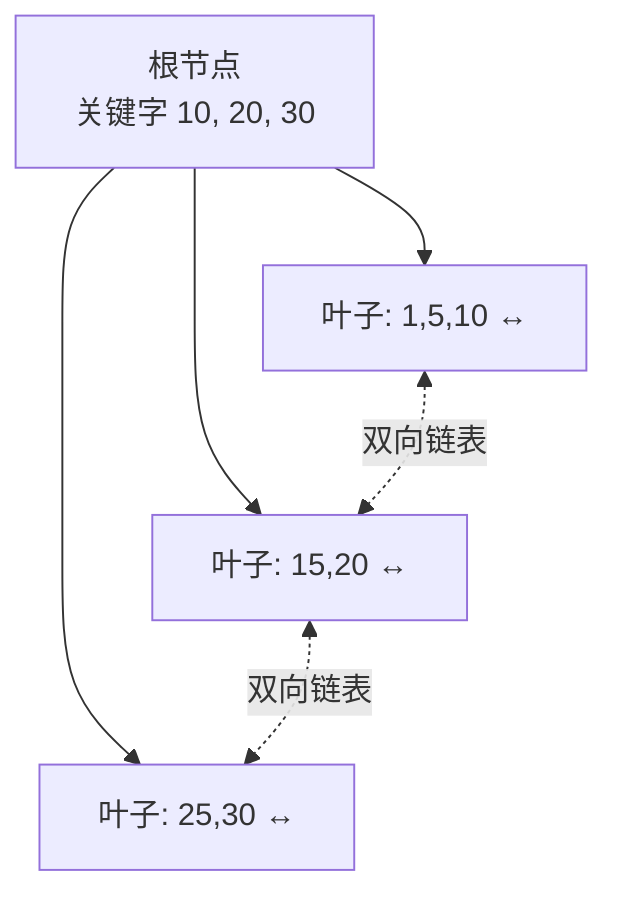
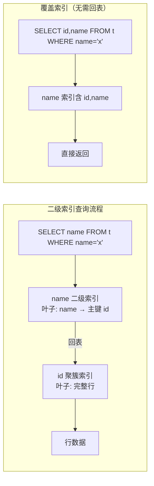
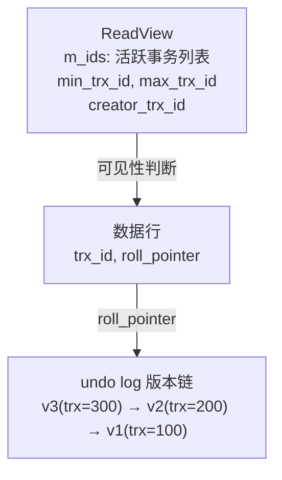
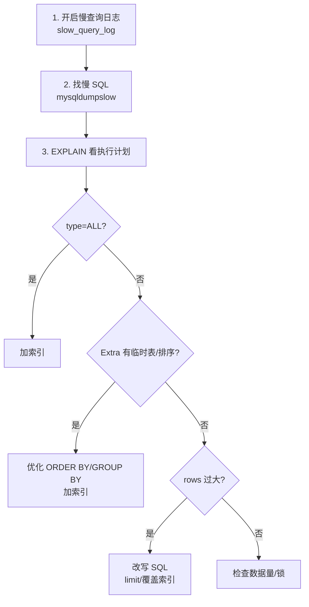

# M4 MySQL 知识点

> 模块：M4 MySQL ｜ 对应课表 Week 1-2
> 深度定位：面试能讲清 ｜ 来源：权威文档/书籍/博客
> 高频题：10 道

---

## 0. 速查索引

| # | 高频题 | 对应章节 | 学时 |
|---|---|---|---|
| 1 | 索引结构（B+Tree vs B-Tree vs Hash） | §1.1 | Week1 Day2 |
| 2 | 聚簇索引 vs 二级索引 vs 覆盖索引 | §1.2 | Week1 Day2 |
| 3 | 最左前缀法则 | §1.3 | Week1 Day2 |
| 4 | 事务 ACID + 隔离级别 | §2.1 | Week1 Day4 |
| 5 | MVCC 实现原理 | §2.2 | Week1 Day4 |
| 6 | 行锁/间隙锁/临键锁 + 加锁规则 | §2.3 | Week2 Day3 |
| 7 | explain 各字段含义 | §3.1 | Week2 Day4 |
| 8 | 分库分表策略 | §3.2 | Week2 |
| 9 | 慢 SQL 优化流程 | §3.3 | Week2 Day4 |
| 10 | 大表 DDL 怎么做 | §3.4 | Week2 |

---

## 1. 索引

### 1.1 索引结构（B+Tree vs B-Tree vs Hash）

**定义**：索引是提升查询速度的数据结构。InnoDB 默认用 B+Tree，Memory 引擎支持 Hash。

**三种结构对比**：

| 维度 | B-Tree | B+Tree | Hash |
|---|---|---|---|
| 节点存数据 | 所有节点都存数据 | 非叶子只存索引，叶子存数据 | 哈希表 |
| 叶子链表 | 无 | 双向链表（范围查询高效） | 不支持范围 |
| 查询复杂度 | O(log n) | O(log n)，但更稳定（数据都在叶子） | O(1) |
| 范围查询 | 慢（回溯） | 快（叶子链表遍历） | 不支持 |
| MySQL 使用 | 不用 | InnoDB/MyISAM | Memory/自适应哈希 |

**B+Tree 结构**（InnoDB）：

**关键点**：
- InnoDB B+Tree 通常 3-4 层，能存千万级数据（每页 16KB，非叶子节点可存上千个指针）。
- **自适应哈希（AHI）**：InnoDB 对热点页自动建 Hash 索引，无需手动。
- B+Tree 的叶子链表使范围查询（`WHERE id BETWEEN 10 AND 20`）只需定位起点后顺序遍历。

> 💡 **面试话术**：「MySQL InnoDB 用 B+Tree。B+Tree 与 B-Tree 的区别是：B-Tree 所有节点都存数据，B+Tree 只有叶子存数据，非叶子只存索引，且叶子之间有双向链表。这样范围查询快——定位起点后顺着链表走就行。B+Tree 通常 3-4 层就能存千万级数据，因为非叶子节点不存数据，一页能放上千个指针。Hash 索引 O(1) 但不支持范围查询，InnoDB 有自适应哈希对热点页自动建 Hash。」

**常见追问**：
- Q: 为什么 MySQL 不用红黑树/AVL 树？ → 红黑树二叉，层数太深（千万数据 20+ 层），磁盘 IO 多；B+Tree 多路，3-4 层即可。
- Q: B+Tree 一个节点多大？ → InnoDB 默认页 16KB，可调 `innodb_page_size`。
- Q: 为什么叶子节点用双向链表而不是单向？ → 支持逆序扫描（ORDER BY DESC）。

**来源**：[MySQL 8.0 Reference — InnoDB Indexes](https://dev.mysql.com/doc/refman/8.0/en/innodb-index-types.html)；《高性能MySQL》第 4 版 第 7 章；[B+Tree 维基](https://en.wikipedia.org/wiki/B%2B_tree)

### 1.2 聚簇索引 vs 二级索引 vs 覆盖索引

**定义**：

| 类型 | 定义 | 叶子存什么 |
|---|---|---|
| 聚簇索引 | 数据行和索引在一起，按主键组织 | 完整行数据 |
| 二级索引（辅助索引） | 非主键索引，叶子存主键值 | 主键值 |
| 覆盖索引 | 查询字段全在索引中，无需回表 | 索引列 |

**关键点**：
- **InnoDB 主键索引就是聚簇索引**，一张表只有一个。MyISAM 没有聚簇索引，数据和索引分离。
- **二级索引需要回表**：先查二级索引拿到主键，再到聚簇索引查完整行。两次 B+Tree 查找。
- **覆盖索引避免回表**：`SELECT id, name FROM t WHERE name='x'`，name 索引含 id 和 name，直接返回，不需要回表。
- `EXPLAIN` 中 Extra 显示 `Using index` = 覆盖索引。

> 💡 **面试话术**：「InnoDB 的主键索引是聚簇索引，数据和索引在一起，按主键组织，一张表只有一个。非主键索引是二级索引，叶子节点存的是主键值，查到后要回表——再到聚簇索引查完整行。覆盖索引是查询字段全在索引里，不需要回表，EXPLAIN 显示 Using index。优化慢查询常用覆盖索引减少回表。」

**常见追问**：
- Q: 为什么二级索引存主键而不存行地址？ → 主键不变，行移动（页分裂）时二级索引不用改；存地址则行移动要改所有索引。
- Q: 没有主键怎么办？ → InnoDB 选第一个非空唯一索引，没有就生成隐藏的 6 字节 ROW_ID。
- Q: 联合索引 (a,b,c) 的叶子存什么？ → a,b,c 的值 + 主键。

**来源**：[MySQL — Clustered Index](https://dev.mysql.com/doc/refman/8.0/en/innodb-index-types.html)；《高性能MySQL》第 4 版 第 7 章

### 1.3 最左前缀法则

**定义**：联合索引 (a,b,c) 的匹配从最左列开始，遇到范围查询停止后续列匹配。

**匹配规则**：

| 查询条件 | 是否走索引 | 说明 |
|---|---|---|
| `a=1 AND b=2 AND c=3` | ✅ 全部 | 完全匹配 |
| `a=1 AND b=2` | ✅ a,b | 部分匹配 |
| `a=1` | ✅ a | 最左列 |
| `b=2 AND c=3` | ❌ | 跳过 a |
| `a=1 AND c=3` | ⚠️ 只用 a | b 跳过，c 不走索引 |
| `a>1 AND b=2` | ⚠️ 只用 a | 范围后停止 |
| `a=1 AND b>2 AND c=3` | ⚠️ a,b | b 范围后 c 不走 |

**关键点**：
- MySQL 优化器会自动调整 WHERE 顺序，`b=2 AND a=1` 等价 `a=1 AND b=2`，都能匹配。
- 范围查询（`>`, `<`, `BETWEEN`, `LIKE 'x%'`）会中断后续列的索引使用。
- `IN` 在 MySQL 5.7+ 被当作多个等值，不中断后续列。

> 💡 **面试话术**：「最左前缀法则是联合索引的匹配规则，从最左列开始，遇到范围查询停止。比如索引 (a,b,c)，a=1 AND b=2 AND c=3 全部走索引；a=1 AND c=3 只走 a，因为跳过 b；a>1 AND b=2 只走 a，范围查询后 b 不走。MySQL 优化器会自动调整 WHERE 顺序，所以 b=2 AND a=1 也能走。IN 在新版 MySQL 当等值处理，不中断。」

**常见追问**：
- Q: LIKE 'abc%' 走索引吗？ → 走，前缀匹配；'%abc' 不走。
- Q: 索引下推（ICP）是什么？ → MySQL 5.6+，联合索引 (a,b)，`a=1 AND b LIKE '%x%'`，存储引擎层先用 b 过滤再回表，减少回表次数。

**来源**：[MySQL — Composite Index](https://dev.mysql.com/doc/refman/8.0/en/multiple-column-indexes.html)；[Index Condition Pushdown](https://dev.mysql.com/doc/refman/8.0/en/index-condition-pushdown.html)

### 1.4 面试话术与追问

> 「MySQL 索引核心是 B+Tree，3-4 层存千万数据。聚簇索引数据和索引在一起，二级索引存主键值要回表，覆盖索引避免回表。联合索引遵守最左前缀法则，范围查询中断后续列。」

- Q: 索引失效场景？ → 函数操作列、隐式类型转换、`%xxx` 前导模糊、OR 连接非索引列、不满足最左前缀。
- Q: 建索引原则？ → 区分度高、常用查询条件、覆盖索引、避免冗余。

### 1.5 进阶阅读

- [MySQL 8.0 InnoDB Indexes](https://dev.mysql.com/doc/refman/8.0/en/innodb-index-types.html)
- [Index Condition Pushdown](https://dev.mysql.com/doc/refman/8.0/en/index-condition-pushdown.html)
- 《高性能MySQL》第 4 版 第 7 章

---

## 2. 事务与锁

### 2.1 事务 ACID + 隔离级别

**ACID**：

| 特性 | 含义 | 实现机制 |
|---|---|---|
| 原子性 Atomicity | 事务要么全做要么全不做 | undo log（回滚日志） |
| 一致性 Consistency | 事务前后数据一致 | 应用层 + 上述三性 |
| 隔离性 Isolation | 并发事务互不干扰 | 锁 + MVCC |
| 持久性 Durability | 提交后永久 | redo log（重做日志） |

**4 种隔离级别**：

| 隔离级别 | 脏读 | 不可重复读 | 幻读 |
|---|---|---|---|
| READ UNCOMMITTED | ✅ 可能 | ✅ 可能 | ✅ 可能 |
| READ COMMITTED（Oracle/PG 默认） | ❌ | ✅ | ✅ |
| REPEATABLE READ（MySQL 默认） | ❌ | ❌ | ❌（MVCC + 间隙锁解决） |
| SERIALIZABLE | ❌ | ❌ | ❌ |

**三种异常**：
- **脏读**：读到其他事务未提交的数据。
- **不可重复读**：同一事务内两次读同一行结果不同（其他事务 UPDATE 提交）。
- **幻读**：同一事务内两次范围查询结果集不同（其他事务 INSERT 提交）。

> 💡 **面试话术**：「ACID 是事务四大特性，原子性靠 undo log，持久性靠 redo log，隔离性靠锁和 MVCC，一致性是前三者加应用层保证。MySQL 默认隔离级别是 REPEATABLE_READ，它用 MVCC 解决不可重复读，用间隙锁解决幻读，这在其他数据库很少见。READ_COMMITTED 是 Oracle/PostgreSQL 默认，会有不可重复读。」

**常见追问**：
- Q: MySQL 的 RR 为什么能解决幻读？ → 快照读用 MVCC，当前读用间隙锁/临键锁。
- Q: 快照读和当前读区别？ → 快照读（普通 SELECT）读 MVCC 视图；当前读（SELECT FOR UPDATE/UPDATE/DELETE）读最新数据并加锁。
- Q: 脏读和不可重复读区别？ → 脏读是未提交数据，不可重复读是已提交数据导致同事务内不一致。

**来源**：[MySQL — Transaction Isolation](https://dev.mysql.com/doc/refman/8.0/en/innodb-transaction-isolation-levels.html)；《高性能MySQL》第 4 版 第 1 章

### 2.2 MVCC 实现原理

**定义**：MVCC（Multi-Version Concurrency Control）多版本并发控制，让读不阻塞写、写不阻塞读。InnoDB 在每行加两个隐藏列：`trx_id`（最后修改的事务 ID）和 `roll_pointer`（指向 undo log 的指针）。

**核心组件**：

**ReadView 规则**（判断版本是否可见）：
1. `trx_id == creator_trx_id`：自己改的，可见。
2. `trx_id < min_trx_id`：事务已提交，可见。
3. `trx_id >= max_trx_id`：事务在 ReadView 创建后开启，不可见。
4. `min_trx_id <= trx_id < max_trx_id`：在 m_ids 中则不可见，不在则可见。
5. 不可见则顺 roll_pointer 找历史版本，重复判断。

**RC vs RR 的 ReadView 差异**：

| 隔离级别 | ReadView 创建时机 |
|---|---|
| READ COMMITTED | 每次 SELECT 都创建新 ReadView |
| REPEATABLE READ | 事务第一次 SELECT 时创建，后续复用 |

**关键点**：
- RC 每次读都看最新已提交数据，所以不可重复读。
- RR 复用 ReadView，所以同一事务内多次读结果一致。

> 💡 **面试话术**：「MVCC 让读写不互斥。每行有 trx_id 和 roll_pointer，指向 undo log 版本链。ReadView 记录当前活跃事务列表，按规则判断版本可见性。RC 和 RR 区别在 ReadView 创建时机：RC 每次 SELECT 都建新 ReadView，所以能看到别人最新提交；RR 事务第一次 SELECT 建一次，后续复用，所以同一事务内读结果一致。这就是 RR 解决不可重复读的原理。」

**常见追问**：
- Q: undo log 版本链会无限增长吗？ → 不会，purge 线程回收无活跃事务引用的旧版本。
- Q: MVCC 解决了幻读吗？ → 快照读解决了，当前读要靠间隙锁。
- Q: 长事务为什么有害？ → 长事务的 ReadView 阻止 purge，undo log 膨胀，回滚段满。

**来源**：[InnoDB MVCC](https://dev.mysql.com/doc/refman/8.0/en/innodb-multi-versioning.html)；《MySQL实战45讲》第 8 讲；[高性能MySQL 第 4 版 第 1 章](https://book.douban.com/subject/35444945/)

### 2.3 行锁/间隙锁/临键锁 + 加锁规则

**三种锁**：

| 锁类型 | 范围 | 目的 |
|---|---|---|
| Record Lock（记录锁） | 单行 | 防止他事务修改/删除该行 |
| Gap Lock（间隙锁） | 索引间隙（开区间） | 防止他事务在间隙 INSERT（防幻读） |
| Next-Key Lock（临键锁） | 记录 + 前间隙（左开右闭） | Record + Gap，默认 |

**加锁规则**（InnoDB RR，原则性总结）：
1. 默认 Next-Key Lock。
2. 等值查询唯一索引，命中记录退化为 Record Lock。
3. 等值查询未命中，退化为 Gap Lock。
4. 范围查询访问到的第一个不满足的值之前的间隙加 Gap Lock。
5. 唯一索引范围查询会退化为部分 Record Lock。

**关键点**：
- 间隙锁只在 RR 隔离级别存在，RC 没有。
- 间隙锁之间不互斥，多个事务可同时持有同一间隙的 Gap Lock。
- 间隙锁的唯一目的是阻止 INSERT。

> 💡 **面试话术**：「InnoDB RR 有三种锁：记录锁锁单行，间隙锁锁索引间隙防 INSERT，临键锁是记录+前间隙。默认 Next-Key Lock，等值唯一索引命中退化为 Record Lock，未命中退化为 Gap Lock。间隙锁只在 RR 有，RC 没有。间隙锁之间不互斥，目的是阻止 INSERT 防幻读。」

**常见追问**：
- Q: 间隙锁导致死锁？ → 事务 A 锁间隙 (10,20)，事务 B 锁间隙 (10,20)，A 想 INSERT 15 等 B，B 想 INSERT 15 等 A，死锁。
- Q: 怎么避免间隙锁？ → 用 RC 隔离级别，或缩小事务。
- Q: SELECT FOR UPDATE 加什么锁？ → 当前读，加 Next-Key Lock（RR）或 Record Lock（RC）。

**来源**：[InnoDB Locking](https://dev.mysql.com/doc/refman/8.0/en/innodb-locking.html)；《MySQL实战45讲》第 21 讲

### 2.4 面试话术与追问

> 「事务 ACID 靠 undo/redo log + 锁 + MVCC。MySQL 默认 RR，用 MVCC 解决不可重复读，间隙锁解决幻读。MVCC 每行有 trx_id 和 roll_pointer 指向 undo 版本链，ReadView 判断可见性。锁分记录锁、间隙锁、临键锁，默认 Next-Key，等值唯一命中退化为记录锁。」

- Q: 死锁排查？ → `SHOW ENGINE INNODB STATUS` 看死锁日志，分析持锁等待图。
- Q: 乐观锁 vs 悲观锁？ → 悲观锁先锁（SELECT FOR UPDATE）；乐观锁用版本号/CAS。

### 2.5 进阶阅读

- [InnoDB Locking](https://dev.mysql.com/doc/refman/8.0/en/innodb-locking.html)
- [InnoDB MVCC](https://dev.mysql.com/doc/refman/8.0/en/innodb-multi-versioning.html)
- 《MySQL实战45讲》第 8/20/21 讲

---

## 3. 优化与运维

### 3.1 explain 各字段含义

**定义**：`EXPLAIN` 显示 SQL 执行计划，是优化慢查询的核心工具。

**关键字段**：

| 字段 | 含义 | 关注点 |
|---|---|---|
| id | 执行顺序 | id 大先执行，相同从上到下 |
| select_type | 查询类型 | SIMPLE/PRIMARY/SUBQUERY/DERIVED |
| table | 表名 | |
| type | 访问类型 | system > const > eq_ref > ref > range > index > ALL，至少 range |
| possible_keys | 可能用的索引 | |
| key | 实际用的索引 | NULL 说明没走索引 |
| key_len | 索引长度 | 判断联合索引用了几列 |
| ref | 索引比较来源 | const/func/列名 |
| rows | 估算扫描行数 | 越少越好 |
| filtered | 过滤比例 | 100 最好 |
| Extra | 额外信息 | Using index/Using temporary/Using filesort |

**type 详解**：
- `const`：主键/唯一索引等值查询，最多 1 行。
- `eq_ref`：JOIN 用主键/唯一索引等值，最多 1 行。
- `ref`：非唯一索引等值。
- `range`：索引范围扫描（BETWEEN, >, IN）。
- `index`：扫描整个索引树。
- `ALL`：全表扫描，最差。

**Extra 关键值**：
- `Using index`：覆盖索引，好。
- `Using where`：用 WHERE 过滤，常见。
- `Using temporary`：用临时表，需优化。
- `Using filesort`：文件排序，需优化（加索引）。

> 💡 **面试话术**：「EXPLAIN 重点看 type、key、rows、Extra。type 表示访问类型，从好到差：const > eq_ref > ref > range > index > ALL，生产至少要到 range。key 是实际用的索引，NULL 说明没走索引要优化。rows 是估算扫描行数。Extra 里 Using index 是覆盖索引最好，Using temporary 和 Using filesort 要优化。」

**常见追问**：
- Q: key_len 怎么算？ → 每列字节数之和，int=4，varchar(n)=2n+2（utf8），可加 NOT NULL 减 1。
- Q: Using filesort 一定慢吗？ → 不一定，数据量小用内存排序；大表才慢。

**来源**：[MySQL — EXPLAIN](https://dev.mysql.com/doc/refman/8.0/en/explain-output.html)；《高性能MySQL》第 4 版 第 8 章

### 3.2 分库分表策略

**垂直 vs 水平**：

| 策略 | 维度 | 场景 |
|---|---|---|
| 垂直分库 | 按业务拆库 | 用户库/订单库/商品库 |
| 垂直分表 | 按字段拆表 | 冷热字段分离 |
| 水平分表 | 按行拆分 | 单表数据量大 |
| 水平分库 | 按行+库拆分 | 单库压力大 |

**分片策略**：
- **范围分片**：id 1-1000 万一张表。热点问题。
- **哈希分片**：id % N。扩容麻烦（一致性哈希）。
- **一致性哈希**：扩容只迁移部分数据。
- **分片键选择**：常用查询条件，避免跨片 JOIN。

**中间件**：
- **ShardingSphere**（Apache 顶级项目）：JDBC / Proxy 两种模式。
- **MyCat**：Proxy 模式，早期流行。
- **Vitess**（YouTube 开源）：云原生。

**关键问题**：
- 跨片 JOIN：冗余字段或应用层组装。
- 分布式事务：XA / TCC / Saga（见 M6）。
- 全局 ID：雪花算法（见 M6/M9）。
- 跨片分页：合并排序，性能差。

> 💡 **面试话术**：「分库分表分垂直和水平。垂直按业务拆库或按字段拆表，水平按行拆分。分片策略有范围分片（热点问题）、哈希分片（扩容麻烦）、一致性哈希。中间件 ShardingSphere 是主流。分库分表带来的问题：跨片 JOIN、分布式事务、全局 ID、跨片分页，都要应用层解决。建议单表超 1000 万或单库超 1TB 再考虑分片，能不分就不分，先优化索引和 SQL。」

**常见追问**：
- Q: 分库分表后怎么分页？ → 各片查 limit，应用层合并排序，深度分页性能差。
- Q: 分片键怎么选？ → 高频查询字段，避免广播查询。
- Q: 什么时候该分库分表？ → 单表数据量影响性能（B+Tree 层数增加）、单库 QPS 到瓶颈。

**来源**：[ShardingSphere](https://shardingsphere.apache.org/)；《高性能MySQL》第 4 版 第 11 章

### 3.3 慢 SQL 优化流程

**优化步骤**：

**常见优化手段**：
1. **加索引**：WHERE/JOIN/ORDER BY 字段。
2. **覆盖索引**：避免回表。
3. **避免 SELECT ***：只查需要的列。
4. **LIMIT 分页优化**：深分页用 `WHERE id > last_id LIMIT 10` 代替 `LIMIT 1000000, 10`。
5. **避免函数操作列**：`WHERE YEAR(create_time)` 不走索引，改 `WHERE create_time >= '2024-01-01'`。
6. **JOIN 优化**：小表驱动大表，被驱动表 JOIN 字段加索引。
7. **UNION ALL 代替 UNION**：避免去重排序。

> 💡 **面试话术**：「慢 SQL 优化流程：先开慢查询日志找慢 SQL，再 EXPLAIN 看执行计划。重点看 type 是否 ALL（全表扫描）、Extra 是否有 Using temporary/filesort、rows 是否过大。优化手段：加索引、用覆盖索引避免回表、深分页用游标 `WHERE id > last_id`、避免函数操作列、小表驱动大表 JOIN、UNION ALL 代替 UNION。」

**常见追问**：
- Q: 深分页为什么慢？ → `LIMIT 1000000, 10` 要扫描 1000010 行再丢弃前 100 万。
- Q: JOIN 顺序重要吗？ → 优化器会选，但小表驱动大表更好，被驱动表 JOIN 字段要加索引。

**来源**：[MySQL — Optimization](https://dev.mysql.com/doc/refman/8.0/en/statement-optimization.html)；《高性能MySQL》第 4 版 第 8 章

### 3.4 大表 DDL 怎么做

**问题**：大表 ALTER TABLE 可能锁表数小时。

**方案**：

| 方案 | 原理 | 优缺点 |
|---|---|---|
| Online DDL（MySQL 5.6+） | INPLACE/COPY 算法 | 加索引不锁表，部分操作仍锁 |
| pt-online-schema-change | 建影子表+触发器同步 | 不锁表，但有延迟 |
| gh-ost（GitHub） | 基于 binlog，无触发器 | 更稳定，GitHub 出品 |

**Online DDL 限制**：
- 加列（默认最后）：INPLACE，不锁。
- 修改列类型：COPY，锁表。
- 加索引：INPLACE，不锁。

**关键点**：
- 生产大表用 pt-osc 或 gh-ost 更安全。
- 低峰期执行。
- 监控主从延迟。

> 💡 **面试话术**：「大表 DDL 不能直接 ALTER，会锁表。MySQL 5.6+ 有 Online DDL，加索引不锁表但部分操作仍锁。生产用 pt-online-schema-change 或 gh-ost，原理是建影子表+触发器或 binlog 同步，不锁表但有延迟。建议低峰期执行并监控主从延迟。」

**常见追问**：
- Q: gh-ost 为什么比 pt-osc 好？ → gh-ost 基于 binlog 不用触发器，不增加主库负担，可控性更强。
- Q: 加列为什么不锁表？ → INPLACE 算法只改元数据，新列默认 NULL，旧行读取时填充。

**来源**：[MySQL — Online DDL](https://dev.mysql.com/doc/refman/8.0/en/innodb-online-ddl.html)；[pt-osc](https://www.percona.com/doc/percona-toolkit/pt-online-schema-change.html)；[gh-ost](https://github.com/github/gh-ost)

### 3.5 面试话术与追问

> 「优化看 EXPLAIN 的 type/key/rows/Extra。分库分表是最后手段，单表千万级再考虑，中间件用 ShardingSphere。慢 SQL 优化从加索引、覆盖索引、游标分页入手。大表 DDL 用 pt-osc 或 gh-ost 避免锁表。」

- Q: 索引建多了有害吗？ → 占空间、写放大（INSERT/UPDATE 要维护索引）。
- Q: 怎么看慢查询？ → `slow_query_log=ON`，`long_query_time=1`，`mysqldumpslow` 分析。

### 3.6 进阶阅读

- [MySQL EXPLAIN Output](https://dev.mysql.com/doc/refman/8.0/en/explain-output.html)
- [ShardingSphere](https://shardingsphere.apache.org/)
- [gh-ost](https://github.com/github/gh-ost)
- 《高性能MySQL》第 4 版 第 8/11 章

---

## 附：参考资料汇总

### 官方文档
- [MySQL 8.0 Reference Manual](https://dev.mysql.com/doc/refman/8.0/en/) — InnoDB/索引/事务/锁/优化
- [InnoDB Index Types](https://dev.mysql.com/doc/refman/8.0/en/innodb-index-types.html)
- [InnoDB Locking](https://dev.mysql.com/doc/refman/8.0/en/innodb-locking.html)
- [InnoDB MVCC](https://dev.mysql.com/doc/refman/8.0/en/innodb-multi-versioning.html)
- [Transaction Isolation](https://dev.mysql.com/doc/refman/8.0/en/innodb-transaction-isolation-levels.html)
- [EXPLAIN Output](https://dev.mysql.com/doc/refman/8.0/en/explain-output.html)
- [Online DDL](https://dev.mysql.com/doc/refman/8.0/en/innodb-online-ddl.html)

### 书籍
- 《高性能MySQL》第 4 版 — 索引/查询优化/运维
- 《MySQL实战45讲》丁奇 — MVCC/锁/优化实战

### 工具
- [ShardingSphere](https://shardingsphere.apache.org/) — 分库分表中间件
- [gh-ost](https://github.com/github/gh-ost) — Online DDL 工具
- [pt-online-schema-change](https://www.percona.com/doc/percona-toolkit/pt-online-schema-change.html)

### 博客
- [B+Tree 维基](https://en.wikipedia.org/wiki/B%2B_tree)
- [Index Condition Pushdown](https://dev.mysql.com/doc/refman/8.0/en/index-condition-pushdown.html)
