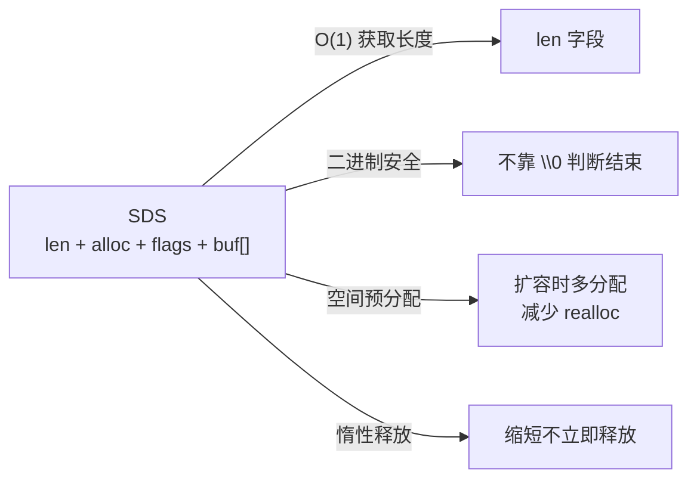
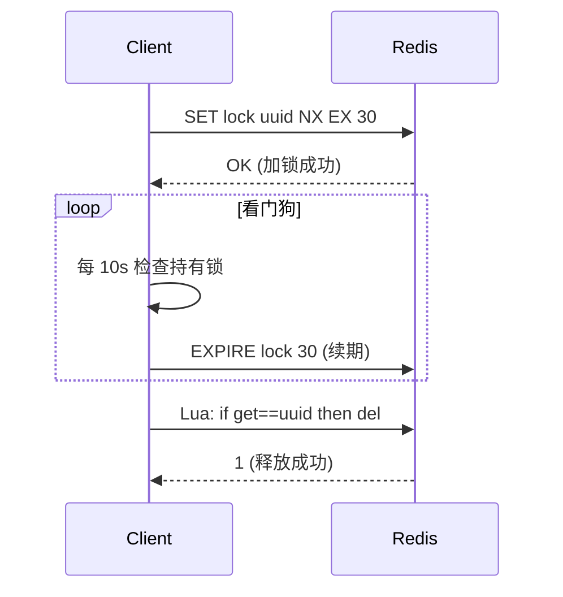
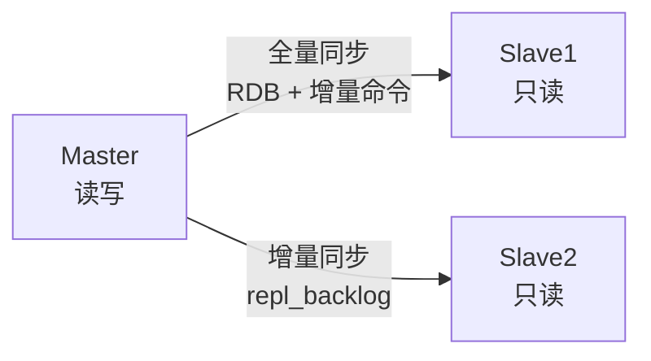
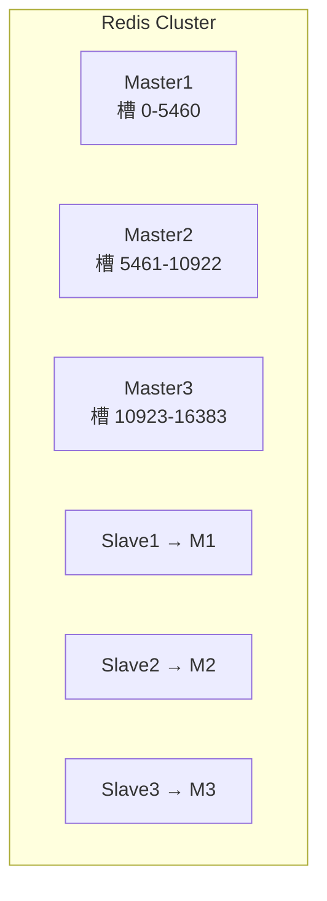

# M5 Redis 知识点

> 模块：M5 Redis ｜ 对应课表 Week 3
> 深度定位：面试能讲清 ｜ 来源：权威文档/书籍/博客
> 高频题：10 道

---

## 0. 速查索引

| # | 高频题 | 对应章节 | 学时 |
|---|---|---|---|
| 1 | 5 大数据结构底层 | §1.1 | Week3 Day1 |
| 2 | 缓存穿透/击穿/雪崩 | §2.1 | Week3 Day2 |
| 3 | 缓存与 DB 双写一致性 | §2.2 | Week3 Day2 |
| 4 | 分布式锁 | §2.3 | Week3 Day3 |
| 5 | 过期策略 + 内存淘汰 | §3.1 | Week3 Day3 |
| 6 | RDB vs AOF 持久化 | §3.2 | Week3 Day1 |
| 7 | 主从同步 + 哨兵 | §3.3 | Week3 Day3 |
| 8 | Cluster 集群 | §3.4 | Week3 Day3 |
| 9 | 跳跃表原理 | §1.2 | Week3 Day1 |
| 10 | Redis 单线程为什么快 | §4.1 | Week3 Day3 |

---

## 1. 数据结构与底层

### 1.1 5 大数据结构底层

**5 大类型与底层编码**：

| 类型 | 底层编码（Redis 7.x） | 转换条件 |
|---|---|---|
| String | int / embstr / raw | 数字用 int；≤44 字节 embstr；否则 raw |
| List | quicklist（ziplist + linkedlist） | 始终 quicklist（7.x 起 listpack 替代 ziplist） |
| Hash | listpack / hashtable | 元素少且小用 listpack，否则 hashtable |
| Set | intset / hashtable | 全整数用 intset，否则 hashtable |
| ZSet | listpack / skiplist + hashtable | 元素少用 listpack，否则跳表+哈希表 |

**SDS（Simple Dynamic String）**：Redis 自己的字符串，替代 C 字符串。

**关键点**：
- **SDS** 比 C 字符串的优势：O(1) 取长度、二进制安全（可存 \0）、防缓冲区溢出、预分配减少内存重分配。
- **ziplist/listpack**：紧凑连续内存，省空间但查找 O(n)，元素多时退化。
- **skiplist**：见 §1.2。
- Redis 7 用 listpack 替代 ziplist，解决连锁更新问题。

> 💡 **面试话术**：「Redis 5 大类型：String/List/Hash/Set/ZSet。String 底层是 SDS，比 C 字符串多了 len 字段，O(1) 取长度、二进制安全、空间预分配。Hash/Set/ZSet 小数据量用紧凑结构（listpack/intset）省内存，大了转 hashtable/skiplist。Redis 7 用 listpack 替代 ziplist，解决连锁更新问题。」

**常见追问**：
- Q: 为什么不用 C 字符串？ → C 字符串取长度 O(n)、不二进制安全、容易缓冲区溢出。
- Q: embstr 和 raw 区别？ → embstr 把 SDS 和对象头放一块连续内存，一次分配；raw 分两次。embstr 只读，修改会转 raw。

**来源**：[Redis Data Types](https://redis.io/docs/data-types/)；《Redis 设计与实现》黄健宏 第 2/7 章；[SDS 源码](https://github.com/redis/redis/blob/unstable/src/sds.c)

### 1.2 跳跃表原理（ZSET 核心）

**定义**：跳跃表（Skip List）是概率性平衡数据结构，通过多级索引实现 O(log n) 查找，是 Redis ZSet 的底层实现之一（元素多时）。

**查找过程**：从最高层开始，比目标大就下降一层，比目标小就向右走。

**关键点**：
- 每个节点随机决定升到几层（概率 1/2 升一层），期望层数 O(log n)。
- 查找/插入/删除都是 O(log n)，与红黑树相当但实现更简单、并发友好。
- Redis 选跳跃表而非红黑树的原因：实现简单、范围查询友好（ZRANGE）、内存可控（可调层数）。
- ZSet 同时用 skiplist + hashtable：skiplist 负责按分数范围查询，hashtable 负责 O(1) 按成员查分数。

> 💡 **面试话术**：「ZSet 底层是 skiplist + hashtable 双结构。skiplist 是多级链表，每层是下层的"快车道"，查找从最高层开始向右走、向下走，O(log n)。Redis 选跳跃表而非红黑树是因为实现简单、范围查询友好、并发改造容易。hashtable 让按 member 查 score 是 O(1)。」

**常见追问**：
- Q: 跳跃表 vs 红黑树？ → 都是 O(log n)，跳跃表实现更简单、范围查询更快、内存略多。
- Q: 为什么 ZSet 要两个结构？ → skiplist 擅长范围查（ZRANGEBYSCORE），hashtable 擅长点查（ZSCORE）。
- Q: 层数怎么决定？ → 随机，每层晋升概率 1/4（Redis 实现）。

**来源**：[William Pugh — Skip Lists](https://www.cs.umd.edu/~pugh/skiplists/skiplists.pdf)；[Redis ZSet 源码 t_zset.c](https://github.com/redis/redis/blob/unstable/src/t_zset.c)；《Redis 设计与实现》第 5 章

### 1.3 面试话术与追问

> 「Redis 数据结构核心是 SDS 和 skiplist。SDS 解决 C 字符串痛点，ZSet 用 skiplist+hashtable 双结构。小数据用 listpack 省内存。」

- Q: Stream 是什么？ → Redis 5 引入的日志型结构，支持消费者组，类 Kafka。
- Q: Bitmap/HyperLogLog/Geo？ → 基于 String/ZSet 的高级结构，位图/基数统计/地理位置。

### 1.4 进阶阅读

- [Redis Data Types Introduction](https://redis.io/docs/data-types/)
- [William Pugh Skip Lists paper](https://www.cs.umd.edu/~pugh/skiplists/skiplists.pdf)
- 《Redis 设计与实现》黄健宏 — 数据结构底层

---

## 2. 缓存问题与分布式锁

### 2.1 缓存穿透/击穿/雪崩

| 问题 | 定义 | 原因 | 解决 |
|---|---|---|---|
| 穿透 | 查不存在的数据，缓存和 DB 都没有 | 恶意攻击/bug | 布隆过滤器/缓存空值 |
| 击穿 | 热点 key 失效瞬间大量请求打到 DB | 单个 key 过期 | 互斥锁/热点 key 永不过期 |
| 雪崩 | 大量 key 同时失效 | 批量过期/Redis 宕机 | 过期时间加随机/集群/限流 |

**解决方案详解**：
- **布隆过滤器**：请求先过布隆过滤器判断 key 可能存在，不存在直接返回。有误判率（说存在可能不存在，说不存在一定不存在）。
- **缓存空值**：DB 查不到也缓存 `null`，设短过期时间。
- **互斥锁**：缓存未命中时只让一个线程查 DB 重建缓存，其他等待。
- **永不过期**：热点 key 不设过期，后台异步更新。
- **过期时间加随机**：`expire = base + random`，避免同时失效。

> 💡 **面试话术」：「缓存三大问题：穿透是查不存在的数据，缓存 DB 都没有，解决用布隆过滤器或缓存空值。击穿是热点 key 失效瞬间大量请求打 DB，解决用互斥锁或热点 key 永不过期。雪崩是大量 key 同时失效，解决给过期时间加随机值、用 Redis 集群、加限流。三者区别：穿透是数据根本不存在，击穿是单 key 失效，雪崩是多 key 同时失效。」

**常见追问**：
- Q: 布隆过滤器能删除吗？ → 标准 Bloom 不能删除（计数布隆可以）。
- Q: 互斥锁怎么实现？ → `SET key value NX EX 10`，拿到的查 DB 重建，其他 sleep 重试。

**来源**：[Redis Best Practices — Caching](https://redis.io/docs/manual/patterns/)；《Redis 开发与运维》付磊 第 11 章

### 2.2 缓存与 DB 双写一致性

**核心策略**：

| 策略 | 流程 | 一致性 | 问题 |
|---|---|---|---|
| Cache Aside（旁路缓存，推荐） | 读：先缓存，miss 查 DB 写缓存；写：先更 DB 再删缓存 | 最终一致 | 删缓存失败仍不一致 |
| Read/Write Through | 缓存层代理读写 DB | 强一致 | 实现复杂 |
| Write Behind | 异步写 DB | 性能高 | 可能丢数据 |

**Cache Aside 的两种写顺序**：

| 顺序 | 问题 |
|---|---|
| 先删缓存再更 DB | 并发下：A 删缓存 → B 读 DB 旧值写缓存 → A 更 DB → 缓存是旧值 |
| 先更 DB 再删缓存（推荐） | 删缓存失败不一致；并发概率低（需读在写之间） |

**延迟双删**：先删缓存 → 更 DB → sleep → 再删缓存。解决"先删缓存再更 DB"的并发问题。

**最终一致方案**：
- 订阅 binlog（Canal）→ 异步删缓存，保证最终一致。
- 设过期时间兜底。

> 💡 **面试话术」：「Cache Aside 是主流：读先查缓存 miss 查 DB 写缓存，写先更 DB 再删缓存。为什么删缓存而不是更新缓存？因为更新可能并发乱序，删是幂等的。先删缓存再更 DB 有并发问题——A 删后 B 读旧值写回。先更 DB 再删缓存更安全，删失败可用延迟双删或订阅 binlog 异步删。最终一致靠过期时间兜底。」

**常见追问**：
- Q: 为什么删缓存而不是更新？ → 避免并发更新乱序；删除幂等；部分场景缓存计算复杂。
- Q: 强一致怎么做？ → 加分布式锁串行化，或用 2PC，但性能差，一般最终一致够用。

**来源**：[Redis — Distributed Locks](https://redis.io/docs/manual/patterns/distributed-locks/)；[Canal GitHub](https://github.com/alibaba/canal)

### 2.3 分布式锁（SETNX + Redisson + RedLock）

**演进**：

| 方案 | 实现 | 问题 |
|---|---|---|
| SETNX + EXPIRE | `SETNX key` + `EXPIRE key 10` | 非原子，SETNX 后崩溃永久锁 |
| SET NX EX | `SET key val NX EX 10` | 原子加锁，但业务超时锁自动释放，被他人抢 |
| SET NX EX + 唯一值 + Lua 校验 | 加锁带唯一 ID，释放用 Lua 校验 ID | 解决误删，但主从切换丢锁 |
| Redisson | 看门狗自动续期 + Lua | 生产可用，单点故障 |
| RedLock | 多实例多数派 | 争议大，Martin Kleppmann 批评 |

**Redisson 原理**：
- 加锁用 Lua 脚本（原子）。
- **看门狗**：默认 30s 过期，每 10s 检查并续期，业务不超时锁不丢。
- 可重入：Hash 结构存 thread_id 和重入次数。
- 公平锁/读写锁/信号量都支持。

**RedLock**（争议）：
- 5 个独立 Redis 实例，向多数（3 个）加锁成功才算成功。
- Martin Kleppmann 批评：依赖时钟、GC pause 导致锁失效。
- antirez（Redis 作者）反驳但社区仍有争议。

> 💡 **面试话术」：「分布式锁演进：SETNX+EXPIRE 非原子 → SET NX EX 原子但业务超时锁误释放 → 加唯一 ID 释放用 Lua 校验 → Redisson 看门狗自动续期。生产用 Redisson，看门狗默认 30s 过期每 10s 续期，可重入用 Hash 存线程 ID。RedLock 多实例多数派有争议，Martin Kleppmann 批评它依赖时钟和 GC pause。一般 Redisson 单实例够用，强一致用 ZK。」

**常见追问**：
- Q: Redisson 看门狗原理？ → 后台线程定时检查锁是否还持有，是就续期。
- Q: 主从切换丢锁怎么办？ → RedLock 或用 ZK；或业务层幂等兜底。
- Q: ZK 分布式锁 vs Redis？ → ZK 强一致（CP），临时顺序节点，性能低；Redis AP 性能高但有边界情况。

**来源**：[Redis — Distributed Locks](https://redis.io/docs/manual/patterns/distributed-locks/)；[Redisson GitHub](https://github.com/redisson/redisson)；[Martin Kleppmann — How to do distributed locking](https://martin.kleppmann.com/2016/02/08/how-to-do-distributed-locking.html)

### 2.4 面试话术与追问

> 「缓存三大问题用布隆过滤器/互斥锁/随机过期解决。Cache Aside 双写一致性先更 DB 再删缓存，可订阅 binlog 异步删。分布式锁生产用 Redisson 看门狗自动续期，强一致用 ZK。」

- Q: 缓存预热怎么做？ → 启动时加载热点数据；统计访问日志挑热点。

### 2.5 进阶阅读

- [Redis Distributed Locks](https://redis.io/docs/manual/patterns/distributed-locks/)
- [Martin Kleppmann — How to do distributed locking](https://martin.kleppmann.com/2016/02/08/how-to-do-distributed-locking.html)
- [Redisson 文档](https://github.com/redisson/redisson/wiki)

---

## 3. 持久化与高可用

### 3.1 过期策略 + 内存淘汰

**过期策略**（key 怎么被删）：

| 策略 | 机制 | Redis 用 |
|---|---|---|
| 定时过期 | 每个 key 设定时器，到期删 | ❌ 太耗 CPU |
| 惰性过期 | 访问时检查过期才删 | ✅ 用 |
| 定期过期 | 每隔一段时间随机抽样删过期 | ✅ 用 |

Redis 用 **惰性 + 定期** 组合：访问时检查 + 每 100ms 随机抽样删。

**8 种内存淘汰策略**（maxmemory 满时）：

| 策略 | 范围 | 规则 |
|---|---|---|
| noeviction | — | 不淘汰，写报错（默认） |
| allkeys-lru | 所有 key | 淘汰最久未用 |
| allkeys-lfu | 所有 key | 淘汰最少使用 |
| allkeys-random | 所有 key | 随机 |
| volatile-lru | 设过期的 key | LRU |
| volatile-lfu | 设过期的 key | LFU |
| volatile-random | 设过期的 key | 随机 |
| volatile-ttl | 设过期的 key | 快过期的先淘汰 |

> 💡 **面试话术」：「Redis 过期是惰性+定期组合：访问时检查过期才删，加上每 100ms 随机抽样删过期 key。内存淘汰 8 种，默认 noeviction 写报错。常用 allkeys-lru 淘汰最久未用。Redis 4 加了 LFU（最少使用），比 LRU 更适合热点数据场景。缓存场景用 allkeys-lru/lfu，持久化场景用 volatile-lru 只淘汰有过期时间的。」

**常见追问**：
- Q: LRU 怎么实现？ → Redis 用近似 LRU，随机采样 5 个（可调 maxmemory-samples）淘汰最久未用，比真 LRU 省内存。
- Q: LFU 比 LRU 好在哪？ → LFU 按访问频率，LRU 按访问时间；LFU 不会因偶尔访问淘汰热点。

**来源**：[Redis — Key Eviction](https://redis.io/docs/reference/eviction/)；《Redis 设计与实现》第 9 章

### 3.2 RDB vs AOF 持久化

| 维度 | RDB | AOF |
|---|---|---|
| 原理 | 全量快照二进制文件 | 追加写命令日志 |
| 触发 | 定时/手动 BGSAVE | always/everysec/no |
| 恢复速度 | 快（直接加载） | 慢（重放命令） |
| 数据安全 | 可能丢最后一次快照后数据 | everysec 最多丢 1s |
| 文件大小 | 小（压缩） | 大（重写可缩小） |
| 性能影响 | BGSAVE fork 子进程，影响小 | 追加写，影响略大 |

**AOF 重写**：AOF 文件越来越大，重写把多条命令合并为等价的最小命令集。

**混合持久化**（Redis 4+）：AOF 重写时把当前内存快照以 RDB 格式写入 AOF 文件开头，后续增量命令追加。兼顾恢复速度和数据安全。

> 💡 **面试话术」：「RDB 是全量快照，恢复快但可能丢数据；AOF 是命令日志，数据安全但恢复慢。Redis 4 引入混合持久化——AOF 重写时开头写 RDB 快照，后续追加增量命令，兼顾速度和安全。生产推荐 everysec + 混合持久化。」

**常见追问**：
- Q: BGSAVE 怎么不影响主进程？ → fork 子进程 + COW（写时复制），子进程写 RDB，主进程继续服务。
- Q: AOF everysec 怎么实现？ → 写命令先入缓冲，每秒 fsync 一次。

**来源**：[Redis — Persistence](https://redis.io/docs/management/persistence/)；《Redis 设计与实现》第 10/11 章

### 3.3 主从同步 + 哨兵

**主从同步**：

- **全量同步**：Slave 首次连接，Master 执行 BGSAVE 发 RDB，再发增量命令。
- **增量同步**：基于 repl_backlog（环形缓冲区），Slave 断线重连用 offset 找差异。
- 主从是**异步复制**，有延迟，可能丢数据。

**哨兵（Sentinel）**：
- 监控 Master/Slave 健康。
- Master 宕机自动选举新 Master（Raft）。
- 通知客户端切换。
- 至少 3 个 Sentinel 节点（奇数，避免脑裂）。

> 💡 **面试话术」：「主从同步分全量和增量。全量是 Slave 首次连接，Master BGSAVE 发 RDB 再发增量命令。增量基于 repl_backlog 环形缓冲区，Slave 断线重连用 offset 找差异。主从异步复制有延迟可能丢数据。哨兵监控主从健康，Master 宕机自动选举新 Master，用 Raft，至少 3 节点避免脑裂。哨兵本身不存数据，只做监控和故障转移。」

**常见追问**：
- Q: 主从延迟怎么排查？ → `INFO replication` 看 offset 差；写多读少延迟大。
- Q: 脑裂问题？ → 旧 Master 还活着被选新 Master，旧 Master 写的数据丢。配置 min-slaves-to-write 缓解。

**来源**：[Redis — Replication](https://redis.io/docs/management/replication/)；[Redis Sentinel](https://redis.io/docs/management/sentinel/)

### 3.4 Cluster 集群

**定义**：Redis Cluster 是去中心化分布式方案，数据分片 + 高可用。

**数据分片**：
- **16384 个槽位**（hash slot），每个 key 通过 `CRC16(key) % 16384` 映射到槽。
- 节点负责一部分槽，最少 3 主 3 从。
- 客户端缓存槽位映射，MOVED 重定向时更新。

**关键点**：
- **为什么 16384 而不是 65536？** → 作者 antirez 回答：心跳包小（16384/8=2KB）、节点数一般不超过 1000、压缩率高。
- **槽位迁移**：在线迁移，逐 key 迁移，迁移中 ASK 重定向。
- **故障转移**：Master 宕机，Slave 被选为新 Master（Gossip 协议）。
- **限制**：不支持跨槽事务/多键操作（除非 hash tag `{tag}` 强制同槽）。

> 💡 **面试话术」：「Redis Cluster 有 16384 个槽，key 通过 CRC16 % 16384 映射。最少 3 主 3 从，每个 Master 负责一部分槽。为什么 16384？作者说心跳包小（2KB）、节点不超过 1000 够用、压缩率高。客户端缓存槽位映射，操作不在本节点返回 MOVED 重定向。故障转移靠 Gossip 选新 Master。限制是不支持跨槽多键操作，可用 hash tag `{tag}` 强制同槽。」

**常见追问**：
- Q: Cluster 和哨兵区别？ → Cluster 数据分片+高可用；哨兵只高可用不分片。
- Q: 为什么至少 3 主 3 从？ → 故障转移需要多数派投票，3 节点才能容忍 1 个故障。

**来源**：[Redis Cluster Specification](https://redis.io/docs/reference/cluster-spec/)；[antirez — Why 16384](https://github.com/redis/redis/issues/2576)

### 3.5 面试话术与追问

> 「持久化 RDB 快/AOF 安全，混合持久化兼顾。过期是惰性+定期，淘汰常用 allkeys-lru。高可用主从+哨兵做故障转移，Cluster 数据分片 16384 槽。」

- Q: Redis 怎么扩容？ → Cluster 加节点，迁移槽位；非 Cluster 用代理（Codis/Twemproxy）。
- Q: 主从和 Cluster 怎么选？ → 数据量小用主从+哨兵；大或要分片用 Cluster。

### 3.6 进阶阅读

- [Redis Persistence](https://redis.io/docs/management/persistence/)
- [Redis Replication](https://redis.io/docs/management/replication/)
- [Redis Cluster Spec](https://redis.io/docs/reference/cluster-spec/)
- [antirez — Why 16384 slots](https://github.com/redis/redis/issues/2576)

---

## 4. 性能与其他

### 4.1 Redis 单线程为什么快

**单线程指**：命令处理是单线程（Redis 6+ 多线程处理网络 IO，但命令执行仍单线程）。

**快的原因**：

1. **纯内存操作**：内存读写纳秒级。
2. **单线程无锁无切换**：避免锁竞争和上下文切换。
3. **IO 多路复用**：epoll 单线程处理大量连接。
4. **高效数据结构**：SDS、skiplist、hash table 都是 O(1)/O(log n)。
5. **避免不必要的锁**：单线程天然无并发问题。

**Redis 6 多线程**：
- 网络 IO（读写 socket）多线程并行。
- 命令执行仍单线程，保证无锁。
- 适合网络 IO 成为瓶颈的场景。

> 💡 **面试话术」：「Redis 单线程指命令执行单线程，6.0 后网络 IO 多线程但命令仍单线程。快的原因：纯内存操作、单线程无锁无切换、epoll IO 多路复用处理大量连接、高效数据结构。单线程不是瓶颈，因为 Redis 是内存操作，CPU 不是瓶颈，瓶颈在网络和内存。」

**常见追问**：
- Q: 单线程怎么利用多核？ → 一台机器跑多实例，每个实例绑一核。
- Q: 哪些命令会阻塞？ → KEYS/SMEMBERS 大集合/Lua 长循环/SORT 大数据。用 SCAN 代替 KEYS。

**来源**：[Redis — IO Multiplexing](https://redis.io/docs/reference/architecture/)；[Redis 6 Multi-threaded I/O](https://redis.io/docs/reference/internets/]；《Redis 设计与实现》第 22 章

### 4.2 面试话术与追问

> 「Redis 快靠纯内存+单线程无锁+epoll+高效结构。6.0 多线程只优化网络 IO，命令仍单线程。」

- Q: Redis 怎么做事务？ → MULTI/EXEC/DISCARD/WATCH，本质是命令打包，不支持回滚。
- Q: Pipeline 和事务区别？ → Pipeline 是批量发命令减少 RTT，不保证原子；MULTI/EXEC 保证顺序执行但不回滚。

### 4.3 进阶阅读

- [Redis Architecture](https://redis.io/docs/reference/architecture/)
- [Redis 6 Multi-threaded I/O](https://redis.io/docs/reference/internals/)
- 《Redis 设计与实现》第 22 章

---

## 附：参考资料汇总

### 官方文档
- [Redis Documentation](https://redis.io/docs/) — 数据类型/持久化/集群
- [Redis Data Types](https://redis.io/docs/data-types/)
- [Redis Persistence](https://redis.io/docs/management/persistence/)
- [Redis Replication](https://redis.io/docs/management/replication/)
- [Redis Sentinel](https://redis.io/docs/management/sentinel/)
- [Redis Cluster Specification](https://redis.io/docs/reference/cluster-spec/)
- [Redis Key Eviction](https://redis.io/docs/reference/eviction/)
- [Redis Distributed Locks](https://redis.io/docs/manual/patterns/distributed-locks/)

### 书籍
- 《Redis 设计与实现》黄健宏 — 数据结构/持久化/集群源码
- 《Redis 开发与运维》付磊 — 实战与运维

### 论文
- [William Pugh — Skip Lists](https://www.cs.umd.edu/~pugh/skiplists/skiplists.pdf) — 跳跃表原始论文
- [Martin Kleppmann — How to do distributed locking](https://martin.kleppmann.com/2016/02/08/how-to-do-distributed-locking.html) — RedLock 批评

### 源码
- [Redis GitHub](https://github.com/redis/redis) — sds.c / t_zset.c / cluster.c
- [antirez — Why 16384 slots](https://github.com/redis/redis/issues/2576)

### 工具
- [Redisson](https://github.com/redisson/redisson) — 分布式锁/限流
- [Canal](https://github.com/alibaba/canal) — binlog 订阅做缓存同步
