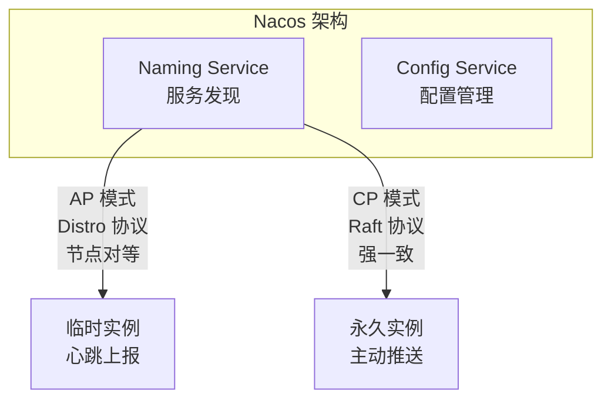
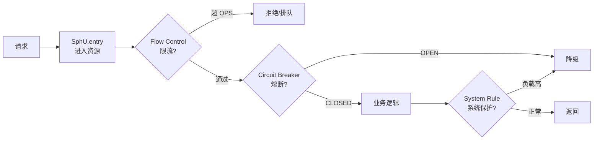
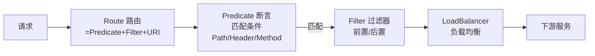
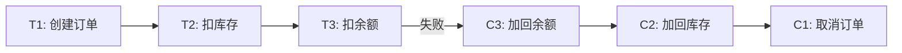
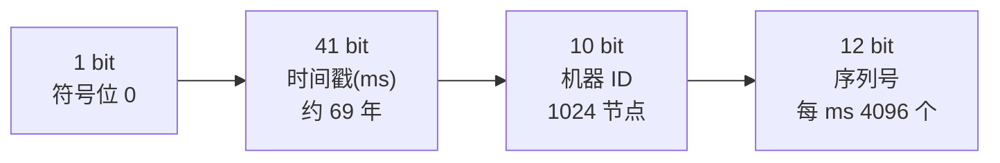

# M6 微服务 + 分布式知识点

> 模块：M6 微服务 + 分布式 ｜ 对应课表 Week 4
> 深度定位：面试能讲清 ｜ 来源：权威文档/书籍/博客
> 高频题：10 道

---

## 0. 速查索引

| # | 高频题 | 对应章节 | 学时 |
|---|---|---|---|
| 1 | CAP 定理 + BASE | §1.1 | Week4 Day3 |
| 2 | Nacos 注册中心（CP+AP 切换） | §1.2 | Week4 Day1 |
| 3 | Sentinel 限流 + 熔断降级 | §2.1 | Week4 Day4 |
| 4 | Dubbo SPI vs Java SPI | §2.2 | Week4 Day3 |
| 5 | 分布式事务：TCC vs AT vs Saga | §3.1 | Week4 Day4 |
| 6 | 网关 Gateway 路由/过滤器/断言 | §2.3 | Week4 Day2 |
| 7 | 分布式锁（Redis vs ZK） | §3.2 | Week4 Day5 |
| 8 | 雪花算法 + 时钟回拨 | §3.3 | Week4 Day5 |
| 9 | 配置中心（Nacos Config / Apollo） | §1.3 | Week4 Day1 |
| 10 | 服务间调用重试 + 幂等 | §3.4 | Week4 Day5 |

---

## 1. 微服务基础与注册中心

### 1.1 CAP 定理 + BASE

**CAP 定理**：分布式系统三选二。

| 属性 | 含义 |
|---|---|
| Consistency 一致性 | 所有节点同一时刻看到相同数据 |
| Availability 可用性 | 每个请求都能得到响应（不保证最新） |
| Partition tolerance 分区容错 | 网络分区时系统仍能运作 |

**P 在分布式下不可避免**（网络一定可能分区），所以实际是 **CP vs AP** 二选一：

| 选择 | 代表 | 场景 |
|---|---|---|
| CP | ZK / etcd / Consul | 强一致，注册中心、配置中心 |
| AP | Eureka / Nacos（AP 模式） | 高可用，注册中心 |

**BASE 理论**（CAP 的工程实践）：

| 字母 | 含义 |
|---|---|
| BA Basically Available | 基本可用，允许部分功能降级 |
| S Soft State | 软状态，允许中间状态 |
| E Eventually Consistent | 最终一致性 |

> 💡 **面试话术**：「CAP 定理说一致性、可用性、分区容错三选二。P 在分布式下不可避免，所以实际是 CP 还是 AP。ZK 是 CP，注册中心选 leader 时不可用；Eureka 是 AP，节点对等随时可用。Nacos 默认 AP 也可切 CP。BASE 是 CAP 的工程实践：基本可用、软状态、最终一致。互联网场景多用 AP + 最终一致，强一致用 CP 但要容忍短暂不可用。」

**常见追问**：
- Q: 为什么注册中心多用 AP？ → 注册中心容忍数据短暂不一致，但不能不可用，否则服务发现挂导致雪崩。
- Q: ZK 做 CP 怎么实现？ → ZAB 协议，写需要半数以上 ACK，leader 选举期间不可写。

**来源**：[Brewer's CAP Theorem](https://en.wikipedia.org/wiki/CAP_theorem)；[BASE — Dan Pritchett](https://queue.acm.org/detail.cfm?id=1394128)

### 1.2 Nacos 注册中心（CP+AP 切换）

**定义**：Nacos 是阿里开源的注册中心 + 配置中心，支持 AP 和 CP 两种模式切换。



**AP vs CP 模式**：

| 维度 | AP（默认） | CP |
|---|---|---|
| 协议 | Distro | Raft |
| 实例类型 | 临时（心跳维持） | 永久（需主动删除） |
| 一致性 | 最终一致 | 强一致 |
| 可用性 | 节点对等，任一可读 | leader 写，选举期不可用 |
| 适用 | 微服务注册 | 数据库/K8s 节点 |

**关键点**：
- 微服务场景默认 AP：服务实例心跳上报，Nacos 不主动探活，心跳停则剔除。
- CP 用于需要强一致的注册（如 K8s Service）。
- Nacos 2.x 用 gRPC 长连接替代 HTTP 心跳，性能更好。

> 💡 **面试话术**：「Nacos 支持注册中心 + 配置中心，AP/CP 双模式。默认 AP 用 Distro 协议节点对等，临时实例心跳维持，适合微服务。CP 用 Raft 强一致，适合永久实例如数据库。Nacos 2 改用 gRPC 长连接性能更好。注册中心选 AP 是因为可用性优先，数据短暂不一致可以接受，但不能挂。」

**常见追问**：
- Q: Nacos 和 Eureka 区别？ → Nacos 支持配置中心和 CP/AP 切换；Eureka 只 AP 且已停止维护。
- Q: Nacos 集群怎么部署？ → 至少 3 节点，配置一致，依赖 MySQL 持久化配置。

**来源**：[Nacos 官方](https://nacos.io/zh-cn/docs/what-is-nacos.html)；[Nacos 架构](https://nacos.io/zh-cn/docs/architecture.html)

### 1.3 配置中心（Nacos Config / Apollo）

| 维度 | Nacos Config | Apollo |
|---|---|---|
| 推送方式 | 长轮询 + 推 | HTTP 长轮询 |
| 配置版本 | 有历史 | 有历史 + 灰度发布 |
| 权限 | RBAC | 细粒度权限 |
| 多环境 | namespace + group | env + cluster + namespace |
| 生态 | Spring Cloud Alibaba | 独立，跨语言 |

**关键点**：
- **动态刷新**：Nacos Config 配合 `@RefreshScope` 实现配置热更新。
- **灰度发布**：Apollo 原生支持按 IP/标签灰度。
- **namespace**：环境隔离（dev/test/prod）；**group**：业务分组；**dataId**：具体配置。

> 💡 **面试话术**：「配置中心主流 Nacos 和 Apollo。Nacos 集成在 Spring Cloud Alibaba，配置用 namespace/group/dataId 三层，配合 @RefreshScope 热更新。Apollo 是携程开源，原生支持灰度发布和细粒度权限，跨语言支持好。选 Nacos 是因为注册中心+配置中心一体，Apollo 在灰度和权限上更强。」

**常见追问**：
- Q: 配置中心怎么实现动态刷新？ → Nacos 长轮询监听变更 + @RefreshScope 重建 Bean。
- Q: 配置回滚？ → Apollo/Nacos 都有历史版本可一键回滚。

**来源**：[Nacos Config](https://nacos.io/zh-cn/docs/quick-start-spring-cloud.html)；[Apollo 官方](https://www.apolloconfig.com/)

### 1.4 面试话术与追问 + 进阶阅读

> 「CAP 是基础，注册中心选 AP（Nacos/Eureka），配置中心选 CP。Nacos 注册+配置一体，Apollo 灰度更强。」

- [Nacos 官方](https://nacos.io/zh-cn/)
- [Apollo GitHub](https://github.com/apolloconfig/apollo)
- [CAP Theorem](https://en.wikipedia.org/wiki/CAP_theorem)

---

## 2. 服务治理

### 2.1 Sentinel 限流 + 熔断降级

**定义**：Sentinel 是阿里开源的流量治理组件，支持限流、熔断降级、系统自适应保护。



**限流模式**：
- **QPS 限流**：超过阈值直接拒绝。
- **并发线程数限流**：超过线程数拒绝（更准确反映业务压力）。
- **流控效果**：直接拒绝 / Warm Up（预热）/ 排队等待（匀速）。

**熔断策略**：
- **慢调用比例**：RT 超阈值且比例超阈值触发。
- **异常比例/异常数**：异常率/数超阈值触发。
- 熔断状态：CLOSED → OPEN（熔断）→ HALF_OPEN（探测）→ CLOSED/OPEN。

**Sentinel vs Hystrix**：

| 维度 | Sentinel | Hystrix |
|---|---|---|
| 限流 | 有（QPS/线程数） | 无 |
| 熔断 | 慢调用/异常比例 | 异常比例 |
| 降级 | 有 | 有 |
| 控制台 | 实时监控+动态规则 | Dashboard 已停止维护 |
| 模型 | 滑动窗口 | 断路器 |

> 💡 **面试话术**：「Sentinel 是阿里流量治理组件，支持限流、熔断降级、系统保护。限流有 QPS 和并发线程数两种模式，流控效果支持直接拒绝、Warm Up 预热、排队等待匀速。熔断有慢调用比例和异常比例/数两种策略，状态机 CLOSED/OPEN/HALF_OPEN。和 Hystrix 比，Sentinel 有限流、控制台更友好、滑动窗口模型，Hystrix 已停止维护。」

**常见追问**：
- Q: 限流算法有哪些？ → 计数器（固定窗口）、滑动窗口、漏桶（匀速）、令牌桶（允许突发）。
- Q: Sentinel 滑动窗口怎么实现？ → LeapArray，按时间分桶，滑动统计。

**来源**：[Sentinel 官方](https://sentinelguard.io/zh-cn/docs/introduction.html)；[Sentinel GitHub](https://github.com/alibaba/Sentinel)

### 2.2 Dubbo SPI 机制 vs Java SPI

**Java SPI**：`ServiceLoader` 加载 `META-INF/services/` 下接口实现，一次性加载所有实现。

**Dubbo SPI**（增强版）：

| 特性 | Java SPI | Dubbo SPI |
|---|---|---|
| 加载方式 | 一次性全加载 | 按需加载（key-value） |
| IOC 注入 | 不支持 | 支持 setter 注入依赖 |
| AOP 包装 | 不支持 | 支持 Wrapper 自动包装 |
| 自适应 | 不支持 | @Adaptive 按参数动态选实现 |

**Dubbo SPI 配置**：`META-INF/dubbo/接口全名`，内容 `key=实现类全名`。

```properties
# META-INF/dubbo/org.apache.dubbo.rpc.Protocol
dubbo=org.apache.dubbo.rpc.protocol.dubbo.DubboProtocol
rest=org.apache.dubbo.rpc.protocol.rest.RestProtocol
```

**关键点**：
- Dubbo SPI 用 `ExtensionLoader.getExtensionLoader(Protocol.class).getExtension("dubbo")` 按 key 取实现。
- **IOC**：实现类的 setter 方法会被自动注入依赖（其他扩展点）。
- **AOP Wrapper**：实现类有单参构造器（接口类型）的会被识别为 Wrapper，自动包装。
- **@Adaptive**：运行期按 URL 参数动态选实现（如 `Protocol$Adaptive` 按 `protocol` 参数）。

> 💡 **面试话术**：「Dubbo SPI 是 Java SPI 的增强版。Java SPI 一次性加载所有实现，Dubbo SPI 按 key-value 按需加载，更省资源。Dubbo SPI 还支持 IOC（setter 注入依赖）、AOP（Wrapper 自动包装）、@Adaptive（运行期按 URL 参数动态选实现）。Dubbo 的扩展点如 Protocol/LoadBalance/Serialization 都用 SPI，这是 Dubbo 灵活性的基础。」

**常见追问**：
- Q: @Adaptive 怎么工作？ → 运行期生成代理类，从 URL 取参数 key，再用 ExtensionLoader 取对应实现。
- Q: Dubbo SPI 为什么不用 Spring IOC？ → Dubbo 设计成无框架依赖，SPI 是轻量级自研。

**来源**：[Dubbo SPI 文档](https://dubbo.apache.org/zh-cn/docs/concepts/extensibility/)；[Dubbo GitHub](https://github.com/apache/dubbo)

### 2.3 网关 Gateway 路由/过滤器/断言

**定义**：Spring Cloud Gateway 是基于 Spring WebFlux + Reactor 的 API 网关，替代 Zuul。



**三要素**：

| 要素 | 作用 | 示例 |
|---|---|---|
| Route 路由 | 完整转发规则 | id + uri + predicates + filters |
| Predicate 断言 | 匹配条件 | Path=/api/**, Header=X-Request-Id, Method=GET |
| Filter 过滤器 | 请求/响应处理 | AddRequestHeader, RewritePath, RateLimiter |

**配置示例**：
```yaml
spring:
  cloud:
    gateway:
      routes:
        - id: user-service
          uri: lb://user-service
          predicates:
            - Path=/api/user/**
          filters:
            - StripPrefix=1
            - AddRequestHeader=X-Gateway, true
```

**关键点**：
- **Gateway vs Nginx**：Gateway 是应用层网关，集成 Spring 生态、服务发现、限流；Nginx 是高性能反向代理，做负载均衡和静态资源。
- **Filter 类型**：GlobalFilter（全局）vs GatewayFilter（路由级）。
- **限流**：内置 RequestRateLimiter（基于 Redis + Lua 令牌桶）。

> 💡 **面试话术**：「Spring Cloud Gateway 三要素：Route 路由是完整规则，Predicate 断言匹配条件（Path/Header/Method），Filter 过滤器做请求响应处理。底层是 WebFlux + Reactor 异步非阻塞，性能比 Zuul 1.x 好。和 Nginx 比，Gateway 集成 Spring 生态、服务发现、Sentinel 限流；Nginx 做反向代理和负载均衡。Filter 分 GatewayFilter 路由级和 GlobalFilter 全局。」

**常见追问**：
- Q: Gateway 为什么用 WebFlux 不用 WebMVC？ → WebMVC 同步阻塞，WebFlux 异步非阻塞，网关高并发场景更适合。
- Q: Gateway 怎么做限流？ → 内置 RequestRateLimiter，基于 Redis 令牌桶。

**来源**：[Spring Cloud Gateway](https://docs.spring.io/spring-cloud-gateway/docs/current/reference/html/)；[Gateway GitHub](https://github.com/spring-cloud/spring-cloud-gateway)

### 2.4 面试话术与进阶阅读

> 「Sentinel 限流+熔断+降级，滑动窗口模型。Dubbo SPI 是 Java SPI 增强，支持 IOC/AOP/自适应。Gateway 三要素路由+断言+过滤器，WebFlux 异步非阻塞。」

- [Sentinel 文档](https://sentinelguard.io/zh-cn/)
- [Dubbo SPI](https://dubbo.apache.org/zh-cn/docs/concepts/extensibility/)
- [Spring Cloud Gateway](https://docs.spring.io/spring-cloud-gateway/docs/current/reference/html/)

---

## 3. 分布式事务与工具

### 3.1 分布式事务：TCC vs AT vs Saga

**CAP 下分布式事务的取舍**：强一致用 2PC/3PC（性能差），最终一致用 TCC/Saga/本地消息表。

| 方案 | 模式 | 一致性 | 复杂度 | 适用 |
|---|---|---|---|---|
| 2PC/XA | 强一致 | 强 | 高（锁） | 数据库层 |
| TCC | Try-Confirm-Cancel | 最终 | 高（业务侵入） | 资金交易 |
| AT（Seata） | 自动生成补偿 | 最终 | 低（无侵入） | 通用 |
| Saga | 长事务分解+补偿 | 最终 | 中 | 长流程 |
| 本地消息表 | 消息+本地事务 | 最终 | 低 | 异步场景 |

**TCC 三阶段**：
- **Try**：预留资源（如冻结余额）。
- **Confirm**：确认提交（扣减冻结）。
- **Cancel**：取消（解冻）。
- 业务侵入大，需为每个操作写 Try/Confirm/Cancel 三套。

**Seata AT 模式**：
- 自动生成 undo_log 记录变更前后快照。
- 全局事务失败时自动反向 SQL 回滚。
- 业务无侵入，但需每库建 undo_log 表。

**Saga**：
- 长事务分解为多个本地事务，每个有对应补偿。
- 失败时反向执行已完成事务的补偿。
- 适合长流程如订单-支付-发货。



> 💡 **面试话术**：「分布式事务方案：强一致用 2PC/XA 但性能差。最终一致用 TCC/Saga/AT。TCC 是 Try-Confirm-Cancel 三阶段，业务侵入大但灵活，适合资金交易。Seata AT 是自动生成 undo_log 反向 SQL 回滚，业务无侵入，通用。Saga 把长事务分解，失败时反向补偿，适合长流程。本地消息表适合异步场景，消息+本地事务保证最终一致。」

**常见追问**：
- Q: AT 怎么保证隔离性？ → 全局锁，写前先拿全局锁，避免脏写；读已提交级别。
- Q: TCC 幂等怎么做？ → 状态机 + 唯一流水号，Confirm/Cancel 重试要幂等。

**来源**：[Seata 官方](https://seata.io/zh-cn/docs/overview/what-is-seata.html)；[Saga 模式](https://microservices.io/patterns/data/saga.html)

### 3.2 分布式锁（Redis vs ZK）

详见 M5 §2.3。此处补充 ZK 方案对比：

| 维度 | Redis（Redisson） | ZK |
|---|---|---|
| 一致性 | AP（主从异步） | CP（ZAB） |
| 性能 | 高（内存） | 中（写需半数 ACK） |
| 实现 | SET NX EX + 看门狗 | 临时顺序节点 + Watch |
| 公平性 | 非公平（可改） | 公平（顺序节点） |
| 锁失效 | 业务超时自动释放 | 客户端 session 断开自动释放 |
| 安全 | 主从切换可能丢锁 | 强一致不会丢 |

> 💡 **面试话术**：「分布式锁 Redis 和 ZK：Redis 用 SET NX EX + Redisson 看门狗，AP 性能高但主从切换可能丢锁；ZK 用临时顺序节点 + Watch，CP 强一致不会丢锁但性能低。生产场景：性能优先用 Redis（容忍边界情况），强一致用 ZK。」

**来源**：[ZK Recipes — Locks](https://zookeeper.apache.org/doc/current/recipes.html#sc_recipes_Locks)；[Curator InterProcessMutex](https://curator.apache.org/curator-recipes/shared-reentrant-lock.html)

### 3.3 雪花算法 + 时钟回拨

**雪花算法（Snowflake）**：64 位 ID 生成。



**关键点**：
- 时间戳 41 bit，可用 69 年（从自定义纪元起）。
- 机器 ID 10 bit，支持 1024 节点（可拆 5 位机房 + 5 位机器）。
- 序列号 12 bit，每毫秒可生成 4096 个。
- 单节点每秒 409.6 万 ID。

**时钟回拨问题**：
- 服务器时间回拨（NTP 同步、虚拟机迁移）会导致生成重复 ID。
- 解决方案：
  - 回拨小（< 几 ms）：等待回拨时间。
  - 回拨大：抛异常或用历史时间 + 序列号扩展。
  - 百度 UidGenerator：用环形缓冲，时间戳用工作时间不依赖系统时钟。
  - 美团 Leaf：用 ZK 同步时间戳，回拨告警。

> 💡 **面试话术」：「雪花算法 64 位：1 符号 + 41 时间戳 + 10 机器 ID + 12 序列号，单节点每秒 400 万 ID。时钟回拨是最大问题——NTP 同步或 VM 迁移导致时间回退，可能生成重复 ID。解决：小回拨等待、大回拨抛异常、或用 UidGenerator 环形缓冲/美团 Leaf ZK 同步。」

**常见追问**：
- Q: 雪花算法 ID 不连续怎么处理？ → 业务无影响；如需递增用数据库号段（美团 Leaf）。
- Q: 机器 ID 怎么分配？ → 配置文件、ZK 自动分配、数据库分配。

**来源**：[Twitter Snowflake](https://github.com/twitter-archive/snowflake)；[百度 UidGenerator](https://github.com/baidu/uid-generator)；[美团 Leaf](https://github.com/Meituan-Dianping/Leaf)

### 3.4 服务间调用重试 + 幂等设计

**重试问题**：网络抖动导致超时，重试可能造成重复调用。

**幂等设计**：

| 方案 | 实现 | 适用 |
|---|---|---|
| 唯一索引 | DB 唯一约束 | 插入场景 |
| Token 机制 | 请求前获取 token，请求带 token 校验 | 表单提交 |
| 状态机 | 状态流转校验 | 订单流转 |
| 乐观锁 | version 字段 CAS | 更新场景 |
| 去重表 | 记录处理过的请求 ID | 通用 |

**关键点**：
- 重试要配合幂等，否则重复请求导致数据问题。
- 重试次数和退避策略：固定间隔 / 指数退避。
- 超时设置：连接超时 + 读超时，避免无限等待。

> 💡 **面试话术」：「服务间调用重试必须配合幂等。幂等方案：插入用唯一索引、表单用 token、订单用状态机、更新用乐观锁 version、通用用去重表记录请求 ID。重试要有次数限制和退避策略（指数退避）。超时设置连接超时+读超时，避免级联雪崩要配合熔断。」

**常见追问**：
- Q: 幂等和重试关系？ → 重试是手段，幂等是保障，重试必须幂等。
- Q: MQ 怎么保证幂等？ → 消费端用消息 ID 去重表或 Redis SetNX。

**来源**：[微服务幂等设计](https://microservices.io/patterns/communication-style/idempotent-retry.html)

### 3.5 面试话术与进阶阅读

> 「分布式事务 TCC/AT/Saga 各有场景，AT 无侵入通用，TCC 灵活侵入大。分布式锁 Redis AP/ZK CP。雪花算法 64 位要处理时钟回拨。重试必须配合幂等。」

- [Seata 文档](https://seata.io/zh-cn/)
- [Twitter Snowflake](https://github.com/twitter-archive/snowflake)
- [美团 Leaf](https://github.com/Meituan-Dianping/Leaf)

---

## 附：参考资料汇总

### 官方文档
- [Nacos](https://nacos.io/zh-cn/)
- [Sentinel](https://sentinelguard.io/zh-cn/)
- [Dubbo](https://dubbo.apache.org/zh-cn/)
- [Spring Cloud Gateway](https://docs.spring.io/spring-cloud-gateway/docs/current/reference/html/)
- [Seata](https://seata.io/zh-cn/)
- [Apollo](https://www.apolloconfig.com/)
- [ZooKeeper Recipes](https://zookeeper.apache.org/doc/current/recipes.html)

### 论文与理论
- [CAP Theorem](https://en.wikipedia.org/wiki/CAP_theorem)
- [BASE — Dan Pritchett](https://queue.acm.org/detail.cfm?id=1394128)
- [Saga Pattern](https://microservices.io/patterns/data/saga.html)

### 开源项目
- [Twitter Snowflake](https://github.com/twitter-archive/snowflake) — 雪花算法
- [百度 UidGenerator](https://github.com/baidu/uid-generator)
- [美团 Leaf](https://github.com/Meituan-Dianping/Leaf)
- [Curator](https://curator.apache.org/) — ZK 客户端
