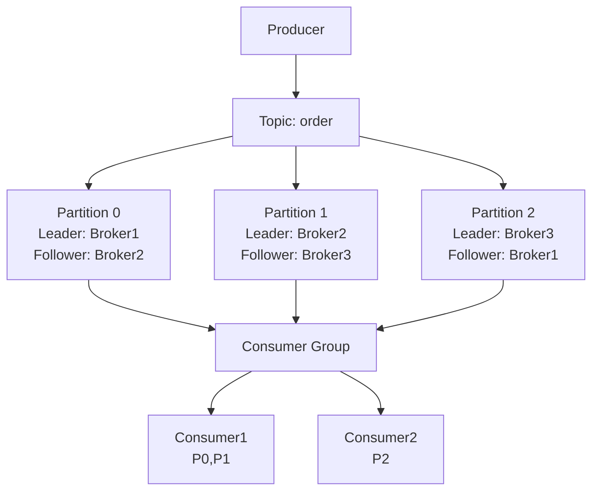
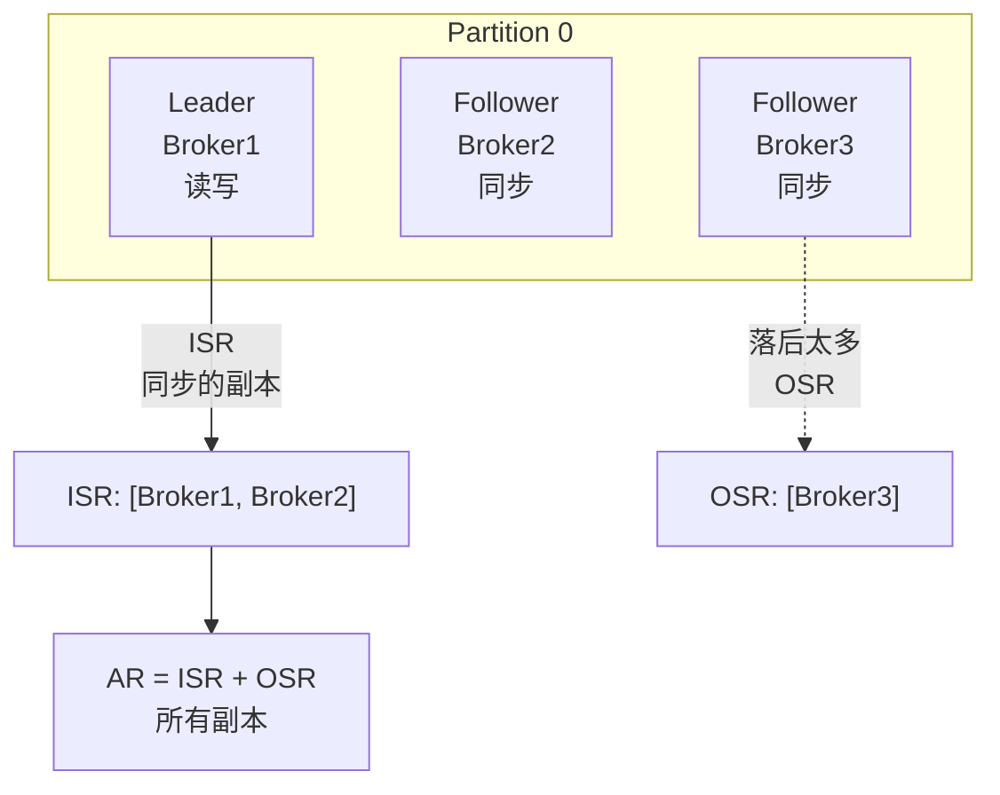
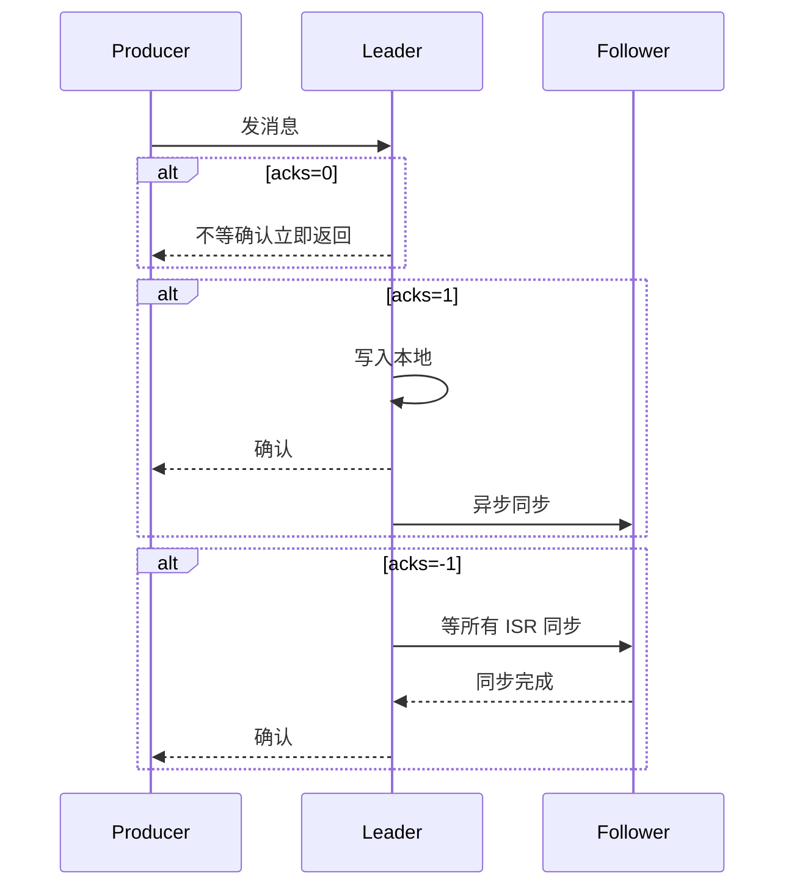
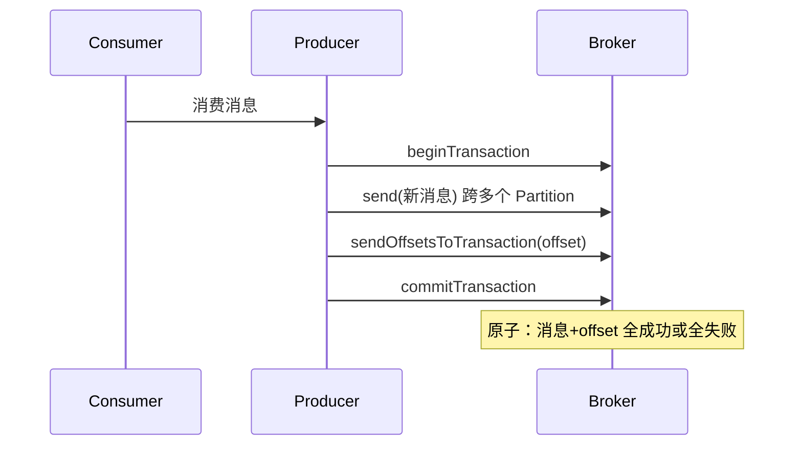
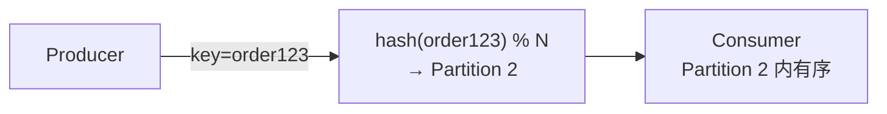

# M7 Kafka 知识点

> 模块：M7 消息队列 Kafka ｜ 对应课表 Week 3
> 深度定位：面试能讲清 ｜ 来源：权威文档/书籍/博客
> 高频题：8 道

---

## 0. 速查索引

| # | 高频题 | 对应章节 | 学时 |
|---|---|---|---|
| 1 | Kafka 架构 | §1.1 | Week3 Day4 |
| 2 | 分区策略 + 副本机制 | §1.2 | Week3 Day4 |
| 3 | ACK = 0/1/-1 区别 | §2.1 | Week3 Day4 |
| 4 | 消息可靠性（生产+Broker+消费） | §2.2 | Week3 Day4 |
| 5 | 幂等 + 事务 | §2.3 | Week3 Day4 |
| 6 | 消费组 Rebalance | §3.1 | Week3 Day5 |
| 7 | 顺序消费 | §3.2 | Week3 Day5 |
| 8 | Kafka vs RocketMQ vs RabbitMQ | §4.1 | Week3 Day5 |

---

## 1. Kafka 架构

### 1.1 Kafka 架构（Broker/Topic/Partition/Consumer Group）

**核心概念**：

| 概念 | 含义 |
|---|---|
| Broker | Kafka 节点，多个 Broker 组成集群 |
| Topic | 消息主题，逻辑分类 |
| Partition | 分区，Topic 的物理分片，并行度单位 |
| Replica | 副本，每个 Partition 有多个副本（1 Leader + N Follower） |
| Producer | 生产者，发消息到 Topic |
| Consumer | 消费者，从 Partition 拉取消息 |
| Consumer Group | 消费者组，组内分摊 Partition，组间广播 |
| ZooKeeper/KRaft | 元数据管理（KRaft 是 2.8+ 去中心化方案） |

**关键点**：
- **Partition 是并行度单位**：一个 Consumer Group 内，每个 Partition 只能被一个 Consumer 消费（保证分区内有序）。
- **Consumer Group 实现广播**：不同 Group 各自消费完整 Topic。
- **Leader 处理读写**，Follower 只同步。Leader 宕机从 ISR 选新 Leader。
- **Offset** 由消费者自己管理（Kafka 0.9+ 存在 `__consumer_offsets` topic）。

> 💡 **面试话术」：「Kafka 架构核心是 Broker/Topic/Partition/Consumer Group。Topic 分多个 Partition，Partition 是并行度单位，分布在不同 Broker 上。每个 Partition 有 1 Leader + N Follower，Leader 读写，Follower 同步。Consumer Group 内 Partition 被分摊消费，组间广播。Offset 由消费者维护存在 __consumer_offsets topic。Partition 数决定并行度和扩展性。」

**常见追问**：
- Q: Partition 数怎么定？ → 吞吐量 / 单 Partition 吞吐量；一般 3-10 个，过多增加开销。
- Q: Kafka 为什么快？ → 顺序写磁盘 + 零拷贝（sendfile）+ 批量压缩 + 分区并行。
- Q: KRaft 是什么？ → Kafka 2.8+ 用 Raft 替代 ZK 做元数据管理，简化架构。

**来源**：[Kafka Documentation](https://kafka.apache.org/documentation/)；[Kafka Architecture](https://kafka.apache.org/documentation/#architecture)；《Kafka 权威指南》第 1-2 章

### 1.2 分区策略 + 副本机制（Leader/Follower/ISR/OSR）

**分区策略**（Producer 发消息到哪个 Partition）：

| 策略 | 规则 |
|---|---|
| 指定 Partition | `ProducerRecord(topic, partition, ...)` 直接发 |
| 有 key | `hash(key) % partitionCount`，同 key 同分区 |
| 无 key | 轮询（Round Robin）/ 粘性（Sticky，2.4+） |
| 自定义 Partitioner | 实现 `Partitioner` 接口 |

**副本机制**：

| 概念 | 含义 |
|---|---|
| AR All Replicas | 分区所有副本 |
| ISR In-Sync Replicas | 与 Leader 同步的副本（延迟 < `replica.lag.time.max.ms`） |
| OSR Out-of-Sync Replicas | 同步落后的副本 |
| AR = ISR + OSR | |

**Leader 选举**：
- Leader 宕机，从 ISR 中选第一个作为新 Leader（按 ISR 顺序）。
- `unclean.leader.election.enable=true` 允许从 OSR 选 Leader（可能丢数据，性能优先）。
- 默认 false，保证数据安全。

> 💡 **面试话术」：「分区策略：有 key 用 hash(key) % partitionCount 保证同 key 同分区；无 key 轮询或粘性。副本机制：每个 Partition 有 1 Leader + N Follower，Leader 读写 Follower 同步。ISR 是与 Leader 同步的副本，落后超时进 OSR。Leader 宕机从 ISR 选第一个，unclean.leader.election 默认 false 不允许 OSR 当 Leader 防丢数据。」

**常见追问**：
- Q: ISR 怎么判断同步？ → Follower 在 `replica.lag.time.max.ms`（默认 10s）内追上 Leader 的最新 offset 即在 ISR。
- Q: 副本数怎么定？ → 至少 3（容忍 2 故障）；副本数越多越安全但存储翻倍。

**来源**：[Kafka Replication](https://kafka.apache.org/documentation/#replication)；[Kafka ISR](https://kafka.apache.org/documentation/#design_replicatedlog)

### 1.3 面试话术与进阶阅读

> 「Kafka 架构核心是 Partition 分区并行 + 副本高可用。分区有 key 用 hash，副本 ISR 同步集合，Leader 宕机从 ISR 选。」

- [Kafka Documentation](https://kafka.apache.org/documentation/)
- 《Kafka 权威指南》第 1-2 章

---

## 2. 可靠性与幂等

### 2.1 ACK = 0/1/-1 区别

**acks 参数**（Producer）：

| acks | 含义 | 可靠性 | 性能 | 丢数据风险 |
|---|---|---|---|---|
| 0 | Producer 不等确认 | 最低 | 最高 | 高（Broker 宕即丢） |
| 1 | Leader 写入即确认 | 中 | 中 | 中（Leader 宕但 Follower 未同步） |
| -1/all | ISR 全部同步才确认 | 最高 | 最低 | 极低（除非 ISR 全宕） |

**关键点**：
- 生产环境金融/订单场景用 `acks=-1`。
- 配合 `min.insync.replicas`（最小同步副本数，默认 1，建议 2）。
- `acks=-1` + `min.insync.replicas=2` + `replication.factor=3` = 高可靠。

> 💡 **面试话术」：「acks 三个值：0 不等确认性能最高但可能丢；1 Leader 写入即确认，Leader 宕但 Follower 未同步会丢；-1/all 等 ISR 全同步才确认最可靠。生产高可靠用 -1 + min.insync.replicas=2 + 副本数 3，容忍 1 个副本故障且不丢数据。」

**常见追问**：
- Q: acks=-1 一定不丢吗？ → ISR 全宕仍丢，但概率极低；min.insync.replicas 越大越安全但可用性降低。
- Q: acks=-1 性能差多少？ → 需等所有 ISR 同步，延迟增加，吞吐量降。

**来源**：[Kafka Producer Configs — acks](https://kafka.apache.org/documentation/#producerconfigs_acks)

### 2.2 消息可靠性（生产者+Broker+消费者）

**三段保证**：

| 环节 | 风险 | 解决 |
|---|---|---|
| Producer → Broker | 网络丢/重试失败 | acks=-1 + retries + 幂等 |
| Broker | Leader 宕、磁盘故障 | 副本 + acks=-1 + min.insync.replicas |
| Consumer | 漏消费/重复消费 | 手动提交 offset + 幂等消费 |

**Producer 端**：
- `acks=-1` + `retries=Integer.MAX_VALUE` + `enable.idempotence=true`。
- `max.in.flight.requests.per.connection=5`（幂等时 ≤ 5）。

**Broker 端**：
- `replication.factor=3` + `min.insync.replicas=2`。
- `unclean.leader.election.enable=false`。

**Consumer 端**：
- `enable.auto.commit=false`，手动提交。
- 处理完业务再提交 offset（先消费后提交 vs 先提交后消费的取舍）。
- 幂等消费：用消息 ID 去重表或 Redis SetNX。

> 💡 **面试话术」：「消息可靠性三段保证：Producer 用 acks=-1 + retries + 幂等防止发送丢失；Broker 用 3 副本 + min.insync.replicas=2 + 禁用 unclean 选举防止存储丢失；Consumer 关闭自动提交，手动提交 offset，业务处理完再提交，配合幂等消费防重复。三段都做到才能保证 exactly-once 语义。」

**常见追问**：
- Q: at-least-once / at-most-once / exactly-once 区别？ → 至少一次（重试可能重复）、最多一次（不重试可能丢）、精确一次（幂等+事务）。
- Q: Consumer 怎么保证不丢？ → 先消费再提交 offset；提交了但没处理会丢。

**来源**：[Kafka — Guaranteeing Message Delivery](https://kafka.apache.org/documentation/#semantics)

### 2.3 幂等 + 事务

**幂等 Producer**（0.11+）：
- `enable.idempotence=true`。
- Broker 为每个 Producer 分配 PID（Producer ID），消息带 PID + SequenceNumber。
- Broker 去重：相同 PID + Partition + SequenceNumber 视为重复。

**事务**（0.11+）：
- 跨 Partition 原子写入：要么全成功要么全失败。
- 场景：消费-处理-生产（consume-process-produce）原子化。
- API：`beginTransaction` → `send` → `sendOffsetsToTransaction` → `commitTransaction`。

**关键点**：
- 幂等只保证单 Partition 单会话内不重复。
- 事务保证跨 Partition 原子性，配合 Consumer `isolation.level=read_committed` 只读已提交事务。

> 💡 **面试话术」：「Kafka 幂等 Producer 用 PID + SequenceNumber，Broker 去重，保证单 Partition 单会话不重复。事务用于跨 Partition 原子写入，典型场景是 consume-process-produce——消费消息、处理、生产新消息+提交 offset，全原子。Consumer 用 isolation.level=read_committed 只读已提交事务。幂等是事务的基础。」

**常见追问**：
- Q: 幂等能跨会话吗？ → 不能，PID 每次会话新分配；跨会话要靠事务。
- Q: 事务性能影响？ → 增加协调开销，吞吐量降 10-20%。

**来源**：[KIP 98 — Exactly Once Delivery](https://cwiki.apache.org/confluence/display/KAFKA/KIP-98+-+Exactly+Once+Delivery+and+Transactional+Messaging)；[Kafka Transactions](https://kafka.apache.org/documentation/#transactions)

### 2.4 面试话术与进阶阅读

> 「可靠性三段保证：生产 acks=-1+幂等，Broker 3 副本，消费手动提交+幂等。事务用于跨 Partition 原子写入。」

- [Kafka Producer Configs](https://kafka.apache.org/documentation/#producerconfigs)
- [KIP 98 Exactly Once](https://cwiki.apache.org/confluence/display/KAFKA/KIP-98+-+Exactly+Once+Delivery+and+Transactional+Messaging)

---

## 3. 消费与运维

### 3.1 消费组 Rebalance 触发条件

**Rebalance**：Consumer Group 内 Partition 重新分配。

**触发条件**：

| 触发 | 说明 |
|---|---|
| Consumer 加入 | 新 Consumer 上线 |
| Consumer 退出 | Consumer 宕/主动关闭 |
| Consumer 心跳超时 | `session.timeout.ms` 内未心跳 |
| Partition 数变化 | Topic 增减 Partition |
| Consumer 订阅变化 | 订阅 Topic 列表变化 |

**问题**：
- Rebalance 期间所有 Consumer 暂停消费（stop-the-world）。
- 频繁 Rebalance 影响吞吐量。

**优化**：
- `session.timeout.ms` 调大（如 30s）防止误判。
- `max.poll.interval.ms` 调大（处理慢时，默认 5min）。
- `heartbeat.interval.ms` 适当小（及时心跳）。
- 静态成员（`group.instance.id`）避免重启触发 Rebalance。

**分区分配策略**：
- RangeAssignor（默认）：按 Partition 范围分配。
- RoundRobinAssignor：轮询。
- StickyAssignor：粘性，尽量保持原分配减少变动。
- CooperativeStickyAssignor（2.4+）：增量 Rebalance，不全暂停。

> 💡 **面试话术」：「Rebalance 是 Consumer Group 重新分配 Partition，触发条件：Consumer 加入/退出、心跳超时、Partition 数变化。Rebalance 期间所有 Consumer 暂停消费，影响吞吐。优化：调大 session.timeout 和 max.poll.interval 防误判、用静态成员避免重启触发、用 CooperativeStickyAssignor 增量 Rebalance 减少暂停。」

**常见追问**：
- Q: Rebalance 怎么选 Coordinator？ → Consumer Group 的 Coordinator 在 `__consumer_offsets` 对应 Partition 的 Leader Broker。
- Q: Consumer 处理慢触发 Rebalance？ → 超过 max.poll.interval.ms 未 poll，被认为挂了，触发 Rebalance。

**来源**：[Kafka Consumer Groups](https://kafka.apache.org/documentation/#consumerconfigs)；[KIP 429 — Incremental Cooperative Rebalance](https://cwiki.apache.org/confluence/display/KAFKA/KIP-429%3A+Kafka+Consumer+Incremental+Cooperative+Rebalance)

### 3.2 顺序消费怎么实现

**核心**：Kafka 只保证**单 Partition 内有序**，跨 Partition 不保证。

**方案**：

| 方案 | 实现 | 适用 |
|---|---|---|
| 单 Partition | Topic 只设 1 Partition | 全局有序，但失去并行 |
| 按 key 路由 | 同业务 key 发同 Partition | 同 key 有序，常用 |
| 业务分片 | 按订单 ID 取模路由 | 同订单事件有序 |

**关键点**：
- 同 key 消息进同 Partition，单 Consumer 顺序消费。
- 顺序消费与并行度矛盾：N 个 Partition 最多 N 个 Consumer 并行。
- 业务幂等：失败重试可能重复消费，需幂等。

> 💡 **面试话术」：「Kafka 顺序消费靠 Partition——单 Partition 内消息有序。方案：单 Partition 全局有序但失去并行；按 key 路由（如 order ID）保证同 key 有序最常用。同 key 进同 Partition 由单 Consumer 顺序消费。顺序和并行矛盾，N 个 Partition 最多 N 个 Consumer。失败重试要幂等，否则重复消费破坏顺序。」

**常见追问**：
- Q: 多 Consumer 并发消费同一 Partition 能有序吗？ → 不能，Kafka 不允许同一 Group 内多 Consumer 消费同一 Partition。
- Q: 顺序消费怎么处理失败？ → 阻塞重试或发到死信队列；不能跳过否则破坏顺序。

**来源**：[Kafka — Guarantees](https://kafka.apache.org/documentation/#semantics)

### 3.3 面试话术与进阶阅读

> 「Rebalance 触发于 Consumer 增减/心跳超时，期间暂停消费，优化用静态成员和增量 Rebalance。顺序消费靠 Partition 内有序，按 key 路由最常用。」

- [Kafka Consumer Configs](https://kafka.apache.org/documentation/#consumerconfigs)
- [KIP 429 Cooperative Rebalance](https://cwiki.apache.org/confluence/display/KAFKA/KIP-429)

---

## 4. 对比与选型

### 4.1 Kafka vs RocketMQ vs RabbitMQ 对比

| 维度 | Kafka | RocketMQ | RabbitMQ |
|---|---|---|---|
| 语言 | Scala/Java | Java | Erlang |
| 模型 | Pull | Pull | Push（可调） |
| 吞吐量 | 百万级 | 百万级 | 万级 |
| 延迟 | ms 级 | ms 级 | μs 级（最低） |
| 顺序消息 | Partition 内 | Partition 内 | 单队列 |
| 事务 | 有（跨 Partition） | 有（更强） | 弱 |
| 延迟消息 | 无（需自实现） | 有（开源） | 有（插件） |
| 死信 | 无原生 | 有 | 有 |
| 适用 | 日志/大数据/流处理 | 金融/电商事务 | 业务消息/低延迟 |

**选型建议**：
- **大数据/日志/流处理**：Kafka（吞吐量王、生态好）。
- **金融/电商事务**：RocketMQ（事务消息、延迟消息原生支持）。
- **复杂路由/低延迟业务**：RabbitMQ（路由灵活、延迟低）。

> 💡 **面试话术」：「Kafka/RocketMQ/RabbitMQ 对比：Kafka 吞吐量百万级适合日志和流处理；RocketMQ 事务消息和延迟消息原生支持适合金融电商；RabbitMQ Erlang 写延迟最低路由灵活适合业务消息。Kafka 没有原生延迟消息和死信，需自实现。选型：大数据用 Kafka，事务用 RocketMQ，复杂路由用 RabbitMQ。」

**常见追问**：
- Q: Kafka 为什么吞吐量高？ → 顺序写磁盘 + 零拷贝 sendfile + 批量压缩 + 分区并行 + PageCache。
- Q: RocketMQ 和 Kafka 架构区别？ → RocketMQ 用 NameServer（无状态）替代 ZK；CommitLog 单文件顺序写所有 Topic。

**来源**：[Kafka Documentation](https://kafka.apache.org/documentation/)；[RocketMQ](https://rocketmq.apache.org/)；[RabbitMQ](https://www.rabbitmq.com/)

### 4.2 面试话术与进阶阅读

> 「三大 MQ 对比：Kafka 大数据、RocketMQ 事务、RabbitMQ 路由。」

- [Kafka](https://kafka.apache.org/documentation/)
- [RocketMQ](https://rocketmq.apache.org/docs/)
- [RabbitMQ](https://www.rabbitmq.com/documentation.html)

---

## 附：参考资料汇总

### 官方文档
- [Kafka Documentation](https://kafka.apache.org/documentation/) — 架构/配置/语义
- [Kafka Producer Configs](https://kafka.apache.org/documentation/#producerconfigs)
- [Kafka Consumer Configs](https://kafka.apache.org/documentation/#consumerconfigs)
- [Kafka Replication](https://kafka.apache.org/documentation/#replication)
- [RocketMQ](https://rocketmq.apache.org/)
- [RabbitMQ](https://www.rabbitmq.com/)

### KIP（改进提案）
- [KIP-98 Exactly Once](https://cwiki.apache.org/confluence/display/KAFKA/KIP-98+-+Exactly+Once+Delivery+and+Transactional+Messaging)
- [KIP-429 Cooperative Rebalance](https://cwiki.apache.org/confluence/display/KAFKA/KIP-429%3A+Kafka+Consumer+Incremental+Cooperative+Rebalance)

### 书籍
- 《Kafka 权威指南》Neha Narkhede — 架构与运维
- 《Kafka 技术内幕》郑奇煌 — 源码解析
