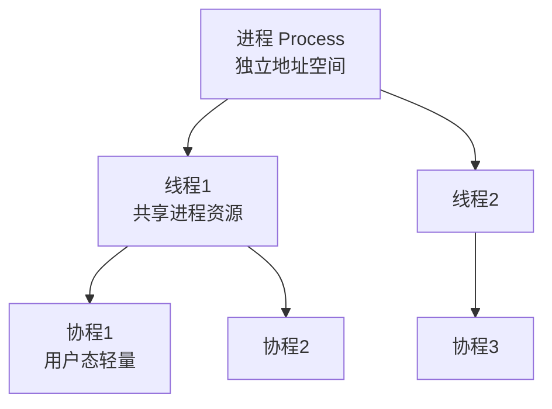
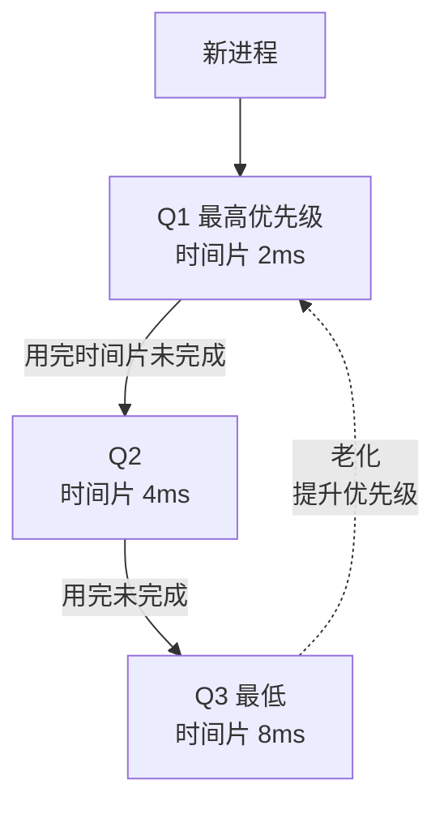
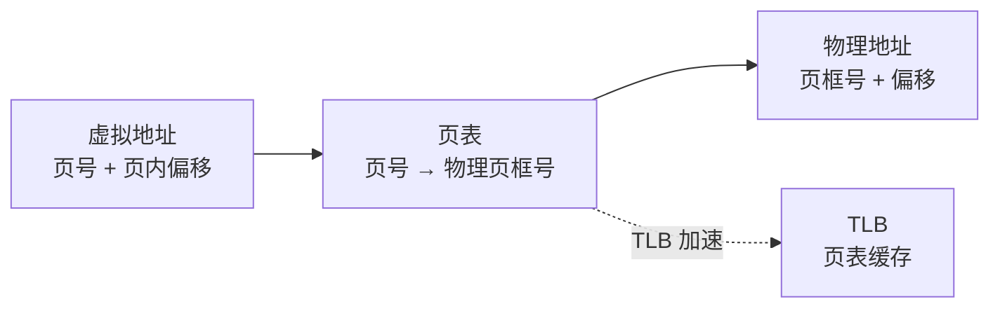
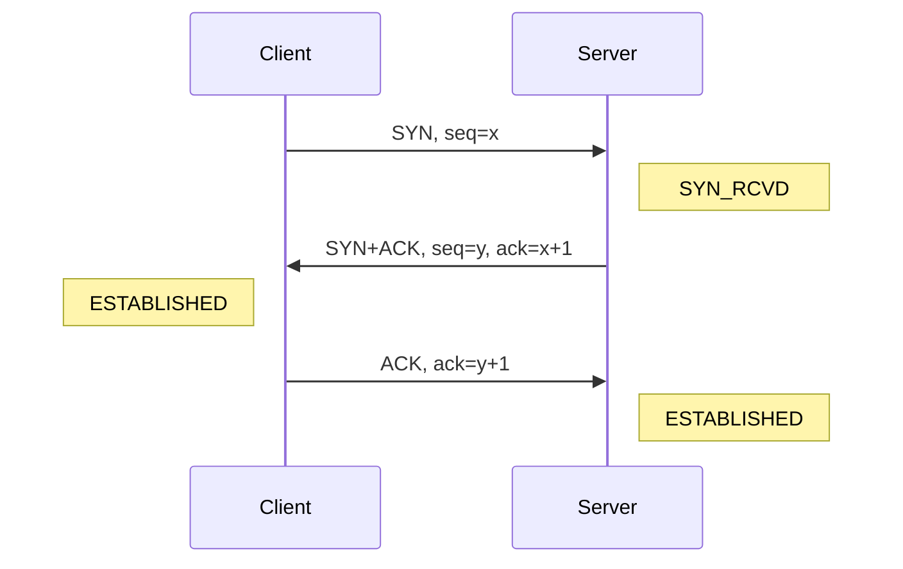
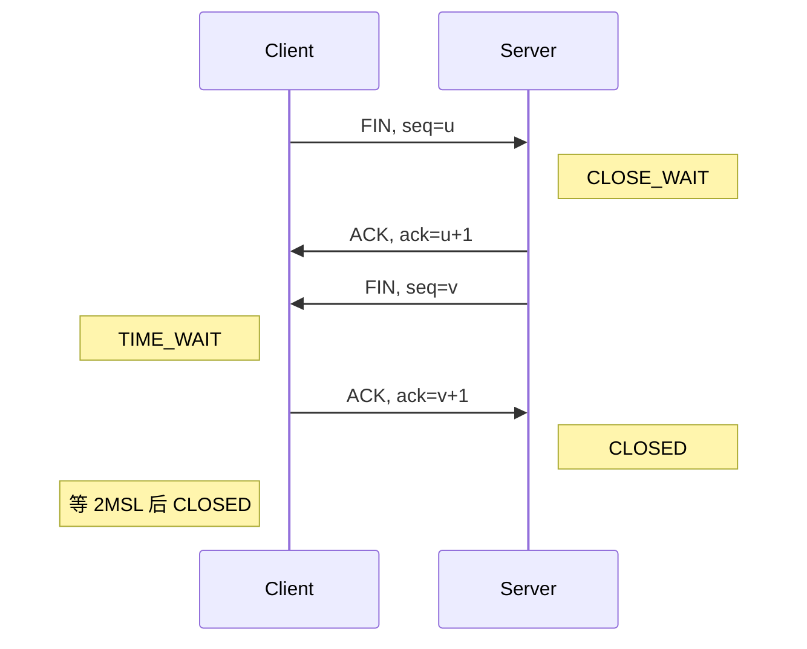
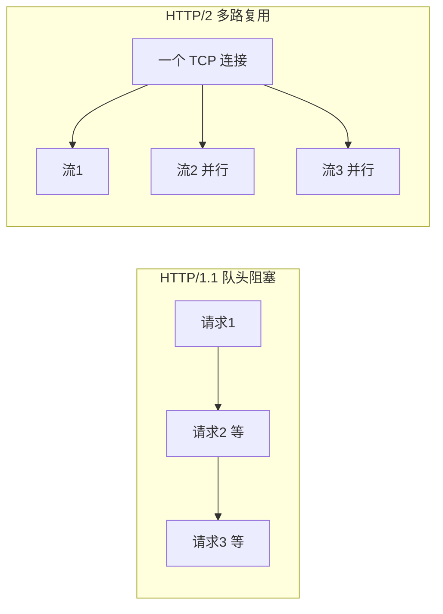
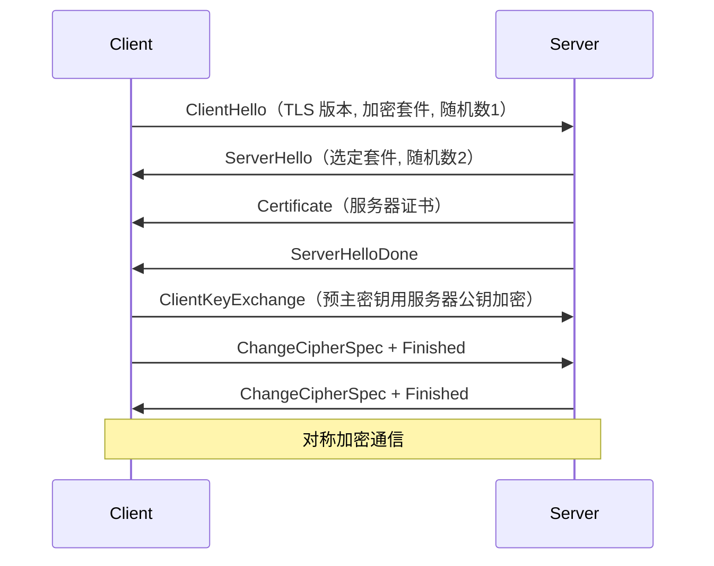

# M8 操作系统 + 网络知识点

> 模块：M8 操作系统 + 网络 ｜ 对应课表 Week 5
> 深度定位：面试能讲清 ｜ 来源：权威文档/书籍/博客
> 高频题：10 道

---

## 0. 速查索引

| # | 高频题 | 对应章节 | 学时 |
|---|---|---|---|
| 1 | 进程 vs 线程 vs 协程 | §1.1 | Week5 Day1 |
| 2 | 进程调度算法 | §1.2 | Week5 Day1 |
| 3 | 虚拟内存 + 分页/分段/段页式 | §1.3 | Week5 Day2 |
| 4 | 死锁条件 + Banker 算法 | §1.4 | Week5 Day3 |
| 5 | Linux 常用命令 | §1.5 | Week5 Day4 |
| 6 | TCP 三次握手 | §2.1 | Week5 Day1 |
| 7 | TCP 四次挥手 + TIME_WAIT | §2.2 | Week5 Day1 |
| 8 | 粘包/拆包 | §2.3 | Week5 Day3 |
| 9 | HTTP 1.0/1.1/2.0/3.0 区别 | §2.4 | Week5 Day2 |
| 10 | HTTPS TLS 握手 | §2.5 | Week5 Day2 |

---

## 1. 操作系统

### 1.1 进程 vs 线程 vs 协程

| 维度 | 进程 | 线程 | 协程 |
|---|---|---|---|
| 资源 | 独立地址空间 | 共享进程地址空间 | 共享线程栈 |
| 调度 | OS 调度 | OS 调度 | 用户态调度 |
| 切换开销 | 大（切页表/TLB） | 中（切栈/寄存器） | 小（用户态） |
| 通信 | IPC（管道/消息队列/共享内存） | 共享内存（注意锁） | 共享内存 |
| 并发数 | 几十-几百 | 几百-几千 | 几万-几十万 |

**关键点**：
- **进程**：资源分配基本单位，有独立虚拟地址空间，进程间隔离。
- **线程**：CPU 调度基本单位，共享进程的堆/全局变量，独有栈/PC/寄存器。
- **协程**：用户态轻量级线程，由语言/库调度（如 Go goroutine、Kotlin coroutine），不陷入内核，切换成本极低。
- **上下文切换**：进程切换需切页表（TLB 失效），最贵；线程只切栈和寄存器；协程只保存少量寄存器到用户栈。

> 💡 **面试话术**：「进程是资源分配单位有独立地址空间，线程是 CPU 调度单位共享进程资源，协程是用户态轻量线程。切换开销：进程 > 线程 > 协程。进程切换要切页表 TLB 失效最贵；线程只切栈和寄存器；协程在用户态调度不陷内核最轻。进程间通信用 IPC，线程间共享内存但要加锁，协程单线程内无需锁。Go 的 goroutine、Kotlin 的 coroutine 都是协程。」

**常见追问**：
- Q: 线程为什么比进程轻？ → 共享地址空间，切换不切页表，创建不需复制资源（fork 进程有 COW 优化但仍更重）。
- Q: 协程为什么能高并发？ → 用户态调度不陷内核，单线程可跑几万协程；但协程不能利用多核（多核需多线程+协程）。
- Q: 线程的私有资源？ → 栈、PC、寄存器、线程局部存储（TLS）。

**来源**：《深入理解计算机系统》第 8 章；[Linux threads](https://man7.org/linux/man-pages/man7/pthreads.7.html)

### 1.2 进程调度算法

| 算法 | 规则 | 优缺点 |
|---|---|---|
| FCFS 先来先服务 | 按 arrival 顺序 | 简单，但短任务被长任务阻塞（护航效应） |
| SJF 短作业优先 | 选估计最短 | 平均等待最短，但长任务饥饿 |
| SRTF 最短剩余优先 | SJF 抢占版 | 更优，但饥饿更严重 |
| 时间片轮转 | 每个进程固定时间片 | 公平，但时间片太小切换开销大 |
| 优先级调度 | 按优先级 | 可能低优先级饥饿，需老化 |
| 多级反馈队列 MLFQ | 多队列+动态降级 | 综合最优，Linux CFS 借鉴 |

**多级反馈队列（MLFQ）**：

**Linux CFS（Completely Fair Scheduler）**：
- 不用时间片，按 vruntime（虚拟运行时间）排序，选最小的运行。
- 用红黑树组织就绪进程。
- `nice` 值影响 vruntime 增长速度（-20 到 19，越小优先级越高）。

> 💡 **面试话术**：「调度算法有 FCFS 先来先服务、SJF 短作业优先、时间片轮转、优先级、多级反馈队列 MLFQ。FCFS 简单但有护航效应，SJF 平均等待最短但长任务饥饿，时间片轮转公平但切换开销。MLFQ 多队列+动态降级是综合最优。Linux 用 CFS 完全公平调度，按 vruntime 红黑树选最小，nice 值影响优先级。」

**常见追问**：
- Q: 时间片多大合适？ → 太小切换开销大，太大退化为 FCFS；Linux 默认 1-10ms。
- Q: CFS 怎么保证公平？ → vruntime 增长速率相同，运行多的 vruntime 大被排后。

**来源**：《操作系统导论》（OSTEP）第 7-9 章；[Linux CFS](https://www.kernel.org/doc/html/latest/scheduler/sched-design-CFS.html)

### 1.3 虚拟内存 + 分页/分段/段页式

**虚拟内存**：每个进程有独立虚拟地址空间，通过页表映射到物理内存，按需换入换出。

| 方案 | 单位 | 优点 | 缺点 |
|---|---|---|---|
| 分页 | 固定大小页（4KB） | 无外部碎片 | 内部碎片；页表大 |
| 分段 | 逻辑段（代码/数据/栈） | 按逻辑组织 | 外部碎片 |
| 段页式 | 段内分页 | 兼顾两者 | 地址变换多次查表 |

**分页地址变换**：

**关键点**：
- **TLB（Translation Lookaside Buffer）**：页表缓存，命中率 > 99%。
- **多级页表**：32 位用 2 级，64 位用 4 级，避免页表占满内存。
- **缺页中断**：访问的页不在内存，从磁盘换入，可能触发页面置换。
- **页面置换算法**：FIFO（先进先出）、LRU（最久未用）、Clock（时钟，近似 LRU）、LFU（最少使用）。
- **LRU 实现**：双向链表 + 哈希表，访问移到头部，淘汰尾部。

> 💡 **面试话术**：「虚拟内存让每个进程有独立地址空间，通过页表映射物理内存。分页固定大小无外部碎片但有内部碎片，分段按逻辑但有外部碎片，段页式结合两者。地址变换靠 TLB 缓存页表，命中率 99%+。缺页时从磁盘换入，触发页面置换，常用 LRU（最久未用淘汰）。LRU 用双向链表+哈希表 O(1) 实现。」

**常见追问**：
- Q: 多级页表为什么省内存？ → 顶级页表常驻，二级按需创建，未使用段不分配。
- Q: LRU 和 LFU 区别？ → LRU 按时间（最久未用淘汰），LFU 按频率（最少使用淘汰）；LFU 老数据难淘汰，需衰减。
- Q: 页大小为什么是 4KB？ → 平衡内部碎片和页表大小；大页（HugePages）2MB 减少页表项。

**来源**：《深入理解计算机系统》第 9 章；[Linux Memory Management](https://www.kernel.org/doc/html/latest/admin-guide/mm/index.html)

### 1.4 死锁条件 + Banker 算法

**死锁 4 个必要条件**（同 M2 §5.1）：互斥、持有并等待、不可剥夺、循环等待。

**处理策略**：

| 策略 | 方法 |
|---|---|
| 预防 | 破坏 4 条件之一（如固定加锁顺序破坏循环等待） |
| 避免 | Banker 算法，分配前判断是否安全 |
| 检测+恢复 | 资源分配图检测，杀进程恢复 |
| 鸵鸟 | 忽略（多数 OS 选择，概率低） |

**Banker 算法**：
- 每个进程声明最大资源需求 `Max`。
- 系统维护 `Available`（可用）、`Allocation`（已分配）、`Need = Max - Allocation`。
- 分配前模拟：找 Need ≤ Available 的进程，假设它完成释放资源，再找下一个，若所有进程都能完成则安全，否则拒绝分配。

> 💡 **面试话术」：「死锁 4 条件：互斥、持有并等待、不可剥夺、循环等待。处理策略：预防破坏条件（固定加锁顺序）、避免用 Banker 算法、检测+恢复。Banker 算法在分配前模拟：找 Need ≤ Available 的进程假设完成释放，若所有进程都能完成则安全，否则拒绝。实际 OS 用鸵鸟策略忽略死锁，应用层靠固定加锁顺序预防。」

**常见追问**：
- Q: Banker 算法为什么生产很少用？ → 需预先知道最大需求，实际难预知；开销大。
- Q: 死锁检测算法？ → 资源分配图找环路，O(n³)。

**来源**：《操作系统概念》（恐龙书）第 7 章；[Deadlock Wikipedia](https://en.wikipedia.org/wiki/Deadlock)

### 1.5 Linux 常用命令

| 场景 | 命令 |
|---|---|
| 进程 CPU | `top` / `htop`，`top -Hp <pid>` 看线程 |
| 进程内存 | `ps aux --sort=-%mem` |
| 系统负载 | `uptime`，`vmstat 1` |
| 网络 | `netstat -tlnp`，`ss -tlnp`，`tcpdump` |
| IO | `iostat -x 1`，`iotop` |
| 磁盘 | `df -h`，`du -sh *` |
| 系统调用 | `strace -p <pid>` |
| 文件描述符 | `lsof -p <pid>` |
| 内存 | `free -h` |
| 端口占用 | `lsof -i:8080` |

**CPU 100% 排查**：
1. `top` 找 CPU 高的进程 PID。
2. `top -Hp <pid>` 找 CPU 高的线程 TID。
3. `printf '%x\n' <tid>` 转 16 进制。
4. `jstack <pid> | grep <hex_tid> -A 20` 看线程栈。

> 💡 **面试话术」：「Linux 排查命令：CPU 用 top/htop，内存用 ps/free，网络用 netstat/ss/tcpdump，IO 用 iostat/iotop，系统调用用 strace，文件描述符用 lsof。CPU 100% 排查：top 找进程 → top -Hp 找线程 → 16 进制 → jstack 看栈。生产必背 top/vmstat/netstat/iostat/strace/lsof。」

**来源**：[Linux man pages](https://man7.org/linux/man-pages/)；《Linux 性能优化》Brendan Gregg

### 1.6 面试话术与进阶阅读

> 「OS 核心：进程/线程/协程、调度、虚拟内存、死锁。Linux 排查用 top/vmstat/netstat/iostat/strace/lsof。」

- 《深入理解计算机系统》第 8-9 章
- 《操作系统导论》OSTEP
- [Brendan Gregg — Linux Performance](http://www.brendangregg.com/linuxperf.html)

---

## 2. 计算机网络

### 2.1 TCP 三次握手

**为什么三次而非两次？**
- 防止历史连接（旧 SYN）误建立：第三次 ACK 确认双方都知道最新 seq。
- 同步双方初始 seq：Server 需确认 Client 收到自己的 seq。
- 两次握手时，旧 SYN 到达 Server，Server 直接进 ESTABLISHED 浪费资源。

**关键点**：
- SYN 不带数据但消耗一个 seq 号。
- 第三次 ACK 可携带数据。
- SYN Flood 攻击：伪造大量 SYN，Server 半连接队列满。防御：SYN Cookie。

> 💡 **面试话术」：「TCP 三次握手：Client 发 SYN seq=x，Server 回 SYN+ACK seq=y ack=x+1，Client 再 ACK ack=y+1。为什么三次？防止旧 SYN 误建立连接，且确认双方初始 seq。两次握手时旧 SYN 到达 Server 直接 ESTABLISHED 浪费资源。SYN Flood 攻击利用半连接队列满，用 SYN Cookie 防御。」

**常见追问**：
- Q: 第三次 ACK 丢了怎么办？ → Server 超时重发 SYN+ACK，Client 收到再 ACK；若 Client 已发数据，数据包带 ACK 等同确认。
- Q: 初始 seq 为什么不固定从 0？ → 防止旧连接的延迟报文被新连接接收。

**来源**：[RFC 793 — TCP](https://datatracker.ietf.org/doc/html/rfc793)；《TCP/IP 详解》卷 1 第 13 章

### 2.2 TCP 四次挥手 + TIME_WAIT

**为什么四次？**
- TCP 全双工，每个方向单独关闭。Server 收到 FIN 只表示 Client 不再发，Server 可能还有数据要发，所以 ACK 和 FIN 分开。

**TIME_WAIT 原因**（主动关闭方等 2MSL）：
1. **确保最后 ACK 到达**：若 Server 未收到最后 ACK，重发 FIN，Client 仍能响应。
2. **让旧报文消失**：2MSL（最大报文生存时间）确保本次连接的所有报文在网络中过期，不会被新连接接收。

**TIME_WAIT 过多问题**：
- 每个 TIME_WAIT 占用端口和内存，高并发短连接服务器可能耗尽端口。
- 解决：`tcp_tw_reuse`（复用 TIME_WAIT 连接）、长连接、连接池。

> 💡 **面试话术」：「TCP 四次挥手：Client FIN → Server ACK → Server FIN → Client ACK。为什么四次？TCP 全双工，每个方向单独关，Server 收 FIN 时可能还有数据要发，ACK 和 FIN 分开。TIME_WAIT 在主动关闭方等 2MSL：一确保最后 ACK 到达（Server 没收到重发 FIN），二让旧报文消失。TIME_WAIT 过多用 tcp_tw_reuse 或长连接解决。」

**常见追问**：
- Q: CLOSE_WAIT 过多说明什么？ → 应用层 bug，收到 FIN 后没调 close()，连接泄漏。
- Q: 2MSL 多长？ → Linux 默认 60s（MMSL 30s），可调。
- Q: 为什么 TIME_WAIT 是 2 倍 MSL？ → 一次 ACK 去 + 一次 FIN 回，最坏两个 MSL。

**来源**：[RFC 793 — TCP Connection Termination](https://datatracker.ietf.org/doc/html/rfc793)；[Linux TCP tuning](https://www.kernel.org/doc/Documentation/networking/ip-sysctl.txt)

### 2.3 粘包/拆包

**原因**：TCP 是字节流，无边界，应用层消息边界需自行处理。

| 方案 | 实现 |
|---|---|
| 固定长度 | 每条消息固定 N 字节 |
| 分隔符 | 用 \n 或特殊字符分隔 |
| 长度前缀 | 消息头带长度，最常用 |
| 自定义协议 | 魔数+长度+类型+正文+校验 |

**Netty 解决方案**：
- `FixedLengthFrameDecoder` 固定长度。
- `LineBasedFrameDecoder` 换行分隔。
- `LengthFieldBasedFrameDecoder` 长度字段（最常用）。

> 💡 **面试话术」：「粘包/拆包是因为 TCP 是字节流无边界。解决：固定长度、分隔符、长度前缀（最常用）、自定义协议。Netty 用 LengthFieldBasedFrameDecoder 按长度字段拆分。应用层协议如 HTTP 用 Content-Length 或 chunked 编码，Redis 用 \r\n 分隔。」

**常见追问**：
- Q: UDP 会粘包吗？ → 不会，UDP 是数据报有边界。
- Q: 为什么 TCP 不保留消息边界？ → TCP 设计目标是流式传输，边界由应用层定义。

**来源**：[Netty Frame Decoders](https://netty.io/wiki/user-guide-for-4.x.html)

### 2.4 HTTP 1.0/1.1/2.0/3.0 区别

| 版本 | 特性 | 问题 |
|---|---|---|
| 1.0 | 每请求一个连接 | 连接开销大 |
| 1.1 | Keep-Alive 长连接、管道化、Host 头 | 队头阻塞 |
| 2.0 | 二进制分帧、多路复用、头部压缩 HPACK、服务端推送 | TCP 队头阻塞 |
| 3.0 | 基于 QUIC（UDP）、解决 TCP 队头阻塞、0-RTT | 部署中 |

**关键点**：
- **HTTP/1.1 队头阻塞**：前请求慢阻塞后续（应用层）。
- **HTTP/2 多路复用**：一个 TCP 连接多流并行，但 TCP 丢包所有流阻塞（TCP 队头阻塞）。
- **HTTP/3 用 QUIC（UDP）**：流独立，丢包只影响该流，0-RTT 握手。

> 💡 **面试话术」：「HTTP 演进：1.0 每请求一连接；1.1 长连接+管道化但有队头阻塞；2.0 二进制分帧+多路复用+HPACK 头部压缩，但有 TCP 层队头阻塞；3.0 基于 QUIC（UDP），流独立解决 TCP 队头阻塞，支持 0-RTT。HTTP/2 多路复用解决应用层队头阻塞，但 TCP 丢包阻塞所有流，HTTP/3 用 UDP 解决。」

**常见追问**：
- Q: HTTP/2 为什么还用 TCP？ → 历史原因，TCP 可靠传输；HTTP/3 才换 UDP。
- Q: HPACK 怎么压缩头部？ → 静态表 + 动态表 + 哈夫曼编码。

**来源**：[HTTP/2 RFC 7540](https://datatracker.ietf.org/doc/html/rfc7540)；[HTTP/3 RFC 9114](https://datatracker.ietf.org/doc/html/rfc9114)；[QUIC](https://www.chromium.org/quic/)

### 2.5 HTTPS TLS 握手过程

**TLS 1.2 握手关键步骤**：
1. **ClientHello**：客户端发 TLS 版本、支持的加密套件、随机数。
2. **ServerHello + 证书**：服务器选套件、发随机数、证书。
3. **客户端验证证书**：CA 链验证、有效期、域名。
4. **生成主密钥**：用两个随机数 + 预主密钥生成会话密钥。
5. **加密通信**：用对称密钥（如 AES）加密应用数据。

**TLS 1.3 优化**：
- 握手从 2-RTT 减到 1-RTT，支持 0-RTT 恢复。
- 移除不安全算法（RSA 密钥交换、CBC 模式）。
- 强制前向安全（ECDHE）。

**关键点**：
- **非对称加密（RSA/ECDHE）** 用于交换密钥，**对称加密（AES）** 用于数据。
- **证书链**：服务器证书 ← 中间 CA ← 根 CA，客户端信任根 CA。
- **前向安全**：ECDHE 每次握手生成临时密钥，私钥泄露不影响历史会话。

> 💡 **面试话术」：「HTTPS = HTTP + TLS。TLS 握手：ClientHello 发随机数和套件，ServerHello 回随机数+证书，客户端验证证书链，用服务器公钥加密预主密钥，双方用两个随机数+预主密钥生成会话密钥，之后对称加密通信。非对称加密换密钥，对称加密传数据。TLS 1.3 减到 1-RTT，强制 ECDHE 实现前向安全。」

**常见追问**：
- Q: 为什么不全用非对称加密？ → 非对称加密慢（RSA 比 AES 慢 100-1000 倍）。
- Q: 证书怎么验证？ → CA 链向上到根 CA，根 CA 预装在系统/浏览器。
- Q: 前向安全是什么？ → 私钥泄露不影响历史会话，靠 ECDHE 临时密钥实现。

**来源**：[RFC 5246 — TLS 1.2](https://datatracker.ietf.org/doc/html/rfc5246)；[RFC 8446 — TLS 1.3](https://datatracker.ietf.org/doc/html/rfc8446)；[Let's Encrypt 文档](https://letsencrypt.org/docs/)

### 2.6 面试话术与进阶阅读

> 「网络核心：TCP 三次握手/四次挥手，HTTP 演进 1.0→2.0→3.0，HTTPS 用 TLS 非对称换密钥+对称传数据。」

- 《TCP/IP 详解》卷 1
- [RFC 793 TCP](https://datatracker.ietf.org/doc/html/rfc793)
- [RFC 8446 TLS 1.3](https://datatracker.ietf.org/doc/html/rfc8446)
- [Brendan Gregg Linux Performance](http://www.brendangregg.com/linuxperf.html)

---

## 附：参考资料汇总

### RFC 标准文档
- [RFC 793 — TCP](https://datatracker.ietf.org/doc/html/rfc793)
- [RFC 5246 — TLS 1.2](https://datatracker.ietf.org/doc/html/rfc5246)
- [RFC 8446 — TLS 1.3](https://datatracker.ietf.org/doc/html/rfc8446)
- [RFC 7540 — HTTP/2](https://datatracker.ietf.org/doc/html/rfc7540)
- [RFC 9114 — HTTP/3](https://datatracker.ietf.org/doc/html/rfc9114)

### 书籍
- 《深入理解计算机系统》（CSAPP）— 进程/虚拟内存
- 《操作系统导论》OSTEP — 调度/死锁
- 《TCP/IP 详解》卷 1 — TCP/HTTP
- 《Linux 性能优化》Brendan Gregg — Linux 排查

### 文档
- [Linux CFS](https://www.kernel.org/doc/html/latest/scheduler/sched-design-CFS.html)
- [Linux Memory Management](https://www.kernel.org/doc/html/latest/admin-guide/mm/index.html)
- [QUIC](https://www.chromium.org/quic/)
- [Let's Encrypt](https://letsencrypt.org/docs/)
- [Brendan Gregg — Linux Performance](http://www.brendangregg.com/linuxperf.html)

### 工具
- [Netty Frame Decoders](https://netty.io/wiki/user-guide-for-4.x.html) — 粘包拆包
- [Linux man pages](https://man7.org/linux/man-pages/)
