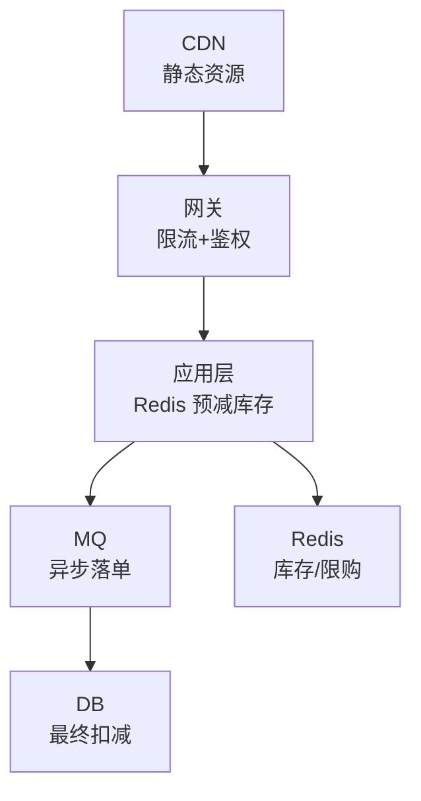
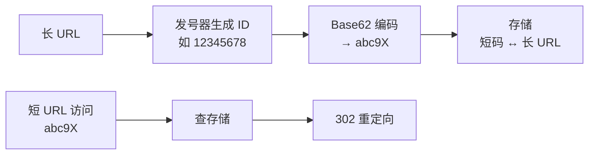
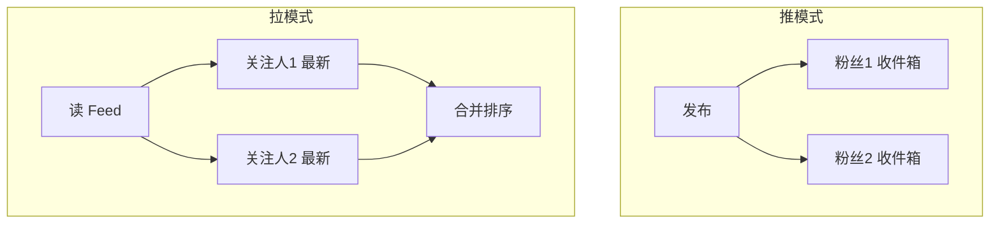
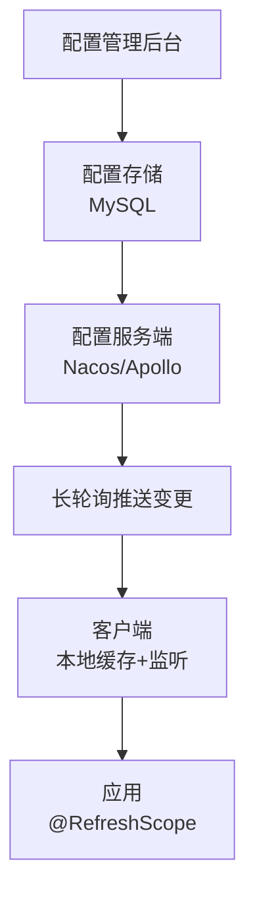
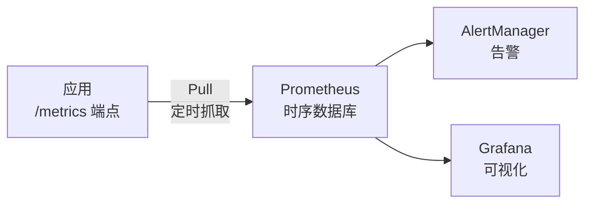
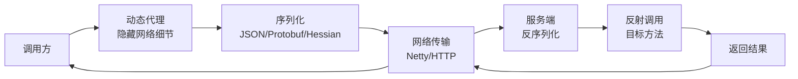

# M9 系统设计知识点

> 模块：M9 系统设计 ｜ 对应课表 Week 5-6
> 深度定位：面试能讲清 ｜ 来源：权威文档/书籍/博客
> 高频题：10 道

---

## 0. 速查索引

| # | 高频题 | 对应章节 | 学时 |
|---|---|---|---|
| 1 | 秒杀系统 | §1 | Week5 Day5 |
| 2 | 短 URL 系统 | §2 | Week5 Day3 |
| 3 | Feed 流 | §3 | Week6 Day1 |
| 4 | 附近的人（GeoHash） | §4 | Week6 Day2 |
| 5 | 分布式 ID | §5 | Week6 Day5 |
| 6 | 接口幂等性 | §6 | Week6 Day3 |
| 7 | 全局唯一发号器 | §5 | Week6 Day5 |
| 8 | 配置中心设计 | §7 | Week6 Day2 |
| 9 | 监控系统 | §8 | Week6 Day3 |
| 10 | 设计 RPC 框架 | §9 | Week4 Day4 |

---

## 1. 秒杀系统

**核心挑战**：瞬时高并发、防超卖、防黄牛。

**架构分层**：



**关键设计**：

| 层级 | 策略 |
|---|---|
| 前端 | 按钮置灰、答题验证、CDN 缓存静态页 |
| 网关 | 限流（令牌桶）、IP 黑名单、风控 |
| 应用 | Redis 预减库存（原子 DECR）、单用户限购 |
| MQ | 异步下单，削峰 |
| DB | 唯一索引防重、乐观锁/悲观锁扣减 |

**防超卖**：
- **Redis 原子扣减**：`DECR stock`，结果 < 0 回滚。
- **DB 乐观锁**：`UPDATE stock SET num=num-1 WHERE id=x AND num>0`。
- **唯一索引**：user_id + activity_id 唯一，防重复下单。

**热点 key 问题**：
- 单 key QPS 过高打挂 Redis。
- 解决：分片（库存拆 10 份到 10 个 key）、本地缓存。

> 💡 **面试话术」：「秒杀系统核心是分层削峰防超卖。前端按钮置灰+CDN，网关限流+风控，应用层 Redis 原子 DECR 预减库存，MQ 异步落单削峰，DB 用唯一索引+乐观锁最终扣减。防超卖靠 Redis DECR 原子性 + DB `WHERE num>0` 乐观锁。单用户限购用 Redis SetNX。热点 key 分片到多个 key。」

**常见追问**：
- Q: Redis 挂了怎么办？ → 降级到 DB 限流；Redis Cluster 高可用。
- Q: MQ 丢消息？ → Producer 用 acks=all，Consumer 手动提交+幂等。
- Q: 一人一单怎么保证？ → Redis SetNX 或 DB 唯一索引（user_id+activity_id）。

**来源**：[美团 — 秒杀系统设计](https://tech.meituan.com/)；《亿级流量网站架构核心技术》

---

## 2. 短 URL 系统

**核心**：长 URL → 短 URL，访问短 URL 重定向到长 URL。

**架构**：



**两种生成方案**：

| 方案 | 实现 | 优缺点 |
|---|---|---|
| 哈希（MD5/MurmurHash） | 长度固定，可能冲突 | 简单但要处理冲突 |
| 发号器 + Base62 | 自增 ID 转 Base62 | 无冲突，可预测 |

**关键点**：
- **Base62**：用 `0-9a-zA-Z`（62 字符）编码，6 位可表示 626 ≈ 568 亿。
- **存储**：MySQL 存 `短码 → 长 URL`，Redis 缓存热点。
- **重定向**：用 302（临时）而非 301（永久），便于统计 PV；301 会被浏览器缓存导致后续不访问服务器。
- **哈希冲突**：发号器方案无冲突；哈希方案需检查冲突后加随机盐重哈希。

> 💡 **面试话术」：「短 URL 系统用发号器+Base62 编码。发号器生成自增 ID（如雪花），Base62 编码成 6 位短码，存 MySQL + Redis 缓存。访问短码查到长 URL 用 302 重定向（不用 301 是因为 302 不被浏览器缓存，能统计 PV）。发号器方案无冲突；哈希方案要处理冲突。」

**常见追问**：
- Q: 发号器怎么实现？ → 雪花算法（见 §5）或 DB 号段（美团 Leaf）。
- Q: 短码被预占？ → 预留敏感词库过滤。

**来源**：[短 URL 设计](https://www.infoq.cn/article/short-url-design)；[TinyURL 架构](https://www.hellointerview.com/learn/system-design/problem-breakdowns/tinyurl)

---

## 3. Feed 流

**核心**：用户看关注的人的最新内容列表（如微博/朋友圈）。

**三种模式**：

| 模式 | 原理 | 优缺点 |
|---|---|---|
| 推（Fanout-on-Write） | 发布时写扩散到粉丝收件箱 | 读快，写慢，大 V 写放大 |
| 拉（Fanout-on-Read） | 读时实时拉关注人最新 | 写快，读慢 |
| 推拉结合 | 大 V 拉，普通用户推 | 综合，复杂 |



**关键点**：
- **推模式**：发布时写扩散到所有粉丝的活跃收件箱（Redis ZSet 按时间排序）。大 V（百万粉丝）写放大严重，改用拉模式。
- **拉模式**：读时实时拉关注人最新，合并排序。读放大，但适合大 V。
- **推拉结合**：普通用户发推，大 V 不推只拉；粉丝读时合并推内容+大 V 拉内容。
- **存储**：活跃 Feed 用 Redis ZSet（score=时间戳），历史用 DB。

> 💡 **面试话术」：「Feed 流三种模式：推模式发布时写扩散到粉丝收件箱，读快但大 V 写放大；拉模式读时实时拉关注人最新，写快但读放大；推拉结合大 V 拉普通用户推。微博用推拉结合。存储用 Redis ZSet 按时间戳排序，活跃数据在 Redis，历史在 DB。」

**常见追问**：
- Q: 大 V 怎么定义？ → 粉丝数阈值（如 10 万）。
- Q: Feed 排序？ → 按时间或推荐算法（互动率加权）。

**来源**：[微博 Feed 架构](https://www.infoq.cn/article/weibo-feed-architecture)；[Twitter Fanout](https://blog.twitter.com/engineering/en_us/topics/infrastructure/2017/the-infrastructure-behind-twitter)

---

## 4. 附近的人（GeoHash）

**核心**：基于地理位置找附近的人/店。

**方案演进**：

| 方案 | 实现 | 问题 |
|---|---|---|
| MySQL 经纬度 | `WHERE lat BETWEEN ... AND lng BETWEEN ...` | 索引难，效率低 |
| GeoHash | 经纬度编码成字符串，前缀相同相近 | 边界问题 |
| Redis GEO | 基于 GeoHash + ZSet | 简单高效 |

**GeoHash 原理**：
- 经纬度二分编码，交替组合成二进制串。
- Base32 编码成字符串，前缀越长精度越高。
- 前缀相同 = 区域相近（但边界处可能编码不同）。

```
经度 116.40 → 1101001011
纬度 39.90  → 1011100011
交替：11100 11101 00110 11011 → wx4g0f
```

**Redis GEO 命令**：
- `GEOADD locations 经度 纬度 member`
- `GEORADIUS locations 经度 纬度 半径 m WITHCOORD WITHDIST`
- 底层是 ZSet，score 是 GeoHash 编码值。

> 💡 **面试话术」：「附近的人用 GeoHash。经纬度二分编码交替组合成二进制串，Base32 编码，前缀相同表示区域相近。边界处可能编码不同，需要查相邻 8 个格子。生产用 Redis GEO 命令，底层 GeoHash + ZSet，GEORADIUS 一次查询。MySQL 经纬度查询索引难效率低。」

**常见追问**：
- Q: GeoHash 精度？ → 编码长度越长精度越高，6 位约 1.2km×0.6km。
- Q: 边界问题怎么解决？ → 查相邻 8 格的 GeoHash。

**来源**：[Redis GEO](https://redis.io/commands/?group=geo)；[GeoHash 论文](https://en.wikipedia.org/wiki/Geohash)

---

## 5. 分布式 ID / 发号器

**方案对比**：

| 方案 | 原理 | 优缺点 |
|---|---|---|
| UUID | 随机 128 位 | 无序，索引差，太长 |
| DB 自增 | 单库 auto_increment | 单点，性能瓶颈 |
| DB 号段 | 批量取号（如美团 Leaf） | 高性能，依赖 DB |
| 雪花算法 | 时间戳+机器+序列 | 分布式，时钟回拨问题 |
| Redis INCR | 原子自增 | 简单，依赖 Redis 持久化 |

详见 M6 §3.3 雪花算法。

> 💡 **面试话术」：「分布式 ID 方案：UUID 无序索引差；DB 自增单点；DB 号段批量取号高性能；雪花算法时间戳+机器+序列分布式但有时钟回拨；Redis INCR 简单但持久化风险。生产用雪花算法（如美团 Leaf、百度 UidGenerator）。」

**来源**：[美团 Leaf](https://github.com/Meituan-Dianping/Leaf)；[百度 UidGenerator](https://github.com/baidu/uid-generator)

---

## 6. 接口幂等性设计

**核心**：多次相同请求结果一致。

**方案**：

| 方案 | 实现 | 适用 |
|---|---|---|
| 唯一索引 | DB 唯一约束 | 插入 |
| Token 机制 | 请求前获取 token，请求带 token 校验 | 表单提交 |
| 状态机 | 状态流转校验 | 订单流转 |
| 乐观锁 | version CAS | 更新 |
| 去重表 | 记录处理过的请求 ID | 通用 |

详见 M6 §3.4。

> 💡 **面试话术」：「接口幂等方案：插入用唯一索引、表单用 token、订单用状态机、更新用乐观锁 version、通用用去重表。幂等是重试安全的基础，HTTP POST 天然不幂等需业务保证，PUT/DELETE 天然幂等。」

**来源**：[幂等设计模式](https://microservices.io/patterns/communication-style/idempotent-retry.html)

---

## 7. 配置中心设计

**核心**：集中配置 + 动态刷新 + 多环境隔离。

**架构**：



**关键设计**：
- **多环境隔离**：namespace（env）+ group（业务）+ dataId（配置）。
- **动态刷新**：长轮询或 gRPC 长连接，服务端变更推客户端。
- **灰度发布**：按 IP/标签灰度推送。
- **回滚**：版本历史一键回滚。
- **客户端容错**：本地缓存配置，服务端不可用时用缓存。

详见 M6 §1.3。

> 💡 **面试话术」：「配置中心核心是集中配置+动态刷新+多环境隔离。设计：namespace+group+dataId 三层隔离，长轮询推送变更，灰度按 IP/标签，版本回滚，客户端本地缓存容错。Nacos/Apollo 是主流实现。」

**来源**：[Nacos Config](https://nacos.io/zh-cn/docs/quick-start-spring-cloud.html)；[Apollo](https://www.apolloconfig.com/)

---

## 8. 监控系统

**三大支柱**：

| 类型 | 含义 | 工具 |
|---|---|---|
| Metrics 指标 | 数值时序数据（QPS/RT/CPU） | Prometheus + Grafana |
| Logging 日志 | 事件记录 | ELK（Elasticsearch+Logstash+Kibana） |
| Tracing 链路追踪 | 请求跨服务调用链 | Jaeger / SkyWalking / Zipkin |

**Prometheus 架构**：



**关键概念**：
- **Pull 模式**：Prometheus 主动拉取应用 metrics（vs Push）。
- **Metrics 类型**：Counter（递增）、Gauge（任意值）、Histogram（分布）、Summary（分位数）。
- **PromQL**：查询语言，如 `rate(http_requests_total[5m])`。
- **OpenTelemetry**：统一 Metrics/Logs/Traces 标准。

> 💡 **面试话术」：「监控系统三大支柱：Metrics 用 Prometheus+Grafana，Logging 用 ELK，Tracing 用 Jaeger/SkyWalking。Prometheus 是 Pull 模式主动抓 /metrics，4 种指标类型 Counter/Gauge/Histogram/Summary，用 PromQL 查询。链路追踪用 TraceID 串联跨服务调用，OpenTelemetry 是统一标准。」

**常见追问**：
- Q: TraceID 怎么传递？ → 请求头注入（如 `X-B3-TraceId`），跨服务透传。
- Q: Prometheus 为什么用 Pull？ → 主动控制抓取频率，应用无感知；Push 模式应用需主动推送。

**来源**：[Prometheus](https://prometheus.io/docs/)；[OpenTelemetry](https://opentelemetry.io/docs/)；[SkyWalking](https://skywalking.apache.org/)

---

## 9. 设计一个 RPC 框架

**核心**：远程过程调用，让远程调用像本地调用。

**架构**：



**核心组件**：

| 组件 | 职责 |
|---|---|
| 动态代理 | 客户端生成接口代理，屏蔽网络调用 |
| 序列化 | JSON/Protobuf/Hessian/Kryo |
| 网络传输 | Netty（NIO）/HTTP |
| 注册中心 | 服务注册与发现（Nacos/ZK） |
| 负载均衡 | 轮询/随机/一致性哈希/最少连接 |
| 集群容错 | Failover 重试/Failfast 快速失败/Failsafe 忽略 |
| 服务端反射 | 根据接口名+方法签名反射调用 |

**Dubbo 调用流程**：
1. 服务端启动注册到注册中心。
2. 客户端从注册中心订阅服务地址列表。
3. 调用时动态代理 → 序列化 → 负载均衡选一台 → Netty 发送。
4. 服务端接收 → 反序列化 → 反射调用 → 返回。
5. 客户端反序列化返回结果。

**关键设计点**：
- **SPI 扩展**：序列化/负载均衡/协议都可插拔（见 M6 §2.2）。
- **异步调用**：基于 CompletableFuture，不阻塞线程。
- **超时与重试**：防止雪崩，配合熔断降级。
- **心跳保活**：长连接检测空闲。

> 💡 **面试话术」：「RPC 框架核心组件：动态代理屏蔽网络、序列化（Protobuf 高效）、网络传输（Netty NIO）、注册中心（Nacos/ZK）服务发现、负载均衡、集群容错。调用流程：客户端代理 → 序列化 → 负载均衡选节点 → Netty 发送 → 服务端反序列化 → 反射调用 → 返回。Dubbo 用 SPI 让协议/序列化/负载均衡可插拔，支持异步 CompletableFuture 和超时重试。」

**常见追问**：
- Q: RPC vs HTTP？ → RPC 是协议约定，可基于 TCP/HTTP；HTTP 是协议。gRPC 基于 HTTP/2。
- Q: 为什么用动态代理？ → 让远程调用代码像本地调用，开发者无感。
- Q: 序列化怎么选？ → 性能优先 Protobuf/Kryo，跨语言用 JSON/Protobuf，Java 内部用 Hessian。

**来源**：[Dubbo 架构](https://dubbo.apache.org/zh-cn/docs/concepts/architecture/)；[gRPC](https://grpc.io/docs/)；《大型网站技术架构》

---

## 附：参考资料汇总

### 书籍
- 《数据密集型应用系统设计》（DDIA）Kleppmann — 系统设计圣经
- 《大型网站技术架构》李智慧 — 中文实战
- 《亿级流量网站架构核心技术》— 秒杀/高并发

### 官方文档
- [Prometheus](https://prometheus.io/docs/)
- [OpenTelemetry](https://opentelemetry.io/docs/)
- [SkyWalking](https://skywalking.apache.org/)
- [Dubbo Architecture](https://dubbo.apache.org/zh-cn/docs/concepts/architecture/)
- [Redis GEO](https://redis.io/commands/?group=geo)
- [Nacos](https://nacos.io/zh-cn/)
- [Apollo](https://www.apolloconfig.com/)

### 开源项目
- [美团 Leaf — 发号器](https://github.com/Meituan-Dianping/Leaf)
- [百度 UidGenerator](https://github.com/baidu/uid-generator)
- [Jaeger — 链路追踪](https://www.jaegertracing.io/)

### 博客与文章
- [美团技术博客](https://tech.meituan.com/) — 秒杀/动态线程池/Leaf
- [Hello Interview — System Design](https://www.hellointerview.com/learn/system-design/problem-breakdowns/tinyurl)
- [Twitter Fanout 架构](https://blog.twitter.com/engineering/en_us/topics/infrastructure/2017/the-infrastructure-behind-twitter)
- [InfoQ — 微博 Feed 架构](https://www.infoq.cn/article/weibo-feed-architecture)
- [System Design Primer](https://github.com/donnemartin/system-design-primer)
