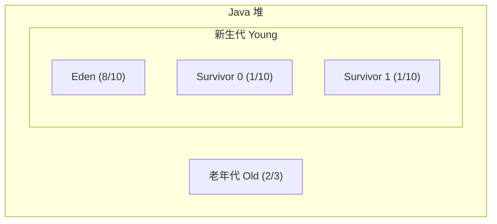
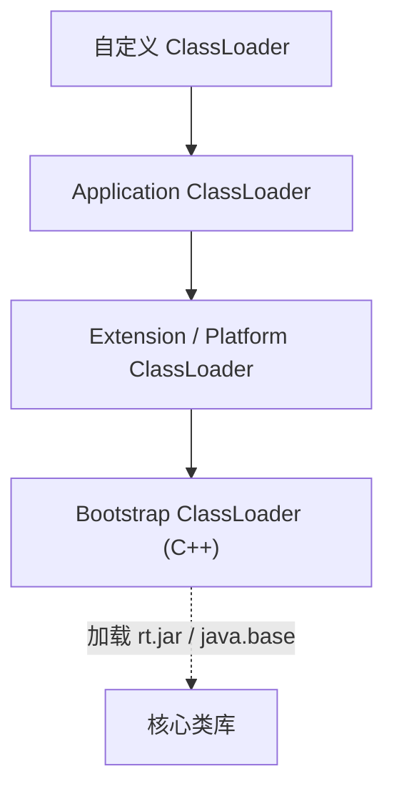

# M1 JVM 知识点文档实现计划

> **For agentic workers:** REQUIRED SUB-SKILL: Use superpowers:subagent-driven-development (recommended) or superpowers:executing-plans to implement this plan task-by-task. Steps use checkbox (`- [ ]`) syntax for tracking.

**Goal:** 产出 `docs/notes/m1-jvm.md`，覆盖 M1 模块 10 道面试高频题，按课表 4 学时分章，面试导向深度，权威来源可追溯。

**Architecture:** 单文件 Markdown 文档，按课表顺序分 4 章 + 速查索引 + 参考资料汇总。每章末尾固定「面试话术与追问」+「进阶阅读」。详写核心知识点（400–800 字），略写辅助知识点（100–200 字），深度知识仅附链接。图表用 Mermaid/ASCII。

**Tech Stack:** Markdown、Mermaid、Git

**Spec:** `docs/superpowers/specs/2026-07-05-m1-jvm-notes-design.md`

---

## 文件结构

| 文件 | 操作 | 职责 |
|---|---|---|
| `docs/notes/m1-jvm.md` | 新建 | M1 JVM 全部知识点，4 章 + 索引 + 附录 |
| `docs/superpowers/plans/2026-07-05-m1-jvm-notes.md` | 本计划 | 实现步骤追踪 |

---

## Task 1: 创建文档骨架

**Files:**
- Create: `docs/notes/m1-jvm.md`

- [ ] **Step 1: 创建 `docs/notes/` 目录并写入文档骨架**

写入以下内容到 `docs/notes/m1-jvm.md`：

```markdown
# M1 JVM 知识点

> 模块：M1 JVM ｜ 对应课表 Week 1-2
> 深度定位：面试能讲清 ｜ 来源：权威文档/书籍/博客
> 高频题：10 道

---

## 0. 速查索引

| # | 高频题 | 对应章节 | 学时 |
|---|---|---|---|
| 1 | JVM 运行时数据区 | §1.1–1.7 | Week1 Day1 |
| 2 | 堆内存分代结构 | §3.4 | Week1 Day3 |
| 3 | GC 算法 | §3.2 | Week1 Day3 |
| 4 | 垃圾收集器对比 | §3.6 | Week1 Day3 |
| 5 | CMS 四阶段 | §3.7 | Week1 Day3 |
| 6 | G1 原理 | §3.8 | Week1 Day3 |
| 7 | 类加载过程 | §2.1 | Week1 Day2 |
| 8 | 双亲委派 + 打破方式 | §2.3–2.4 | Week1 Day2 |
| 9 | OOM 排查 | §4.4–4.5 | Week2 Day1-2 |
| 10 | 对象晋升老年代条件 | §3.5 | Week1 Day3 |

---

## 1. 运行时数据区

（待填充）

---

## 2. 类加载机制

（待填充）

---

## 3. GC 算法与垃圾收集器

（待填充）

---

## 4. JVM 调优与 OOM 排查

（待填充）

---

## 附：参考资料汇总

（待填充）
```

- [ ] **Step 2: 验证骨架**

运行：
```bash
node -e "const fs=require('fs'); const t=fs.readFileSync('docs/notes/m1-jvm.md','utf8'); const secs=['## 0. 速查索引','## 1. 运行时数据区','## 2. 类加载机制','## 3. GC 算法与垃圾收集器','## 4. JVM 调优与 OOM 排查','## 附：参考资料汇总']; const missing=secs.filter(s=>!t.includes(s)); if(missing.length){console.log('FAIL: missing',missing); process.exit(1)} console.log('PASS: skeleton has all', secs.length, 'sections');"
```
Expected: `PASS: skeleton has all 6 sections`

- [ ] **Step 3: 提交**

```bash
git add docs/notes/m1-jvm.md
git commit -m "docs(notes): M1 JVM 文档骨架"
```

---

## Task 2: 编写第 1 章 — 运行时数据区

**Files:**
- Modify: `docs/notes/m1-jvm.md`（替换 `## 1. 运行时数据区` 下的 `（待填充）`）

**覆盖高频题 #1**：JVM 运行时数据区（画图：堆/栈/方法区/PC/本地方法栈）

**内容要求**：

| 小节 | 详略 | 必须覆盖 |
|---|---|---|
| 1.1 程序计数器（PC） | 略写 | 定义、线程私有、唯一不 OOM 的区域 |
| 1.2 虚拟机栈 | 详写 | 栈帧结构（局部变量表/操作数栈/动态链接/返回地址）、StackOverflowError vs OOM |
| 1.3 本地方法栈 | 略写 | 与虚拟机栈的区别、服务 native 方法 |
| 1.4 堆 | 详写 | 定义、线程共享、GC 主战场、Eden/Survivor/Old 分代（含 Mermaid 图） |
| 1.5 方法区 / Metaspace | 详写 | JDK 7→8 永久代废弃演进、Metaspace 在直接内存中、存储内容（类信息/常量池/静态变量） |
| 1.6 运行时常量池 | 略写 | class 文件常量池 → 运行时常量池、动态性（String.intern） |
| 1.7 直接内存 | 略写 | NIO DirectByteBuffer、不受 -Xmx 约束、与 Metaspace 关系 |
| 1.8 面试话术与追问 | — | 至少 3 个追问（如：栈帧里有什么？为什么永久代被废弃？PC 为什么线程私有？） |
| 1.9 进阶阅读 | — | JVM 规范 §2.5 链接、R大相关回答 |

**权威来源建议**（不限于）：
- JVM 规范 §2.5: https://docs.oracle.com/javase/specs/jvms/se17/html/jvms-2.html#jvms-2.5
- 《深入理解JVM》第3版 第 2 章
- OpenJDK Metaspace 相关文档
- R大（RednaxelaFX）知乎关于永久代废弃的回答

**Mermaid 图示例**（堆分代，在 1.4 堆 中使用）：



- [ ] **Step 1: 编写 1.1–1.7 各小节内容**

按完整模板（详写）或简化模板（略写）编写，每节附来源链接。

- [ ] **Step 2: 编写 1.8 面试话术与追问**

写一段连贯的、可直接口述的运行时数据区总览话术（150–250 字），列至少 3 个常见追问及简短应答方向。

- [ ] **Step 3: 编写 1.9 进阶阅读**

附 2–4 个权威链接（JVM 规范、R大回答等），每个链接附一句话说明。

- [ ] **Step 4: 验证第 1 章内容**

运行：
```bash
node -e "const fs=require('fs'); const t=fs.readFileSync('docs/notes/m1-jvm.md','utf8'); const subs=['### 1.1','### 1.2','### 1.3','### 1.4','### 1.5','### 1.6','### 1.7','### 1.8','### 1.9']; const missing=subs.filter(s=>!t.includes(s)); if(missing.length){console.log('FAIL: missing',missing); process.exit(1)} if(t.includes('（待填充）')&&t.indexOf('（待填充）')<t.indexOf('## 2.')){console.log('FAIL: chapter 1 still has placeholder'); process.exit(1)} const ch1=t.substring(t.indexOf('## 1.'),t.indexOf('## 2.')); if(ch1.length<2000){console.log('FAIL: chapter 1 too short',ch1.length); process.exit(1)} console.log('PASS: chapter 1 complete,', ch1.length, 'chars');"
```
Expected: `PASS: chapter 1 complete, <N> chars`（N > 2000）

- [ ] **Step 5: 提交**

```bash
git add docs/notes/m1-jvm.md
git commit -m "docs(notes): M1 JVM 第1章 运行时数据区"
```

---

## Task 3: 编写第 2 章 — 类加载机制

**Files:**
- Modify: `docs/notes/m1-jvm.md`（替换 `## 2. 类加载机制` 下的 `（待填充）`）

**覆盖高频题 #7 #8**：类加载过程、双亲委派 + 打破方式

**内容要求**：

| 小节 | 详略 | 必须覆盖 |
|---|---|---|
| 2.1 类加载过程 | 详写 | 5 阶段（加载→验证→准备→解析→初始化）每阶段做什么、准备阶段 static 变量赋默认值 vs 初始化阶段赋真实值、含 Mermaid 流程图 |
| 2.2 类加载器分类 | 略写 | Bootstrap/Extension(JDK9+ Platform)/Application/自定义、各自加载范围 |
| 2.3 双亲委派模型 | 详写 | 工作原理（先委派父加载器）、为什么这样设计（安全+避免重复加载）、含层级图 |
| 2.4 打破双亲委派 | 详写 | 3 种方式：SPI 机制（ClassLoader.getParent 返回 null 的 Bootstrap 加载 SPI 接口，用 Thread.contextClassLoader 加载实现）、Tomcat 每个 WebApp 独立 ClassLoader 先自己加载、热部署/OSGi 模块化 |
| 2.5 面试话术与追问 | — | 至少 3 个追问（如：为什么需要打破双亲委派？JDK9 模块化对类加载的影响？） |
| 2.6 进阶阅读 | — | JVM 规范 §5 链接、Tomcat 类加载文档、SPI 相关 |

**权威来源建议**（不限于）：
- JVM 规范 §5 Loading, Linking, and Initializing: https://docs.oracle.com/javase/specs/jvms/se17/html/jvms-5.html
- 《深入理解JVM》第3版 第 7 章
- Tomcat 官方文档 Class Loader: https://tomcat.apache.org/tomcat-9.0-doc/class-loader-howto.html
- JDBC SPI 与 Thread.contextClassLoader 相关 Stack Overflow 高票回答

**Mermaid 图示例**（双亲委派层级，在 2.3 中使用）：



- [ ] **Step 1: 编写 2.1–2.4 各小节内容**

- [ ] **Step 2: 编写 2.5 面试话术与追问**

- [ ] **Step 3: 编写 2.6 进阶阅读**

- [ ] **Step 4: 验证第 2 章内容**

运行：
```bash
node -e "const fs=require('fs'); const t=fs.readFileSync('docs/notes/m1-jvm.md','utf8'); const subs=['### 2.1','### 2.2','### 2.3','### 2.4','### 2.5','### 2.6']; const missing=subs.filter(s=>!t.includes(s)); if(missing.length){console.log('FAIL: missing',missing); process.exit(1)} const ch2=t.substring(t.indexOf('## 2.'),t.indexOf('## 3.')); if(ch2.includes('（待填充）')){console.log('FAIL: chapter 2 has placeholder'); process.exit(1)} if(ch2.length<2000){console.log('FAIL: chapter 2 too short',ch2.length); process.exit(1)} console.log('PASS: chapter 2 complete,', ch2.length, 'chars');"
```
Expected: `PASS: chapter 2 complete, <N> chars`（N > 2000）

- [ ] **Step 5: 提交**

```bash
git add docs/notes/m1-jvm.md
git commit -m "docs(notes): M1 JVM 第2章 类加载机制"
```

---

## Task 4: 编写第 3 章 — GC 算法与垃圾收集器

**Files:**
- Modify: `docs/notes/m1-jvm.md`（替换 `## 3. GC 算法与垃圾收集器` 下的 `（待填充）`）

**覆盖高频题 #2 #3 #4 #5 #6 #10**：堆分代、GC 算法、收集器对比、CMS、G1、晋升条件

> 这是 M1 最核心的章节，覆盖 6/10 道高频题，篇幅应最长（约 3500–5000 字）。

**内容要求**：

| 小节 | 详略 | 必须覆盖 |
|---|---|---|
| 3.1 判断对象存活 | 详写 | 引用计数法（循环引用问题）vs 可达性分析（GC Roots 种类）、finalize() 机制 |
| 3.2 GC 算法 | 详写 | 标记-清除（碎片）、标记-复制（浪费空间）、标记-整理（移动成本），各画 ASCII 示意 |
| 3.3 分代收集理论 | 详写 | 弱代假说（绝大多数对象朝生夕灭 / 熬过越多次 GC 越难回收）、跨代引用假说、Remembered Set |
| 3.4 堆分代结构 | 详写 | Eden:S0:S1 = 8:1:1、新生代:老年代 = 1:2、Minor GC vs Major GC vs Full GC 区别 |
| 3.5 对象晋升老年代条件 | 详写 | 年龄阈值（-XX:MaxTenuringThreshold，默认15）、大对象直接进老代（-XX:PretenureSizeThreshold）、动态年龄判断、Survivor 空间不足 |
| 3.6 收集器对比 | 详写 | Serial/ParNew/Parallel Scavenge/CMS/G1/ZGC/Shenandoah，按「分代/算法/并行/特性」做对比表 |
| 3.7 CMS 四阶段 | 详写 | 初始标记(STW)→并发标记→重新标记(STW)→并发清除、优缺点（碎片/Concurrent Mode Failure→降级 Serial Old）、参数 |
| 3.8 G1 原理 | 详写 | Region(1-32MB)、CSet、SATB、RSet、Mixed GC、-XX:MaxGCPauseMillis、与 CMS 对比 |
| 3.9 面试话术与追问 | — | 至少 4 个追问（如：G1 什么时候 Full GC？CMS 和 G1 怎么选？为什么 G1 用 SATB 不用增量更新？） |
| 3.10 进阶阅读 | — | ZGC 染色指针、SATB 源码、G1 调优权威链接 |

**权威来源建议**（不限于）：
- 《深入理解JVM》第3版 第 3 章
- OpenJDK G1 文档: https://openjdk.org/jeps/243
- Oracle G1 GC Tuning Guide: https://docs.oracle.com/en/java/javase/17/gctuning/
- 美团技术博客 G1 调优实战
- R大关于 CMS/G1 的知乎回答
- ZGC JEP: https://openjdk.org/jeps/377
- Stack Overflow 上 SATB vs Incremental Update 的高票回答

**对比表格式**（3.6 收集器对比）：

```
| 收集器 | 分代 | 算法 | 并行/并发 | STW | 适用场景 |
|---|---|---|---|---|---|
| Serial | 新生代 | 复制 | 单线程 | 全程STW | 客户端模式 |
| ParNew | 新生代 | 复制 | 并行 | 全程STW | 配合CMS |
| ... | ... | ... | ... | ... | ... |
```

- [ ] **Step 1: 编写 3.1–3.5 各小节内容**（对象存活判定、GC 算法、分代理论、堆结构、晋升条件）

- [ ] **Step 2: 编写 3.6 收集器对比**（含对比表）

- [ ] **Step 3: 编写 3.7 CMS 四阶段**（含 Mermaid 或 ASCII 阶段图）

- [ ] **Step 4: 编写 3.8 G1 原理**（含 Region 结构图）

- [ ] **Step 5: 编写 3.9 面试话术与追问 + 3.10 进阶阅读**

- [ ] **Step 6: 验证第 3 章内容**

运行：
```bash
node -e "const fs=require('fs'); const t=fs.readFileSync('docs/notes/m1-jvm.md','utf8'); const subs=['### 3.1','### 3.2','### 3.3','### 3.4','### 3.5','### 3.6','### 3.7','### 3.8','### 3.9','### 3.10']; const missing=subs.filter(s=>!t.includes(s)); if(missing.length){console.log('FAIL: missing',missing); process.exit(1)} const ch3=t.substring(t.indexOf('## 3.'),t.indexOf('## 4.')); if(ch3.includes('（待填充）')){console.log('FAIL: chapter 3 has placeholder'); process.exit(1)} if(ch3.length<3500){console.log('FAIL: chapter 3 too short',ch3.length); process.exit(1)} console.log('PASS: chapter 3 complete,', ch3.length, 'chars');"
```
Expected: `PASS: chapter 3 complete, <N> chars`（N > 3500）

- [ ] **Step 7: 提交**

```bash
git add docs/notes/m1-jvm.md
git commit -m "docs(notes): M1 JVM 第3章 GC算法与垃圾收集器"
```

---

## Task 5: 编写第 4 章 — JVM 调优与 OOM 排查

**Files:**
- Modify: `docs/notes/m1-jvm.md`（替换 `## 4. JVM 调优与 OOM 排查` 下的 `（待填充）`）

**覆盖高频题 #9**：OOM 排查步骤（MAT 分析 + jstack + jstat）

**内容要求**：

| 小节 | 详略 | 必须覆盖 |
|---|---|---|
| 4.1 常用 JVM 参数 | 详写 | -Xms/-Xmx/-Xmn/-XX:MetaspaceSize/-XX:MaxMetaspaceSize/-XX:SurvivorRatio/-XX:MaxTenuringThreshold/-XX:+UseG1GC，分「堆内存/非堆/GC选择/调优」分类列出 |
| 4.2 命令行工具 | 详写 | jps(查进程)/jstat(GC统计)/jmap(堆dump)/jstack(线程栈)/jinfo(参数)，每个附典型用法和输出解读 |
| 4.3 内存溢出 vs 内存泄漏 | 详写 | OOM 是症状（Heap/OOM/Metaspace OOM 类型）、内存泄漏是根因（静态集合持有/ThreadLocal/连接未关闭），画因果图 |
| 4.4 OOM 排查步骤 | 详写 | 标准流程：jmap dump → MAT 打开 → Dominator Tree → 找大对象 → GC Root 链路 → 定位代码，含编号步骤 |
| 4.5 MAT 工具实操 | 详写 | Histogram/Dominator Tree/Leak Suspects 报告/Path to GC Roots，附截图说明（文字描述操作路径） |
| 4.6 常见调优案例 | 详写 | 2-3 个案例：Full GC 频繁（老年代太小）、Young GC 过长（Eden 太大）、Metaspace OOM（动态生成类），每个按「现象→排查→解决」结构 |
| 4.7 面试话术与追问 | — | 至少 3 个追问（如：线上 OOM 怎么不重启快速排查？jstack 死锁怎么查？） |
| 4.8 进阶阅读 | — | MAT 官方文档、JDK Mission Control、美团/阿里 OOM 排查博客 |

**权威来源建议**（不限于）：
- Oracle JDK 工具文档: https://docs.oracle.com/en/java/javase/17/docs/specs/man/
- MAT 官方: https://eclipse.dev/mat/
- 美团技术博客「Java OOM 排查」相关文章
- 阿里 P3C / arthas 文档
- Stack Overflow 上 jstat/jmap 输出解读的高票回答
- GitHub arthas 仓库: https://github.com/alibaba/arthas

- [ ] **Step 1: 编写 4.1–4.2**（JVM 参数 + 命令行工具）

- [ ] **Step 2: 编写 4.3–4.5**（OOM vs 泄漏 + 排查步骤 + MAT 实操）

- [ ] **Step 3: 编写 4.6 常见调优案例**

- [ ] **Step 4: 编写 4.7 面试话术与追问 + 4.8 进阶阅读**

- [ ] **Step 5: 验证第 4 章内容**

运行：
```bash
node -e "const fs=require('fs'); const t=fs.readFileSync('docs/notes/m1-jvm.md','utf8'); const subs=['### 4.1','### 4.2','### 4.3','### 4.4','### 4.5','### 4.6','### 4.7','### 4.8']; const missing=subs.filter(s=>!t.includes(s)); if(missing.length){console.log('FAIL: missing',missing); process.exit(1)} const ch4=t.substring(t.indexOf('## 4.'),t.indexOf('## 附')); if(ch4.includes('（待填充）')){console.log('FAIL: chapter 4 has placeholder'); process.exit(1)} if(ch4.length<2500){console.log('FAIL: chapter 4 too short',ch4.length); process.exit(1)} console.log('PASS: chapter 4 complete,', ch4.length, 'chars');"
```
Expected: `PASS: chapter 4 complete, <N> chars`（N > 2500）

- [ ] **Step 6: 提交**

```bash
git add docs/notes/m1-jvm.md
git commit -m "docs(notes): M1 JVM 第4章 JVM调优与OOM排查"
```

---

## Task 6: 编写附录 + 全文验收

**Files:**
- Modify: `docs/notes/m1-jvm.md`（替换 `## 附：参考资料汇总` 下的 `（待填充）`）

- [ ] **Step 1: 编写参考资料汇总**

将全文中引用过的所有来源按类别整理：

```markdown
## 附：参考资料汇总

### 官方文档
- [The Java Virtual Machine Specification, Java SE 17 Edition](https://docs.oracle.com/javase/specs/jvms/se17/html/)
- [OpenJDK G1 GC](https://openjdk.org/jeps/243)
- [ZGC JEP 377](https://openjdk.org/jeps/377)
- [Oracle G1 GC Tuning Guide](https://docs.oracle.com/en/java/javase/17/gctuning/)
- ...

### 书籍
- 《深入理解Java虚拟机：JVM高级特性与最佳实践》第3版 — 周志明
- ...

### 技术博客
- 美团技术团队 JVM 相关文章
- R大（RednaxelaFX）知乎回答
- ...

### 工具文档
- [Eclipse MAT](https://eclipse.dev/mat/)
- [Arthas](https://github.com/alibaba/arthas)
- ...
```

- [ ] **Step 2: 全文验收 — 检查无占位符**

运行：
```bash
node -e "const fs=require('fs'); const t=fs.readFileSync('docs/notes/m1-jvm.md','utf8'); const placeholders=['（待填充）','TBD','TODO','待补充']; const found=placeholders.filter(p=>t.includes(p)); if(found.length){console.log('FAIL: found placeholders:',found); process.exit(1)} console.log('PASS: no placeholders');"
```
Expected: `PASS: no placeholders`

- [ ] **Step 3: 全文验收 — 10 道高频题全部覆盖**

运行：
```bash
node -e "const fs=require('fs'); const t=fs.readFileSync('docs/notes/m1-jvm.md','utf8'); const checks=[['运行时数据区','1.1'],['堆','1.4'],['方法区','1.5'],['类加载','2.1'],['双亲委派','2.3'],['GC 算法','3.2'],['分代','3.4'],['晋升','3.5'],['CMS','3.7'],['G1','3.8'],['OOM','4.4'],['MAT','4.5']]; const missing=checks.filter(([kw,sec])=>!t.includes(sec)); if(missing.length){console.log('FAIL: missing sections',missing); process.exit(1)} console.log('PASS: all', checks.length, 'key sections present');"
```
Expected: `PASS: all 12 key sections present`

- [ ] **Step 4: 全文验收 — 来源链接数量**

运行：
```bash
node -e "const fs=require('fs'); const t=fs.readFileSync('docs/notes/m1-jvm.md','utf8'); const links=t.match(/https?:\/\/[^\s)]+/g)||[]; if(links.length<15){console.log('FAIL: only',links.length,'source links, need >=15'); process.exit(1)} console.log('PASS:', links.length, 'source links found');"
```
Expected: `PASS: <N> source links found`（N >= 15）

- [ ] **Step 5: 全文验收 — 总篇幅**

运行：
```bash
node -e "const fs=require('fs'); const t=fs.readFileSync('docs/notes/m1-jvm.md','utf8'); console.log('Total chars:', t.length); if(t.length<8000){console.log('FAIL: too short'); process.exit(1)} console.log('PASS: length OK');"
```
Expected: `PASS: length OK`（total > 8000）

- [ ] **Step 6: 提交**

```bash
git add docs/notes/m1-jvm.md
git commit -m "docs(notes): M1 JVM 附录与全文验收"
```

---

## 验收清单

| 检查项 | 验证方式 | 对应 Task |
|---|---|---|
| 文档骨架 6 大章节 | Step 2 验证脚本 | Task 1 |
| 第 1 章 9 小节 + 无占位符 + >2000 字 | Step 4 验证脚本 | Task 2 |
| 第 2 章 6 小节 + 无占位符 + >2000 字 | Step 4 验证脚本 | Task 3 |
| 第 3 章 10 小节 + 无占位符 + >3500 字 | Step 6 验证脚本 | Task 4 |
| 第 4 章 8 小节 + 无占位符 + >2500 字 | Step 5 验证脚本 | Task 5 |
| 全文无占位符 | Step 2 验证脚本 | Task 6 |
| 12 个关键小节存在 | Step 3 验证脚本 | Task 6 |
| 来源链接 >= 15 个 | Step 4 验证脚本 | Task 6 |
| 总篇幅 > 8000 字 | Step 5 验证脚本 | Task 6 |
| 每章有面试话术与追问 | 人工检查（每章 .8/.5/.9/.7 节） | Task 2-5 |
| 每章有进阶阅读 | 人工检查（每章末节） | Task 2-5 |
| Mermaid 图可渲染 | GitHub 预览检查 | Task 2-4 |
